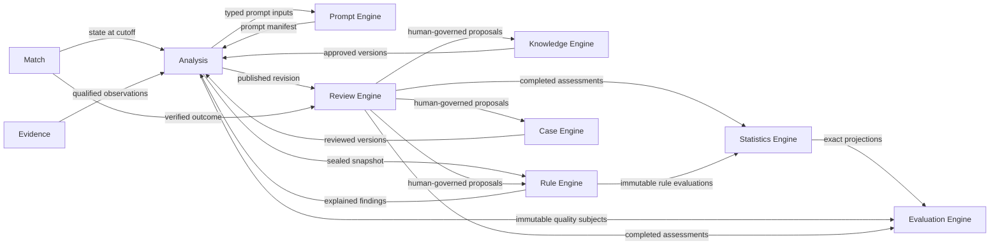
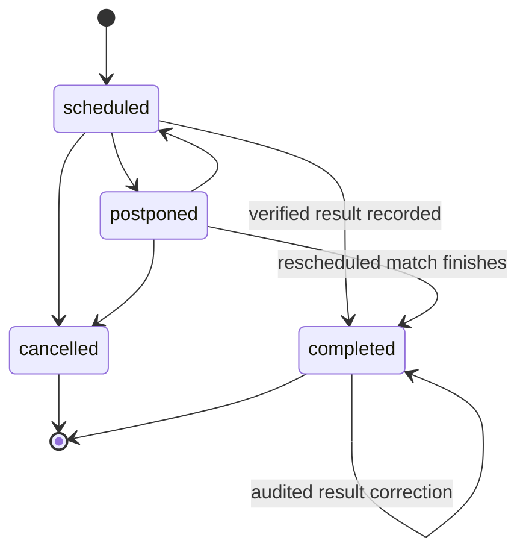
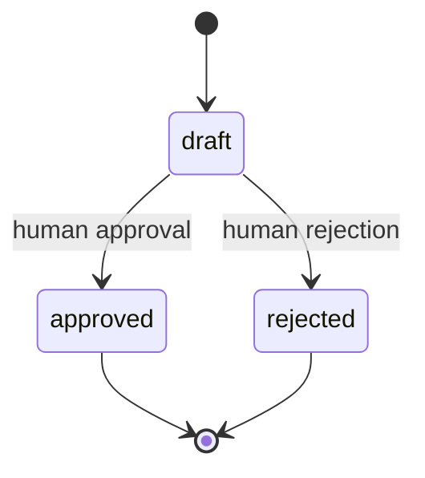
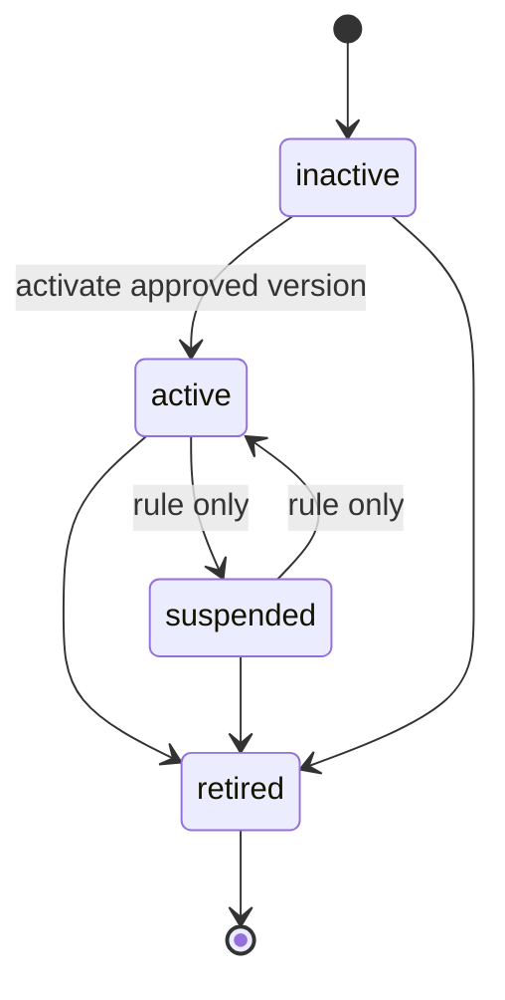
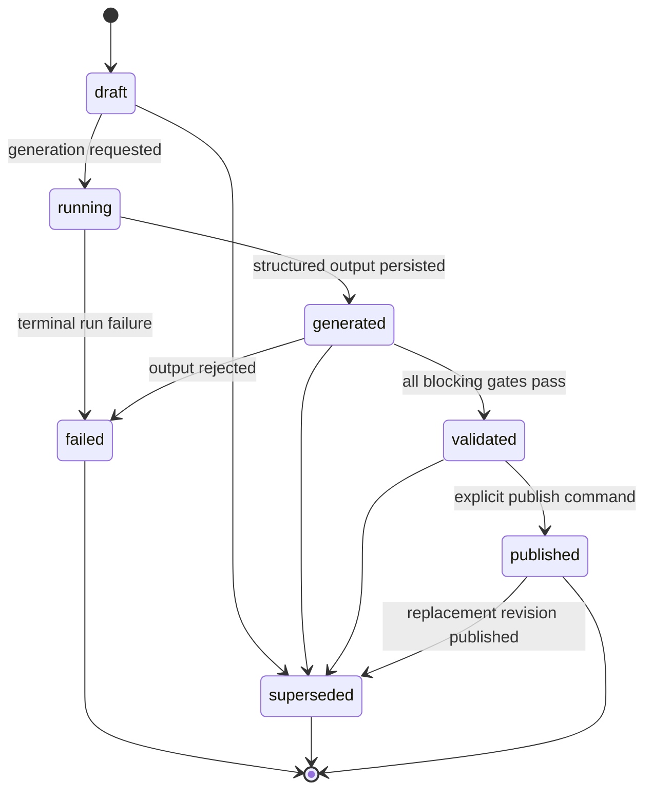
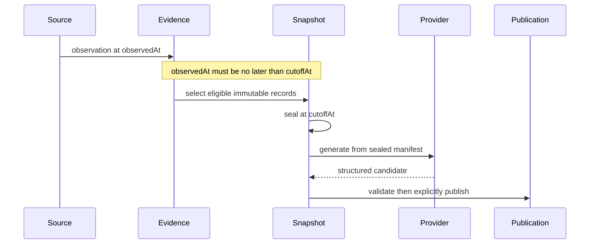

# FAS Domain Model

## 1. Purpose and Authority

This document defines the ubiquitous language, domain boundaries, aggregate rules, and temporal semantics for Football Analysis System (FAS) v1. It refines the product concepts in [01_PRODUCT](./01_PRODUCT.md) within the system boundaries established by [04_ARCHITECTURE](./04_ARCHITECTURE.md).

This is a domain contract, not a persistence or transport specification. [12_DATABASE](./12_DATABASE.md) is authoritative for tables, constraints, and physical version records. [13_API](./13_API.md) is authoritative for HTTP resources, commands, and representations. If terminology drifts, the domain meaning here must be reconciled explicitly rather than inferred from a table or DTO name.

V1 is pre-match and post-match only. It has no live analysis, users, authentication, commercialization, or notifications. The implementation is full TypeScript. PostgreSQL is the v1 system of record; pgvector belongs to Phase 2.

## 2. Ubiquitous Language

| Term | Domain meaning | Excludes |
|---|---|---|
| Match | A scheduled football fixture between identified participants in a competition season, including status and any verified result. | An analysis, market, or prediction. |
| Source record | An append-only capture of what an external source supplied, with provenance, observation/retrieval times, parser version, and checksum. | A normalized claim accepted by FAS. |
| Evidence item | A normalized, source-backed observation about a typed subject, valid or observed at a known time and carrying a quality state. | AI prose or an unsupported assertion. |
| Fact | An evidence item whose statement is directly supported by a source and normalized without analytical interpretation. | A forecast, causal claim, or market opinion. |
| Market signal | A time-dependent observation derived from market data. It is evidence of market state, not evidence that an outcome will occur. | Ground truth or a deterministic rule result. |
| Outcome evidence | Source-backed evidence used to verify or correct a completed match result. | The result row without provenance. |
| Knowledge item | The stable identity of governed football or methodology guidance. | A mutable body of text. |
| Knowledge version | An immutable, sourced, scoped, effective-dated revision of a knowledge item. | Automatically trusted model output. |
| Rule | The stable identity of a governed deterministic analytical rule. | An LLM instruction or statistical metric. |
| Rule version | An immutable condition tree and outcome definition with scope, sample size, confidence, validation method, and limitations. | A rule evaluation against a match. |
| Rule evaluation | Deterministic application of one rule version to one sealed analysis snapshot, including exact inputs and condition-level explanation. | A probabilistic AI inference. |
| Rule finding | The typed conclusion emitted by a matched rule evaluation. | A model-authored interpretation of that finding. |
| Case | The stable identity of a governed historical analogy derived from a completed, reviewed match. | Any superficially similar past match. |
| Case version | An immutable reviewed account of context, decisive factors, outcome, lessons, scope, and limitations. | A claim that history will repeat. |
| Case analogy | An analysis claim comparing the current snapshot with an exact case version and stating both similarities and material differences. | A citation-free anecdote. |
| Analysis | The stable root for one pre-match analytical lineage for a match and requested cutoff. | A single provider response. |
| Analysis snapshot | A sealed manifest of exact match state, eligible evidence, knowledge versions, case versions, and deterministic evaluations used by an analysis run. | A mutable query of current data. |
| Analysis run | One auditable execution attempt against a sealed snapshot and model configuration. | A published analytical artifact. |
| Analysis revision | An immutable structured analytical document accepted from a run and validated under a schema version. | Raw provider output. |
| Claim | A stable, typed statement within an analysis revision. | Unstructured prose whose epistemic type must be guessed. |
| Review | A post-match assessment of a published revision against a specific verified result version and outcome evidence. | Editing the original analysis with hindsight. |
| Learning candidate | A review-derived proposal for knowledge, rule, case, or methodology change that requires human disposition. | An approved or active artifact. |
| Metric | A versioned, rebuildable statistical definition and its projection over immutable source records. | A causal conclusion. |
| Cutoff | The latest permissible observation time for material included in a pre-match snapshot. | Job start time, retrieval time, or publication time. |
| Publish | Make one validated analysis revision the immutable, reviewable record. | Merely generating or validating output. |

## 3. Epistemic Types

Epistemic type is part of the domain contract and must never be inferred from prose. Conversion between types is prohibited except through an explicit domain operation that preserves the source type and provenance.

| Type | Produced by | Required support | Permitted claim | Prohibited treatment |
|---|---|---|---|---|
| Fact | Evidence normalization | One or more valid evidence items observed no later than cutoff | A directly source-supported statement | Prediction, inference, or silent conflict resolution |
| Market signal | Market evidence normalization | Market evidence, source, observed time, metric/value, quality | A description of market state or movement | Ground truth, causal proof, or result guarantee |
| Deterministic rule finding | Rule Engine | Exact rule version, sealed snapshot inputs, evaluator version, applicability result, explanation | What the declared rule deterministically found | AI opinion or statistical performance claim |
| Case analogy | Case Engine plus analysis composition | Exact approved case version, retrieval reason, similarities, material differences | A bounded historical comparison | Assertion that the same outcome follows |
| Inference | AI provider output after validation | Rationale and typed citations to eligible snapshot artifacts | A reasoned interpretation or scenario | Fact, deterministic result, or authoritative decision |
| Uncertainty | Readiness, validation, or AI analysis | Missing/conflicting/stale evidence, model limitation, scenario spread, or unresolved contradiction | What is unknown, weakly supported, or capable of falsifying an inference | Empty disclaimer or hidden confidence downgrade |

Confidence qualifies an inference, scenario, rule version, or statistical estimate in its own context; equal numeric values do not make those concepts interchangeable. Source quality is not model confidence. Rule confidence is governed metadata, not the AI's confidence. Statistical intervals belong to the Statistics Engine.

## 4. Bounded Contexts and Ownership

The modular monolith uses explicit ownership. A context may read another context's published contract or immutable reference, but it may not mutate another context's aggregate or read its persistence representation as an integration contract.

| Bounded context | Owns | Publishes to other contexts | Must not own |
|---|---|---|---|
| Match Catalog | Competitions, seasons, teams, canonical identities | Stable catalog references | Fixture evidence or analysis |
| Match | Fixture participants, kickoff, status, verified result identity | Match state and result version | Source provenance or analytical claims |
| Evidence | Sources, source records, normalized evidence, quality, conflicts | Cutoff-qualified evidence and provenance | Match lifecycle or inference |
| Knowledge Engine | Knowledge roots, immutable versions, approval/effectivity, retrieval rationale | Exact eligible knowledge selections | Prompt generation or automatic learning promotion |
| Rule Engine | Rule roots/versions, lifecycle, deterministic per-snapshot evaluations and findings | Eligible versions and explained findings | Statistical aggregation, LLM calls, or quality gates |
| Case Engine | Case roots/versions, review eligibility, retrieval rationale, similarities/differences | Exact eligible case selections | Outcome prediction |
| Prompt Engine | Prompt templates/versions, composition policy, prompt manifests, output schema references | Reproducible provider request manifest | Arbitrary retrieval or domain approval |
| Analysis | Analysis lineage, snapshots, runs, revisions, claims, validation and publication | Published revision and frozen provenance | Provider-specific domain concepts |
| Review Engine | Reviews, claim/rule/case assessments, learning candidates | Completed assessments and proposals | Rewriting published analyses or activating proposals |
| Evaluation Engine | Assessment definitions, rubrics, qualification/gate policy, immutable runs and reports | Reproducible quality and release assessments | Metric computation, per-match review, or source mutation |
| Statistics Engine | Metric definitions and rebuildable projections | Qualified metrics with population, sample, interval, and watermark | Deterministic per-snapshot rule evaluation or causal inference |
| Operations | Durable jobs, idempotency records, provider-call audit, material audit events | Execution status and diagnostics | Business truth |

The Rule, Evaluation, and Statistics Engines are separate. Rule answers, “Did this exact rule version apply to this exact snapshot, and why?” Evaluation answers, “Under this versioned assessment policy, did this immutable subject or corpus satisfy the declared quality gate?” Statistics answers, “What metric and uncertainty are deterministically computed for this declared population?” None may substitute for another.

## 5. Aggregates and Transactional Boundaries

Aggregate names describe consistency boundaries, not table layouts. Cross-aggregate workflows use application services, stable identifiers, domain events, and the transaction boundaries defined in [04_ARCHITECTURE](./04_ARCHITECTURE.md).

| Aggregate root | Included concepts | Consistency boundary and responsibilities |
|---|---|---|
| Match | Participants, kickoff/status, result reference/version | Exactly one participant per required role; legal status transitions; verified result requires outcome evidence. |
| Evidence item | Normalized observation and source-record reference | Provenance, subject, metric, observation time, normalized value, checksum, and quality classification remain coherent. Conflicts link items without overwriting them. |
| Knowledge item | Ordered knowledge versions and lifecycle pointer | Versions increase monotonically; approved versions are immutable; retrieval selects only approved and effective versions. |
| Rule | Ordered rule versions and lifecycle pointer | Activation names one approved version satisfying qualification requirements; historical versions/evaluations remain immutable. |
| Case | Ordered case versions and lifecycle pointer | Production eligibility requires completed review provenance and an approved, active version. |
| Prompt template | Ordered prompt versions and lifecycle | A manifest references exact immutable versions and schemas, never “latest” after composition. |
| Analysis | Requested cutoff, snapshot identity, runs, revisions, publication pointer | Snapshot is sealed before generation; runs share explicit lineage; only a valid revision can be published; publication is immutable. |
| Review | Published revision/result version, assessments, learning candidates | Completion requires the governed assessment set and a verified result; later corrections do not rewrite the completed review. |
| Metric definition | Formula version and projections | A projection is reproducible from source watermark and computation version and can be rebuilt without changing source records. |
| Job | Lease, attempts, checkpoint, terminal result | At most one valid lease holder; retries are bounded and idempotent at the business-command boundary. |

Source records and audit events are append-only records rather than mutable business aggregates. Provider calls are operational records attached to an analysis run; provider response fields do not enter domain models until mapped and validated.

## 6. Identifiers, Versions, and Identity

1. Every aggregate root and externally referenced entity uses an opaque UUID. An external provider identifier is an alias, never FAS identity.
2. Governed artifacts have a stable root identifier and immutable version identity. A reference used in analysis always names the exact version, not only the root or “current” version.
3. Integer version numbers are positive and monotonic within a root. They are not global ordering or time.
4. Mutable roots use optimistic concurrency through a row/resource version. This concurrency token is distinct from an immutable content version and from an API major version.
5. Schema versions independently identify structured documents such as evidence values, rule conditions, prompt output contracts, analysis content, jobs, and learning proposals.
6. Content and manifest checksums establish integrity and replay identity. Matching checksums do not merge distinct domain identities.
7. A model configuration is provider-neutral domain configuration identified independently from a provider request/response identifier.
8. Reviews bind to an exact analysis revision and exact result version/checksum. Corrections create a superseding assessment lineage; they never alter what was originally reviewed.

Physical key, constraint, and checksum details remain authoritative in [12_DATABASE](./12_DATABASE.md); external representation and concurrency headers remain authoritative in [13_API](./13_API.md).

## 7. Lifecycle State Machines

Commands must reject undefined transitions. Approval, activation, validation, and publication are distinct decisions even if one operator performs them in v1.

### 7.1 Match

A result correction creates a new auditable result version; the self-transition does not mutate historical review references.

### 7.2 Governed Artifacts

Governed artifacts separate immutable version review from stable-root activation:

- versions follow `draft -> approved | rejected`; approved versions never change;
- roots follow `inactive -> active -> retired`;
- Rule roots additionally permit `active <-> suspended`;
- activation selects an exact approved version as the root's current active version.

Revisions to approved content create a new draft version. Activating a replacement advances the root pointer and does not mutate either version. Retirement affects future eligibility only; historical snapshots retain exact version references.

### 7.3 Analysis

A retry creates another run and does not silently replace the snapshot. A new snapshot requires an explicit new analysis lineage or attempt lineage as defined by persistence policy.

### 7.4 Analysis Run, Review, and Learning Candidate

- Analysis run: `queued -> running -> generated -> valid | invalid`, with `failed` from `queued` or `running`.
- Review: `draft -> completed`; completion is immutable.
- Learning candidate: `proposed -> accepted | rejected`; acceptance creates a draft in the owning context and grants no approval or activation.

## 8. Domain Invariants

### 8.1 Evidence and Time

1. Every fact, market signal, and outcome observation has source provenance, observation time, normalization version, and content integrity metadata.
2. Evidence observed after an analysis cutoff cannot enter its snapshot, even if retrieved before generation.
3. Retrieval time cannot be substituted for observation time.
4. Conflicting evidence remains visible. Resolution records a choice and rationale but does not delete or rewrite alternatives.
5. A market signal always retains its observation time and is never promoted to fact because it correlates with a later result.

### 8.2 Governed Inputs

1. Production retrieval uses only approved, active where applicable, effective-at-cutoff artifact versions.
2. An active rule version satisfies minimum sample, confidence, validation-method, scope, and limitations requirements.
3. A production case originates from a completed match and completed review.
4. A learning candidate cannot directly change an approved or active artifact.
5. V1 retrieval is deterministic metadata/tag/full-text retrieval. pgvector and embedding-based retrieval are Phase 2 and require separate version governance.

### 8.3 Analysis and Publication

1. Standard v1 analysis type is `pre_match`; its requested cutoff is earlier than kickoff.
2. A snapshot is immutable once sealed and identifies every selected artifact version and relevant checksum.
3. The Rule Engine evaluates exact active rule versions against exact normalized snapshot inputs.
4. A run records exact snapshot, prompt component versions, output schema, model configuration, provider attempts, and validator versions.
5. A fact claim has valid evidence citations; a rule finding cites its rule evaluation; a case analogy cites its case version and records differences.
6. Inference and scenario claims declare confidence, rationale, and supporting typed citations; unsupported content cannot be relabeled as fact.
7. A published analysis references exactly one sealed snapshot and one immutable revision with no unresolved blocking validation.
8. AI output is always a draft until deterministic validation and an explicit publication command succeed.

### 8.4 Review and Statistics

1. A completed review targets a published revision and a verified result version supported by outcome evidence.
2. Review assessments use `supported`, `contradicted`, `inconclusive`, or `not_assessable`; they do not retroactively change claim types.
3. Statistics are projections over immutable records, keyed by metric/computation version and source watermark.
4. A statistic below its minimum sample may be inspectable but is unqualified.
5. Statistics describe populations and uncertainty; they do not infer causality or make Evaluation Engine quality/gate decisions.

## 9. Domain Events

Domain events use past tense, carry event ID, occurred-at time, aggregate identity/version, correlation ID, actor type, reason where material, and a schema-versioned payload containing references rather than secrets or large documents. They are facts about committed domain changes, not commands. Their durable representation and transactional publication mechanism are governed by [12_DATABASE](./12_DATABASE.md) and [04_ARCHITECTURE](./04_ARCHITECTURE.md).

| Context | Event | Trigger and principal consumers |
|---|---|---|
| Match | `MatchScheduled`, `MatchPostponed`, `MatchCancelled` | Fixture lifecycle changed; Evidence and Analysis may reassess readiness. |
| Match | `MatchResultVerified`, `MatchResultCorrected` | Outcome evidence accepted; Review may start or mark prior result version superseded. |
| Evidence | `EvidenceRecorded`, `EvidenceQualityChanged`, `EvidenceConflictResolved` | Source-backed observation or quality decision committed; readiness may be recalculated. |
| Knowledge | `KnowledgeVersionApproved`, `KnowledgeActivated`, `KnowledgeRetired` | Human governance completed; future retrieval eligibility changes. |
| Rule Governance | `RuleVersionApproved`, `RuleActivated`, `RuleSuspended`, `RuleRetired` | Rule eligibility changes; no historical evaluation is changed. |
| Rule | `RuleEvaluationCompleted`, `RuleEvaluationFailed` | Exact snapshot/version rule application ended; Analysis consumes result, Statistics later aggregates it. |
| Case | `CaseVersionApproved`, `CaseActivated`, `CaseRetired` | Future case retrieval eligibility changes. |
| Analysis | `AnalysisSnapshotSealed` | Cutoff-qualified manifest became immutable; generation can proceed. |
| Analysis | `AnalysisRunStarted`, `AnalysisRunFailed`, `AnalysisRevisionValidated` | Auditable execution/validation milestones occurred. |
| Analysis | `AnalysisPublished`, `AnalysisSuperseded` | Immutable revision became or ceased to be the current published artifact; Review may begin. |
| Review | `ReviewCompleted` | All required assessments committed; Statistics refresh is requested atomically. |
| Review | `LearningCandidateProposed`, `LearningCandidateAccepted`, `LearningCandidateRejected` | Governed proposal changed state; acceptance asks the target context to create a draft. |
| Evaluation | `EvaluationRunCompleted`, `EvaluationRunFailed`, `EvaluationReportCompleted` | Versioned quality assessment completed or failed; governance may consume the immutable report. |
| Statistics | `StatisticsProjectionRefreshed` | A metric version was rebuilt to a source watermark. |

An event consumer must be idempotent. Delivery order must not be assumed across aggregate roots; consumers use aggregate version, event identity, and source watermark to detect duplicates or stale work.

## 10. Temporal and Cutoff Rules

FAS distinguishes event time from processing time:

- `observedAt`: when the reported value applied or was observed at the source;
- `retrievedAt`: when FAS received the source record;
- `validFrom` / `validTo`: when a governed or evidence value is applicable;
- `cutoffAt`: latest permitted observation time for a pre-match snapshot;
- `createdAt`: when FAS persisted a record;
- `publishedAt`: when a validated revision became authoritative for review;
- `occurredAt`: when a domain event's committed change occurred.

The following ordering is required for a standard v1 pre-match analysis:

1. `cutoffAt < kickoffAt` for standard v1 pre-match analysis.
2. Eligibility is evaluated as of cutoff: evidence uses observation/validity time; governed versions use approval, status, effective period, and exact version as of cutoff.
3. A late-arriving record with `observedAt <= cutoffAt` is not silently inserted into an already sealed snapshot. It requires an explicitly new snapshot/analysis lineage so the prior run remains reproducible.
4. A correction discovered after cutoff remains unavailable to the old snapshot even if it corrects a pre-cutoff fact. It may justify a new pre-kickoff analysis if time remains, or appear in post-match review.
5. Provider generation and publication may occur after cutoff, but cannot introduce later evidence.
6. Post-match outcome evidence is categorically excluded from pre-match snapshots and is visible only to review and downstream statistics.
7. Effective windows are interpreted in UTC instants; source timezones are retained only to reconstruct source meaning.
8. V1 has no in-play cutoff semantics. Live observations must be rejected from pre-match workflows rather than approximated.

## 11. Core Relationships

The diagram is conceptual. Cardinalities and physical joins remain authoritative in [12_DATABASE](./12_DATABASE.md).

```mermaid
classDiagram
    class Match
    class EvidenceItem
    class KnowledgeVersion
    class RuleVersion
    class RuleEvaluation
    class CaseVersion
    class Analysis
    class AnalysisSnapshot
    class AnalysisRun
    class AnalysisRevision
    class Claim
    class Review
    class LearningCandidate
    class MetricProjection

    Match "1" --> "0..*" EvidenceItem : concerns
    Match "1" --> "0..*" Analysis : analyzed by
    Analysis "1" --> "1" AnalysisSnapshot : freezes
    AnalysisSnapshot "1" --> "0..*" EvidenceItem : selects
    AnalysisSnapshot "1" --> "0..*" KnowledgeVersion : selects
    AnalysisSnapshot "1" --> "0..*" RuleEvaluation : contains
    RuleVersion "1" --> "0..*" RuleEvaluation : evaluated as
    AnalysisSnapshot "1" --> "0..*" CaseVersion : selects
    Analysis "1" --> "1..*" AnalysisRun : executes
    AnalysisRun "1" --> "0..1" AnalysisRevision : accepts
    AnalysisRevision "1" --> "1..*" Claim : contains
    AnalysisRevision "1" --> "0..*" Review : assessed by
    Review "1" --> "0..*" LearningCandidate : proposes
    Review "0..*" --> "0..*" MetricProjection : contributes to
    RuleEvaluation "0..*" --> "0..*" MetricProjection : contributes to
```

## 12. Boundary Rules for TypeScript

- Domain packages expose TypeScript domain types, value objects, commands, results, events, and ports; they import no NestJS, Next.js, Prisma, OpenAI, Redis, or HTTP types.
- Transport DTOs and Prisma records are mapped at adapters and never become aggregate objects by convenience.
- Discriminated unions represent epistemic claim types and exhaustive handling is required; an `unknown` fallback exists only at compatibility boundaries.
- Identifiers are strongly branded by domain type so a `RuleVersionId` cannot be passed as an `EvidenceItemId`.
- Temporal values are UTC instants plus explicit source timezone metadata where required; bare local date-time strings are not domain instants.
- Provider-neutral analysis contracts cross the AI provider port. OpenAI Responses API fields remain inside the provider adapter.
- The Prompt, Rule, Evaluation, and Statistics Engines have distinct TypeScript ports and cannot import one another's persistence adapters.

## 13. Related Documents

- [PROJECT BIBLE](./00_PROJECT_BIBLE.md) — governing mission and principles.
- [FAS Product Definition](./01_PRODUCT.md) — scope, workflows, and v1 non-goals.
- [FAS System Architecture](./04_ARCHITECTURE.md) — runtime, module dependencies, orchestration, and operational behavior.
- [FAS Database Design](./12_DATABASE.md) — authoritative logical/physical persistence contract.
- [FAS REST API Design](./13_API.md) — authoritative HTTP contract.
