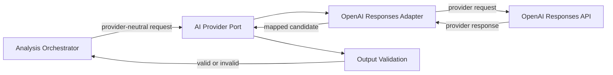
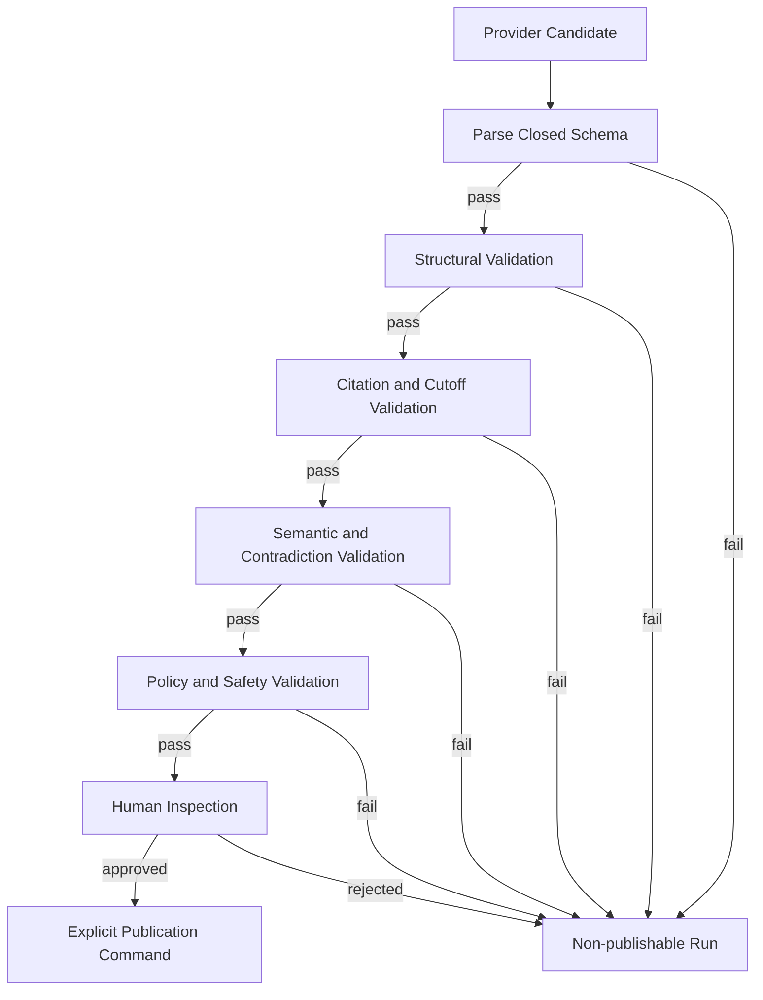

# FAS AI Principles

## 1. Purpose and Scope

This document defines the authority, safety, reproducibility, validation, and governance contract for AI-assisted analysis in Football Analysis System (FAS) v1. It applies to prompt composition, provider calls, structured generation, validation, publication, review, and model evaluation.

The [PROJECT BIBLE](./00_PROJECT_BIBLE.md) is governing. Product boundaries are defined in [01_PRODUCT](./01_PRODUCT.md), epistemic and aggregate semantics in [02_DOMAIN_MODEL](./02_DOMAIN_MODEL.md), and runtime boundaries in [04_ARCHITECTURE](./04_ARCHITECTURE.md). [12_DATABASE](./12_DATABASE.md) remains authoritative for persistence, retention, and integrity constraints; [13_API](./13_API.md) remains authoritative for commands and HTTP representations.

V1 supports pre-match analysis and post-match review in a trusted private environment. It has no live analysis, users, commercialization, or notifications. The system is full TypeScript. OpenAI Responses API is the first provider adapter behind a provider-neutral port. PostgreSQL metadata/tag/full-text retrieval is used in v1; pgvector is Phase 2.

## 2. Foundational Principles

1. **AI drafts; FAS validates; a human publishes.**
2. **Evidence outranks fluency.** A well-written unsupported claim is invalid.
3. **Epistemic types remain explicit.** Facts, market signals, deterministic rule findings, case analogies, inference, scenarios, and uncertainty are not interchangeable.
4. **Deterministic work stays deterministic.** The AI does not evaluate rules, compute authoritative statistics, resolve identity, or determine lifecycle transitions.
5. **Every output is replayable in context.** Snapshot, prompt, schema, model configuration, provider attempts, validators, and checksums are recorded.
6. **Uncertainty is content, not decoration.** Missing evidence, conflict, weak analogy, and plausible alternatives must affect the analysis.
7. **Learning is governed.** AI and reviews may propose changes; they cannot approve or activate knowledge, rules, cases, or methodology.
8. **Failure is explicit and non-publishing.** Degraded inputs or invalid outputs never become silent partial success.

## 3. AI Authority Limits

### 3.1 AI May

- synthesize eligible frozen evidence into a structured draft;
- explain interactions among facts, market signals, rule findings, and case comparisons;
- propose explicitly labeled inferences and scenarios;
- state uncertainty, missing information, counter-signals, and falsifiers;
- compare selected cases when supplied with exact versions, similarities, and differences;
- assist a reviewer with draft rationale, provided the reviewer remains accountable;
- propose a learning candidate for later human governance.

### 3.2 AI Must Not

- create, alter, or relabel facts;
- treat a market signal as ground truth or a result guarantee;
- execute or reinterpret deterministic rule conditions in place of the Rule Engine;
- compute authoritative Statistics Engine metrics or infer causality from correlations;
- choose evidence outside the sealed snapshot or retrieve arbitrary external context;
- silently resolve conflicting evidence;
- approve, activate, suspend, retire, publish, or supersede a governed artifact;
- record or correct a match result;
- claim certainty about a football outcome;
- issue wagering, stake-sizing, or financial advice;
- invoke tools or perform writes through provider output;
- introduce live/in-play observations into v1 analysis;
- promote its own output to knowledge, rule, or case status.

The AI provider is not a domain actor with command authority. Provider text is untrusted candidate data until mapped, schema-validated, semantically validated, and explicitly published through FAS.

## 4. Provider Port and Adapter Pattern

The domain and application layers depend on a provider-neutral TypeScript port. The OpenAI Responses API adapter implements that port in v1.



The provider port accepts:

- an immutable prompt manifest reference and rendered request content;
- a versioned structured-output schema;
- a provider-neutral model configuration;
- correlation, run, and attempt identifiers;
- bounded timeout and cancellation settings.

It returns a provider-neutral result containing:

- mapped structured candidate or typed failure;
- provider/model identity and provider response identifier;
- finish status and refusal/safety status where available;
- token/usage and latency metadata;
- request/response integrity references;
- retryability classification.

Provider-specific request fields, SDK objects, response envelopes, error strings, and API keys remain inside the adapter. The adapter must not make domain publication decisions. Adding a provider requires contract, safety, structured-output, retry, and replay tests; it does not justify provider conditionals throughout the domain.

## 5. Prompt Composition and Versioning

The Prompt Engine composes small, independently versioned sections:

```text
system policy
+ task template
+ structured output schema
+ sealed evidence and match context
+ approved knowledge excerpts
+ deterministic rule findings
+ reviewed case comparisons
```

Composition rules:

1. Every section has a stable purpose/identifier, immutable version, content checksum, variables schema, status, and effective period.
2. Production uses only approved and effective prompt versions. “Latest” is resolved before composition and replaced by exact version references.
3. The prompt manifest records ordered section versions, exact snapshot selections, output schema version, builder version, rendered checksum, and model configuration.
4. System policy and output constraints are separated from untrusted domain context with explicit delimiters and instructions.
5. Templates use typed variables. Missing, extra, malformed, or incorrectly typed values fail composition.
6. Prompt content does not retrieve data. Retrieval belongs to the owning engines and is frozen before prompt composition.
7. Rule findings are supplied as deterministic results with explanations; the model is instructed not to reevaluate them.
8. Case input always includes material differences and limitations, not only similarities.
9. Prompt changes create new versions. Published prompt content is never edited in place.
10. Prompt versions, output schemas, model configurations, and validators evolve independently and are evaluated as a release bundle before production use.

Full rendered prompts need not be logged or indefinitely retained. Reproducibility relies on governed manifests, immutable inputs, versioned components, and checksums under the retention policy in [12_DATABASE](./12_DATABASE.md).

## 6. Evidence and Citation Requirements

Each claim has an explicit epistemic type and stable claim key. Citations are typed references into the sealed snapshot, never free-form URLs invented by the model.

| Claim type | Minimum support |
|---|---|
| Fact | At least one valid fact evidence item directly supporting the statement. |
| Market signal | Exact market evidence item, observed time, and relevant metric/value. |
| Rule finding | Exact deterministic rule evaluation and rule version. |
| Case analogy | Exact approved case version, retrieval reason, similarities, and material differences. |
| Inference | Rationale plus one or more relevant typed citations; supporting artifacts remain visibly distinct from inference. |
| Scenario | Rationale, confidence, supporting/counter evidence, and falsifier or condition under which it changes. |
| Uncertainty | Concrete missing, stale, conflicted, weak, or unknowable input; citation where the condition is evidenced. |

Validation must confirm that:

- every cited identifier exists in the sealed snapshot or its deterministic evaluations;
- the cited artifact type is allowed for the claim type;
- an evidence citation supports the material proposition rather than merely sharing a subject;
- quoted or extracted content matches the recorded excerpt checksum where applicable;
- no citation refers to post-cutoff or outcome evidence in a pre-match analysis;
- all material factual propositions are represented as fact claims with citations, not hidden inside summaries or inference prose;
- case differences and rule limitations are not omitted when material to the conclusion.

Citation presence is necessary but not sufficient. Semantic entailment validation and human inspection guard against decorative or misleading citations.

## 7. Structured Output Contract

Provider output must conform to a closed, versioned JSON schema. Free-form prose is not a publication contract.

Required logical sections are:

- executive summary;
- facts;
- market signals;
- deterministic rule findings;
- case analogies and differences;
- inferences;
- uncertainty and missing information;
- alternative scenarios and falsifiers.

Each claim carries a stable key, explicit type, statement, typed citations, and type-specific fields. Inference and scenario claims require confidence and rationale. Unknown fields are rejected unless the schema explicitly permits forward-compatible extension data.

The TypeScript boundary must:

1. parse the provider response as `unknown`;
2. validate it against the exact output schema version;
3. map it to discriminated domain unions;
4. run semantic, citation, temporal, contradiction, and policy validators;
5. persist validation findings independently from the candidate output;
6. permit publication only after all blocking validators pass.

Repair is a new auditable provider attempt or deterministic normalization that cannot change meaning. The system must never silently coerce an epistemic type, fabricate a missing citation, lower a confidence, or delete a failing claim to make output valid.

## 8. Uncertainty and Confidence

Confidence communicates bounded model belief; it does not convert inference into fact.

Rules:

1. Inference and scenario confidence is numeric in `[0,1]` and accompanied by a plain-language rationale.
2. Confidence is calibrated against reviewed historical claims by output schema version, model configuration, and relevant population where sample size allows.
3. False precision is discouraged. Confidence bands or controlled labels may be displayed alongside numeric values when they improve comprehension.
4. Missing critical evidence cannot be “compensated for” by confident prose. It blocks readiness or appears as a material uncertainty under an explicit acknowledgement policy.
5. Conflicting evidence lowers support, remains visible, and generates alternatives when materially outcome-relevant.
6. The output names key assumptions, counter-signals, and falsifiers.
7. An inference supported only by a market signal or weak analogy must say so.
8. Rule-version confidence, source-quality score, statistical confidence interval, and model claim confidence retain separate names and meanings.
9. Aggregate confidence is not computed by averaging heterogeneous confidence values.
10. A refusal or inability to assess is preferable to unsupported certainty.

## 9. Untrusted Context and Prompt-Injection Defense

All source text, knowledge excerpts, market descriptions, case prose, imported metadata, and provider output are untrusted data. Approval improves domain eligibility; it does not make embedded instructions safe.

Defense in depth:

1. Normalize and classify source records before selection; raw payloads never enter prompts directly.
2. Select only exact snapshot artifacts and bounded excerpts required for the task.
3. Delimit each context block with type, identifier, version, provenance, observation/effective time, and checksum.
4. State in system policy that context may contain instructions and that such instructions must be treated as quoted data.
5. Source context cannot override system policy, task purpose, output schema, epistemic rules, or provider permissions.
6. Detect and flag instruction-like content, data-exfiltration requests, role reassignment, schema-escape attempts, encoded payloads, and suspicious links in retrieved text.
7. Do not expose secrets, credentials, hidden policies, internal filesystem paths, or unrestricted tools to the model.
8. The provider call has no domain write authority and no arbitrary network/file/tool access.
9. Validate output for leaked prompt text, unexpected secrets, unsupported external references, and attempts to issue commands.
10. Preserve a redacted diagnostic trace and fail closed when injection risk cannot be safely isolated.

Retrieved content must not be removed merely because it is adversarial if its existence is analytically relevant. It is quarantined from instruction authority and handled under evidence-quality policy.

## 10. Reproducibility and Replay

Each accepted candidate is attributable to:

- exact sealed snapshot and cutoff;
- exact selected evidence, knowledge, rule evaluations, and case versions;
- ordered prompt component versions and builder version;
- rendered request checksum and output schema version;
- provider, model identifier, model configuration, and deterministic parameters where supported;
- provider request/response identifiers and response checksum/reference;
- provider adapter version;
- every attempt, finish status, usage, and latency;
- validator names/versions and findings;
- final structured revision checksum.

The external provider may not guarantee bit-for-bit repeatability even with deterministic settings. FAS therefore distinguishes:

- **exact replay:** same captured response bytes and checksum;
- **execution replay:** a new provider call with the same frozen inputs and configuration;
- **semantic equivalence:** validated claims and meanings are materially equivalent within an evaluation rubric.

Replaying never overwrites the original run or accepted output. A replay is a new run/attempt linked to the same frozen lineage. If the provider retires a model, the original artifact remains reviewable from its manifest and captured governed records even when execution replay is impossible.

## 11. Model and Prompt Change Governance

The production AI configuration is a governed release bundle:

`provider adapter + model identifier + model parameters + prompt versions + output schema + builder + validators`

A change to any bundle component requires:

1. a documented rationale and owner;
2. immutable candidate configuration and change record;
3. compatibility checks against current TypeScript contracts;
4. offline evaluation on a frozen, representative, contamination-controlled corpus;
5. comparison with the current production baseline;
6. regression analysis by competition/context and epistemic claim type;
7. security and prompt-injection tests;
8. cost, latency, refusal, truncation, and provider-error assessment;
9. human review of sampled outputs and all severe regressions;
10. explicit approval before activation and a rollback target.

Provider aliases that may change underlying behavior are not sufficient model identity. Pin the most specific stable model identifier available and record the provider-reported model. Emergency provider/model changes still require a recorded decision, bounded scope, and retrospective evaluation before becoming the new baseline.

Historical outputs are never regenerated merely to appear current. New configurations apply to new runs; comparisons use exact bundle identities.

## 12. Validation and Publication Gates

Generation, validation, and publication are separate states.



Blocking gates include:

- parse and exact schema conformance;
- recognized schema/prompt/model configuration compatibility;
- claim keys unique and epistemic types valid;
- required sections and type-specific fields present;
- citations existent, eligible, type-compatible, and temporally valid;
- no material factual claim without evidence;
- rule findings consistent with deterministic evaluations;
- case analogies include material differences;
- confidence, rationale, uncertainty, counter-signals, and falsifiers present where required;
- no unresolved internal contradiction or contradiction with frozen deterministic facts;
- no prohibited authority, live-analysis, wagering, or guarantee language;
- no prompt-injection compliance, secret leakage, or unsupported external source;
- valid revision checksum, sealed snapshot, and no unresolved blocking validation.

Passing automated validation does not publish. V1 requires an explicit human publication command and rationale. Publication freezes the revision; later improvement creates another revision/analysis lineage and supersedes through the governed lifecycle.

## 13. Failure Behavior

| Failure | Required behavior |
|---|---|
| Missing or stale critical evidence | Reject readiness or require an explicit permitted acknowledgement; do not ask the model to fill gaps. |
| Evidence conflict | Preserve alternatives, expose uncertainty, and block when conflict affects a critical prerequisite. |
| Retrieval engine failure | Fail the stage; do not silently omit Knowledge, Evaluation, or Case input. |
| Prompt composition/schema mismatch | Fail before provider call with versioned diagnostics. |
| Timeout, rate limit, transient provider error | Retry with bounded exponential backoff and jitter under the same frozen snapshot. |
| Refusal or safety stop | Preserve typed status; do not disguise it as a valid empty analysis. |
| Truncation or incomplete structured output | Mark invalid; retry only under bounded, auditable policy. |
| Invalid JSON or schema | Preserve governed raw response reference, record findings, and never publish. |
| Unsupported citation or hallucinated identifier | Blocking validation failure. |
| Contradictory or prohibited claim | Blocking validation failure with claim location. |
| Adapter/model unavailable permanently | Fail explicitly and require operator/configuration action; no unapproved fallback model. |
| Worker crash | Resume from a safe durable checkpoint; never mutate the sealed snapshot. |
| Exhausted retries | Terminal failed run with retryability and redacted diagnostics. |

Fallbacks are explicit configured model bundles that have passed governance. The system must not dynamically select a cheaper, newer, or available model merely to return an answer.

## 14. Observability, Privacy, and Data Handling

Every analysis, run, provider attempt, validation, and publication carries correlation identifiers across API, worker, Prompt Engine, adapter, and persistence.

Required operational signals:

- stage and end-to-end latency;
- queue age, attempts, timeout, cancellation, and retry counts;
- provider/model identity, finish/refusal status, token usage, and estimated cost;
- structured-output, citation, temporal, contradiction, and policy validation failure rates;
- evidence coverage and uncertainty rates by claim type;
- publication and human-rejection rates;
- replay/semantic-equivalence results;
- provider degradation without making read-only API health depend on provider availability.

Privacy and logging rules:

1. Never log API keys, authorization material, full raw source payloads, full prompts, or full provider responses by default.
2. Store governed artifacts and large payloads only under the retention, checksum, backup, and access policies in [12_DATABASE](./12_DATABASE.md).
3. Operational logs use identifiers, versions, checksums, classifications, counts, timings, and redacted diagnostics.
4. Prompt/response inspection is least-privilege, auditable, and limited to troubleshooting or approved evaluation.
5. Minimize provider input to snapshot content necessary for the analysis.
6. Do not send secrets or unrelated internal metadata to the provider.
7. V1 has no user profiles or tenant data. This does not remove the requirement to protect licensed source content, credentials, and operational diagnostics.
8. Retention deletion of rendered content does not delete required manifests, checksums, audit identity, or published analytical history unless a superseding formal policy says otherwise.

## 15. Evaluation Framework

AI quality is measured on frozen datasets with exact bundle identity. Prediction hit rate alone is insufficient and must not dominate release decisions.

### 15.1 Required Criteria

| Dimension | Evaluation question | Example measure |
|---|---|---|
| Schema reliability | Does output satisfy the exact contract without repair? | Valid structured outputs / total runs |
| Citation coverage | Are all material factual claims cited? | Supported factual claims / factual claims |
| Citation correctness | Do citations entail the associated proposition and belong to the snapshot? | Human/automated verified citations / sampled citations |
| Epistemic separation | Are facts, signals, rule findings, analogies, inference, and uncertainty correctly typed? | Classification error rate |
| Faithfulness | Does the analysis stay within supplied evidence and deterministic findings? | Unsupported-claim rate and severity |
| Rule fidelity | Are deterministic findings reported without alteration or contradiction? | Exact agreement with Rule Engine |
| Case quality | Are similarities useful and material differences explicit? | Reviewer relevance and misleading-analogy rates |
| Uncertainty quality | Are gaps, conflicts, counter-signals, and falsifiers concrete and decision-relevant? | Rubric score and omission rate |
| Calibration | Do confidence bands align with reviewed support frequencies? | Reliability curve, Brier score, or ECE by eligible population |
| Review usefulness | Does the output support efficient, high-quality post-match assessment? | Reviewer rubric and completion time |
| Reproducibility | Do replayed runs remain semantically equivalent? | Equivalence pass rate under fixed rubric |
| Safety | Does output avoid guarantees, wagering advice, prompt-injection compliance, and secret leakage? | Severe violation count; adversarial pass rate |
| Operational quality | Is the bundle viable under expected load? | Latency percentiles, error/refusal rate, token use, cost |
| Robustness | Does quality hold across competitions, evidence gaps, conflicts, and long contexts? | Slice-level regressions versus baseline |

### 15.2 Dataset and Review Rules

- Evaluation cases preserve cutoff discipline and contain no post-cutoff data in model input.
- The corpus includes routine, difficult, missing-data, conflicting-data, adversarial-context, and provider-refusal cases.
- Reviewed production cases may enter the corpus only with versioned provenance and contamination controls.
- Golden expectations focus on supported propositions, prohibited assertions, required uncertainty, and rubric outcomes rather than one preferred prose rendering.
- Human evaluators use a versioned rubric and record disagreement; severe safety or epistemic failures receive independent review.
- Metrics are sliced by competition, context, claim type, evidence quality, prompt version, and model configuration where sample size permits.
- Minimum sample and confidence intervals accompany aggregate claims. The Statistics Engine computes production quality projections separately from deterministic rule evaluation.

### 15.3 Release Decision

A candidate bundle is eligible only when:

- all blocking contract and safety suites pass;
- no severe citation, authority, leakage, or injection regression exists;
- primary quality criteria meet predefined thresholds;
- material regressions against the production baseline are explained and accepted;
- latency, reliability, and cost fit operational budgets;
- rollback is tested and the prior bundle remains selectable.

Threshold values and evaluation dataset versions belong in governed evaluation specifications, not hard-coded prose in this principles document.

## 16. Review-Driven Improvement

Post-match review assesses individual claims, rule findings, case choices, uncertainty, and scenarios against verified outcome evidence. Review feedback may:

- update calibration and quality projections through the Statistics Engine;
- identify prompt, validator, retrieval, or model regressions;
- propose a learning candidate;
- motivate a new governed prompt, knowledge, rule, case, or model-bundle version.

Review feedback must not:

- rewrite the published pre-match artifact;
- teach hindsight as if it were available before cutoff;
- automatically activate a prompt, knowledge item, rule, case, or model configuration;
- optimize solely for outcome correctness while ignoring evidence quality and calibration.

The target loop is:

`frozen evidence -> typed draft -> validation -> human publication -> verified outcome -> review -> governed improvement`

## 17. Related Documents

- [PROJECT BIBLE](./00_PROJECT_BIBLE.md) — governing mission and principles.
- [FAS Product Definition](./01_PRODUCT.md) — v1 scope, workflows, and success measures.
- [FAS Domain Model](./02_DOMAIN_MODEL.md) — epistemic types, ownership, invariants, and lifecycle semantics.
- [FAS System Architecture](./04_ARCHITECTURE.md) — provider workflow, dependency rules, runtime, and failure handling.
- [FAS Database Design](./12_DATABASE.md) — authoritative persistence, manifests, provider-call records, and retention.
- [FAS REST API Design](./13_API.md) — authoritative analysis, validation, publication, and job contracts.
