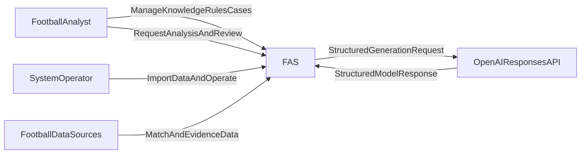
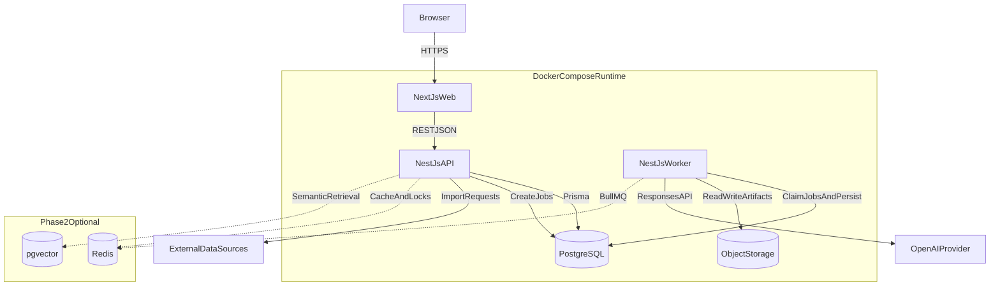
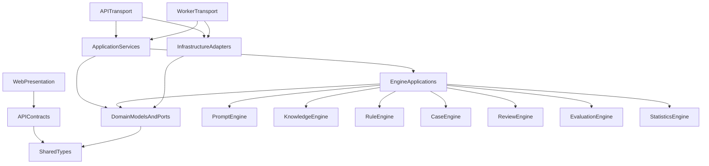
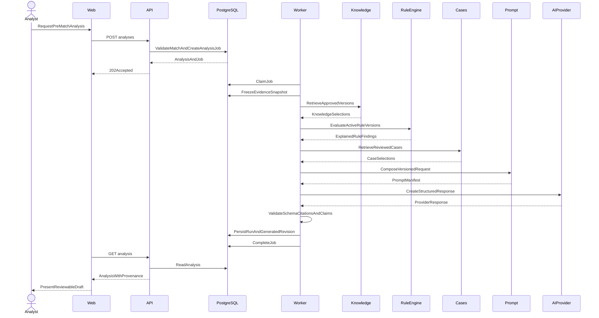
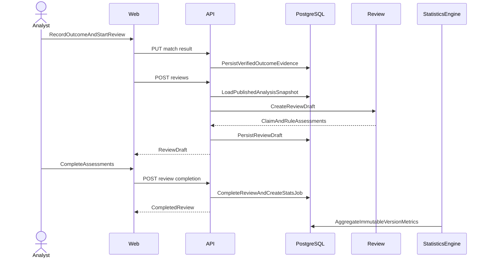
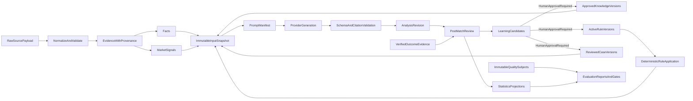

# FAS System Architecture

## 1. Purpose and Constraints

This document defines the production architecture for Football Analysis System (FAS) v1. The [Project Bible](./00_PROJECT_BIBLE.md) governs all design decisions.

The architecture optimizes for:

- evidence-backed and reproducible analysis;
- explicit separation of facts, market signals, deterministic findings, and inference;
- review-driven improvement;
- a maintainable full-TypeScript stack;
- simple local and single-host deployment before measured scale requires distribution.

V1 includes pre-match analysis, post-match review, and seven distinct engines: Prompt, Knowledge, Rule, Case, Review, Evaluation, and Statistics. It excludes live analysis, identity, subscriptions, commercialization, and notifications.

## 2. Architecture Decisions

| Area | Decision | Rationale |
|---|---|---|
| Repository | pnpm + Turborepo | Shared TypeScript contracts and coordinated quality gates |
| Web | Next.js App Router, React, TailwindCSS, shadcn/ui | Server-capable analyst workspace with accessible UI primitives |
| API | NestJS REST API | Explicit modules, dependency injection, validation, and OpenAPI support |
| Persistence | PostgreSQL + Prisma | Transactional integrity, relational traceability, typed access |
| Background work | Separate NestJS worker process | Isolates AI and statistics workloads from HTTP latency |
| AI | OpenAI Responses API behind a provider port | Provider-neutral domain and auditable provider calls |
| Deployment | Docker Compose | Reproducible v1 runtime and local parity |
| Cache/queue | In-process/job-table v1; Redis/BullMQ Phase 2 | Avoid infrastructure before workload justifies it |
| Vector retrieval | Metadata/full-text v1; pgvector Phase 2 | Establish retrieval quality baseline before embeddings |
| System shape | Modular monolith with ports/adapters | Strong boundaries without distributed-system overhead |

Redis and pgvector must not become implicit v1 dependencies. Their ports may exist, but production adapters are introduced only in Phase 2.

The accepted decisions that establish this architecture are:

- [ADR-001: Modular Monolith and TypeScript Monorepo](./decisions/ADR-001-modular-monolith-and-typescript-monorepo.md);
- [ADR-002: PostgreSQL Durable Jobs for V1](./decisions/ADR-002-postgresql-durable-jobs-for-v1.md);
- [ADR-003: Provider-Neutral AI and Staged Retrieval](./decisions/ADR-003-provider-neutral-ai-and-staged-retrieval.md).

## 3. System Context

FAS is deployed in a trusted environment in v1. Public exposure is prohibited until authentication and authorization are designed and implemented.

## 4. Container Architecture

### 4.1 Web

- Renders match, evidence, knowledge, rule, case, analysis, review, and statistics workspaces.
- Calls the API through generated/shared contracts.
- Contains presentation and UI state only; it does not evaluate rules or build prompts.
- Uses server-side rendering where useful, but never accesses the database directly.

### 4.2 API

- Owns REST transport, input validation, orchestration commands, and query endpoints.
- Enforces state transitions and transaction boundaries.
- Creates durable jobs for long-running analysis and statistics work.
- Does not contain provider-specific OpenAI logic.

### 4.3 Worker

- Claims durable jobs from PostgreSQL using transactional locking.
- Runs analysis orchestration, provider calls, validation, and statistics aggregation.
- Uses the same application/domain packages as the API.
- Records heartbeats, attempts, errors, and terminal status for recovery.

### 4.4 PostgreSQL

- System of record for domain entities, immutable versions, evidence provenance, snapshots, jobs, and audit events.
- Provides v1 full-text and metadata retrieval.
- Uses transactions to atomically publish artifacts and enqueue follow-up work.

### 4.5 Object Storage

- Stores large raw provider payloads, source documents, exports, and diagnostic artifacts.
- Database rows hold checksums, metadata, and storage references.
- Development may use an S3-compatible local container; production uses a managed compatible service.

## 5. Logical Modules and Engines

### 5.1 Supporting Domain Modules

| Module | Responsibility | Owns |
|---|---|---|
| Match | Competitions, teams, fixtures, status, outcomes | Match aggregate |
| Evidence | Source observations, provenance, freshness, conflicts | Evidence aggregate |
| Job | Durable asynchronous execution and recovery | Job aggregate |
| Audit | Append-only material state-change records | Audit events |

### 5.2 Seven Engines

| Engine | Architecture summary | Detailed contract |
|---|---|---|
| Prompt Engine | Composes reproducible, versioned AI requests from already selected inputs. | [05_PROMPT_ENGINE](./05_PROMPT_ENGINE.md) |
| Knowledge Engine | Governs and retrieves approved, source-backed knowledge versions. | [06_KNOWLEDGE_ENGINE](./06_KNOWLEDGE_ENGINE.md) |
| Rule Engine | Governs rules and computes deterministic, explained findings for sealed snapshots. | [07_RULE_ENGINE](./07_RULE_ENGINE.md) |
| Case Engine | Governs and retrieves reviewed historical analogies with explicit differences. | [08_CASE_ENGINE](./08_CASE_ENGINE.md) |
| Review Engine | Assesses published analyses after verified outcomes and proposes governed learning. | [09_REVIEW_ENGINE](./09_REVIEW_ENGINE.md) |
| Evaluation Engine | Defines versioned assessment policy and produces quality and release reports. | [10_EVALUATION_ENGINE](./10_EVALUATION_ENGINE.md) |
| Statistics Engine | Deterministically computes versioned metrics, uncertainty, and rebuildable projections. | [11_STATISTICS_ENGINE](./11_STATISTICS_ENGINE.md) |

### 5.3 Analysis Orchestrator

The Analysis Orchestrator is an application service, not an engine. It coordinates the pre-match engine workflow and records each stage. It may depend on engine application ports; engines never depend on the orchestrator.

## 6. Dependency Rules

Rules:

1. Domain packages import no NestJS, Next.js, Prisma, OpenAI, Redis, or HTTP code.
2. Engine domain logic depends only on domain values and declared ports.
3. Infrastructure adapters implement inward-facing ports.
4. Prisma models never cross application boundaries; map them to domain entities or DTOs.
5. Web consumes API contracts and UI packages, never database or engine implementation packages.
6. Engines communicate through application contracts, not direct table reads.
7. Cross-module writes occur through the owning module's command interface.
8. Provider responses are mapped and validated before entering the domain.

## 7. AI Analysis Workflow

### 7.1 Stages

1. **Readiness:** verify match state, kickoff, evidence freshness, and required fields.
2. **Freeze:** create an immutable input snapshot with a cutoff time and checksums.
3. **Retrieve:** obtain approved knowledge versions and reviewed cases using snapshot data.
4. **Apply rules:** execute applicable rule versions deterministically through the Rule Engine.
5. **Compose:** build prompt sections from versioned templates and selected artifacts.
6. **Generate:** call the configured provider with a structured response schema.
7. **Validate:** validate JSON schema, citations, claim types, contradictions, and prohibited assertions.
8. **Persist:** store provider run, output, citations, and validation findings.
9. **Publish:** require valid output and an explicit command; publication makes the revision immutable.
10. **Review later:** compare published claims with final outcome evidence.

Each stage is independently observable. A retry resumes from a safe checkpoint and never silently changes the frozen snapshot.

### 7.2 Prompt Composition

The Prompt Engine composes:

`system policy + task template + output schema + evidence snapshot + knowledge excerpts + rule findings + case comparisons`

Each component has an identifier and version. Provider/model parameters, request checksum, response identifier, usage, latency, and finish status are persisted.

### 7.3 Output Contract

The provider output is structured into:

- executive summary;
- verified facts with evidence citations;
- market signals with observation time;
- deterministic rule findings;
- case analogies and differences;
- AI inferences with confidence and rationale;
- uncertainty and missing information;
- alternative scenarios and falsifiers.

An unsupported claim cannot be relabeled as fact. Validation failure produces a non-publishable run.

## 8. Pre-match Analysis Sequence

## 9. Post-match Review Sequence

## 10. Data Flow and Epistemic Boundaries

Raw payloads are never directly inserted into prompts. Normalization, provenance, classification, and snapshotting happen first. Evaluation consumes immutable subjects and exact Statistics projections to apply assessment policy; it does not compute those projections or participate in per-match rule execution.

## 11. Durable Jobs and Consistency

### 11.1 V1 Job Model

PostgreSQL is the durable queue. Workers claim available rows with `FOR UPDATE SKIP LOCKED`, set leases, renew heartbeats, and record attempts. Job types include:

- `analysis.generate`;
- `analysis.validate`;
- `evaluation.run`;
- `statistics.refresh`;
- `artifact.cleanup`.

This design is adequate for v1 throughput and keeps correctness in one datastore. Phase 2 may replace dispatch with BullMQ while PostgreSQL remains the audit system of record.

### 11.2 Idempotency

- Mutating API commands accept an `Idempotency-Key`.
- Analysis creation uniqueness includes match, analysis kind, and client key.
- Provider retries create distinct attempts under one run; only one accepted output is linked.
- Publishing uses optimistic concurrency and a unique published revision constraint.
- Statistics are recomputable projections keyed by source version and metric version.

### 11.3 Transaction Boundaries

- Creating an analysis and its job is one transaction.
- Publishing a revision and writing its audit event is one transaction.
- Completing a review and enqueueing statistics refresh is one transaction.
- External provider calls never occur inside a database transaction.

## 12. Failure Handling

| Failure | Behavior |
|---|---|
| Missing/stale critical evidence | Reject readiness or require explicit acknowledgement |
| Retrieval failure | Fail stage; do not silently omit an engine |
| Rule evaluation error | Mark run failed with rule version and diagnostic |
| Evaluation input or projection unqualified | Produce a failed or not-qualified evaluation report under the exact policy; do not recompute statistics |
| Provider timeout/rate limit | Retry with bounded exponential backoff and jitter |
| Invalid provider output | Preserve raw response, fail validation, never publish |
| Worker crash | Lease expires and another worker retries from checkpoint |
| Duplicate command | Return the prior idempotent result |
| Conflicting publication | Reject with optimistic concurrency conflict |

Retries are bounded. Permanent failures require operator action and retain diagnostic context without exposing secrets.

## 13. Security and Privacy

- Bind services to private interfaces by default; terminate TLS at the deployment edge.
- Store provider keys and database credentials in runtime secrets, never repository files.
- Validate all API input and provider output.
- Restrict outbound network access to approved data and AI providers.
- Redact secrets and raw sensitive payloads from logs.
- Use least-privilege database roles for migrations and runtime.
- Record material state changes in append-only audit events.
- Sanitize retrieved text and delimit it as untrusted context to mitigate prompt injection.
- Do not let source text override system policy, output schema, or tool permissions.

Because v1 has no user system, it must not be exposed as a public multi-user service.

## 14. Observability

Every HTTP request, job, analysis run, provider call, and review carries a correlation identifier.

Required signals:

- structured logs with module, operation, entity identifier, and result;
- metrics for request latency, job age, stage duration, provider latency/usage, retries, validation failures, and evidence quality;
- traces across API, worker, engine stages, database calls, and provider calls;
- health endpoints separating liveness and readiness;
- audit events for approvals, activation, retirement, publication, and completion.

Never log full prompts or provider responses by default. Store governed artifacts with access controls and checksums.

## 15. Deployment

Docker Compose services:

- `web`;
- `api`;
- `worker`;
- `postgres`;
- optional S3-compatible object storage for local development.

Images are built once and configured by environment. Database migrations run as an explicit release step, not automatically from every replica. Backups include PostgreSQL and object storage; restore drills are required before v1 release.

Scaling order:

1. measure and optimize queries/indexes;
2. scale worker replicas using PostgreSQL leases;
3. add Redis/BullMQ for queue throughput and distributed coordination;
4. add pgvector after retrieval evaluation;
5. extract a service only when independent scaling, ownership, or reliability requirements justify it.

## 16. Architecture Fitness Rules

CI should eventually enforce:

- no forbidden package dependencies;
- no infrastructure imports from domain packages;
- no direct Prisma use outside database adapters;
- no unversioned prompt, rule, knowledge, or case publication;
- schema validation for all provider outputs;
- migration compatibility and rollback review;
- contract tests between web and API;
- architecture decision records for changes to the decisions in this document.

## 17. Related Documents

- [00_PROJECT_BIBLE](./00_PROJECT_BIBLE.md)
- [05_PROMPT_ENGINE](./05_PROMPT_ENGINE.md)
- [06_KNOWLEDGE_ENGINE](./06_KNOWLEDGE_ENGINE.md)
- [07_RULE_ENGINE](./07_RULE_ENGINE.md)
- [08_CASE_ENGINE](./08_CASE_ENGINE.md)
- [09_REVIEW_ENGINE](./09_REVIEW_ENGINE.md)
- [10_EVALUATION_ENGINE](./10_EVALUATION_ENGINE.md)
- [11_STATISTICS_ENGINE](./11_STATISTICS_ENGINE.md)
- [12_DATABASE](./12_DATABASE.md)
- [13_API](./13_API.md)
- [14_MONOREPO](./14_MONOREPO.md)
- [15_DEVELOPMENT_GUIDE](./15_DEVELOPMENT_GUIDE.md)
- [ADR-001](./decisions/ADR-001-modular-monolith-and-typescript-monorepo.md)
- [ADR-002](./decisions/ADR-002-postgresql-durable-jobs-for-v1.md)
- [ADR-003](./decisions/ADR-003-provider-neutral-ai-and-staged-retrieval.md)
