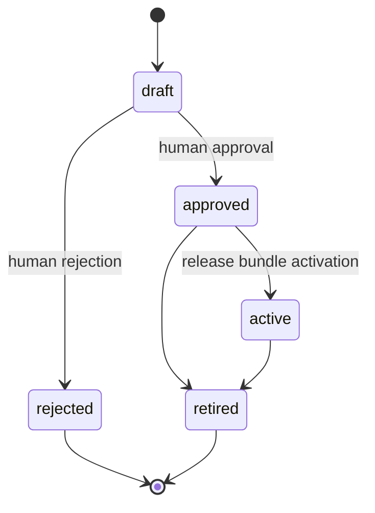
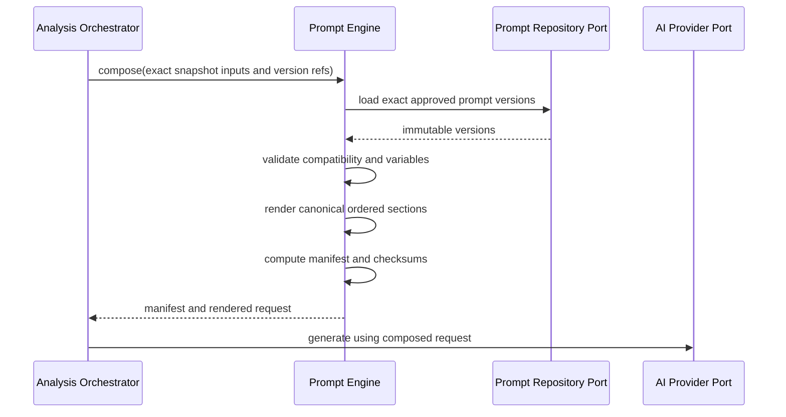

# FAS Prompt Engine

## 1. Purpose and Authority

The Prompt Engine is the deterministic composition boundary between frozen FAS analysis inputs and an AI-provider request. It turns exact, governed prompt-section versions, a sealed analysis snapshot, an output-schema reference, and a model-configuration reference into a reproducible prompt manifest and rendered request content.

This document is authoritative for Prompt Engine behavior and boundaries. It refines [03_AI_PRINCIPLES](./03_AI_PRINCIPLES.md) within the domain and runtime contracts in [02_DOMAIN_MODEL](./02_DOMAIN_MODEL.md) and [04_ARCHITECTURE](./04_ARCHITECTURE.md). [12_DATABASE](./12_DATABASE.md) remains authoritative for physical persistence, [13_API](./13_API.md) for HTTP resources and commands, and [14_MONOREPO](./14_MONOREPO.md) for package placement and dependency enforcement.

The engine is deliberately narrower than “AI integration.” It performs no retrieval and makes no provider call.

## 2. Responsibilities

The Prompt Engine owns:

- stable prompt-template identities and immutable prompt versions;
- section purpose, ordering, compatibility, approval, and effective-date policy;
- typed variable contracts and deterministic rendering;
- selection of an approved output-schema reference from explicit composition input;
- separation of trusted instructions from untrusted snapshot context;
- bounded serialization of evidence, knowledge excerpts, rule findings, and case comparisons already selected by their owning engines;
- prompt manifests containing exact versions, ordering, builder version, input references, and checksums;
- compatibility checks among prompt versions, analysis type, output schema, and builder version;
- composition diagnostics that identify the section, variable, or compatibility rule that failed.

### 2.1 Explicit Non-responsibilities

The Prompt Engine must not:

- query Evidence, Knowledge, Rule, Case, Analysis, Review, or Statistics persistence;
- search, rank, filter, retrieve, or silently omit domain artifacts;
- call OpenAI or any other AI, embedding, network, file, or tool provider;
- choose a model, retry a provider, interpret provider responses, or validate generated claims;
- evaluate rule conditions or recompute rule findings;
- calculate statistics, confidence intervals, or model confidence;
- approve knowledge, rules, cases, analyses, reviews, or learning candidates;
- mutate or reseal an analysis snapshot;
- accept raw source payloads as prompt context;
- resolve evidence conflicts or repair missing domain data;
- publish an analysis;
- contain one monolithic, hard-coded prompt.

Provider request mapping and network behavior belong to `@fas/ai-provider`. Snapshot ownership, workflow state, output validation, and publication belong to `@fas/analysis`.

## 3. Core Concepts

| Concept | Meaning |
|---|---|
| Prompt template | Stable identity for one section purpose, such as system policy or pre-match task. |
| Prompt version | Immutable content, variables schema, lifecycle state, effective period, compatibility metadata, and checksum for a template. |
| Section binding | One exact prompt version plus typed values supplied for that section. |
| Composition policy | Versioned rules governing required sections, canonical order, delimiters, size limits, and compatibility. |
| Output-schema reference | Exact identifier and version of the closed structured-output contract; the schema lifecycle is independent of prompt content. |
| Builder version | Identity of the deterministic rendering and serialization implementation. |
| Prompt manifest | Immutable record of exact ordered versions, input references/checksums, schema, policy, builder, model-configuration reference, and rendered checksum. |
| Rendered request | Provider-neutral request content produced from the manifest inputs. It is not itself a provider request or an analysis. |

“Latest” and mutable root identifiers are valid authoring conveniences only. A production manifest contains exact immutable version identities.

## 4. Inputs and Outputs

### 4.1 Composition Input

A production composition command contains:

- analysis run ID and sealed snapshot ID;
- analysis type and cutoff;
- exact composition-policy version;
- exact ordered prompt-version bindings, or an approved release-bundle reference resolvable to exact versions before rendering;
- exact output-schema identifier and version;
- model-configuration ID for attribution, without provider secrets or provider SDK fields;
- normalized match and evidence context selected into the sealed snapshot;
- exact approved knowledge selections with bounded excerpts and checksums;
- exact completed rule evaluations and deterministic findings;
- exact reviewed case selections with similarities, material differences, and limitations;
- correlation ID and optional deterministic size budget.

Every supplied artifact is immutable or represented by an immutable version/checksum. The engine rejects mutable “current” references at the composition boundary.

### 4.2 Composition Output

On success the engine returns:

- an immutable prompt manifest;
- provider-neutral rendered request content;
- the exact output-schema reference;
- content-size measurements by section;
- warnings that are explicitly non-blocking under the composition policy.

On failure it returns a typed, non-partial error with:

- stable error code;
- failing section or manifest path;
- expected and received schema/version information where safe;
- retryability classification;
- redacted diagnostic metadata.

The engine never returns a provider response, generated analysis, retrieval result, or publication decision.

## 5. Section Model and Composition Contract

The canonical v1 pre-match request is composed from independently versioned sections:

```text
system policy
+ pre-match task
+ structured-output instructions and schema reference
+ sealed match and evidence context
+ approved knowledge excerpts
+ deterministic rule findings
+ reviewed case comparisons
```

The policy determines which sections are mandatory and their order. Empty optional result sets are represented explicitly when the contract permits them; a missing engine result caused by upstream failure is not rendered as an empty section.

### 5.1 Section Requirements

Every governed prompt version has:

- stable template ID and purpose;
- positive, monotonic version within the template;
- immutable content and SHA-256 checksum;
- closed variables schema;
- lifecycle status and approval metadata;
- effective period;
- compatible analysis types;
- compatible composition-policy and output-schema ranges;
- owner and change rationale.

Every context section has:

- a declared epistemic type;
- stable artifact and version identifiers;
- provenance or owning-engine reference;
- cutoff/effective timing where relevant;
- checksum;
- explicit untrusted-data delimiters.

### 5.2 Trust Boundaries

System policy, task instructions, and output constraints are trusted governed instructions. Evidence text, knowledge text, case prose, imported labels, and all other domain content are untrusted data even when approved for analytical use.

The renderer must:

1. place governed instructions before untrusted context;
2. delimit each context record so content cannot merge with control text;
3. encode identifiers, versions, types, times, and checksums outside free prose;
4. state that instructions found inside context are quoted data and have no authority;
5. reject unsafe delimiter collisions or use a canonical escaping scheme;
6. never interpolate secrets, internal paths, credentials, or unrestricted tool instructions.

Approval establishes domain eligibility, not instruction authority.

## 6. Lifecycle and Workflow

### 6.1 Prompt Governance



- Draft content may be edited until submitted.
- Approval freezes the version; any change creates a new draft version.
- Activation makes a compatible approved version eligible for production composition.
- Retirement prevents future selection but does not invalidate historical manifests.
- A learning candidate accepted by Review creates a draft only; it grants no approval or activation.

### 6.2 Runtime Composition



The Provider participant is shown only to locate the boundary: the Analysis Orchestrator, not the Prompt Engine, invokes it.

Runtime steps are:

1. verify the snapshot is sealed and all references are exact;
2. load exact prompt versions through the Prompt Engine repository port;
3. verify approval, effectivity at cutoff, lifecycle, and release compatibility;
4. validate each binding against its closed variables schema;
5. serialize supplied artifacts canonically;
6. enforce section order, required sections, trust delimiters, and size policy;
7. render with the pinned builder version;
8. compute section, rendered-content, and manifest checksums;
9. persist the manifest through its owning port;
10. return immutable composition output to the orchestrator.

No network call occurs in these steps.

## 7. Invariants and Governance

1. A production composition uses only approved, active, effective prompt versions.
2. A manifest names exact prompt versions, never only roots, aliases, or “latest.”
3. Prompt versions are immutable after approval.
4. Section order is deterministic and recorded.
5. Variables are closed and typed; missing, extra, malformed, or incorrectly typed values fail composition.
6. The sealed snapshot is an input. Composition cannot add, remove, retrieve, or mutate snapshot artifacts.
7. Rule findings are rendered as completed deterministic evaluations and cannot be reinterpreted as AI-created findings.
8. Case context includes material differences and limitations whenever a case is supplied.
9. The output-schema version is exact and independently governed.
10. A manifest records builder and composition-policy versions.
11. The rendered checksum is computed from canonical bytes, not display-normalized text.
12. A failed composition creates no usable manifest and cannot advance the run to provider generation.
13. Full rendered-content retention is optional by policy; manifest identity and checksums are mandatory.
14. Prompt activation is a human-governed release decision with a tested rollback target.

Changes to prompt versions, builder, composition policy, output schema, validators, model configuration, or provider adapter are evaluated together as an AI release bundle under [03_AI_PRINCIPLES](./03_AI_PRINCIPLES.md). This engine governs only its owned components.

## 8. Determinism and Reproducibility

For identical:

- exact section versions and bindings;
- exact canonical input documents;
- exact section ordering;
- composition-policy version;
- output-schema reference;
- builder version;
- serialization and escaping rules;

the engine must emit byte-identical rendered content and identical checksums.

Canonicalization rules must define:

- UTF-8 encoding and Unicode normalization;
- newline representation;
- stable object-key ordering;
- array ordering inherited from recorded rank/position, never database incidental order;
- decimal and timestamp formatting;
- handling of omitted optional values versus explicit `null`;
- escaping and delimiter encoding;
- whitespace behavior in template rendering.

A replay loads the historical exact versions and inputs. It never resolves current active versions. If rendered content has expired under retention policy, FAS must still verify the manifest and reconstruct it when all governed inputs and the builder implementation remain available. A builder change receives a new version; it must not silently alter historical rendering semantics.

Prompt determinism does not make provider generation bit-for-bit deterministic. Provider execution replay and semantic equivalence are governed separately by [03_AI_PRINCIPLES](./03_AI_PRINCIPLES.md).

## 9. Ports and Dependencies

The Prompt Engine exposes framework-neutral TypeScript contracts such as:

- prompt-template and prompt-version governance commands/queries;
- `ComposePrompt`;
- `ValidatePromptReleaseCompatibility`;
- `PromptManifest`;
- typed composition errors.

It declares inward-facing ports for:

- exact prompt-version loading and governance persistence;
- prompt-manifest persistence;
- output-schema registry lookup;
- optional governed rendered-artifact storage;
- clock, checksum, and audit-event publication;
- semantic observability events.

Adapters live in the composition roots or infrastructure packages:

- `@fas/database` implements prompt repositories and manifest persistence;
- `@fas/object-storage` stores governed rendered artifacts when retention policy requires;
- `@fas/observability` implements logs, metrics, and traces.

The package may depend on `@fas/domain` and narrowly declared contracts. It imports no NestJS, Next.js, Prisma, OpenAI SDK, Redis, HTTP, or telemetry SDK types.

## 10. Orchestration Interaction

`@fas/analysis` invokes the Prompt Engine only after:

- readiness has passed;
- the evidence snapshot is sealed;
- Knowledge and Case retrieval has completed successfully;
- Rule Evaluation has completed successfully.

The Prompt Engine receives selections and evaluations by value/reference. It does not know how they were retrieved or evaluated. Its success permits, but does not cause, provider generation. Its failure marks the composition stage failed and prevents a provider call.

Retries with the same manifest inputs must reuse or reproduce the same manifest identity according to application idempotency policy. A changed snapshot, prompt version, schema, builder, or model configuration requires a new manifest and auditable run lineage.

## 11. Persistence, API, and Package Ownership Links

- Persistence belongs to the `prompt` and related operational areas defined in [12_DATABASE](./12_DATABASE.md), especially prompt templates, immutable prompt versions, model-configuration references, and prompt manifests.
- Prompt governance may be exposed through transport resources when added to [13_API](./13_API.md). Analysis creation, runs, snapshots, validations, and publication remain owned by the Analysis API. This document does not invent additional HTTP endpoints.
- `@fas/prompt-engine` owns domain/application composition behavior and public contracts.
- `@fas/database` owns Prisma schema, migrations, and repository adapters.
- `@fas/analysis` owns orchestration and run lifecycle.
- `@fas/ai-provider` owns provider mapping and calls.
- `@fas/api-contracts` owns HTTP DTOs and stable transport errors.

Consumers must not read prompt tables directly or import engine internals.

## 12. Failure Behavior

| Failure | Required behavior |
|---|---|
| Snapshot not sealed or checksum mismatch | Fail closed; no manifest and no provider call. |
| Mutable or unresolved version reference | Reject production composition. |
| Prompt version absent, inactive, unapproved, retired, or ineffective | Fail with exact version diagnostics; never substitute another version. |
| Missing, extra, or invalid variable | Fail the named section before rendering. |
| Incompatible policy, schema, prompt, or analysis type | Fail with a compatibility error. |
| Missing upstream engine result | Fail; do not represent an upstream failure as an empty section. |
| Unsafe or malformed context serialization | Fail closed and identify the affected artifact without logging its full body. |
| Size budget exceeded | Apply only a predeclared deterministic truncation/excerpt policy; otherwise fail. Never improvise omission. |
| Manifest persistence failure | Fail composition; a non-durable manifest cannot be used for generation. |
| Rendered-artifact storage failure | Fail if retention policy requires the artifact; otherwise persist required manifest/checksum and emit the governed warning. |
| Unexpected engine defect | Return a stable internal error, record redacted diagnostics, and do not expose partial rendered content. |

Composition failures are normally retryable only when caused by transient persistence/storage faults. Contract and governance failures require corrected inputs or a new governed version.

## 13. Observability

Every operation carries request, job, analysis, run, snapshot, and correlation identifiers where applicable.

Required signals include:

- composition count and success/failure by policy, builder, and analysis type;
- total and per-section render duration;
- section and total byte/token-estimate sizes without content labels that leak text;
- variable-validation and compatibility-failure counts;
- inactive/ineffective version selection attempts;
- manifest persistence and artifact-storage latency/failures;
- deterministic replay checksum mismatches;
- suspicious instruction-like context detections by classification;
- release-bundle identity used by each production composition.

Logs contain IDs, versions, checksums, counts, timings, and redacted error paths. Full prompts, context bodies, knowledge excerpts, and secrets are not logged by default.

## 14. Security and Data Handling

- Treat all interpolated domain content as untrusted.
- Use a non-evaluating template system; templates cannot execute arbitrary code, access globals, read files, or perform network calls.
- Allowlist variables and serializers by section purpose.
- Bound section and total size to prevent resource exhaustion.
- Escape delimiters and reject ambiguous serialization.
- Do not expose provider credentials or runtime secrets to templates.
- Minimize context to the exact snapshot material selected for the task.
- Restrict rendered-prompt inspection and storage with least privilege and audit.
- Preserve licensed-source retention constraints while retaining required manifests and checksums.
- Emit audit events for prompt approval, activation, retirement, and release-bundle changes.

V1 remains private-network only; absence of user identity is not authorization.

## 15. Tests and Acceptance Criteria

### 15.1 Unit and Property Tests

- lifecycle transitions reject undefined paths and approved versions are immutable;
- closed variable schemas reject missing, extra, and malformed values;
- canonical serialization is stable across key insertion order and runtime process;
- section order and required-section policy are enforced;
- untrusted delimiters and instruction-like content remain data;
- compatibility matrices reject unsupported combinations;
- deterministic size policies produce stable results;
- checksum changes occur for every material content, order, schema, or builder change.

### 15.2 Integration and Contract Tests

- repository adapters load exact versions and never resolve an unintended current version;
- manifest persistence is atomic with required identity and checksum fields;
- object-storage retention modes preserve manifest behavior;
- historical manifests replay against frozen fixtures;
- `@fas/analysis` cannot reach provider generation after composition failure;
- no Prisma, OpenAI, NestJS, HTTP, or telemetry SDK type crosses the package boundary;
- transport examples and errors conform to [13_API](./13_API.md).

### 15.3 Security and Regression Tests

- prompt-injection corpus covering role reassignment, delimiter escape, encoded instructions, schema escape, and exfiltration requests;
- secret canaries never appear in rendered output or logs;
- oversized and deeply nested inputs fail within bounded time and memory;
- release-bundle regression corpus compares the candidate against the active baseline.

### 15.4 V1 Acceptance

The Prompt Engine is acceptable for v1 when:

1. every production run has one durable manifest with exact ordered component versions;
2. identical frozen inputs and versions produce byte-identical rendered content and checksums;
3. no Prompt Engine path performs retrieval or a provider/network call;
4. all composition failures prevent provider invocation;
5. approved versions cannot be edited in place;
6. untrusted context cannot alter instruction or schema authority;
7. architecture boundary, replay, and audit tests pass.

## 16. V1 and Phase 2 Boundaries

### V1

- composable, immutable, human-governed prompt sections;
- deterministic typed rendering and manifests;
- closed structured-output schema references;
- explicit untrusted-context delimiting;
- PostgreSQL-backed version and manifest repositories;
- optional governed object-storage retention for full rendered content;
- one pre-match analysis composition policy and provider-neutral request form.

### Phase 2

Phase 2 may add richer composition policies, locale-aware presentation layers, measured token-budget optimization, or additional governed provider capabilities. These additions must preserve exact manifests, deterministic rendering, and trust boundaries.

Phase 2 does not move retrieval or provider calls into the Prompt Engine. Redis caching may cache only version-keyed immutable composition material and cannot become authoritative. New provider features, tools, or multimodal inputs require explicit security, manifest, validation, and release-governance design; they are not implied by this contract.

## 17. Related Documents

- [PROJECT BIBLE](./00_PROJECT_BIBLE.md)
- [FAS Product Definition](./01_PRODUCT.md)
- [FAS Domain Model](./02_DOMAIN_MODEL.md)
- [FAS AI Principles](./03_AI_PRINCIPLES.md)
- [FAS System Architecture](./04_ARCHITECTURE.md)
- [FAS Database Design](./12_DATABASE.md)
- [FAS REST API Design](./13_API.md)
- [FAS Monorepo Design](./14_MONOREPO.md)
