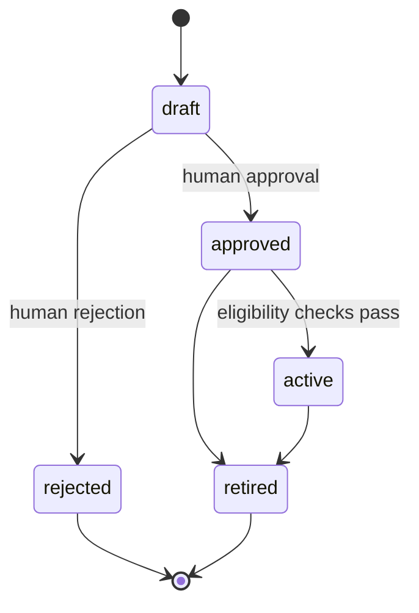
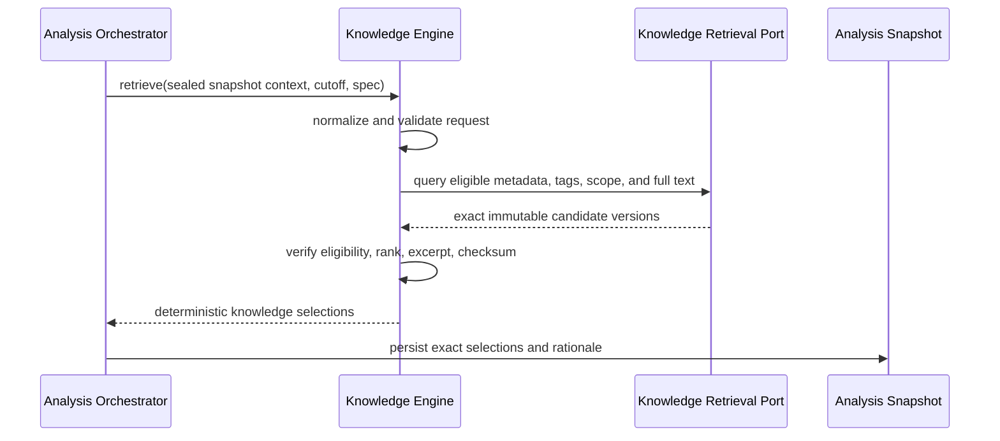

# FAS Knowledge Engine

## 1. Purpose and Authority

The Knowledge Engine governs reusable football-domain and analytical-methodology guidance and returns exact, source-backed knowledge versions eligible for a sealed pre-match analysis. Its purpose is to make reusable guidance reviewable, effective-dated, reproducible, and subordinate to evidence.

This document is authoritative for Knowledge Engine behavior and boundaries. It refines [01_PRODUCT](./01_PRODUCT.md), [02_DOMAIN_MODEL](./02_DOMAIN_MODEL.md), and [04_ARCHITECTURE](./04_ARCHITECTURE.md). [12_DATABASE](./12_DATABASE.md) is authoritative for physical tables, constraints, and indexes; [13_API](./13_API.md) for HTTP resources and commands; [14_MONOREPO](./14_MONOREPO.md) for package and adapter placement.

V1 retrieval uses governed metadata, scope, tags, and PostgreSQL full-text search. Embeddings and pgvector are Phase 2.

## 2. Responsibilities

The Knowledge Engine owns:

- stable knowledge-item identities and immutable knowledge versions;
- draft authoring, source attachment, validation, approval, activation, rejection, and retirement policy;
- source-backing requirements for factual knowledge statements;
- controlled tags, competition/context scope, effective periods, and source-quality classification;
- production eligibility as of an analysis cutoff;
- deterministic v1 retrieval over metadata, tags, scope, and full text;
- bounded excerpt selection from exact versions;
- retrieval rationale, rank, query/filter identity, and checksums;
- creation of a new draft when an accepted learning candidate targets knowledge;
- inspection queries needed by methodology owners.

### 2.1 Explicit Non-responsibilities

The Knowledge Engine must not:

- ingest or normalize match evidence;
- decide analysis readiness or seal analysis snapshots;
- build prompts or call an AI/embedding provider in v1;
- evaluate deterministic rules;
- retrieve or rank historical cases;
- generate analysis claims, model confidence, or match predictions;
- compute Statistics Engine metrics or use aggregate performance as automatic truth;
- auto-approve or auto-activate AI output, review findings, or learning candidates;
- mutate approved versions or historical snapshot selections;
- resolve source conflicts by deleting or overwriting provenance;
- expose raw database models as integration contracts;
- publish analyses or complete reviews.

Knowledge is reusable guidance, not match-specific evidence. A knowledge citation cannot substitute for a factual evidence citation about the current match.

## 3. Core Concepts

| Concept | Meaning |
|---|---|
| Knowledge item | Stable root identity for a coherent reusable subject or methodology. |
| Knowledge version | Immutable sourced, scoped, effective-dated revision of an item. |
| Knowledge source | Link from a version to a source record or governed external citation, including excerpt and locator. |
| Scope | Declared competitions and analytical contexts in which a version may apply. |
| Effective period | UTC interval during which the version is eligible, evaluated at analysis cutoff. |
| Production eligibility | Approved, active, effective, source-complete, and scope-compatible state. |
| Retrieval specification | Versioned query, filters, limits, ordering, and retrieval implementation identity. |
| Knowledge selection | Exact version, bounded excerpt, rank, retrieval reason, and integrity metadata returned for snapshot inclusion. |

Approval means a human has accepted a specific immutable version for governed use. It does not establish universal truth, make embedded text trusted instructions, or guarantee applicability to every match.

## 4. Inputs and Outputs

### 4.1 Governance Inputs

Authoring and lifecycle commands contain:

- knowledge item or exact draft-version identity;
- title, summary, and full Markdown body;
- controlled tags;
- competition and context scope;
- effective period;
- source links with source identity, excerpt, locator, date, and citation role;
- source-quality assessment;
- rationale, actor type/reference where available, correlation ID, and concurrency token.

Approval and activation commands reference an exact version and never accept mutable content inline.

### 4.2 Retrieval Input

A production retrieval request contains:

- sealed snapshot ID and checksum;
- analysis cutoff;
- normalized competition and context filters derived by the Analysis Orchestrator;
- a bounded full-text query and controlled tags;
- exact retrieval-specification/implementation version;
- maximum result and excerpt limits;
- correlation and analysis-run identifiers.

The engine does not derive new match facts from this request and does not query the Evidence module to enrich it.

### 4.3 Retrieval Output

Each selection contains:

- knowledge item ID and exact knowledge-version ID/number;
- title and summary;
- bounded source-backed excerpt;
- scope and effective period;
- controlled tags and source-quality classification;
- rank and deterministic retrieval reason;
- matched filters/terms without leaking unsafe query internals;
- content and excerpt checksums;
- retrieval-specification/implementation version.

The result set also records the normalized query/filter manifest and whether the result limit was reached. “No eligible matches” is a successful empty result. Failure to execute or verify retrieval is not.

## 5. Lifecycle and Governance

### 5.1 Draft and Versioning Rules

- A knowledge item is the stable identity; content lives in versions.
- Draft content may change under optimistic concurrency.
- Submission validates structure, sources, scope, tags, effective period, and checksum.
- Approval freezes the version.
- Editing approved or active content creates a new draft version with the next monotonic version number.
- Activation changes future eligibility; it does not replace references in sealed snapshots.
- Retirement removes the version/item from future retrieval and preserves all historical references.

### 5.2 Approval Requirements

Approval requires:

- a clear title, summary, and bounded subject;
- non-empty full text;
- declared scope and limitations where applicability is not universal;
- valid effective period;
- controlled tags;
- source-quality assessment;
- source links for factual statements;
- no unresolved blocking source-integrity issue;
- human rationale and audit record.

Methodology guidance may include reasoned interpretation, but must identify its evidence basis and limitations. Unsupported AI-generated prose is not source backing.

### 5.3 Learning Candidates

The Review Engine owns learning-candidate disposition. When an accepted candidate targets knowledge:

1. Review sends an explicit create-draft command with proposal provenance.
2. The Knowledge Engine validates the command and creates a new draft item/version.
3. The draft retains its originating review and candidate reference.
4. Normal sourcing, review, approval, activation, and audit requirements apply.

Acceptance never approves or activates the draft. There is no automatic promotion path.

## 6. V1 Retrieval Workflow

Runtime steps:

1. verify snapshot identity/checksum and cutoff are present;
2. normalize query terms, tags, scope, limits, and null/empty semantics under the pinned retrieval specification;
3. apply lifecycle and approval eligibility;
4. apply `effectiveFrom <= cutoff` and `effectiveTo > cutoff` where bounds exist;
5. apply competition/context scope;
6. search approved full text and metadata;
7. calculate deterministic rank and stable tie-break order;
8. select bounded excerpts under a versioned deterministic policy;
9. verify content and excerpt checksums;
10. return exact selections and retrieval manifest;
11. let Analysis persist those selections into the immutable snapshot lineage.

The Knowledge Engine does not send retrieved text to the Prompt Engine. The Analysis Orchestrator passes already persisted selections onward.

## 7. Eligibility, Ranking, and Excerpts

### 7.1 Eligibility

A version is production-eligible only if:

- it is approved and active under the governed lifecycle;
- it was approved and effective as of the analysis cutoff;
- it is not retired as of the applicable eligibility time;
- its sources and content integrity pass required checks;
- its competition/context scope matches the request;
- its schema and retrieval implementation are supported.

A late approval or source correction is not inserted into an already sealed snapshot.

### 7.2 Deterministic Ranking

V1 ranking is a versioned, explicit function of:

- exact scope match;
- controlled-tag match;
- PostgreSQL full-text rank under pinned text-search configuration;
- optional governed source-quality or recency factors only when declared in the retrieval specification;
- stable tie-breakers ending with immutable version ID.

Database incidental order, current time, mutable popularity, and AI judgment must not affect rank. Weight changes create a new retrieval-specification version and require retrieval regression evaluation.

### 7.3 Excerpt Policy

Excerpts are deterministic windows from the immutable knowledge body or stored source-backed segments. The policy defines:

- token/character budget;
- match-window expansion;
- heading and paragraph boundary behavior;
- overlap and deduplication;
- maximum excerpts per version;
- normalization and checksum calculation.

An excerpt does not become a new knowledge version. It retains exact source-version identity and position/locator metadata. Truncation must be visible and cannot remove material limitations in a misleading way.

## 8. Invariants

1. Knowledge item identity and version identity are distinct.
2. Version numbers are positive and monotonic within an item.
3. Approved versions are immutable.
4. Production retrieval returns only approved, active, effective, scope-compatible versions.
5. Every returned selection identifies one exact version and content checksum.
6. Every approved factual knowledge statement has source backing.
7. Sources preserve provenance, excerpt, locator, source date, and citation role.
8. Retrieval is evaluated as of analysis cutoff, not job start or current time.
9. Result ordering is total and deterministic.
10. Query, filters, limits, retrieval version, rank, reason, and excerpt checksum are reproducible.
11. An empty result is distinguishable from retrieval failure.
12. A sealed snapshot selection is never changed by later approval, retirement, reranking, or correction.
13. Knowledge never becomes current-match fact merely by being retrieved.
14. Retrieved text remains untrusted prompt context.
15. Learning candidates and AI output cannot self-promote.

## 9. Determinism and Reproducibility

Given the same:

- database state as of the recorded eligibility watermark;
- cutoff;
- normalized query and filters;
- text-search configuration and dictionaries;
- retrieval-specification/implementation version;
- excerpt policy;
- limit;

v1 retrieval must return the same ordered version IDs, reasons, and excerpt checksums.

The retrieval manifest records these inputs plus the candidate/source watermark needed to explain replay. Stable SQL ordering is mandatory for every paginated or limited query. Locale, collation, tokenizer, stemming configuration, and PostgreSQL behavior that can affect full-text results are pinned and covered by integration tests.

Historical analysis replay uses selections stored in the snapshot; it does not rerun current retrieval to reconstruct history. Retrieval rerun is a diagnostic comparison and produces a new record, never a rewrite.

## 10. Ports and Dependencies

`@fas/knowledge-engine` exposes framework-neutral contracts for:

- item and version commands/queries;
- lifecycle validation and transitions;
- `RetrieveKnowledge`;
- `CreateKnowledgeDraftFromLearningCandidate`;
- exact selection and retrieval-manifest results;
- typed knowledge errors and domain events.

It declares inward-facing ports for:

- knowledge root/version persistence;
- source-link persistence and source-reference verification;
- v1 metadata/tag/full-text retrieval;
- transaction execution;
- clock, checksum, audit-event, and semantic-observability services.

Infrastructure:

- `@fas/database` implements Prisma repositories, PostgreSQL full-text retrieval, migrations, and integrity mapping;
- `@fas/observability` implements telemetry adapters;
- `apps/api` composes governance commands and queries;
- `apps/worker` composes production retrieval within analysis jobs.

The engine imports no NestJS, Next.js, Prisma, OpenAI, pgvector client, Redis, HTTP, or telemetry SDK types. It may depend on `@fas/domain` and explicit cross-module contracts only.

## 11. Orchestration Interaction

The Analysis Orchestrator invokes Knowledge retrieval after evidence snapshot sealing and before prompt composition. It supplies normalized immutable context and owns:

- analysis readiness;
- cutoff and snapshot lifecycle;
- retry/checkpoint behavior;
- persistence of selections in the analysis snapshot;
- deciding whether the configured analysis policy permits a genuinely empty selection;
- passing selected excerpts to the Prompt Engine.

The Knowledge Engine returns selections or a typed failure. It does not invoke Prompt, Rule, Case, AI Provider, Review, or Statistics engines.

Review may propose knowledge changes. Statistics may report retrieval or review quality. Neither can mutate lifecycle state; only explicit Knowledge commands can create, approve, activate, or retire versions.

## 12. Persistence, API, and Package Ownership Links

- The `knowledge` schema area, item/version/source records, and v1 indexes are defined by [12_DATABASE](./12_DATABASE.md).
- Knowledge HTTP resources and lifecycle commands are defined by the Knowledge API in [13_API](./13_API.md). This document does not duplicate the endpoint catalog.
- `@fas/knowledge-engine` owns domain policy, application contracts, retrieval semantics, and errors.
- `@fas/database` owns Prisma and PostgreSQL adapters.
- `@fas/api-contracts` owns transport schemas and stable HTTP error representation.
- `@fas/analysis` owns snapshot join records and analysis orchestration.
- `@fas/review-engine` owns learning-candidate state; Knowledge owns the resulting draft after explicit handoff.
- `@fas/statistics-engine` owns aggregate quality projections, not retrieval or promotion.

Cross-module consumers use public ports and exact immutable references, never direct knowledge table reads.

## 13. Failure Behavior

| Failure | Required behavior |
|---|---|
| Invalid draft content, scope, tags, period, or sources | Reject with field-level typed diagnostics; do not create/approve an invalid version. |
| Concurrent draft/lifecycle update | Reject with optimistic-concurrency conflict. |
| Approval requirements unmet | Keep draft unchanged and return all blocking governance findings. |
| Attempt to edit approved content | Reject; require a new draft version. |
| Ineligible exact version requested | Reject; never substitute another version. |
| Invalid retrieval query/filter/spec | Fail before repository execution. |
| Repository timeout or database error | Fail retrieval as retryable where appropriate; do not return partial selections. |
| Unsupported text-search configuration/version | Fail closed and require operator/release action. |
| Content/source checksum mismatch | Quarantine the affected candidate, fail production retrieval, and emit an integrity alert. |
| Excerpt policy cannot preserve required limitation/source context | Exclude with an explicit reason or fail under policy; never return a misleading excerpt. |
| No eligible match | Return a successful, auditable empty result. |
| Accepted learning candidate cannot create a valid draft | Keep candidate handoff unresolved/failed; never bypass draft validation. |

The Analysis stage fails on Knowledge retrieval failure. It must not silently continue without Knowledge. A successful empty result may continue only when the predeclared analysis policy allows it and records the resulting uncertainty.

## 14. Observability

Every command and retrieval carries correlation, request/job, analysis/run, snapshot, and retrieval-specification identifiers where applicable.

Required signals:

- authoring, approval, rejection, activation, and retirement counts;
- approval lead time and governance failure categories;
- retrieval latency and database query duration;
- candidate, eligible, selected, and truncated counts;
- empty-result and limit-reached rates;
- results and quality sliced by retrieval-specification version and scope;
- full-text query plan regressions and index usage in operational diagnostics;
- checksum/integrity failures;
- replay rank/excerpt mismatches;
- learning-candidate-to-draft counts without implying promotion success.

Logs contain IDs, versions, ranks, reasons, checksums, counts, and redacted diagnostics. Full source documents, full knowledge bodies, queries containing sensitive licensed text, and excerpts are not logged by default.

## 15. Security and Data Handling

- Treat authored/imported text as untrusted data for prompt purposes.
- Sanitize Markdown for display separately from stored canonical content.
- Validate and canonicalize external locators; never fetch arbitrary URLs during production retrieval.
- Enforce bounded query, result, excerpt, tag, and document sizes.
- Use least-privilege runtime database access; lifecycle audit rows are append-only.
- Keep source licenses and retention restrictions with source metadata.
- Prevent SQL/full-text query injection through typed repository parameters.
- Do not store credentials in knowledge content or source links.
- Restrict full-body and source inspection to trusted private operations in v1.
- Before public use, add authenticated identities, authorization, and actor-specific audit controls.

Knowledge approval does not neutralize prompt injection. Selected text must remain delimited and non-authoritative when composed by the Prompt Engine.

## 16. Tests and Acceptance Criteria

### 16.1 Domain and Governance Tests

- legal and illegal lifecycle transitions;
- approved-version immutability and monotonic versioning;
- source requirements for factual statements;
- effective-period boundary behavior in UTC;
- controlled-tag and scope validation;
- learning-candidate acceptance creates only a draft;
- retirement preserves historical exact-version reads.

### 16.2 Retrieval Tests

- eligibility at cutoff across approval, activation, effective, and retirement boundaries;
- scope and tag matching;
- full-text normalization, ranking, and stable tie-breaks;
- deterministic excerpt boundaries and checksums;
- empty result versus failure;
- fixed limits and total ordering;
- same fixture/state/specification returns identical ordered selections;
- late approvals and corrections do not alter sealed snapshots.

### 16.3 Integration and Architecture Tests

- PostgreSQL full-text behavior under pinned configuration;
- repository mapping preserves immutable identities and checksums;
- relevant indexes are used for representative corpus/query plans;
- snapshot persistence records exact version, rank, reason, and excerpt checksum;
- no provider, Prompt Engine, Prisma, NestJS, or HTTP dependency leaks into engine domain code;
- API examples, idempotency, ETag, and stable error mappings conform to [13_API](./13_API.md).

### 16.4 Security and Operational Tests

- SQL/full-text injection and malformed-query corpus;
- instruction-like and malicious Markdown remains inert data;
- oversized/deep documents and query floods are bounded;
- checksum corruption triggers fail-closed behavior;
- backup/restore preserves versions, sources, and retrieval integrity.

### 16.5 V1 Acceptance

The Knowledge Engine is acceptable for v1 when:

1. all production selections are approved, active, effective, source-backed exact versions;
2. historical selections remain reviewable after new versions or retirement;
3. fixed retrieval inputs produce an identical ordered result and excerpt checksums;
4. every selection records a human-readable retrieval reason;
5. retrieval failure cannot be mistaken for an empty result;
6. no learning, AI, Review, or Statistics path auto-promotes content;
7. architecture, retrieval, source-integrity, and replay suites pass.

## 17. V1 and Phase 2 Boundaries

### V1

- human-governed item/version lifecycle;
- source-backed Markdown body, summary, metadata, scope, tags, and effective dates;
- deterministic PostgreSQL metadata/tag/full-text retrieval;
- deterministic bounded excerpts and recorded retrieval rationale;
- exact snapshot selections and checksums;
- no embedding generation and no semantic/vector retrieval.

### Phase 2: pgvector

Phase 2 may add semantic retrieval only after a measured retrieval-quality baseline exists. It requires:

- versioned embedding-provider/model identity;
- dimensions, normalization, chunking version, and source content checksum;
- immutable chunk identity and exact knowledge-version linkage;
- background embedding jobs with explicit status and failure handling;
- governed hybrid-ranking specification and stable tie-breaks;
- recorded query-embedding identity, filters, scores, rank, and embedding version;
- recall, precision/relevance, latency, cost, drift, and security evaluation against a frozen corpus;
- rebuild and rollback capability without changing source knowledge versions.

Embeddings are derived indexes, not knowledge truth. They never replace source text, provenance, lifecycle eligibility, full-text fallback policy, or exact snapshot records. No embedding or retrieval output can approve or promote knowledge automatically.

Redis caching, if introduced, uses immutable version/specification keys and bounded TTLs; PostgreSQL remains authoritative.

## 18. Related Documents

- [PROJECT BIBLE](./00_PROJECT_BIBLE.md)
- [FAS Product Definition](./01_PRODUCT.md)
- [FAS Domain Model](./02_DOMAIN_MODEL.md)
- [FAS AI Principles](./03_AI_PRINCIPLES.md)
- [FAS System Architecture](./04_ARCHITECTURE.md)
- [FAS Database Design](./12_DATABASE.md)
- [FAS REST API Design](./13_API.md)
- [FAS Monorepo Design](./14_MONOREPO.md)
