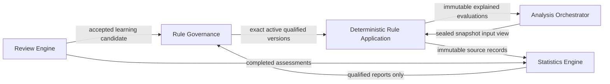
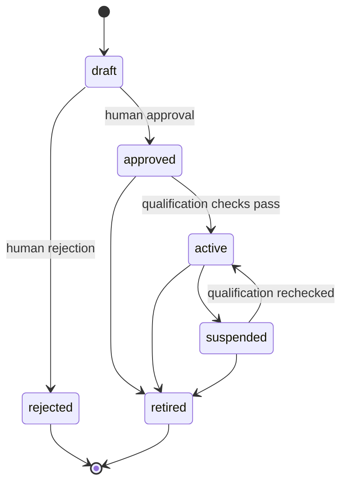
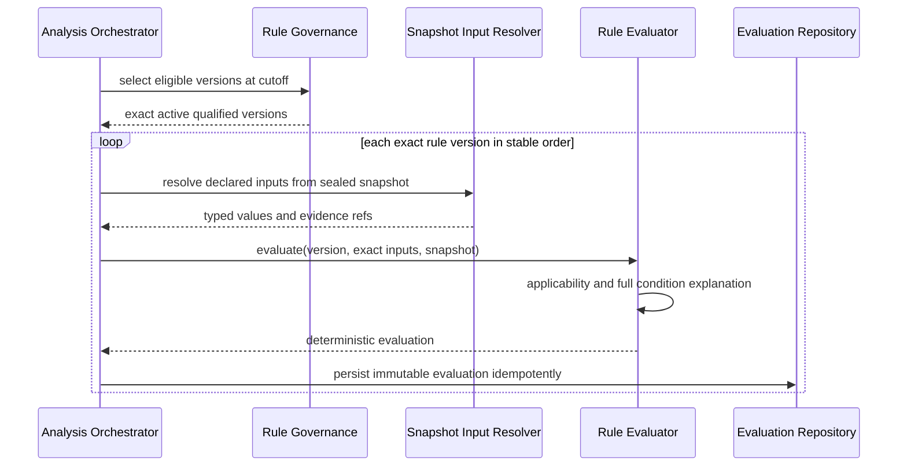

# FAS Rule Engine

## 1. Purpose and Authority

The Rule Engine governs versioned analytical rules and evaluates exact rule versions deterministically against exact normalized inputs from a sealed analysis snapshot. It answers:

> Did this rule version apply to this snapshot, did its declared conditions match, and why?

This document is authoritative for Rule Engine governance and deterministic per-snapshot evaluation. It refines [01_PRODUCT](./01_PRODUCT.md), [02_DOMAIN_MODEL](./02_DOMAIN_MODEL.md), and [04_ARCHITECTURE](./04_ARCHITECTURE.md). [12_DATABASE](./12_DATABASE.md) remains authoritative for tables and physical integrity; [13_API](./13_API.md) for HTTP commands and resources; [14_MONOREPO](./14_MONOREPO.md) for package boundaries.

Deterministic rule application, quality Evaluation, and Statistics are separate. The Rule Engine produces one immutable explained rule evaluation for one rule version and one snapshot. The Evaluation Engine applies assessment policy and quality gates. The Statistics Engine aggregates populations of immutable rule evaluations and reviews. None may substitute for another.

The Rule Engine contains no LLM behavior and makes no AI-provider call.

## 2. Responsibilities

The Rule Engine owns two explicitly separated capabilities inside one package boundary:

### 2.1 Rule Governance

- stable rule identities and immutable rule versions;
- versioned condition and outcome schemas;
- draft validation, approval, activation, suspension, reactivation, and retirement;
- competition/context scope and effective periods;
- sample count, minimum sample, confidence, validation method, evidence basis, and limitations;
- activation qualification policy;
- creation of draft rules/versions from accepted learning candidates;
- exact eligible-version selection for a cutoff.

### 2.2 Deterministic Evaluation

- validation and compilation of the supported condition tree;
- applicability assessment before condition matching;
- typed normalized input resolution through declared snapshot input contracts;
- deterministic operator semantics;
- short-circuit-independent condition evaluation and condition-level explanation;
- statuses `matched`, `not_matched`, `inapplicable`, or `error`;
- deterministic finding emission only for matched rules;
- immutable evaluation identity, exact inputs, evaluator version, and checksums;
- preview evaluation that is clearly non-production and non-persistent.

### 2.3 Explicit Non-responsibilities

The Rule Engine must not:

- call an LLM, embedding model, AI provider, or arbitrary external service;
- parse prose into production conditions at runtime;
- infer missing inputs or ask AI to fill them;
- retrieve arbitrary evidence or read another module's tables;
- treat a market signal as fact;
- generate probabilistic match predictions unless a future, separately governed rule schema explicitly defines a deterministic output of that type;
- calculate sample count, confidence intervals, calibration, hit rate, or other aggregate statistics;
- mutate sample/confidence metadata from evaluation outcomes;
- approve or activate learning candidates automatically;
- build prompts, select knowledge/cases, or publish analyses;
- rewrite historical rule versions or evaluations;
- infer causality from correlation;
- hide limitations, qualification state, or inapplicability.

Authoring assistance may exist outside the production evaluator, but any proposed rule must enter as a draft structured version and pass normal governance. AI-authored prose or conditions have no special authority.

## 3. Separation of Rule Governance, Rule Application, and Statistics

Statistics may inform a human governance decision. It cannot activate, suspend, edit, or rerun a rule automatically. Evaluation does not query Statistics to determine whether current conditions match; qualification metadata is frozen on the exact rule version supplied by Governance.

## 4. Core Concepts

| Concept | Meaning |
|---|---|
| Rule | Stable governed identity for one analytical proposition. |
| Rule version | Immutable scope, condition tree, outcome, qualification metadata, effective period, and checksum. |
| Condition schema | Versioned closed grammar of supported boolean nodes, predicates, operators, values, and missing-data semantics. |
| Outcome schema | Versioned deterministic finding definition emitted on a match. |
| Applicability | Whether scope, timing, schema, and required-input preconditions permit evaluation for this snapshot. |
| Rule evaluation | Immutable execution of one exact rule version against one exact sealed snapshot. |
| Explanation | Condition-by-condition record of resolved inputs, operator semantics, result, and non-sensitive reason. |
| Rule finding | Typed deterministic conclusion emitted only by a matched evaluation. |
| Evaluator version | Exact implementation-semantic identity used to execute the condition schema. |
| Preview | Non-persistent evaluation against supplied test values; never production evidence. |

Rule confidence is governed qualification metadata about the rule version and its validation basis. It is not model confidence, source quality, a statistical confidence interval, or the certainty of one match outcome.

## 5. Inputs and Outputs

### 5.1 Rule Version Input

A rule-version draft contains:

- title and description;
- exact condition-schema version and closed condition tree;
- exact outcome-schema version and deterministic outcome;
- competition/context scope;
- effective period;
- sample count and minimum sample required;
- confidence in `[0,1]`;
- validation method;
- evidence basis or governed references;
- required non-empty limitations;
- authoring rationale and provenance.

Conditions reference stable normalized metric keys and declared subject selectors. They never reference Prisma columns, provider fields, free-form SQL, JavaScript, template expressions, or executable code.

### 5.2 Production Evaluation Input

The evaluation command contains:

- sealed analysis snapshot ID and checksum;
- exact rule-version ID and content checksum;
- cutoff;
- exact normalized input values and their evidence/source references as exposed by the Analysis/Evidence contract;
- input-schema version;
- evaluator version;
- correlation and analysis-run identifiers.

The evaluator must not query for additional match data. Input resolution happens through an explicit application port before or as part of the orchestrated evaluation boundary and records the exact values used.

### 5.3 Evaluation Output

Every production evaluation returns and persists:

- evaluation ID;
- exact snapshot and rule-version IDs/checksums;
- `matched`, `not_matched`, `inapplicable`, or `error`;
- exact normalized input document and checksum;
- condition-level explanation tree;
- applicability rationale;
- deterministic finding for `matched`, otherwise absent;
- rule qualification metadata needed for display: sample count, minimum sample, confidence, validation method, and limitations;
- condition/input/evaluator schema versions;
- evaluation time and correlation identifiers.

An `error` is not `not_matched`. Missing or unsuitable inputs are `inapplicable` when declared semantics permit that classification; malformed contracts, unsupported schemas, or engine defects are errors.

## 6. Condition Language

### 6.1 Design Requirements

The v1 condition language is:

- closed and schema-versioned;
- declarative and side-effect free;
- strongly typed;
- finite and bounded in depth/node count;
- independent of database/provider representation;
- deterministic across supported runtimes;
- explainable at every node;
- incapable of network, filesystem, clock, random, code, or SQL access.

The authoritative operator catalog belongs in the versioned condition schema and implementation contracts, not this architecture document. V1 minimally supports boolean composition and typed comparisons needed by approved rules. Adding an operator changes the condition schema and requires compatibility, determinism, migration, and regression tests.

### 6.2 Semantic Rules

1. Boolean nodes evaluate all children for explanation even if the final truth value could short-circuit, unless the schema version explicitly records deterministic skipped nodes.
2. Values are not truthy/falsy by language convention; types are explicit.
3. Decimal comparisons use declared decimal semantics, never binary floating-point accidents.
4. Timestamps are UTC instants; durations and date boundaries have declared units.
5. String comparison, normalization, case handling, and locale are fixed by schema version.
6. Collection ordering and duplicate handling are explicit.
7. `null`, absent, stale, conflicted, rejected, and superseded inputs are distinct states.
8. Missing-data behavior is declared by predicate/input requirement and cannot default to `false`.
9. Threshold boundaries (`lt`, `lte`, `gt`, `gte`) follow exact schema semantics.
10. No condition can inspect post-cutoff or outcome evidence in a pre-match evaluation.

### 6.3 Applicability Before Match

Applicability is evaluated before the final rule match and covers:

- lifecycle and effectivity at cutoff;
- competition/context scope;
- supported schema/evaluator version;
- required subject availability;
- required input presence, freshness, quality, and temporal eligibility.

An inapplicable rule communicates why it could not validly answer. It does not emit a negative finding.

## 7. Lifecycle and Governance

### 7.1 Draft and Validation

Drafts may be edited under optimistic concurrency. Validation checks:

- condition and outcome schema conformance;
- supported operators, types, metric keys, and subject selectors;
- bounded complexity;
- scope and effective-period coherence;
- outcome uniqueness and epistemic classification;
- complete sample/confidence/validation/limitations metadata;
- representative examples covering match, no-match, inapplicable, and boundary cases.

Validation does not approve the rule.

### 7.2 Approval and Activation

Approval is a human decision that freezes the exact version. Activation additionally requires:

- approved status;
- `sampleCount >= minimumSampleRequired`;
- confidence present and within `[0,1]`;
- non-empty validation method and limitations;
- supported condition/outcome/evaluator compatibility;
- effective and coherent scope;
- no blocking governance finding;
- explicit rationale and audit event.

Activation selects one exact version for future eligibility. It never changes historical evaluations.

### 7.3 Suspension and Retirement

Suspension immediately prevents new production selection while preserving the ability to investigate and later reactivate the same immutable version after qualification is rechecked. Retirement permanently prevents future selection. Neither transition alters sealed snapshots or existing evaluations.

### 7.4 New Evidence and Learning

Changed conditions, thresholds, outcomes, scope, sample, confidence, validation method, or limitations require a new draft version. An accepted learning candidate creates only a draft through an explicit Rule Governance command. There is no automatic promotion, activation, threshold tuning, or online learning.

## 8. Production Evaluation Workflow

The orchestrator may evaluate independent versions concurrently, but persistence and returned collections use stable ordering. A failure policy is explicit:

- contract/infrastructure failure for any required rule fails the Rule Evaluation stage;
- a valid `inapplicable` evaluation does not fail the stage;
- partial results are retained diagnostically if useful but are not presented as a complete successful evaluation set.

## 9. Invariants

1. Production evaluation references one exact rule version and one exact sealed snapshot.
2. Only approved, active, effective, qualified versions are selected for production.
3. Rule versions are immutable after approval.
4. Activation requires sample count, minimum sample, confidence, validation method, scope, and limitations.
5. Input values are exact, normalized, temporally eligible, and persisted with provenance/checksum.
6. The evaluator uses no current time, random value, network, filesystem, database query, provider call, or hidden mutable state.
7. The same valid version, inputs, schema, and evaluator version produce the same status, explanation, finding, and semantic checksum.
8. `matched`, `not_matched`, `inapplicable`, and `error` remain distinct.
9. A finding exists only for `matched`.
10. Explanation covers every condition node under declared schema semantics.
11. Missing or conflicted input is never silently converted to `false`.
12. Rule confidence and sample metadata are exposed with every finding and cannot be rewritten by the evaluator.
13. No LLM evaluates, repairs, overrides, or explains the authoritative result.
14. Existing evaluations are append-only and never recalculated in place.
15. Evaluation and Statistics remain separate contracts, persistence concerns, and package responsibilities.

## 10. Determinism and Reproducibility

Exact deterministic replay requires:

- rule-version content and checksum;
- condition and outcome schema versions;
- snapshot ID/checksum and cutoff;
- exact normalized input document and checksum;
- evaluator version;
- canonical value encoding and comparison semantics.

The evaluator emits a semantic result checksum over status, applicability, explanation tree, and finding. Evaluation time, execution duration, correlation IDs, and storage IDs are excluded from semantic equality.

Canonical rules include:

- stable condition-node identity and traversal order;
- canonical JSON key order and UTF-8 encoding;
- exact decimal representation;
- UTC timestamp serialization;
- stable collection ordering;
- exhaustive typed state representation;
- no dependence on JavaScript object insertion order or database order.

An evaluator change that can alter semantics receives a new evaluator version. Historical evaluations remain authoritative records of what the prior version produced. Diagnostic replay creates a comparison record or test result; it never overwrites the original.

## 11. Ports and Dependencies

`@fas/rule-engine` exposes framework-neutral contracts for:

- rule root/version governance commands and queries;
- draft validation and qualification results;
- eligible-version selection;
- snapshot input requirements;
- deterministic production evaluation;
- non-persistent preview evaluation;
- typed evaluations, findings, explanations, errors, and domain events.

It declares inward-facing ports for:

- rule root/version persistence;
- immutable evaluation persistence;
- normalized snapshot input resolution;
- transaction execution;
- clock for record metadata only;
- checksum, audit-event, and semantic-observability services.

The pure evaluator itself receives all data as arguments and needs no I/O port.

Adapters:

- `@fas/database` implements rule/evaluation repositories and Prisma mapping;
- `@fas/evidence` and `@fas/analysis` expose the normalized snapshot input contract without exposing persistence;
- `@fas/observability` implements telemetry;
- `apps/api` composes governance and preview commands;
- `apps/worker` composes production evaluation within analysis jobs.

The engine imports no NestJS, Next.js, Prisma, OpenAI, Redis, HTTP, telemetry SDK, or Statistics Engine implementation.

## 12. Orchestration Interaction

The Analysis Orchestrator:

1. seals the snapshot;
2. asks Rule Governance for exact eligible versions at cutoff;
3. obtains each version's declared input requirements;
4. resolves exact normalized inputs from snapshot-owned contracts;
5. invokes the deterministic evaluator;
6. persists evaluations idempotently;
7. records the complete evaluation set in analysis lineage;
8. passes explained findings and qualification metadata to the Prompt Engine.

The Prompt Engine receives completed findings and must instruct the model not to reevaluate them. The AI may discuss implications but cannot change the authoritative status, condition results, sample count, confidence, or limitations.

Review later assesses usefulness and outcome relevance without rewriting evaluations. Statistics later aggregates immutable evaluations and completed reviews under its own metric versions and sample qualification.

## 13. Persistence, API, and Package Ownership Links

- Rule roots, immutable versions, qualification fields, evaluations, and findings belong to the `rule` area specified in [12_DATABASE](./12_DATABASE.md).
- Governance, preview, and statistics-link resources are specified in the Rule and Statistics sections of [13_API](./13_API.md); this document does not duplicate endpoint catalogs.
- `@fas/rule-engine` owns governance semantics, the condition language, pure evaluator, application ports, and typed results.
- `@fas/database` owns Prisma schema, migrations, and repository adapters.
- `@fas/analysis` owns workflow, snapshot, run, and stage completion.
- `@fas/evidence` owns source provenance, normalization, freshness, and conflicts.
- `@fas/statistics-engine` owns aggregate rule-version metrics and qualification of those metrics.
- `@fas/review-engine` owns rule assessments and learning candidates.
- `@fas/api-contracts` owns transport schemas and stable HTTP errors.

The package may contain separate governance and evaluation modules to preserve conceptual boundaries. Neither may import Statistics persistence or implementation.

## 14. Failure Behavior

| Failure | Required behavior |
|---|---|
| Invalid condition/outcome document | Reject draft validation with node-level diagnostics. |
| Unsupported schema/operator/metric type | Reject validation or mark production execution `error`; never guess semantics. |
| Approval/activation qualification unmet | Reject transition and list sample/confidence/limitations/validation blockers. |
| Attempt to edit approved version | Reject; require a new draft version. |
| Concurrent lifecycle change | Reject with optimistic-concurrency conflict. |
| Rule not active/effective/in scope | Do not select it for production; direct exact evaluation reports inapplicability or governance error according to command type. |
| Required input absent/stale/conflicted | Return `inapplicable` with exact reasons when declared by schema; use `error` for malformed/unrepresentable input. |
| Snapshot/checksum mismatch | Fail closed with `error`; do not evaluate. |
| Evaluator defect or resource bound exceeded | Record `error`, fail the stage, and emit redacted diagnostics. |
| Evaluation persistence failure | Fail the stage; an unpersisted result is not production-complete. |
| Duplicate production evaluation command | Return the existing identical evaluation; conflict if checksums differ. |
| One required rule errors in a batch | Mark the stage failed under v1 policy; never present the remainder as a complete set. |
| Preview failure | Return diagnostics only; create no production evaluation. |

Retries use the same snapshot, exact rule versions, inputs, and evaluator version. Correcting data or versions requires a new explicit analysis/snapshot lineage where applicable.

## 15. Observability

Every governance command and evaluation carries correlation, request/job, analysis/run, snapshot, rule, and rule-version identifiers as applicable.

Required signals:

- draft validation, approval, activation, suspension, and retirement counts;
- activation failures by qualification reason;
- eligible-version selection count and latency;
- evaluation count and duration by condition/evaluator schema version;
- matched, not-matched, inapplicable, and error counts;
- inapplicability and missing/conflicted-input reason counts;
- condition node count/depth and resource-bound rejection rates;
- persistence/idempotency conflicts;
- deterministic replay mismatches;
- evaluator-version adoption and old-version usage;
- downstream review/statistical quality via their owning engines, linked by exact rule version.

Operational dashboards must not present match rate as rule quality. Quality reporting includes population, sample, metric version, confidence interval where appropriate, and source watermark from Statistics.

Logs include identifiers, schema/evaluator versions, status, node paths, metric keys, checksums, counts, and timings. They exclude full sensitive input payloads and source text by default.

## 16. Security and Resource Safety

- The condition language is data, never executable code.
- Reject JavaScript, SQL, regular expressions without bounded safe semantics, templates, scripts, and dynamic property traversal.
- Allowlist metric keys, selectors, operators, value types, and outcome keys.
- Bound document bytes, tree depth, node count, collection size, and evaluation time.
- Validate every persisted condition document again at the evaluator compatibility boundary.
- Use parameterized repositories and least-privilege database roles.
- Never include secrets or raw source payloads in conditions, explanations, or logs.
- Restrict lifecycle commands to the trusted private environment and record append-only audits.
- Before public/multi-user operation, add authenticated identity, authorization, and actor-level audit.

Rules can still encode harmful or misleading methodology even when technically deterministic. Human governance, evidence basis, limitations, sample qualification, review, and suspension are mandatory controls.

## 17. Tests and Acceptance Criteria

### 17.1 Condition and Evaluator Tests

- golden tests for every schema node/operator/type;
- property tests for boolean algebra where semantics permit;
- exact threshold, decimal, timestamp, duration, normalization, and collection boundaries;
- exhaustive absent/null/stale/conflicted/rejected/superseded input behavior;
- applicability before matching;
- full explanation coverage and stable node ordering;
- stable semantic checksums across processes;
- no clock/random/I/O dependency in the pure evaluator;
- depth, size, and time bounds.

### 17.2 Governance Tests

- all legal and illegal lifecycle transitions;
- monotonic versions and approved immutability;
- activation sample/confidence/validation/limitations requirements;
- effectivity and scope at cutoff;
- suspension/reactivation and retirement behavior;
- accepted learning candidate creates a draft only;
- historical versions remain readable and evaluations unchanged.

### 17.3 Integration and Contract Tests

- exact eligible-version selection under concurrent lifecycle changes;
- normalized snapshot input mapping preserves provenance and types;
- unique `(snapshot, ruleVersion)` evaluation idempotency;
- repository round-trip preserves condition, explanation, finding, and checksums;
- Rule stage failure prevents Prompt/Provider stages;
- preview creates no production record;
- Statistics consumes immutable evaluations through contracts without evaluator/table coupling;
- API request/response examples and errors conform to [13_API](./13_API.md).

### 17.4 Architecture and Security Tests

- no OpenAI/AI provider, Statistics implementation, Prisma, NestJS, HTTP, or telemetry SDK import in engine domain/evaluator;
- static scan and runtime tests prove no dynamic code execution;
- adversarial deeply nested, oversized, malformed, and type-confusion conditions fail safely;
- evaluator has no outbound network or filesystem capability;
- audit and redaction behavior covers every lifecycle change and failure class.

### 17.5 V1 Acceptance

The Rule Engine is acceptable for v1 when:

1. every production evaluation names an exact active qualified rule version and sealed snapshot;
2. identical version/input/evaluator fixtures produce identical status, explanation, finding, and semantic checksum;
3. every result distinguishes match, no-match, inapplicability, and error;
4. every finding exposes sample count, confidence, validation method, and limitations;
5. no evaluator path calls an LLM or computes Statistics metrics;
6. no learning or review path automatically changes production rule state;
7. all lifecycle, operator, boundary, replay, persistence, and architecture suites pass.

## 18. V1 and Phase 2 Boundaries

### V1

- human-governed immutable rule versions;
- closed versioned JSON condition and outcome schemas;
- deterministic pure evaluation against sealed snapshot inputs;
- explicit applicability and condition-level explanations;
- sample count, minimum sample, confidence, validation method, and limitations required for activation;
- immutable PostgreSQL evaluation records;
- non-persistent preview evaluation;
- sequential or bounded in-process/worker evaluation under the v1 job model.

### Phase 2

Phase 2 may add:

- additional typed operators or subject selectors through new schema versions;
- compiled/cached condition plans keyed by rule checksum and evaluator version;
- bounded parallel evaluation and distributed dispatch when measured load requires it;
- Redis caching using immutable versioned keys;
- stronger authoring simulation, holdout tooling, and governance workflows.

Phase 2 additions do not change the core semantics: PostgreSQL remains authoritative, evaluations remain deterministic and immutable, and Statistics remains separate. New operators cannot call LLMs, arbitrary code, databases, or networks. Automated discovery or AI-assisted rule proposals, if introduced, produce drafts only and require source basis, qualification, human approval, and explicit activation.

## 19. Related Documents

- [PROJECT BIBLE](./00_PROJECT_BIBLE.md)
- [FAS Product Definition](./01_PRODUCT.md)
- [FAS Domain Model](./02_DOMAIN_MODEL.md)
- [FAS AI Principles](./03_AI_PRINCIPLES.md)
- [FAS System Architecture](./04_ARCHITECTURE.md)
- [FAS Database Design](./12_DATABASE.md)
- [FAS REST API Design](./13_API.md)
- [FAS Monorepo Design](./14_MONOREPO.md)
