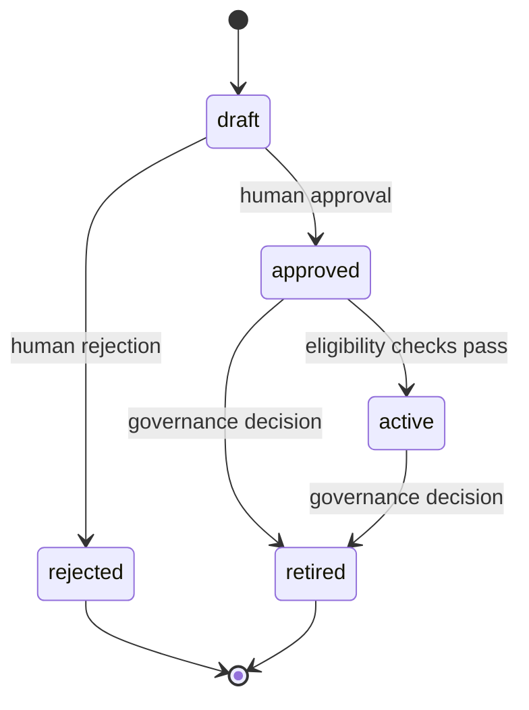
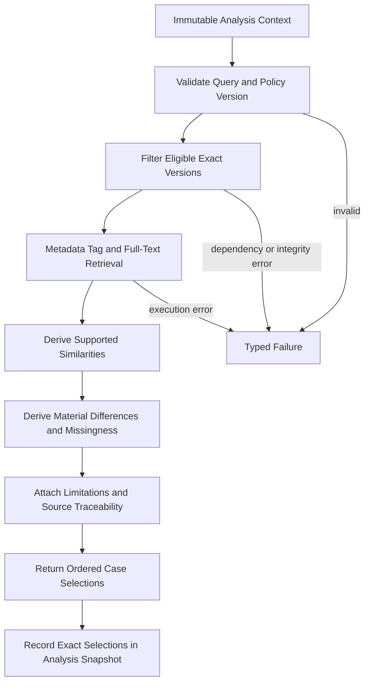

# FAS Case Engine

## 1. Purpose and Authority

The Case Engine governs reviewed historical analogies used in Football Analysis System (FAS). Its purpose is to make prior matches available as bounded, source-traceable comparisons without implying that history repeats or that similarity causes an outcome.

This document is authoritative for Case Engine behavior, eligibility, retrieval semantics, and integration boundaries. The [PROJECT BIBLE](./00_PROJECT_BIBLE.md) governs the mission; [02_DOMAIN_MODEL](./02_DOMAIN_MODEL.md) governs shared domain language and invariants; [04_ARCHITECTURE](./04_ARCHITECTURE.md) governs runtime and dependency direction. Persistence, HTTP, and package layout remain authoritative in [12_DATABASE](./12_DATABASE.md), [13_API](./13_API.md), and [14_MONOREPO](./14_MONOREPO.md), respectively.

V1 uses deterministic PostgreSQL metadata, tag, and full-text retrieval. Semantic/vector retrieval belongs to Phase 2.

## 2. Responsibilities and Boundaries

### 2.1 Responsibilities

The Case Engine:

- owns stable case identities, immutable case versions, and their governed lifecycle;
- verifies that a case is derived from a completed match and completed review;
- preserves links to the exact historical analysis, review, assessment, outcome, and evidence records supporting the case;
- governs approval, activation, retirement, effective scope, limitations, and version immutability;
- determines which exact case versions are eligible for a production pre-match analysis at its cutoff;
- retrieves eligible cases using a versioned, reproducible retrieval policy;
- returns a retrieval reason, explicit similarities, material differences, limitations, and traceability for every selected case;
- supports preview retrieval without making preview results part of a production snapshot;
- publishes exact eligible selections to the Analysis Orchestrator through a package contract;
- accepts review-derived proposals only as inputs to a new draft workflow.

### 2.2 Non-responsibilities

The Case Engine does not:

- predict a result, assign causal force to an analogy, or assert that a historical outcome will recur;
- decide whether an analysis is ready, seal or publish an analysis, compose prompts, or call an AI provider;
- ingest or normalize match evidence, verify outcomes, or conduct post-match reviews;
- evaluate deterministic rule conditions or calculate rule performance;
- aggregate calibration, retrieval-quality, or outcome statistics;
- approve a case merely because AI, a review, or a learning candidate proposed it;
- retrieve arbitrary external material or bypass case governance;
- mutate a case version, historical analysis, review, assessment, or evidence record.

Case retrieval is evidence selection, not causal inference. The Analysis layer and AI may use a selected case only as an explicitly typed `case_analogy`.

## 3. Domain Contract

### 3.1 Case Identity and Version

A **Case** is the stable governed identity of one historical analogy. A **Case Version** is an immutable reviewed account of:

- the originating completed match;
- the exact completed review and, where present, published analysis revision;
- pre-match context that was actually known at the historical cutoff;
- decisive factors identified by review, clearly distinguished from pre-match facts;
- verified result summary and outcome-evidence provenance;
- reusable lessons, scope, controlled tags, and limitations;
- source links with explicit roles;
- content schema version and integrity checksum.

Historical result and review findings may be shown as historical context. They must never be represented as evidence about the current match.

### 3.2 Case Selection

A **Case Selection** is an immutable retrieval result for one analysis context. It identifies the exact case version and retrieval-policy version and includes:

- rank and retrieval reason;
- similarities supported by normalized current and historical attributes;
- material differences, including missing or non-comparable attributes;
- case limitations and source-traceability references;
- retrieval diagnostics sufficient for replay, without exposing persistence internals.

A numeric retrieval score, if used internally, is ranking metadata only. It is not probability, confidence, causal effect, or expected outcome.

## 4. Inputs and Outputs

### 4.1 Governance Inputs

- completed match identity and exact verified result version;
- completed review identity and assessment set;
- optional published analysis revision and its sealed snapshot;
- selected evidence, claims, and review assessments with explicit case-evidence roles;
- authored context, lessons, scope, tags, limitations, and source rationale;
- actor, command reason, idempotency key, expected row version, and correlation ID.

### 4.2 Retrieval Inputs

- immutable analysis context identity and requested cutoff;
- competition, season, participant, and normalized context attributes permitted by the selection contract;
- controlled tags, applicable rule-finding keys, and requested result-pattern filters where product policy permits them;
- result limit and a versioned retrieval-policy identifier;
- correlation ID and mode: `preview` or `production`.

Production retrieval accepts only orchestrator-supplied, cutoff-qualified values. It does not load mutable current-match data independently.

### 4.3 Outputs

- governed case roots and immutable versions;
- lifecycle command results and domain events;
- an eligibility decision with explicit rejection reasons;
- ordered case selections with exact version IDs, retrieval rationale, similarities, material differences, limitations, and traceability;
- typed failures distinguishing invalid requests, ineligible cases, unavailable dependencies, and integrity violations.

An empty successful retrieval is a valid result only when the policy found no eligible analogy. It must be distinguishable from retrieval failure.

## 5. Lifecycle and Governance

Rules:

1. A draft may be created only from a completed match and completed review reference.
2. Approval and activation are distinct decisions, even when performed by the same trusted operator.
3. Approval requires complete traceability, explicit limitations, and a review showing why the case is reusable.
4. Production eligibility requires an approved, active exact version whose scope and effective period include the analysis cutoff.
5. Approved and active versions are immutable. Corrections or revised interpretation create a new draft version.
6. Retirement affects future retrieval only; historical snapshot selections remain valid and inspectable.
7. A learning candidate accepted by governance asks the Case Engine to create a draft. It grants no approval or activation.
8. Rejection and retirement record a rationale and append-only audit event.

## 6. Eligibility Policy

A case version is production-eligible only when all of the following hold:

- its originating match is completed;
- its referenced review is completed and targets a published analysis revision where a revision is referenced;
- the referenced result version is verified and backed by outcome evidence;
- the version is approved and active at the requested cutoff;
- its effective window and competition/context scope apply;
- required title, summary, context, decisive factors, lessons, limitations, and source roles are complete;
- every referenced artifact exists and passes integrity checks;
- no governance hold or unresolved traceability defect applies.

Eligibility is evaluated as of the analysis cutoff. Later approval, activation, correction, or retirement does not change a previously sealed selection. A case whose historical pre-match context cannot be separated from hindsight is ineligible until corrected through a new version.

## 7. Retrieval and Comparison Workflow

### 7.1 Candidate Filtering

Filtering precedes ranking. The engine applies lifecycle, effective-time, scope, competition, controlled-tag, review-completion, and integrity requirements. It excludes the current match and any case that would leak post-cutoff information about the current fixture.

### 7.2 V1 Ranking

V1 ranking uses a versioned deterministic combination of declared filters, controlled-tag overlap, normalized attributes, and PostgreSQL full-text rank. Stable tie-breaking uses immutable identifiers or another policy-declared stable key.

The retrieval policy records:

- policy and query-schema versions;
- normalized query checksum;
- applied filters and candidate count;
- ranking components needed to explain selection;
- exact selected case versions and ordering.

Identical eligible data, query input, and policy version must produce the same ordered result.

### 7.3 Similarity and Material Differences

Similarity is never accepted as a single opaque score. Each selected case must name comparable dimensions and identify the current and historical values supporting the comparison.

Material differences include any difference that could weaken or reverse the analogy, including:

- competition, season, venue, stage, or scheduling context;
- team strength or tactical context when represented by eligible normalized data;
- availability, rest, form, market-state, or evidence-quality differences;
- different rule applicability or decisive-factor context;
- missing, stale, conflicted, or non-comparable attributes;
- limitations recorded on the case version.

If required material differences cannot be derived or reviewed, the candidate is excluded or returned as non-selectable in preview. The engine must not fill gaps with AI-generated facts.

### 7.4 Source Traceability

Every comparison supports traversal:

`selection -> exact case version -> case evidence role -> historical evidence/claim/review assessment -> source record or verified outcome`

Traceability references use stable domain identifiers and checksums. Free-form URLs or prose alone are insufficient. Broken traceability is an integrity failure, not a warning that production retrieval may ignore.

## 8. Ports and Dependencies

The Case Engine declares inward-facing TypeScript ports for:

- case root/version repository and unit of work;
- completed-review and published-analysis reference lookup;
- completed-match/result and evidence-reference lookup;
- deterministic full-text/metadata retrieval;
- clock, ID, checksum, audit-event, and semantic-observability emission.

It may depend on `@fas/domain` primitives and published contracts from Match, Evidence, Analysis, and Review. It must not depend on NestJS, Next.js, Prisma, OpenAI, Redis, pgvector, HTTP DTOs, the Analysis Orchestrator implementation, or another engine's persistence adapter.

Adapters implement these ports in `@fas/database` and composition roots. Cross-context reads use published immutable-reference contracts; cross-context writes use the owning context's command interface.

## 9. Analysis Orchestrator Interaction

The Analysis Orchestrator calls the Case Engine; the Case Engine never calls or controls the orchestrator.

1. The orchestrator supplies immutable, cutoff-qualified analysis context and a pinned retrieval-policy version.
2. The Case Engine validates the request and retrieves only eligible exact case versions.
3. The Case Engine returns bounded selections containing retrieval reason, similarities, material differences, limitations, and traceability.
4. The orchestrator records the exact accepted selections and checksums in the analysis snapshot manifest before prompt composition.
5. The Prompt Engine receives the recorded selections; it does not rerun retrieval.
6. Analysis validation rejects a case analogy that cites an unselected version or omits material differences.

A retrieval timeout, repository failure, policy mismatch, or integrity defect fails the retrieval stage. The orchestrator must not silently continue with an omitted Case Engine input. A genuine zero-result response remains explicit and reproducible.

## 10. Persistence, API, and Package Ownership

This document intentionally does not duplicate physical catalogs:

- [12_DATABASE §10 and §12](./12_DATABASE.md#10-case-library-tables) define authoritative case storage, case evidence, and snapshot selection records.
- [13_API §12](./13_API.md#12-case-library-api) defines authoritative HTTP resources and commands.
- [`@fas/case-engine` in 14_MONOREPO](./14_MONOREPO.md#fas-case-engine) owns domain/application behavior and public contracts.
- `@fas/database` owns Prisma mappings, repositories, migrations, and query adapters.
- `@fas/api-contracts` and `apps/api` own transport schemas, mapping, OpenAPI, idempotency, and HTTP concerns.
- `@fas/analysis` owns snapshot, analysis, validation, and publication behavior.

No consumer may use Case Engine tables or Prisma delegates as an integration API.

## 11. Failure Behavior

| Failure | Required behavior |
|---|---|
| Originating match or review incomplete | Reject draft creation or approval with a non-retryable eligibility error. |
| Result unverified or outcome traceability missing | Reject approval/activation; do not infer the result from prose. |
| Invalid lifecycle transition or stale row version | Return conflict/precondition failure and preserve current state. |
| Unsupported scope, tag, or query schema | Reject the request; do not broaden the query silently. |
| Retrieval dependency unavailable | Return a retryable stage failure; do not return an empty success. |
| Broken evidence, claim, review, or checksum reference | Fail closed with an integrity error and remove the version from production eligibility pending governance. |
| Similarity found but material differences unavailable | Exclude the candidate or mark it non-selectable in preview. |
| Duplicate command | Return the prior idempotent result when request checksum matches; otherwise return conflict. |
| Phase 2 embedding unavailable | Apply only an explicitly configured, evaluated fallback to v1 retrieval; otherwise fail. |

Retries must be bounded and safe. They may repeat retrieval against the same pinned inputs and policy but may not change query scope, cutoff, or selected versions invisibly.

## 12. Observability and Audit

Every command and retrieval carries request/correlation, analysis/snapshot, policy-version, and operation identifiers.

Required signals include:

- governance transition counts and failures;
- eligible and excluded candidate counts by reason;
- retrieval latency, candidate-set size, result count, and zero-result rate;
- selected-rank distribution and retrieval-policy version;
- missing-difference, broken-traceability, and integrity-failure counts;
- later Review Engine case assessments, exposed to Statistics as immutable inputs;
- repository/full-text failures and bounded retry counts.

Logs contain identifiers, versions, checksums, counts, timings, and redacted diagnostics. They do not contain full source payloads or unrestricted case prose by default. Approval, activation, retirement, and integrity-governance actions produce append-only audit events with actor type and rationale.

## 13. Security and Data Handling

- Treat case prose, source excerpts, tags, and imported metadata as untrusted data even after approval.
- Validate schemas, lengths, controlled vocabularies, identifiers, and lifecycle commands at boundaries.
- Delimit selected case content when composed into prompts; embedded instructions have no authority.
- Enforce least-privilege repository access and prevent direct cross-module table access.
- Keep licensed source content and object references out of operational logs and API fields not designed to expose them.
- Never store credentials, provider secrets, or unrestricted source payloads in case records or retrieval manifests.
- Preserve append-only audit and immutable version history.
- V1 remains private and trusted-environment only; public access requires authentication, authorization, actor identity, and abuse controls.

## 14. Tests and Acceptance Criteria

### 14.1 Unit and Property Tests

- lifecycle transitions reject every undefined edge;
- approved/active versions cannot be edited;
- eligibility requires completed review, completed match, verified result, scope/effectivity, and intact traceability;
- retrieval filtering and stable tie-breaking are deterministic;
- every selected case has at least one supported similarity and explicit material differences;
- score/value types cannot be interpreted as probability or confidence;
- post-cutoff changes do not alter a pinned retrieval result;
- accepted learning candidates create only drafts.

### 14.2 Integration and Contract Tests

- repository mappings preserve exact version identities and checksums;
- full-text/tag retrieval obeys policy version, filters, ordering, and pagination/limit;
- snapshot selections persist rank, retrieval reason, similarities, differences, and exact case version;
- broken foreign references or checksums fail closed;
- API examples and stable `CASE_` errors validate against OpenAPI;
- package-boundary tests prevent Prisma, framework, provider, and orchestrator imports;
- duplicate commands are idempotent and optimistic conflicts are visible.

### 14.3 End-to-End Acceptance

V1 Case Engine is accepted when:

1. no production-selected case lacks completed-review and verified-outcome provenance;
2. every selected analogy names an exact immutable version, retrieval reason, supported similarities, material differences, and limitations;
3. the same pinned context, eligible corpus, and retrieval-policy version yields the same ordered selections;
4. selected cases and traceability survive retirement or later version creation;
5. retrieval failure never appears as an empty successful selection;
6. no case output makes a causal claim or represents historical outcome as current-match evidence;
7. an analysis is blocked when a cited case was not selected or material differences are omitted.

## 15. V1 and Phase 2

### 15.1 V1

- governed case roots and immutable versions;
- completed-review and verified-result eligibility;
- deterministic metadata, controlled-tag, and PostgreSQL full-text retrieval;
- explicit similarities, material differences, limitations, and traceability;
- preview and production retrieval modes;
- snapshot integration, audit, diagnostics, and review feedback.

### 15.2 Phase 2

- versioned embeddings and pgvector retrieval behind the existing port;
- hybrid lexical/vector ranking with evaluated, pinned policy versions;
- embedding model, dimensions, chunking version, source checksum, filters, rank, and score recorded for replay;
- retrieval-quality evaluation by relevant population and human judgment;
- optional caching keyed by corpus/query/policy versions.

Phase 2 changes ranking adapters, not case semantics. It may not weaken review eligibility, traceability, explicit differences, human governance, or the prohibition on causal claims.

## 16. Related Documents

- [00_PROJECT_BIBLE](./00_PROJECT_BIBLE.md)
- [01_PRODUCT](./01_PRODUCT.md)
- [02_DOMAIN_MODEL](./02_DOMAIN_MODEL.md)
- [03_AI_PRINCIPLES](./03_AI_PRINCIPLES.md)
- [04_ARCHITECTURE](./04_ARCHITECTURE.md)
- [09_REVIEW_ENGINE](./09_REVIEW_ENGINE.md)
- [12_DATABASE](./12_DATABASE.md)
- [13_API](./13_API.md)
- [14_MONOREPO](./14_MONOREPO.md)
