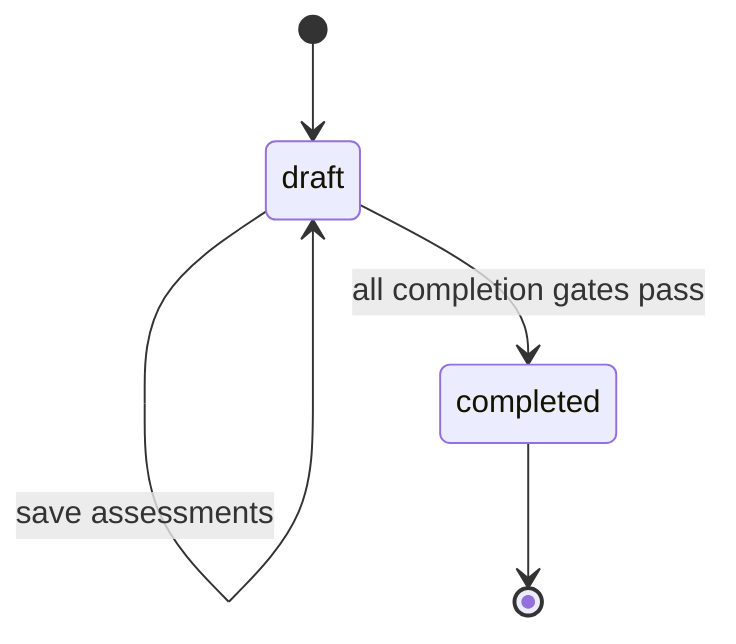
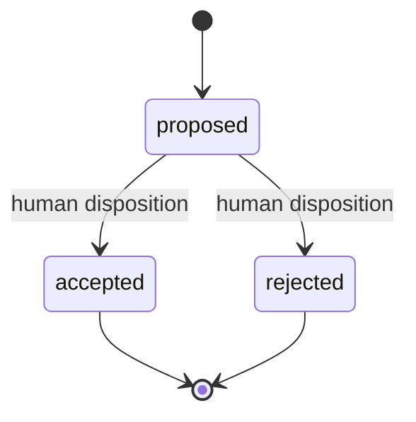
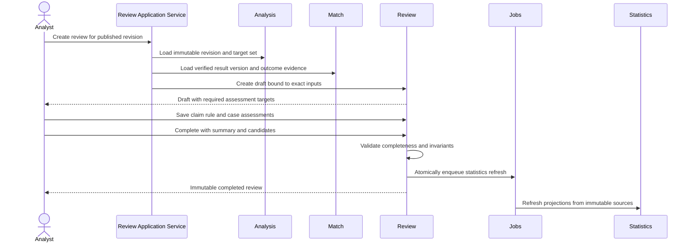

# FAS Review Engine

## 1. Purpose and Authority

The Review Engine performs governed post-match assessment of what FAS published before kickoff. It compares the exact claims, deterministic rule evaluations, and selected historical cases in a published pre-match analysis with an exact verified result version and source-backed outcome evidence.

Its purpose is accountability and disciplined learning, not hindsight editing. A review records what was supported, contradicted, inconclusive, or not assessable; explains rule and case usefulness; and may create learning candidates for later human governance.

This document is authoritative for Review Engine behavior, assessment ownership, completion policy, and learning-candidate boundaries. Shared terminology and invariants are governed by [02_DOMAIN_MODEL](./02_DOMAIN_MODEL.md); runtime and dependency rules by [04_ARCHITECTURE](./04_ARCHITECTURE.md). Persistence, HTTP, and package layout remain authoritative in [12_DATABASE](./12_DATABASE.md), [13_API](./13_API.md), and [14_MONOREPO](./14_MONOREPO.md).

## 2. Responsibilities and Boundaries

### 2.1 Responsibilities

The Review Engine:

- owns review identity, draft/completed lifecycle, and immutable completion;
- binds each review to an exact published analysis revision and exact verified result version/checksum;
- evaluates every governed review target required by the analysis: claims, applied rule evaluations, and selected case versions;
- owns claim, rule, and case assessment records and their rationales;
- requires outcome-evidence traceability for assessments that depend on observed events;
- records evidence gaps, uncertainty quality, inference quality, and the limits of what the outcome can establish;
- validates review completeness and internal consistency before completion;
- owns learning candidates, their disposition, and the handoff that asks a target engine to create a draft;
- emits completed assessments for Statistics Engine consumption;
- provides completed-review provenance required by Case Engine governance.

### 2.2 Non-responsibilities

The Review Engine does not:

- edit, regenerate, reclassify, republish, or supersede the historical analysis;
- change its sealed snapshot, claims, citations, confidence, rule evaluations, or selected cases;
- record or verify match results, normalize outcome evidence, or resolve evidence conflicts;
- rerun deterministic rule conditions;
- define or calculate aggregate performance, calibration, confidence intervals, or population metrics;
- claim that a rule or analogy caused the result;
- approve, activate, suspend, retire, or mutate knowledge, rules, cases, prompts, model configurations, or methodology;
- treat outcome correctness as proof that the original reasoning was sound;
- let AI complete a review, publish an assessment, or approve learning without accountable human action.

## 3. Rule, Review, Evaluation, and Statistics Are Distinct

| Concern | Owning engine | Question answered | Output |
|---|---|---|---|
| Deterministic rule application | Rule Engine | Did this exact rule version apply to this exact sealed snapshot, and why? | Immutable applicability, condition explanation, and rule finding |
| Post-match Review | Review Engine | How did a published claim, rule finding, or case analogy stand against this exact verified outcome and its evidence? | Immutable assessments and governed learning proposals |
| Quality Evaluation | Evaluation Engine | Under an exact assessment definition, does an immutable subject or corpus satisfy the declared quality policy and gate? | Immutable criterion results, gate decision, and report |
| Statistical Aggregation | Statistics Engine | Across a defined immutable population, what performance or calibration is observed with what sample and uncertainty? | Rebuildable, versioned metric projections |

The Review Engine assesses a stored rule evaluation; it never recomputes or changes it. It may record that a correctly evaluated rule was unhelpful, immaterial, misleading in context, or impossible to judge from the outcome. That is a review judgment, not a new deterministic evaluation.

The Statistics Engine consumes completed reviews and immutable evaluations. It owns population definitions, formulas, qualification thresholds, samples, intervals, and source watermarks. A single review cannot establish statistical reliability or causality, and a metric projection cannot rewrite a review.

## 4. Domain Contract

### 4.1 Review

A **Review** is a post-match aggregate bound to:

- one exact published analysis revision;
- that revision's sealed snapshot and immutable target set;
- one exact verified result version/checksum;
- the outcome evidence supporting that result;
- a schema/rubric version;
- review-level summary, overall assessment, and completion metadata.

The review target set is fixed when the draft is created. It contains stable references to all claims and the selected rule evaluations and case versions that completion policy requires. New source data or corrected results do not silently replace this set.

### 4.2 Claim Assessment

Every assessed claim uses exactly one governed category:

- `supported`: the available verified outcome evidence supports the assessable proposition;
- `contradicted`: the available verified outcome evidence contradicts the assessable proposition;
- `inconclusive`: relevant evidence exists but does not resolve the proposition;
- `not_assessable`: the claim is not testable from the verified outcome, falls outside the observation scope, or lacks sufficient eligible outcome evidence.

These categories assess the claim as originally written. They do not change its epistemic type or imply that a supporting citation was valid at publication. Review rationale must distinguish outcome agreement from reasoning quality.

Facts and pre-match market-state descriptions are not marked contradicted merely because the match ended differently than an inference expected. Uncertainty claims are assessed on whether they accurately represented unknowns and plausible alternatives, not on whether the least likely scenario occurred.

### 4.3 Rule Assessment

A rule assessment references the exact immutable rule evaluation and records:

- whether the stored finding was reported faithfully in the analysis;
- usefulness and outcome relevance under the review rubric;
- correctness category appropriate to the declared rule outcome;
- whether stated limitations were material;
- rationale and outcome-evidence references where applicable.

It does not alter the evaluation, rule version, sample metadata, confidence, or lifecycle. Aggregate rule usefulness is a Statistics Engine concern.

### 4.4 Case Assessment

A case assessment references the exact selected case version and records:

- relevance of the stated similarities;
- completeness and materiality of the recorded differences;
- whether the analogy was useful, neutral, or misleading under the rubric;
- whether hindsight or historical outcome was over-weighted;
- rationale and outcome-evidence references where applicable.

It does not change the case version or prove that similarity caused an outcome.

### 4.5 Learning Candidate

A **Learning Candidate** is a schema-versioned review-derived proposal for `knowledge`, `rule`, `case`, or `methodology` change. It contains evidence summary, proposal, source review, lifecycle status, and resolution rationale.

Acceptance means only that the proposal is suitable to hand to the owning context as a request to create a new draft root/version. Acceptance never approves or activates that draft and never edits an existing approved artifact.

## 5. Inputs and Outputs

### 5.1 Required Inputs

- exact published analysis revision, content checksum, and publication metadata;
- sealed snapshot manifest and its cutoff;
- immutable analysis claims and typed citations;
- exact rule evaluations referenced or selected by the analysis;
- exact case versions/selections, including recorded similarities and material differences;
- exact verified match-result version/checksum;
- valid outcome evidence and provenance;
- review rubric/schema version;
- actor, rationale, idempotency key, expected row version, and correlation ID for commands.

AI-generated review suggestions, if introduced, are untrusted optional draft assistance. They are never required evidence and cannot satisfy human completion authority.

### 5.2 Outputs

- review draft with a fixed assessment target set;
- claim, rule, and case assessments with rationale and typed outcome-evidence references;
- review-level summary, overall assessment, and immutable completion record;
- proposed, accepted, or rejected learning candidates;
- domain events for completion and candidate disposition;
- typed validation and failure results;
- immutable assessment references for Statistics and completed-review provenance for Case governance.

## 6. Lifecycle and Governance

### 6.1 Review Lifecycle

Rules:

1. A draft may be created only for a published analysis revision with a verified result backed by outcome evidence.
2. At most one completed review is authoritative for the same published revision and result version.
3. Draft updates require optimistic concurrency and preserve material audit history.
4. Completion is an explicit human command and makes the review and assessments immutable.
5. A corrected result creates a new result version and a superseding review lineage. It never mutates the completed review.
6. A later rubric change does not reinterpret a completed review in place; re-assessment creates a separately identified review lineage.

### 6.2 Learning Candidate Lifecycle

Acceptance and target-engine draft creation are separate commands. The handoff must be idempotent and record the created draft identity when successful. A handoff failure leaves the accepted candidate visible and retryable; it must not be reported as an approved artifact.

## 7. Review Workflow

### 7.1 Create Draft

The application service verifies publication, result, and outcome provenance; captures exact references and checksums; selects the active review rubric version; derives the required target set; and creates the draft idempotently.

Creation does not copy or rewrite claim text for correction. Display snapshots may be retained for integrity or usability, but the analysis revision remains authoritative.

### 7.2 Assess Targets

The reviewer:

1. reads the original claim in its pre-match context;
2. identifies what part, if any, is assessable after the match;
3. cites eligible outcome evidence rather than relying on the score alone when the rationale concerns events or performance;
4. selects the governed assessment category or rubric value;
5. explains outcome agreement separately from evidence, reasoning, uncertainty, and usefulness;
6. records data gaps, conflicts, or later corrections explicitly.

Draft saves may be partial. They cannot alter the fixed target identity or source artifacts.

### 7.3 Complete

Completion requires:

- unchanged and valid published revision/result references;
- all required claim, rule, and case targets assessed;
- valid category/rubric values and non-empty rationale where required;
- outcome-evidence references for evidence-dependent judgments;
- no citation to evidence unrelated to the reviewed result or assessment;
- overall assessment and summary;
- internally consistent learning proposals with schema version and evidence summary;
- actor rationale, expected row version, and no unresolved blocking validation.

Completion and creation of the statistics-refresh job occur in one database transaction. External calls and target-engine learning handoffs do not occur in that transaction.

### 7.4 Corrected Outcomes

When Match publishes a corrected result version:

- the existing completed review remains bound to the prior version;
- consumers can see that its result reference is superseded;
- a new review lineage targets the corrected result;
- assessments may be copied only as editable draft convenience with provenance, never as pre-completed truth;
- Statistics uses the governing projection policy and source watermark to avoid mixing superseded and current result lineages.

## 8. Assessment Invariants

1. A review assesses only a published revision; drafts and merely validated revisions are ineligible.
2. The verified result and outcome evidence belong to the same match as the analysis.
3. Every assessment references an item in the review's fixed target set.
4. A claim has at most one current assessment within a review.
5. Assessment category is explicit and never inferred from rationale prose.
6. `supported` means support from outcome evidence for the assessable proposition, not proof of causation or validation of all reasoning.
7. `contradicted` cannot be assigned solely because a forecasted score or scenario did not occur when the claim was conditional or non-exclusive.
8. `not_assessable` is valid and preferable to forced hindsight; it requires a reason.
9. Rule assessments reference stored evaluations and never rerun conditions.
10. Case assessments preserve exact case version and original differences.
11. Completion is immutable and cannot be reopened.
12. Learning candidates cannot change any governed artifact directly.
13. AI assistance never supplies command authority or evidence provenance.

## 9. Ports and Dependencies

The Review Engine declares inward-facing TypeScript ports for:

- review, assessment, and learning-candidate repositories;
- published analysis revision/snapshot lookup;
- immutable rule-evaluation and case-selection lookup;
- verified result-version and outcome-evidence lookup;
- target-context draft-creation commands for accepted candidates;
- transaction runner and durable statistics-job enqueue;
- clock, ID, checksum, audit-event, and semantic-observability emission.

It may depend on `@fas/domain` and published immutable-reference contracts from Analysis, Match, Evidence, Evaluation/Rule, and Case. It must not depend on NestJS, Next.js, Prisma, OpenAI, telemetry SDKs, HTTP DTOs, another engine's repository implementation, or Statistics implementation details.

Target engines do not import Review internals. Candidate acceptance invokes their public command contracts. Statistics reads completed assessments through a published query/event contract.

## 10. Orchestration Interaction

The Review workflow is coordinated by Review Engine application services exposed through API composition. It is downstream of publication and verified outcomes; it is not a stage that may alter pre-match analysis.

- `AnalysisPublished` makes a revision eligible for future review but does not create one before a verified outcome exists.
- `MatchResultVerified` permits idempotent draft creation for eligible published revisions.
- `MatchResultCorrected` marks prior review result references as superseded and permits a new review lineage.
- `ReviewCompleted` is emitted only after immutable assessments commit.
- Completion atomically enqueues statistics refresh; Statistics does not participate in the completion transaction.
- Candidate acceptance calls the target owner to create a draft and records the returned identity.
- Case Engine may use a completed review as provenance for a separately governed case draft/version.

Event consumers are idempotent and do not assume cross-aggregate delivery order. Missing prerequisites cause deferred/retryable handling, not creation of incomplete truth.

## 11. Persistence, API, and Package Ownership

This document intentionally does not duplicate physical catalogs:

- [12_DATABASE §13](./12_DATABASE.md#13-review-and-learning-tables) defines authoritative review, assessment, and learning-candidate persistence.
- [13_API §15–16](./13_API.md#15-review-api) defines authoritative HTTP commands and representations.
- [`@fas/review-engine` in 14_MONOREPO](./14_MONOREPO.md#4-package-responsibilities) owns review domain/application behavior and public contracts.
- `@fas/database` owns Prisma mappings, migrations, repositories, transaction adapters, and constraints.
- `@fas/api-contracts` and `apps/api` own runtime transport schemas, DTO mapping, OpenAPI, ETags, and idempotency handling.
- `@fas/statistics-engine` owns metric definitions and projections; `@fas/jobs` owns durable refresh dispatch.

The Review Engine does not read Analysis, Rule, Case, Evidence, or Match tables directly as an integration shortcut. Adapters satisfy the published ports and map persistence records to domain contracts.

## 12. Failure Behavior

| Failure | Required behavior |
|---|---|
| Analysis revision absent, unpublished, or checksum mismatch | Reject review creation; never review a mutable draft. |
| Result absent, provisional, unrelated, or lacking outcome evidence | Reject creation/completion with a non-retryable prerequisite error until corrected. |
| Required target missing or reference integrity broken | Block completion and report the exact target/reference. |
| Invalid assessment category or missing rationale/evidence | Reject the draft command with field-level validation; preserve prior draft. |
| Stale `If-Match` or concurrent completion | Return precondition/conflict; never merge completed assessments silently. |
| Duplicate command | Return the prior idempotent result when request checksum matches; otherwise conflict. |
| Completion transaction fails | Commit neither completed state nor statistics job; retry safely. |
| Statistics refresh fails later | Keep the review completed; retry/rebuild the projection independently. |
| Corrected result arrives | Preserve completed review and create/offer a superseding lineage. |
| Candidate target handoff fails | Preserve accepted candidate with retryable handoff status/diagnostic; do not imply target approval. |
| AI draft assistance fails or is invalid | Continue manual review; never substitute unsupported generated assessments. |

Unexpected failures produce stable `REVIEW_` errors with retryability and redacted diagnostics. No failure path may modify the published analysis or silently drop required assessment targets.

## 13. Observability and Audit

Every review operation carries request/correlation, match, analysis revision, result version, rubric version, and review identifiers.

Required signals include:

- eligible published analyses awaiting review and review-completion latency;
- draft age, completion rate, and completion-validation failures;
- assessment counts by target type and governed category;
- `not_assessable` and missing-outcome-evidence rates;
- rule/case usefulness rubric distributions as source observations, not aggregate conclusions;
- learning-candidate proposal, disposition, handoff success, and handoff latency;
- corrected-result and superseding-review counts;
- statistics-job enqueue and downstream refresh status;
- optimistic-concurrency, idempotency, and integrity failures.

Statistics Engine owns qualified aggregate metrics. Review telemetry is operational and must not be presented as statistically reliable analysis unless computed through a governed metric definition.

Logs contain identifiers, versions, categories, counts, timings, and redacted diagnostics. Review rationale, full analysis content, and outcome payloads are not logged by default. Creation, completion, candidate disposition, target handoff, and supersession produce append-only audit events with actor and rationale.

## 14. Security and Data Handling

- Treat imported outcome text, analysis prose, case content, candidate proposals, and AI suggestions as untrusted data.
- Validate closed schemas, identifiers, lengths, controlled values, evidence ownership, and cross-match consistency.
- Do not allow content-embedded instructions to invoke commands, alter rubrics, or bypass completion gates.
- Enforce least-privilege access to review, evidence, and artifact stores; runtime roles cannot modify append-only audit records.
- Never log credentials, full source/provider payloads, unrestricted analysis content, or licensed excerpts by default.
- Candidate proposals contain references and bounded summaries, not secrets or arbitrary executable content.
- Target-engine handoff accepts a typed command, never raw SQL, provider tool calls, or dynamic code.
- V1 is restricted to a trusted private environment. Public exposure requires identity, authorization by action/resource, actor-bound audit, abuse protection, and review of previously trusted endpoints.

## 15. Tests and Acceptance Criteria

### 15.1 Unit and Property Tests

- only published revisions and verified result versions can create reviews;
- result, outcome evidence, and analysis must refer to the same match;
- the target set is complete, stable, and duplicate-free;
- assessment categories are exhaustive and cannot be inferred from prose;
- conditional claims, uncertainty, facts, market signals, rule findings, and case analogies apply the correct rubric;
- undefined review and candidate transitions are rejected;
- completion is immutable;
- corrected results produce a new lineage;
- candidate acceptance cannot approve or activate a target artifact.

### 15.2 Integration and Contract Tests

- repositories preserve exact revision, result, target, rubric, and checksum references;
- completion and statistics-job enqueue are atomic;
- optimistic concurrency and idempotency behave as documented;
- every evidence-dependent assessment validates outcome-evidence provenance;
- completed review events are idempotent for Statistics consumers;
- candidate handoff creates at most one target draft under retries;
- API examples and stable `REVIEW_` errors validate against OpenAPI;
- package-boundary tests reject Prisma, framework, provider, Statistics-internal, and cross-repository imports.

### 15.3 End-to-End Acceptance

V1 Review Engine is accepted when:

1. at least 95% of completed matches with published analyses can receive a completed review within the operational review window;
2. every completed review binds to an exact immutable published revision and verified result version with outcome provenance;
3. all required claim, rule, and case targets have explicit, rationalized assessments;
4. completion cannot change the analysis, snapshot, evaluation, case selection, or result version;
5. corrected results preserve prior reviews and produce auditable superseding lineages;
6. completion atomically enqueues Statistics refresh without coupling review correctness to projection availability;
7. accepted learning candidates create only governed drafts and never auto-approve or activate learning;
8. Evaluation, Review, and Statistics outputs remain distinct in contracts, persistence mappings, and UI presentation.

## 16. V1 and Phase 2

### 16.1 V1

- manually initiated or prerequisite-triggered review drafts;
- claim-level assessments using the four governed categories;
- rule and case assessments under versioned rubrics;
- immutable completion against exact published revision and verified result;
- learning candidate proposal, human disposition, and idempotent draft handoff;
- atomic Statistics refresh enqueue;
- corrected-result review lineage, audit, diagnostics, and trusted-environment controls.

V1 does not require an AI reviewer. If AI assistance is enabled, it is advisory draft text behind the same validation, traceability, security, and human-completion gates.

### 16.2 Phase 2

- authenticated roles, reviewer assignment, independent second review, and disagreement/adjudication workflows;
- richer review rubrics and versioned inter-reviewer reliability;
- prioritized review queues based on transparent operational policy;
- retrieval/model/prompt regression slices generated by Statistics;
- bounded AI-assisted assessment suggestions evaluated on frozen review corpora;
- distributed job dispatch where measured load requires it.

Phase 2 may improve workflow and measurement but cannot rewrite history, collapse Review into Evaluation or Statistics, infer causality from outcome agreement, or auto-approve learning.

## 17. Related Documents

- [00_PROJECT_BIBLE](./00_PROJECT_BIBLE.md)
- [01_PRODUCT](./01_PRODUCT.md)
- [02_DOMAIN_MODEL](./02_DOMAIN_MODEL.md)
- [03_AI_PRINCIPLES](./03_AI_PRINCIPLES.md)
- [04_ARCHITECTURE](./04_ARCHITECTURE.md)
- [08_CASE_ENGINE](./08_CASE_ENGINE.md)
- [12_DATABASE](./12_DATABASE.md)
- [13_API](./13_API.md)
- [14_MONOREPO](./14_MONOREPO.md)
