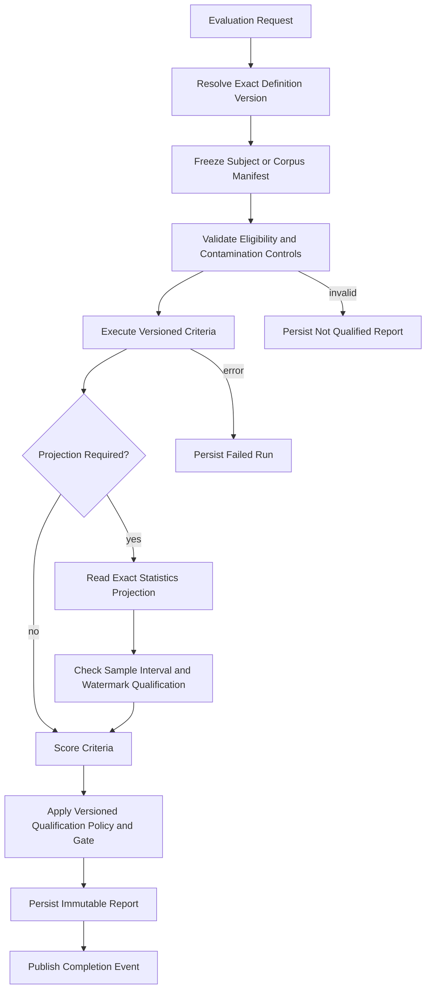

# FAS Evaluation Engine

## 1. Purpose

The Evaluation Engine is the governed quality-assessment boundary for FAS. It defines how immutable analyses, completed reviews, rule versions and evaluations, case versions, and knowledge versions are assessed; applies versioned rubrics and gates; and produces reproducible evaluation reports used for release and methodology decisions.

It answers:

> Under this exact assessment definition and qualification policy, how well did this immutable subject or corpus satisfy the declared quality criteria, and did it pass the applicable gate?

It does not answer how a population's metric is computed—that belongs to the [Statistics Engine](./11_STATISTICS_ENGINE.md)—and it does not perform the analyst's per-match post-match review—that belongs to the Review Engine.

This document refines [02_DOMAIN_MODEL](./02_DOMAIN_MODEL.md), [03_AI_PRINCIPLES](./03_AI_PRINCIPLES.md), and [04_ARCHITECTURE](./04_ARCHITECTURE.md). Persistence and transport remain authoritative in [12_DATABASE](./12_DATABASE.md) and [13_API](./13_API.md).

## 2. Boundary With Statistics and Review

| Concern | Evaluation Engine | Statistics Engine | Review Engine |
|---|---|---|---|
| Versioned rubric, criterion, scoring scale, severity, threshold, and gate | Owns | Consumes as an immutable reference when a formula requires it | May supply human assessments under a declared rubric |
| Per-match human review against a verified result | Does not perform | Consumes completed review records | Owns |
| Deterministic rule application to a sealed snapshot | Consumes immutable Rule Engine results when required by an assessment | Aggregates completed results | Assesses usefulness after the match |
| Metric formula, population selection, aggregation, interval, watermark, and rebuild | Does not compute | Owns | Does not compute |
| Calibration methodology and acceptance policy | Owns the definition, bins/rubric, thresholds, slices, and qualification policy | Computes the calibration projection and interval | Supplies immutable claim assessments |
| Quality or release decision | Applies a versioned gate and records the decision/report | Supplies qualified projections, never the policy decision | Supplies review evidence, never the release decision |
| Causal interpretation | Prohibited | Prohibited | May record bounded human rationale, not statistical proof |

The Evaluation Engine may consume a qualified Statistics Engine projection. It must not recompute the projection, change its population, or treat an unqualified value as qualified. The Statistics Engine may consume completed evaluation facts, but it must not decide whether a quality gate passes.

## 3. Responsibilities

The Evaluation Engine owns:

- stable assessment-definition identities and immutable versions;
- assessment subjects and supported subject-type contracts;
- criteria, rubrics, scoring scales, weights, severities, and required evidence;
- calibration methodology as policy: confidence bands or bins, expected comparisons, accepted error measures, qualification requirements, and thresholds;
- corpus definitions and contamination-control requirements for offline evaluation;
- qualification policy for whether an assessment or report is decision-eligible;
- deterministic quality gates and release-gate composition;
- execution of machine-checkable criteria over immutable source references;
- ingestion of explicitly identified human assessment results produced under a versioned rubric;
- immutable evaluation runs, criterion results, gate decisions, and reports;
- comparison to an exact baseline report or governed release bundle;
- explanations of failed, waived, skipped, and unassessable criteria;
- evaluator and report schema versioning;
- audit events for definition activation and report completion.

### 3.1 Non-responsibilities

The Evaluation Engine does not:

- create, edit, publish, supersede, approve, activate, suspend, or retire an analysis, review, rule, case, or knowledge source record;
- conduct the per-match human Review Engine workflow or create learning candidates;
- retrieve mutable “latest” subjects after a run begins;
- compute authoritative aggregates, confidence intervals, sample counts, source watermarks, or projections;
- define a metric formula or silently substitute one metric version for another;
- perform AI generation, prompt composition, case retrieval, or knowledge retrieval;
- infer causal relationships from evaluation scores or correlations;
- reinterpret a deterministic rule condition or alter a recorded rule evaluation;
- promote a candidate model, prompt, rule, case, or knowledge version automatically;
- use match outcomes that were unavailable at the declared pre-match cutoff as model input;
- turn a quality score into a football-outcome prediction.

## 4. Core Contracts

### 4.1 Assessment Definition

An `AssessmentDefinitionVersion` is immutable and includes:

- stable definition ID, positive version, purpose, owner, status, effective period, and content checksum;
- supported subject types: analysis revision, analysis run, completed review, rule version/evaluation, case version, knowledge version, governed AI release bundle, or frozen corpus;
- criterion definitions with stable keys, evaluator kind and version, severity, score scale, required inputs, and evidence requirements;
- scoring and weighting methodology, including missing/unassessable handling;
- calibration policy where applicable, referencing exact Statistics Engine metric definitions;
- qualification policy: minimum sample, required slices, interval constraints, contamination checks, and required human coverage;
- gate expression and threshold values;
- report schema version and comparison policy;
- limitations and prohibited interpretations.

Production or release decisions use only approved, active, effective definition versions. Editing an approved definition creates a new version.

### 4.2 Evaluation Run

An `EvaluationRun` binds:

- one exact assessment-definition version;
- an immutable subject manifest or frozen corpus manifest;
- exact evaluator versions;
- exact Statistics Engine projection identities and watermarks, if used;
- baseline report identity, if compared;
- execution time, correlation ID, attempts, and computation/checksum metadata.

A retry creates another attempt or run under the same frozen manifest. It never refreshes inputs implicitly.

### 4.3 Criterion Result and Gate Decision

Each criterion result records `pass`, `fail`, `warning`, `unassessable`, or `error`, plus score where defined, severity, evidence references, evaluator version, and explanation. `unassessable` is not success.

A gate decision is a deterministic application of the definition version to criterion results and referenced qualified projections. It records `passed`, `failed`, or `not_qualified`. Waivers are explicit, reasoned, bounded, and auditable; they do not rewrite the underlying result.

### 4.4 Evaluation Report

An evaluation report is immutable and contains:

- definition, subject/corpus, bundle, baseline, and evaluator identities;
- qualification status and reasons;
- criterion-level results and evidence;
- qualified Statistics Engine projections with metric version, population, sample, interval, and watermark;
- gate decision, failures, regressions, waivers, and limitations;
- slice results where required;
- report schema/computation version, checksum, and completion time.

Reports state quality under a declared methodology. They do not claim causality or guarantee future football outcomes.

## 5. Inputs and Outputs

### Inputs

- sealed analysis snapshots, immutable runs/revisions/claims/citations, and validations;
- completed reviews and immutable claim/rule/case assessments;
- immutable rule versions, rule evaluations, and deterministic findings;
- immutable approved case and knowledge versions with provenance;
- exact prompt, model-configuration, provider-attempt, and release-bundle manifests;
- frozen evaluation corpus manifests and human rubric results;
- qualified or explicitly unqualified metric projections from the Statistics Engine;
- exact baseline evaluation reports;
- versioned assessment definitions and evaluator implementations.

All inputs are references plus integrity metadata. The engine reads source records through published ports and never through another module's persistence representation.

### Outputs

- immutable evaluation runs and criterion results;
- gate and release-eligibility decisions;
- immutable evaluation reports and baseline comparisons;
- redacted diagnostics and operational status;
- `EvaluationRunCompleted`, `EvaluationRunFailed`, and `EvaluationReportCompleted` events;
- evidence-backed recommendations for human governance, never automatic mutations.

## 6. Workflow

1. Resolve the requested approved assessment-definition version; never defer “latest” resolution.
2. Build and checksum an immutable subject/corpus manifest.
3. verify subject eligibility, cutoff discipline, required review state, corpus provenance, contamination controls, and evaluator compatibility.
4. Execute deterministic validators and bind any human assessment inputs to their exact rubric version.
5. Request or read exact Statistics Engine projections when criteria require population metrics.
6. Preserve unqualified projections as evidence but do not allow them to satisfy a qualified gate.
7. Score criteria and apply the versioned qualification and gate policy.
8. Persist the report and event atomically; recommendations remain advisory.

## 7. Invariants

1. Every result names an exact assessment-definition version, subject manifest checksum, evaluator version, and report schema version.
2. Source analyses, reviews, rules, rule evaluations, cases, knowledge, and metric projections are read-only inputs.
3. No run reads post-freeze “latest” records.
4. A report cannot be `passed` when a blocking criterion failed, errored, or is unassessable unless the definition declares and records an explicit waiver path.
5. A Statistics Engine value cannot satisfy a gate unless its exact projection is qualified under its metric definition.
6. Qualification policy and measured sample qualification remain distinct: Evaluation owns the policy decision; Statistics owns the measured projection and qualification facts.
7. Calibration methodology is versioned. Calibration values and intervals are computed only by Statistics.
8. Human rubric results identify evaluator procedure, rubric version, subject, and assessment time; anonymous free-form opinions are not criterion results.
9. Baseline comparison uses exact immutable report identities and comparable definition semantics.
10. Hindsight data never enters a pre-match model-input corpus; post-match records may be evaluation labels only when explicitly declared.
11. Failed or partial runs never replace a completed report.
12. Evaluation output may recommend governance action but cannot perform it.

## 8. Ports and Dependencies

### Inbound ports

- `RunEvaluation`
- `GetEvaluationRun`
- `GetEvaluationReport`
- `CompareEvaluationReports`
- `CreateAssessmentDefinitionDraft`
- `ApproveAssessmentDefinitionVersion`
- `ActivateAssessmentDefinitionVersion`

### Outbound ports

- `AnalysisEvaluationSource`
- `ReviewEvaluationSource`
- `RuleEvaluationSource`
- `CaseEvaluationSource`
- `KnowledgeEvaluationSource`
- `PromptAndModelManifestSource`
- `StatisticsProjectionReader`
- `EvaluationRepository`
- `JobDispatcher`
- `AuditEventPublisher`
- `Clock`, `IdGenerator`, and observability ports

Dependencies point inward. The engine may depend on `@fas/domain` and published contracts, never Prisma models, NestJS, OpenAI, another engine's repository, or HTTP DTOs. The Statistics Engine is reached only through `StatisticsProjectionReader`; neither engine imports the other's infrastructure adapter.

## 9. Persistence, API, and Package Mapping

### Persistence

- Existing immutable inputs map to [rule evaluations](./12_DATABASE.md#9-rule-tables), [analysis records](./12_DATABASE.md#12-analysis-tables), [reviews](./12_DATABASE.md#13-review-and-learning-tables), and [statistics projections](./12_DATABASE.md#15-statistics-tables).
- Evaluation-owned assessment definitions, frozen runs, criterion results, gate decisions, and reports map to [Evaluation Tables](./12_DATABASE.md#14-evaluation-tables).
- Durable execution maps to [jobs and audit events](./12_DATABASE.md#16-operational-tables).

### API

- Existing source-resource reads map to [Analysis API](./13_API.md#13-analysis-api), [Review API](./13_API.md#15-review-api), and [Statistics API](./13_API.md#18-statistics-api).
- Long-running execution follows [Job API](./13_API.md#14-job-api).
- Authoritative resources are `/evaluation-definitions`, `/evaluations`, and `/evaluation-reports` in [Evaluation API](./13_API.md#17-evaluation-api), with asynchronous runs returning `202 Accepted`.

### Package

The package is [`@fas/evaluation-engine`](./14_MONOREPO.md#fas-evaluation-engine), with pure domain/application contracts and no framework imports. `apps/api` invokes definition/report commands and queries; `apps/worker` executes evaluation jobs. Repository adapters remain in `@fas/database`; job and telemetry adapters remain in `@fas/jobs` and `@fas/observability`. `@fas/rule-engine` retains deterministic per-snapshot rule application; Evaluation consumes those immutable results when its assessment policy requires them.

## 10. Failure and Observability

| Failure | Required behavior |
|---|---|
| Definition missing, inactive, or incompatible | Reject before execution with stable definition/version diagnostics |
| Subject changed or checksum mismatch | Fail closed; do not refresh the manifest |
| Required review or label absent | Produce `not_qualified` or fail according to the definition |
| Corpus contamination or cutoff violation | Blocking failure with affected subject references |
| Criterion evaluator error | Record criterion error; gate cannot silently pass |
| Statistics projection missing/stale/unqualified | Preserve status and produce `not_qualified`; never locally recompute |
| Baseline not comparable | Omit comparison with explicit reason; do not normalize silently |
| Worker crash | Retry from durable checkpoint against the same manifest |
| Duplicate request | Return the prior idempotent result |
| Report persistence conflict | Reject or retry transaction; never publish two authoritative reports for one declared identity |

Required signals include run and queue latency, criterion duration/error rate, gate outcomes by definition version, qualification failures by reason, contamination/cutoff violations, human-assessment coverage, baseline regressions, projection age/watermark, retries, and report checksum failures. Logs carry correlation IDs and immutable identities, not full prompts, provider payloads, or licensed source content.

## 11. Test Strategy

- **Unit:** rubric scoring, weights, threshold boundaries, missing/unassessable behavior, qualification rules, waiver rules, and gate truth tables.
- **Property-based:** criterion ordering independence where declared, score bounds, deterministic repeatability, and no pass with an unresolved blocker.
- **Contract:** every source port returns immutable versioned references; Statistics projections preserve population/sample/interval/watermark semantics.
- **Golden corpus:** schema, citation, epistemic separation, faithfulness, rule fidelity, case quality, uncertainty, calibration-policy, safety, and semantic-equivalence cases from [03_AI_PRINCIPLES](./03_AI_PRINCIPLES.md#15-evaluation-framework).
- **Contamination/temporal:** no post-cutoff model input, explicit label separation, late-arrival isolation, and frozen-manifest replay.
- **Integration:** database constraints, idempotent jobs, crash recovery, exact report replay, and completion-event publication.
- **Architecture:** no Prisma/NestJS/OpenAI imports in engine domain code; no direct Statistics or source-module table access.
- **End-to-end:** candidate release bundle versus baseline, qualified projection consumption, failed gate, explicit waiver, and immutable report retrieval.

## 12. V1 and Phase 2

### V1

- Versioned assessment definitions for AI release bundles and governed artifacts.
- Frozen manually curated and reviewed corpora.
- Deterministic structural, citation, epistemic, safety, rule-fidelity, and reproducibility criteria.
- Versioned human rubrics and imported human results; no evaluator-account system.
- Qualified Statistics Engine projections for calibration and aggregate quality gates.
- Baseline comparison, immutable reports, explicit human release decision, and PostgreSQL durable jobs.
- No automatic promotion, online experimentation, live-match evaluation, or public multi-user workflow.

### Phase 2

- Larger stratified corpora and stronger contamination lineage.
- Inter-rater agreement and adjudication workflows after identity/authorization exists.
- Shadow/canary evaluation and drift detection using exact release bundles.
- Scheduled regression suites and richer slice discovery, with multiplicity controls.
- Distributed dispatch through BullMQ when measured load requires it.
- Semantic retrieval evaluation for versioned pgvector/embedding configurations.
- External benchmark import and artifact storage with licensing, provenance, and retention controls.

Phase 2 adds execution scale and evaluation breadth; it does not weaken immutability, qualification, engine separation, or human governance.

## 13. Related Documents

- [PROJECT BIBLE](./00_PROJECT_BIBLE.md)
- [FAS Product Definition](./01_PRODUCT.md)
- [FAS Domain Model](./02_DOMAIN_MODEL.md)
- [FAS AI Principles](./03_AI_PRINCIPLES.md)
- [FAS System Architecture](./04_ARCHITECTURE.md)
- [FAS Statistics Engine](./11_STATISTICS_ENGINE.md)
- [FAS Database Design](./12_DATABASE.md)
- [FAS REST API Design](./13_API.md)
- [FAS Monorepo Design](./14_MONOREPO.md)
