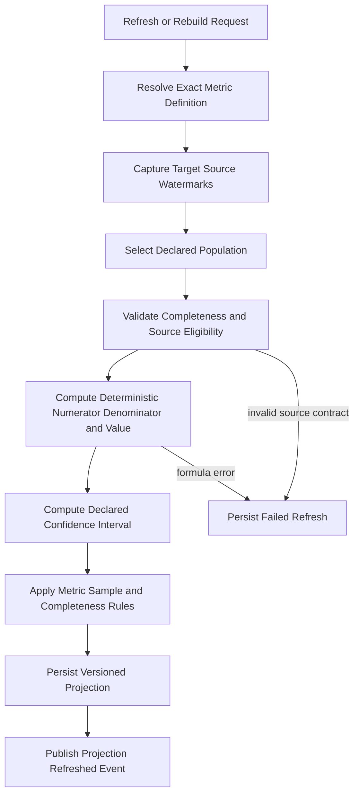

# FAS Statistics Engine

## 1. Purpose

The Statistics Engine is the deterministic projection boundary for FAS. It computes reproducible metrics over declared populations of immutable source records, quantifies uncertainty, records source watermarks, and rebuilds projections without changing business truth.

It answers:

> Under this exact metric definition, population, dimensions, computation version, and source watermark, what value and uncertainty are deterministically obtained, and is the sample statistically qualified for reporting?

It does not decide whether the result is good enough, whether a release passes, or why an observed relationship exists. Quality policy and gates belong to the [Evaluation Engine](./10_EVALUATION_ENGINE.md); per-match human assessment belongs to the Review Engine.

This document refines [02_DOMAIN_MODEL](./02_DOMAIN_MODEL.md), [04_ARCHITECTURE](./04_ARCHITECTURE.md), and the statistics contracts in [12_DATABASE](./12_DATABASE.md) and [13_API](./13_API.md).

## 2. Boundary With Evaluation and Review

| Concern | Statistics Engine | Evaluation Engine | Review Engine |
|---|---|---|---|
| Metric formula and computation version | Owns | References exact versions | Does not own |
| Population, filters, dimensions, exclusions, and denominator | Owns | Declares which projection a gate requires | Supplies immutable review records |
| Aggregation and projection | Owns | Does not recompute | Does not compute |
| Confidence interval or uncertainty estimate | Owns | Consumes with exact method/version | Does not compute |
| Minimum sample attached to a metric definition | Owns as a deterministic reporting prerequisite | May impose additional decision qualification policy | Does not own |
| `qualified` result for a computed sample | Computes from metric definition and observed population | Decides whether that projection may satisfy a gate | Does not decide |
| Calibration | Computes values, bins, reliability projections, Brier score, ECE, and intervals under an exact metric version | Owns calibration methodology, accepted slices, thresholds, and gate policy | Supplies reviewed labels |
| Per-match human review | Does not perform | Does not perform | Owns |
| Quality/release decision | Prohibited | Owns versioned policy and report decision | Prohibited |
| Causal interpretation | Prohibited | Prohibited | Human rationale cannot convert correlation into proof |

“Qualified” in a statistics response means only that the projection met its metric definition's sample and completeness rules. It does not mean a model, rule, case, knowledge item, or release is approved.

## 3. Responsibilities

The Statistics Engine owns:

- stable metric identities and immutable metric-definition versions;
- formulas, units, numerator/denominator semantics, missing-value policy, and computation versions;
- explicit populations, inclusion/exclusion rules, periods, dimensions, and normalized dimension identity;
- deterministic aggregations over immutable analyses, reviews, rule evaluations, cases, knowledge records, evidence, and operational records;
- calibration projections over reviewed claims and exact model/prompt/schema populations;
- confidence intervals and other declared uncertainty calculations;
- sample count, minimum sample, completeness, and statistical qualification;
- source-watermark capture and reproducible incremental refresh;
- full and scoped rebuilds into replaceable projections;
- projection lineage, checksums, and freshness;
- descriptive comparisons and time series that preserve denominator and slice definitions;
- immutable refresh events and operational diagnostics.

### 3.1 Non-responsibilities

The Statistics Engine does not:

- define quality, release, approval, activation, or retirement policy;
- decide that a metric value passes a quality gate;
- perform deterministic per-snapshot rule evaluation;
- conduct per-match human review or alter an assessment;
- create or mutate analyses, reviews, rules, rule evaluations, cases, knowledge, evidence, or operational source records;
- infer causality, football mechanisms, or future outcomes from correlation;
- hide low sample size, wide intervals, missing labels, survivorship bias, or population drift;
- combine heterogeneous confidence concepts into one score;
- ask an AI provider to compute authoritative metrics;
- silently change a formula, population, interval method, exclusion, or denominator;
- publish a value without metric version, population, sample, watermark, and computation identity;
- treat a projection table as the source of business truth.

## 4. Core Contracts

### 4.1 Metric Definition

A `MetricDefinitionVersion` is immutable and includes:

- stable metric key and positive version;
- purpose, description, unit, and allowed subject types;
- source record types and required source states;
- population specification with inclusion, exclusion, time, and cutoff semantics;
- formula, numerator, denominator, missing-data behavior, and zero-denominator behavior;
- dimensions, allowed cardinality, and normalized dimension hashing rules;
- interval/uncertainty method and parameters where applicable;
- minimum sample, completeness requirements, and qualification expression;
- computation implementation/version compatibility;
- limitations and prohibited interpretations;
- effective state and content checksum.

A formula or semantic change creates a new metric-definition version. A code optimization that is mathematically equivalent may use a new computation version while preserving the metric version, but equivalence must be tested.

### 4.2 Population

A population is a closed, reproducible set selected from immutable records using the metric definition and an upper source watermark. It records:

- source types and exact eligibility states;
- period and event-time basis;
- filters and exclusions;
- subject and dimensions;
- included, excluded, missing, and invalid counts;
- population checksum or reproducible membership reference;
- source watermark and selection version.

The denominator is never inferred from the rows that happened to produce a non-null value.

### 4.3 Source Watermark

A source watermark is an ordered, source-specific boundary proving which committed source records were eligible for a refresh. It is not merely `computedAt`.

The watermark may be represented by a committed event sequence, monotonic ingestion sequence, or an equivalent ordered cursor defined per source port. Wall-clock time alone is insufficient when late-arriving or corrected records can exist.

A composite projection records every contributing source watermark. Incremental refresh reads records greater than the prior watermark and no greater than the target watermark. A rebuild may use a later watermark, but never rewrites an older projection identity in place.

### 4.4 Metric Projection

A projection contains:

- metric key and definition version;
- computation and population-selector versions;
- subject, period, normalized dimensions, and population description;
- numerator, denominator, value, and unit;
- sample count, minimum sample, completeness, and `qualified`;
- confidence interval bounds and method/version where applicable;
- source watermarks and source membership/checksum metadata;
- computed time, status, and projection checksum.

Unqualified projections may be returned for inspection, but clients must display `qualified: false` and its reasons.

## 5. Inputs and Outputs

### Inputs

- immutable published analysis revisions, typed claims, citations, snapshots, runs, validations, and exact release-bundle references;
- completed reviews and immutable claim/rule/case assessments;
- immutable rule versions, evaluations, findings, and evaluator versions;
- approved immutable case and knowledge versions and their lifecycle histories;
- immutable evidence-quality records and analysis readiness summaries;
- durable job/provider-call records for operational metrics;
- versioned metric definitions;
- source-port watermarks and committed events.

The engine consumes source modules through published read contracts. It neither imports their repositories nor queries their tables as a cross-module integration contract.

### Outputs

- versioned metric projections;
- calibration bins/curves and proper scoring-rule projections;
- evidence coverage, review completion, rule-version, case, knowledge, failure, latency, and operational projections;
- population and exclusion manifests;
- qualification and interval details;
- refresh/rebuild status and redacted diagnostics;
- `StatisticsProjectionRefreshed` and `StatisticsProjectionFailed` events.

Outputs are descriptive projections. A consumer needing a quality decision passes exact projection identities to the Evaluation Engine.

## 6. Workflow

1. Resolve an exact active metric-definition version and compatible computation version.
2. Capture a consistent target watermark for each source before selection.
3. Select the population using event-time and lifecycle semantics declared by the metric.
4. Record included, excluded, missing, invalid, and late-arriving counts.
5. Compute numerator, denominator, value, and declared dimensions deterministically.
6. Compute the versioned confidence interval or uncertainty representation.
7. Determine statistical qualification from observed sample/completeness and the metric definition.
8. Persist the projection and outbox/audit event atomically.
9. On rebuild, compare equivalent projections where possible and retain lineage; do not mutate source records.

## 7. Metric Families in V1

### 7.1 Analysis Quality

- factual citation coverage;
- citation/validation failure rate;
- epistemic classification error rate where reviewed labels exist;
- uncertainty and scenario coverage;
- publication, rejection, retry, and invalid-output rates;
- semantic replay equivalence rate.

### 7.2 Calibration

- observed support frequency by declared confidence bin;
- Brier score for eligible binary assessment targets;
- expected calibration error under exact binning and weighting semantics;
- reliability projection by competition, claim type, model configuration, prompt/schema bundle, and evidence-quality slice where qualified.

Calibration labels come from completed immutable reviews. `inconclusive` and `not_assessable` are excluded or handled only as the metric definition explicitly states; they are never silently mapped to failure.

### 7.3 Rule-Version Statistics

- matched, not-matched, inapplicable, and error counts;
- reviewed usefulness and correctness categories;
- outcome-relevance rates and intervals;
- population and sample by exact rule version and evaluator version.

Rule versions are never pooled across semantic changes unless a separate metric explicitly defines and labels that population.

### 7.4 Evidence, Case, Knowledge, and Review

- evidence coverage, staleness, conflict, and missing-critical-input rates;
- case selection and reviewed usefulness rates by exact case version;
- knowledge usage and reviewed issue rates by exact knowledge version;
- review completion rate and completion latency;
- assessment coverage and unassessable rates.

### 7.5 Operational

- job age, stage latency, provider latency, retry/error/refusal/truncation rates;
- token usage and governed cost projections;
- refresh lag, projection age, rebuild duration, and source-watermark lag.

Operational projections are not substitutes for live telemetry or health checks.

## 8. Invariants

1. Every projection names an exact metric-definition version, computation version, population semantics, and source watermark.
2. Source records are immutable inputs; a refresh or rebuild performs no cross-module write.
3. Equivalent inputs and versions produce the same value, qualification, interval, and normalized dimension identity.
4. Every value exposes numerator/denominator where meaningful, sample count, minimum sample, and qualification.
5. A below-minimum or incomplete sample is `qualified: false` even if the point estimate appears favorable.
6. Confidence interval method and parameters are versioned and cannot change silently.
7. `computedAt` is not a source watermark.
8. Late-arriving records affect only a projection at a later watermark or an explicit rebuild.
9. Corrected/superseding source records remain historically attributable; population rules determine which version is eligible.
10. Metric dimensions have controlled cardinality; arbitrary labels cannot create unbounded projection keys.
11. No aggregation silently mixes rule, case, knowledge, prompt, model, evaluator, rubric, or schema versions.
12. Statistical confidence intervals, rule confidence, source quality, and model claim confidence retain separate meanings.
13. A projection makes no causal claim and no release/quality decision.
14. Rebuilds are idempotent for the full projection identity and never delete the source lineage needed for audit.

## 9. Ports and Dependencies

### Inbound ports

- `RefreshMetric`
- `RefreshMetricSet`
- `RebuildMetric`
- `GetMetricProjection`
- `QueryMetricSeries`
- `GetRefreshStatus`
- `CreateMetricDefinitionDraft`
- `ApproveMetricDefinitionVersion`
- `ActivateMetricDefinitionVersion`

### Outbound source ports

- `AnalysisStatisticsSource`
- `ReviewStatisticsSource`
- `RuleStatisticsSource`
- `CaseStatisticsSource`
- `KnowledgeStatisticsSource`
- `EvidenceStatisticsSource`
- `OperationsStatisticsSource`
- `SourceWatermarkReader`

### Infrastructure ports

- `MetricDefinitionRepository`
- `MetricProjectionRepository`
- `StatisticsCheckpointRepository`
- `JobDispatcher`
- `AuditEventPublisher`
- `Clock`, `IdGenerator`, and observability ports

The engine depends only on `@fas/domain` and published source contracts. It does not import Evaluation Engine policy implementations, Review Engine internals, Prisma, NestJS, OpenAI, or source repositories. Evaluation consumes Statistics through a projection-reader contract; Statistics does not call Evaluation to compute a value.

## 10. Persistence, API, and Package Mapping

### Persistence

The authoritative v1 mapping is [Statistics Tables](./12_DATABASE.md#15-statistics-tables):

- `metric_definitions` and `metric_definition_versions` store stable identity plus immutable population/filter, formula, interval, minimum-sample, completeness, unit, and computation-compatibility policy;
- `metric_projections` stores subject, period, dimensions, numerator, denominator, value, interval, sample/qualification, composite watermarks, population lineage, computed time, checksum, and computation version.

Durable refreshes use [jobs](./12_DATABASE.md#16-operational-tables), including `statistics.refresh`. Implementations must preserve composite source watermarks, projection/checkpoint status, normalized dimension hashes, population/exclusion metadata, and rebuild lineage.

### API

The authoritative endpoints are [Statistics API](./13_API.md#18-statistics-api):

- `GET /statistics/quality`;
- `GET /statistics/rules/{ruleId}/versions/{version}`;
- `GET /statistics/calibration`;
- `GET /statistics/reviews`;
- `POST /statistics/refresh`.

Every response includes metric/version, population/filters, sample/minimum, value/unit, interval where applicable, watermark, computed time, and qualification. Long-running refresh and rebuild commands follow [Job API](./13_API.md#14-job-api), idempotency, and `202 Accepted` conventions. Any new metric-definition governance or rebuild endpoint requires an update to [13_API](./13_API.md) before implementation.

### Package

The package mapping is `@fas/statistics-engine` in [14_MONOREPO](./14_MONOREPO.md#engines). It owns pure metric definitions, formulas, population selection contracts, interval policies, qualification computation, refresh/rebuild use cases, and projection DTOs.

- `apps/api` exposes read and refresh commands.
- `apps/worker` executes refresh and rebuild jobs.
- `@fas/database` implements definition, projection, checkpoint, and source adapters.
- `@fas/jobs` provides durable PostgreSQL dispatch in v1.
- `@fas/observability` provides telemetry adapters.
- `@fas/api-contracts` owns transport schemas without becoming the domain model.

The package phrase “qualification thresholds” in [14_MONOREPO](./14_MONOREPO.md#engines) means metric-level minimum sample and completeness rules only. Evaluation quality policy and gate thresholds belong exclusively to `@fas/evaluation-engine`.

## 11. Failure and Observability

| Failure | Required behavior |
|---|---|
| Unknown/inactive metric version | Reject before population selection |
| Incompatible computation version | Fail explicitly; do not fall back to another formula |
| Source watermark unavailable/inconsistent | Retry if transient; otherwise fail without publishing |
| Source contract/schema mismatch | Fail affected projection with source/version diagnostics |
| Missing labels or incomplete population | Apply declared missing policy and expose counts; never impute silently |
| Zero denominator | Emit the metric's declared null/undefined result and `qualified: false` |
| Interval computation invalid | Do not publish a qualified projection |
| Worker crash or lease expiry | Resume from checkpoint or restart idempotently at the same target watermark |
| Duplicate refresh | Return or join the existing idempotent job/result |
| Projection write conflict | Resolve by exact identity; never overwrite a different watermark/version |
| Rebuild differs unexpectedly | Retain both diagnostics, mark verification failure, and alert; do not change source |

Required telemetry includes refresh/rebuild duration, queue age, records scanned/included/excluded, projection count, qualification rate and reasons, interval failures, source lag by watermark, late-arrival count, checkpoint age, recomputation mismatches, high-cardinality dimension rejection, and query latency. Traces link refresh job, metric version, source reads, projection write, and emitted event. Logs contain identifiers, counts, watermarks, and redacted errors—not full source documents or provider responses.

## 12. Test Strategy

- **Unit:** formulas, denominator semantics, missing-data policy, dimensions, minimum-sample boundaries, and qualification reasons.
- **Statistical:** interval coverage on simulated data, known calibration fixtures, Brier/ECE golden values, and numerical edge cases.
- **Property-based:** determinism, partition/merge equivalence for mergeable metrics, bounded values, dimension normalization, and idempotent rebuild identity.
- **Temporal:** cutoff eligibility, late arrivals, corrections, superseding records, event-time periods, and composite watermark advancement.
- **Contract:** every source port exposes immutable versions and a stable ordered watermark; no source mutation method exists.
- **Integration:** PostgreSQL consistency snapshot, `FOR UPDATE SKIP LOCKED` job behavior, checkpoints, crash recovery, unique projection identity, and outbox/event atomicity.
- **Rebuild:** full rebuild equals incremental result at the same metric/computation/population/watermark identity.
- **Architecture:** no direct Prisma, NestJS, OpenAI, Evaluation policy implementation, or source repository imports.
- **API:** qualification and interval metadata always present as required; unqualified results cannot be serialized as reliable.
- **End-to-end:** review completion enqueues refresh, projections become queryable, and Evaluation consumes an exact projection without Statistics making the gate decision.

## 13. V1 and Phase 2

### V1

- PostgreSQL-backed deterministic batch projections.
- Explicit metric versions, populations, dimensions, minimum samples, intervals, qualification, and source watermarks.
- Full rebuild plus simple checkpointed incremental refresh where correctness is demonstrable.
- Analysis quality, calibration, exact rule-version, evidence, review, case/knowledge usage, and operational metric families.
- Wilson or exact documented intervals for proportions and bootstrap only where deterministic seeding and cost are controlled.
- PostgreSQL durable `statistics.refresh` jobs.
- API reads expose unqualified values with reasons.
- No causal inference, online experimentation, real-time stream processing, or live-match statistics.

### Phase 2

- BullMQ dispatch and distributed coordination when measured refresh load requires them.
- Partitioned/materialized projection strategies based on query plans and volume.
- More advanced interval/hierarchical methods as new versioned metrics, never silent replacements.
- Drift, cohort, and time-window projections for governed release bundles.
- Semantic-retrieval quality projections for pgvector and exact embedding/chunking versions.
- Scheduled backfills, parallel rebuilds, and stronger reconciliation against independent implementations.
- Multiplicity-aware exploratory slicing with controlled cardinality and explicit non-causal labeling.

Phase 2 changes scale and available metric definitions; PostgreSQL source truth, deterministic lineage, qualification visibility, and the Evaluation/Statistics boundary remain.

## 14. Related Documents

- [PROJECT BIBLE](./00_PROJECT_BIBLE.md)
- [FAS Product Definition](./01_PRODUCT.md)
- [FAS Domain Model](./02_DOMAIN_MODEL.md)
- [FAS AI Principles](./03_AI_PRINCIPLES.md)
- [FAS System Architecture](./04_ARCHITECTURE.md)
- [FAS Evaluation Engine](./10_EVALUATION_ENGINE.md)
- [FAS Database Design](./12_DATABASE.md)
- [FAS REST API Design](./13_API.md)
- [FAS Monorepo Design](./14_MONOREPO.md)
