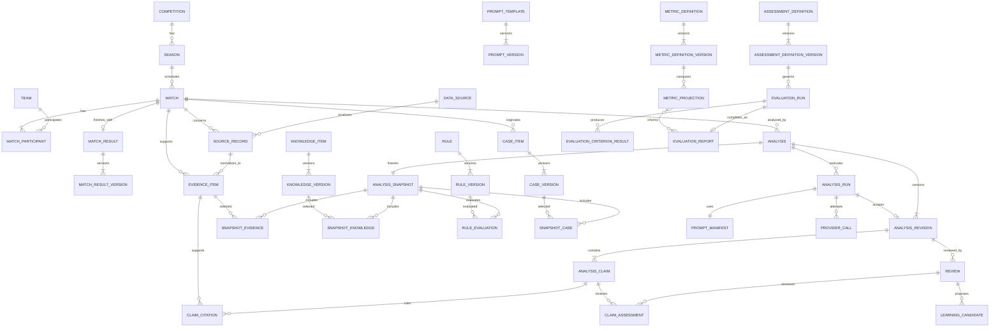

# FAS Database Design

## 1. Scope

PostgreSQL is the system of record for FAS v1. Prisma owns migrations and typed persistence access. The schema is designed for traceability, immutable versioning, deterministic replay, and post-match learning.

This document is a logical and physical design contract. The future Prisma schema must preserve these boundaries even where Prisma naming differs.

## 2. Design Principles

1. Store source observations separately from interpretations.
2. Version knowledge, rules, cases, prompts, and analyses; never rewrite published history.
3. Freeze every analysis input as a manifest of exact record versions.
4. Keep provider/model calls auditable without coupling domain records to OpenAI fields.
5. Use database constraints for invariants, not application checks alone.
6. Use UUID primary keys generated by the application or PostgreSQL.
7. Store all timestamps as `timestamptz` in UTC; retain source timezone separately when needed.
8. Use `jsonb` only for genuinely variable structures, never to avoid relational modeling.
9. Use explicit status values and guarded transitions; avoid physical deletion of governed artifacts.
10. Make statistics rebuildable from immutable source records.

## 3. Naming and Common Columns

- Tables and columns use `snake_case`; Prisma models may use PascalCase mappings.
- Primary key: `id uuid`.
- Mutable roots include `created_at`, `updated_at`, and `row_version integer` for optimistic concurrency.
- Version tables include `version integer`, `created_at`, and a unique `(root_id, version)`.
- Externally exposed IDs are UUIDs; sequential internal IDs are not exposed.
- Checksums use SHA-256 lowercase hex and columns named `*_sha256`.
- Confidence is stored as `numeric(5,4)` in `[0,1]`.
- Probabilities, when present, must sum within a documented tolerance.
- JSON documents include a `schema_version`.

## 4. Schema Areas

| Schema area | Purpose |
|---|---|
| `catalog` | Competitions, seasons, teams, and source identities |
| `match` | Fixtures, participants, results, and match state |
| `evidence` | Raw source records, normalized observations, facts, and market signals |
| `knowledge` | Governed knowledge roots, versions, sources, and retrieval |
| `rule` | Governed rules, versions, evaluations, and findings |
| `case_lib` | Reviewed case roots, versions, and match links |
| `prompt` | Prompt templates, versions, and composition manifests |
| `analysis` | Analysis roots, snapshots, runs, revisions, claims, and citations |
| `review` | Post-match reviews, assessments, and learning candidates |
| `evaluation` | Assessment definitions, frozen evaluation runs, criterion results, gate decisions, and reports |
| `stats` | Deterministic metric definitions, populations, watermarks, and rebuildable projections |
| `ops` | Durable jobs, idempotency, provider calls, and audit events |

Physical PostgreSQL schemas may be introduced in M1. If a single schema is used initially, table names must retain equivalent module ownership.

## 5. Entity Relationship Diagram

The diagram shows principal relationships; supporting joins and operational tables are detailed below.

## 6. Catalog and Match Tables

### `competitions`

| Column | Type | Constraints / meaning |
|---|---|---|
| `id` | uuid | PK |
| `name` | text | Required |
| `country_code` | char(2) | Nullable ISO 3166-1 alpha-2 |
| `competition_type` | text | `league`, `cup`, `tournament` |
| `external_key` | text | Nullable stable internal import key |
| common mutable columns | — | Timestamps and row version |

Unique normalized `(country_code, name)`.

### `seasons`

| Column | Type | Constraints / meaning |
|---|---|---|
| `id` | uuid | PK |
| `competition_id` | uuid | FK competitions |
| `name` | text | Example `2026-27` |
| `starts_on`, `ends_on` | date | Valid date range |

Unique `(competition_id, name)`.

### `teams`

| Column | Type | Constraints / meaning |
|---|---|---|
| `id` | uuid | PK |
| `name` | text | Canonical display name |
| `short_name` | text | Nullable |
| `country_code` | char(2) | Nullable |
| `external_key` | text | Nullable |
| common mutable columns | — | Timestamps and row version |

### `matches`

| Column | Type | Constraints / meaning |
|---|---|---|
| `id` | uuid | PK |
| `season_id` | uuid | FK seasons |
| `external_key` | text | Nullable stable import/demo key (e.g. vertical-slice `MatchId`) |
| `stage` | text | Nullable round/group/stage |
| `kickoff_at` | timestamptz | Scheduled kickoff |
| `source_timezone` | text | IANA timezone used by source |
| `venue_name` | text | Nullable |
| `status` | text | `scheduled`, `postponed`, `cancelled`, `completed` |
| `data_cutoff_at` | timestamptz | Nullable operator-defined cutoff |
| common mutable columns | — | Timestamps and row version |

Unique `external_key` where present. Index `(season_id, kickoff_at)` and `(status, kickoff_at)`.

### `match_participants`

| Column | Type | Constraints / meaning |
|---|---|---|
| `match_id` | uuid | FK matches |
| `team_id` | uuid | FK teams |
| `role` | text | `home`, `away`, or neutral role |

Composite PK `(match_id, role)`, unique `(match_id, team_id)`.

### `match_results`

| Column | Type | Constraints / meaning |
|---|---|---|
| `id` | uuid | PK |
| `match_id` | uuid | Unique FK matches |
| `current_version_id` | uuid | Nullable FK match_result_versions |
| `status` | text | `provisional`, `verified`, `corrected` |
| common mutable columns | — | Timestamps and row version |

`match_results` is the stable aggregate root and current-version pointer. Scores and verification evidence live only in immutable versions.

### `match_result_versions`

| Column | Type | Constraints / meaning |
|---|---|---|
| `id` | uuid | PK |
| `match_result_id` | uuid | FK match_results |
| `version` | integer | Positive, immutable |
| `home_score` | integer | Non-negative |
| `away_score` | integer | Non-negative |
| `verified_evidence_id` | uuid | FK evidence_items |
| `supersedes_version_id` | uuid | Nullable FK match_result_versions |
| `correction_reason` | text | Nullable for the first version; required for corrections |
| `content_sha256` | char(64) | Required |
| `recorded_at` | timestamptz | Required |

Unique `(match_result_id, version)` and unique `(match_result_id, content_sha256)`. A correction appends a new version, advances the root pointer, and records an audit event in one transaction. Historical versions and review references never change.

## 7. Evidence Tables

### `data_sources`

Stores provider identity, source class, trust metadata, terms reference, and active state. `source_class` distinguishes official, statistical, editorial, and market sources.

### `source_records`

| Column | Type | Constraints / meaning |
|---|---|---|
| `id` | uuid | PK |
| `data_source_id` | uuid | FK data_sources |
| `match_id` | uuid | Nullable FK matches |
| `external_record_id` | text | Nullable provider identifier |
| `source_uri` | text | Nullable reference |
| `observed_at` | timestamptz | When the source says the value applied |
| `retrieved_at` | timestamptz | When FAS received it |
| `payload_ref` | text | Object-storage reference or nullable |
| `payload_sha256` | char(64) | Required |
| `parser_version` | text | Required |
| `status` | text | `received`, `parsed`, `rejected`, `superseded` |

Unique `(data_source_id, external_record_id, payload_sha256)` where an external ID exists. Source records are append-only.

### `evidence_items`

| Column | Type | Constraints / meaning |
|---|---|---|
| `id` | uuid | PK |
| `match_id` | uuid | FK matches |
| `source_record_id` | uuid | FK source_records |
| `evidence_type` | text | `fact`, `market_signal`, `outcome` |
| `subject_type`, `subject_id` | text, uuid | Typed domain subject |
| `metric_key` | text | Stable normalized key |
| `value_json` | jsonb | Typed value document |
| `unit` | text | Nullable |
| `observed_at` | timestamptz | Required |
| `valid_from`, `valid_to` | timestamptz | Nullable validity window |
| `quality_status` | text | `valid`, `stale`, `conflicted`, `rejected`, `superseded` |
| `quality_score` | numeric(5,4) | Nullable and explained by quality details |
| `normalizer_version` | text | Required |
| `content_sha256` | char(64) | Required |

Indexes `(match_id, evidence_type, metric_key, observed_at desc)` and GIN on `value_json` only for demonstrated queries.

### `evidence_conflicts`

Links two or more incompatible evidence items through a conflict group. Stores conflict type, resolution status, chosen evidence (nullable), rationale, and resolution time. Resolution never deletes losing evidence.

## 8. Governed Knowledge Tables

### `knowledge_items`

Stable root with `id`, `slug`, lifecycle status, current approved version reference, timestamps, and row version.

### `knowledge_versions`

| Column | Type | Constraints / meaning |
|---|---|---|
| `id` | uuid | PK |
| `knowledge_item_id` | uuid | FK root |
| `version` | integer | Positive, immutable |
| `title` | text | Required |
| `body_markdown` | text | Required |
| `summary` | text | Required |
| `scope_json` | jsonb | Competitions/context applicability |
| `tags` | text[] | Controlled tags |
| `effective_from`, `effective_to` | timestamptz | Nullable validity |
| `review_status` | text | `draft`, `approved`, `rejected` |
| `source_quality` | text | Controlled assessment |
| `content_sha256` | char(64) | Required |
| `approved_at` | timestamptz | Nullable |

Unique `(knowledge_item_id, version)`. Approved versions are immutable.

### `knowledge_sources`

Join from a knowledge version to a source record or external citation. Includes excerpt, locator, source date, and citation role. Every approved factual knowledge statement requires a source.

V1 retrieval uses tags, scope, effective dates, and PostgreSQL full-text search. Phase 2 adds an `embedding` table with model/version/dimensions/content checksum and a pgvector column; embeddings never replace the source version.

## 9. Rule Tables

### `rules`

Stable root with `id`, unique `slug`, lifecycle status (`inactive`, `active`, `suspended`, `retired`), current active version, timestamps, and row version. Draft/approved/rejected review status belongs to immutable rule versions, not the root.

### `rule_versions`

| Column | Type | Constraints / meaning |
|---|---|---|
| `id` | uuid | PK |
| `rule_id` | uuid | FK rules |
| `version` | integer | Positive, immutable |
| `title`, `description` | text | Required |
| `condition_schema_version` | integer | Required |
| `conditions_json` | jsonb | Validated deterministic expression tree |
| `outcome_json` | jsonb | Finding produced on match |
| `scope_json` | jsonb | League/competition/context scope |
| `sample_count` | integer | Non-negative |
| `confidence` | numeric(5,4) | `[0,1]` |
| `minimum_sample_required` | integer | Positive |
| `limitations` | text | Required |
| `validation_method` | text | Required |
| `review_status` | text | `draft`, `approved`, `rejected` |
| `effective_from`, `effective_to` | timestamptz | Nullable |
| `content_sha256` | char(64) | Required |

Unique `(rule_id, version)`. Activation requires approval, `sample_count >= minimum_sample_required`, and non-null confidence.

### `rule_evaluations`

| Column | Type | Constraints / meaning |
|---|---|---|
| `id` | uuid | PK |
| `analysis_snapshot_id` | uuid | FK analysis_snapshots |
| `rule_version_id` | uuid | FK rule_versions |
| `status` | text | `matched`, `not_matched`, `inapplicable`, `error` |
| `input_json` | jsonb | Exact normalized inputs used |
| `explanation_json` | jsonb | Condition-by-condition result |
| `finding_json` | jsonb | Nullable deterministic finding |
| `evaluator_version` | text | Required |
| `evaluated_at` | timestamptz | Required |

Unique `(analysis_snapshot_id, rule_version_id)`.

## 10. Case Library Tables

### `case_items`

Stable root linked to an originating completed match and optional published analysis/review. Holds lifecycle status and current active version.

### `case_versions`

Stores immutable title, summary, context, decisive factors, result summary, reusable lessons, limitations, tags, competition scope, review status, content checksum, and version.

### `case_evidence`

Links case versions to evidence items, analysis claims, or review assessments with an explicit role.

Only approved cases derived from completed reviews are eligible for production retrieval.

## 11. Prompt and Provider Tables

### `prompt_templates` and `prompt_versions`

`prompt_templates` is the stable root keyed by a unique purpose and section, such as policy, analysis task, or review task. `prompt_versions` stores immutable template content, variables schema, output schema reference, status, checksum, and effective dates.

### `model_configurations`

Provider-neutral named configurations: provider key, model identifier, parameters JSON, response schema version, enabled state, and timestamps. API keys are never stored here.

### `prompt_manifests`

| Column | Type | Constraints / meaning |
|---|---|---|
| `id` | uuid | PK |
| `analysis_run_id` | uuid | Unique FK analysis_runs |
| `template_versions_json` | jsonb | Ordered exact version IDs |
| `input_manifest_json` | jsonb | Exact selected snapshot references |
| `rendered_prompt_ref` | text | Governed object reference; nullable by policy |
| `rendered_prompt_sha256` | char(64) | Required |
| `output_schema_version` | text | Required |
| `builder_version` | text | Required |

### `provider_calls`

Stores provider, model, provider request/response IDs, attempt number, request checksum, response object reference/checksum, start/end times, token usage, finish status, error category, retryability, and redacted diagnostic details.

## 12. Analysis Tables

### `analyses`

| Column | Type | Constraints / meaning |
|---|---|---|
| `id` | uuid | PK |
| `match_id` | uuid | FK matches |
| `analysis_type` | text | `pre_match` in v1 |
| `status` | text | `draft`, `running`, `generated`, `validated`, `published`, `failed`, `superseded` |
| `published_revision_id` | uuid | Nullable FK analysis_revisions |
| `requested_cutoff_at` | timestamptz | Required and before kickoff |
| common mutable columns | — | Timestamps and row version |

### `analysis_snapshots`

One immutable snapshot per analysis attempt lineage. Stores match state JSON, cutoff time, schema version, overall checksum, created time, and completeness/quality summary. It is sealed before retrieval and generation.

Join tables:

- `snapshot_evidence(snapshot_id, evidence_item_id, selection_role, value_sha256)`;
- `snapshot_knowledge(snapshot_id, knowledge_version_id, rank, retrieval_reason, excerpt_sha256)`;
- `snapshot_cases(snapshot_id, case_version_id, rank, similarity_reason, differences_json)`.

Rule inputs are represented by `rule_evaluations`; exact versions and normalized inputs are stored there.

### `analysis_runs`

| Column | Type | Constraints / meaning |
|---|---|---|
| `id` | uuid | PK |
| `analysis_id` | uuid | FK analyses |
| `analysis_snapshot_id` | uuid | FK snapshots |
| `run_number` | integer | Positive |
| `model_configuration_id` | uuid | FK model_configurations |
| `status` | text | `queued`, `running`, `generated`, `valid`, `invalid`, `failed` |
| `stage` | text | Current workflow stage |
| `accepted_provider_call_id` | uuid | Nullable FK provider_calls |
| `started_at`, `finished_at` | timestamptz | Nullable |
| `error_category`, `error_detail_json` | text, jsonb | Redacted |

Unique `(analysis_id, run_number)`.

### `analysis_revisions`

Immutable structured analysis document with `analysis_id`, revision number, source run ID, schema version, content JSON, content checksum, validation status, publication time, and superseded time.

### `analysis_claims`

| Column | Type | Constraints / meaning |
|---|---|---|
| `id` | uuid | PK |
| `analysis_revision_id` | uuid | FK revisions |
| `claim_key` | text | Stable within revision |
| `claim_type` | text | `fact`, `market_signal`, `rule_finding`, `case_analogy`, `inference`, `scenario`, `uncertainty` |
| `statement` | text | Required |
| `confidence` | numeric(5,4) | Nullable; required for inference/scenario |
| `rationale` | text | Nullable |
| `position` | integer | Display order |

Unique `(analysis_revision_id, claim_key)`.

### `claim_citations`

Links a claim to an evidence item, rule evaluation, knowledge version, or case version. Exactly one target type is populated, enforced by a check constraint. Includes citation role and optional excerpt checksum.

Facts require evidence citations. Rule findings require a rule evaluation. Case analogies require a case version and recorded differences. Inference may cite multiple supporting artifact types.

### `analysis_validations`

Stores validation kind, validator version, status, severity, location, message, details JSON, and run/revision reference. Publication requires no unresolved blocking validation.

## 13. Review and Learning Tables

### `reviews`

| Column | Type | Constraints / meaning |
|---|---|---|
| `id` | uuid | PK |
| `analysis_revision_id` | uuid | FK published revision |
| `match_result_version_id` | uuid | FK immutable match_result_versions row assessed |
| `status` | text | `draft`, `completed` |
| `overall_assessment` | text | Nullable structured category |
| `summary` | text | Nullable until completion |
| `completed_at` | timestamptz | Nullable |
| common mutable columns | — | Timestamps and row version |

Only one completed review per `(analysis_revision_id, match_result_version_id)`; a corrected result can therefore be reviewed without mutating or obscuring the earlier assessment.

### `claim_assessments`

Links review and analysis claim. Stores assessment (`supported`, `contradicted`, `inconclusive`, `not_assessable`), rationale, outcome evidence citations, and assessed time.

### `rule_assessments`

Links review and rule evaluation. Records usefulness, correctness category, outcome relevance, and rationale. It does not update the rule version in place.

### `case_assessments`

Links review and selected case version. Records similarity quality, misleading differences, usefulness, and rationale.

### `learning_candidates`

| Column | Type | Constraints / meaning |
|---|---|---|
| `id` | uuid | PK |
| `review_id` | uuid | FK reviews |
| `candidate_type` | text | `knowledge`, `rule`, `case`, `methodology` |
| `proposal_json` | jsonb | Schema-versioned proposal |
| `evidence_summary` | text | Required |
| `status` | text | `proposed`, `accepted`, `rejected` |
| `resolution_rationale` | text | Nullable |
| `promoted_entity_type`, `promoted_entity_id` | text, uuid | Nullable |

Acceptance creates a new draft root/version through the owning engine; it never activates content automatically.

## 14. Evaluation Tables

Evaluation storage is owned by the Evaluation Engine and remains separate from deterministic rule evaluations in the `rule` area and metric projections in the `stats` area.

### `assessment_definitions` and `assessment_definition_versions`

`assessment_definitions` stores stable assessment-policy identity. Immutable versions store subject types, criteria, rubric/scoring policy, qualification requirements, gate expression, thresholds, report schema version, limitations, lifecycle state, and content checksum.

### `evaluation_runs`

Stores the exact assessment-definition version, frozen subject or corpus manifest, evaluator versions, referenced metric-projection identities and watermarks, optional baseline report, status, attempts, manifest/computation checksums, and correlation metadata.

### `evaluation_criterion_results` and `evaluation_gate_decisions`

Criterion results record status, score, severity, evidence references, evaluator version, and explanation. Gate decisions record `passed`, `failed`, or `not_qualified` plus explicit waivers and reasons. Neither table stores recomputed metric values.

### `evaluation_reports`

Stores one immutable report for a completed run, including qualification, criterion-result references, exact Statistics projections, baseline comparison, gate decision, limitations, report schema/computation version, checksum, and completion time.

## 15. Statistics Tables

### `metric_definitions` and `metric_definition_versions`

The root stores stable metric identity. Immutable versions define population/filter semantics, formula, dimensions, interval method, minimum sample, completeness rules, unit, computation compatibility, lifecycle state, and content checksum.

### `metric_projections`

Stores metric definition version, subject type/ID, period, normalized dimensions and hash, numerator, denominator, value, confidence interval and method, sample/minimum sample, completeness and qualification, composite source watermarks, population/exclusion metadata, computed time, computation version, projection checksum, and rebuild lineage.

Unique identity includes metric version, subject, period, normalized dimensions hash, and source watermark. Values are projections and may be rebuilt.

## 16. Operational Tables

### `jobs`

Durable v1 queue with job type, schema-versioned payload, status, priority, available time, lease owner/expiry, heartbeat, attempts, max attempts, idempotency key, correlation ID, result reference, redacted error, and timestamps.

Indexes support `(status, available_at, priority)` and lease recovery. Payloads carry references, not secrets or large documents.

### `idempotency_records`

Stores scope, key, request checksum, response status/body reference, resource reference, expiry, and created time. Unique `(scope, key)`. Reuse with a different request checksum is a conflict.

### `audit_events`

Append-only event ID, occurred time, actor type (`operator`, `system`, `worker`), actor reference (nullable in v1), action, entity type/ID, prior/new version, correlation ID, reason, and redacted metadata.

Audit rows cannot be updated or deleted by runtime roles.

## 17. Integrity Rules

- Match analysis cutoff must be earlier than kickoff for a standard pre-match analysis.
- A published analysis references exactly one valid immutable revision and sealed snapshot.
- A snapshot cannot include evidence observed after its cutoff.
- Only approved/effective knowledge, rule, and case versions can enter a production snapshot.
- An active rule version satisfies its minimum sample requirement and has confidence and limitations.
- A fact claim has at least one valid evidence citation.
- A published revision has no blocking validation failure.
- A completed review references a published revision and verified result evidence.
- An evaluation report references one exact assessment-definition version, frozen subject manifest, and exact metric projections; it never embeds an independently recomputed statistic.
- A metric projection identifies its exact metric-definition/computation versions, population, qualification, and source watermarks.
- Provider calls cannot be deleted while referenced by an analysis run.
- Governed versions and source records are append-only.

Where Prisma cannot express a constraint, a reviewed SQL migration must add it.

## 18. Indexing and Query Strategy

- B-tree indexes for foreign keys, lifecycle status, effective dates, match kickoff, and job availability.
- Partial indexes for active rules, approved knowledge/cases, incomplete reviews, and runnable jobs.
- GIN full-text indexes on approved knowledge and case text in v1.
- Avoid broad GIN indexes on every JSONB column; add only from measured query plans.
- Cursor pagination uses stable `(created_at, id)` or domain-specific keys.
- Phase 2 pgvector indexes are selected only after corpus size and recall/latency tests.

Use `EXPLAIN ANALYZE` evidence before query denormalization.

## 19. Retention, Backup, and Recovery

- Retain published analyses, snapshots, governed versions, reviews, provider metadata, and audit events indefinitely unless a formal policy supersedes this.
- Raw payloads and full rendered prompts use configurable storage retention, but their checksums and manifests remain.
- Operational job details may be archived after the audit period; terminal job identity and outcome remain.
- Run daily encrypted database backups and object-store versioning where available.
- Test point-in-time recovery and artifact checksum verification before v1 release.
- Schema migrations are forward-only in production; rollback is a new corrective migration or application rollback compatible with the deployed schema.

## 20. Phase 2 Extensions

### Redis

Use for measured cache needs, distributed locks, rate limiting, and BullMQ dispatch. PostgreSQL remains authoritative; cached values include versioned keys and bounded TTLs.

### pgvector

Add versioned embeddings for approved knowledge and case content. Store provider/model, dimensions, source checksum, chunking version, and created time. Retrieval results must record rank, score, filters, and embedding version in the analysis snapshot.
