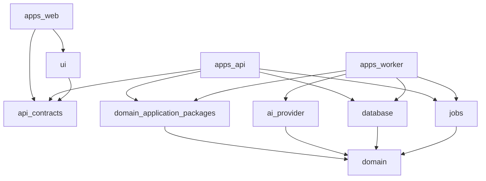

# FAS Monorepo Design

## 1. Objectives

FAS uses a pnpm workspace coordinated by Turborepo. The repository supports a full-TypeScript system while keeping domain logic independent from frameworks and infrastructure.

The monorepo must:

- share contracts and domain primitives safely;
- make module ownership explicit;
- prevent Next.js, NestJS, Prisma, and OpenAI concerns from leaking inward;
- allow API and worker processes to reuse application services;
- provide incremental builds and focused tests;
- keep Phase 2 Redis/pgvector adapters optional.

## 2. Proposed Structure

```text
football-analysis-system/
├── apps/
│   ├── web/                         # Next.js App Router analyst workspace
│   ├── api/                         # NestJS REST composition root
│   └── worker/                      # NestJS durable-job worker composition root
├── packages/
│   ├── api-contracts/               # Transport schemas, DTOs, OpenAPI-derived types
│   ├── domain/                      # Shared domain primitives and cross-domain policies
│   ├── match/                       # Match/catalog application and domain
│   ├── evidence/                    # Provenance, normalization, quality, snapshots
│   ├── analysis/                    # Analysis orchestration and publication lifecycle
│   ├── prompt-engine/               # Prompt composition and manifests
│   ├── knowledge-engine/            # Knowledge governance and retrieval
│   ├── rule-engine/                 # Deterministic rule model and evaluator
│   ├── case-engine/                 # Case governance and retrieval
│   ├── review-engine/               # Review and learning candidates
│   ├── evaluation-engine/           # Assessment policy, quality gates, reports
│   ├── statistics-engine/           # Rebuildable metric calculations
│   ├── ai-provider/                 # Provider port and OpenAI Responses adapter
│   ├── database/                    # Prisma schema, client, migrations, repositories
│   ├── jobs/                        # Durable job port and PostgreSQL adapter
│   ├── object-storage/              # Artifact-storage port and adapters
│   ├── observability/               # Logging, metrics, tracing, correlation
│   ├── config/                      # Typed runtime configuration
│   ├── ui/                          # Shared presentational React components
│   ├── tsconfig/                    # Shared TypeScript compiler policy
│   └── test-utils/                  # Test builders and infrastructure harnesses
├── scripts/                         # Current repository maintenance scripts
├── tooling/
│   └── dependency-cruiser/          # Controlled architecture-rule fixtures
├── docs/                            # Product and architecture source of truth
├── biome.json                       # Formatting and source-lint policy
├── dependency-cruiser.config.cjs    # Dependency-direction policy
├── compose.yaml                     # Local and v1 deployment topology
├── pnpm-workspace.yaml
├── turbo.json
├── package.json
└── README.md
```

This is the target M1 structure, not a claim that every listed package or deployment artifact is implemented. Shared scripts move under `tooling/` only when multiple applications consume them; application Dockerfiles remain app-local when introduced.

## 3. Application Responsibilities

### `apps/web`

Stack: Next.js App Router, React, TypeScript, TailwindCSS, shadcn/ui.

Responsibilities:

- match/evidence workspace;
- knowledge, rule, and case governance screens;
- analysis run, validation, and publication screens;
- post-match review and statistics views;
- API client composition and presentation-specific state.

May depend on:

- `@fas/api-contracts`;
- `@fas/ui`;
- `@fas/config` browser-safe exports only;
- pure formatting utilities.

Must not depend on database, engines, NestJS modules, AI provider, job adapters, or server secrets.

### `apps/api`

Stack: NestJS.

Responsibilities:

- HTTP routing, DTO validation, serialization, and OpenAPI;
- request correlation and trusted-environment controls;
- application command/query invocation;
- transaction and idempotency coordination;
- health/readiness endpoints;
- dependency injection composition root for HTTP runtime.

It contains no reusable business rules. Controllers should translate transport contracts to application commands and map results back.

### `apps/worker`

Stack: NestJS standalone application.

Responsibilities:

- claim and execute durable PostgreSQL jobs;
- run analysis, evaluation, and statistics workflows;
- manage leases, heartbeats, retries, and shutdown;
- compose provider, database, storage, and observability adapters.

It shares application packages with the API but has no HTTP controllers except optional private health probes.

## 4. Package Responsibilities

### Foundation

#### `@fas/domain`

Pure TypeScript primitives shared across bounded modules:

- identifiers and result/error types;
- time, checksum, confidence, sample-size, and lifecycle values;
- domain event contracts;
- epistemic classifications: fact, market signal, deterministic finding, inference;
- port conventions.

It must remain small. Engine-specific entities belong to their engine package.

#### `@fas/api-contracts`

- runtime-validated request/response schemas;
- shared DTO types and stable error codes;
- pagination and envelope contracts;
- OpenAPI generation/input artifacts.

Contracts may use a framework-neutral schema library. They do not import NestJS decorators, Prisma types, or domain entities.

#### `@fas/config`

- validates environment variables at process startup;
- exposes typed server configuration;
- will provide a separate allowlist of browser-safe configuration only when a browser consumer is authorized.

Sprint 5 implements only the server-side API and worker loaders for `NODE_ENV`, API `HOST`, and API `PORT`. Browser-safe configuration remains deferred.

No package reads `process.env` directly except this package and framework bootstraps.

### Domain/Application Modules

#### `@fas/match`

Owns competitions, seasons, teams, fixtures, participants, result state, and match readiness coordination.

#### `@fas/evidence`

Owns source records, normalized evidence, provenance, freshness, conflicts, cutoff checks, quality summaries, and snapshot evidence selection.

#### `@fas/analysis`

Owns analysis lifecycle, workflow orchestration, immutable snapshots, runs, revisions, claims, citations, validations, and publication.

It calls engine ports but does not inspect engine persistence.

### Engines

#### `@fas/prompt-engine`

Owns prompt template/version policy, section composition, output schema selection, rendering, and prompt manifest checksums. No provider network calls.

#### `@fas/knowledge-engine`

Owns knowledge item/version lifecycle, approval/effective-date rules, source requirements, and retrieval. V1 uses repository metadata/full-text ports; Phase 2 adds a semantic retrieval adapter.

#### `@fas/rule-engine`

Owns rule lifecycle, condition schema, deterministic per-snapshot rule application, applicability, explanation, and sample/confidence activation constraints. It must be pure and must not call AI providers.

#### `@fas/case-engine`

Owns case lifecycle, completed-review eligibility, retrieval, and required similarity/difference explanations.

#### `@fas/review-engine`

Owns review lifecycle, claim/rule/case assessments, completion policy, and learning candidates. It never mutates a published analysis or directly activates learning.

#### `@fas/evaluation-engine`

Owns versioned assessment definitions, rubrics, qualification and gate policy, immutable evaluation runs, criterion results, baseline comparisons, and quality/release reports. It consumes exact Statistics projections through a published reader contract and does not compute metrics.

#### `@fas/statistics-engine`

Owns deterministic metric definitions, populations, formulas, sample/completeness qualification, uncertainty calculations, source watermarks, and rebuildable projections. It does not make quality, release, or approval decisions.

### Infrastructure

#### `@fas/database`

- Prisma schema and generated client;
- migrations and seed/reference data;
- repository adapters and persistence mappers;
- transaction runner;
- database health checks.

Only this package imports `@prisma/client`. It implements repository ports declared by owning domain/application packages.

#### `@fas/ai-provider`

- provider-neutral generation port and value types;
- OpenAI Responses API adapter;
- provider request/response mapping;
- retry classification, usage, and redaction helpers.

Provider DTOs do not escape the adapter. Mock/fake providers support tests.

#### `@fas/jobs`

- job command and handler contracts;
- v1 PostgreSQL durable job adapter;
- lease, heartbeat, retry, and idempotency policy;
- Phase 2 BullMQ adapter behind the same dispatch contract.

#### `@fas/object-storage`

Provider-neutral read/write/checksum port plus local/S3-compatible adapters. Domain packages store artifact references, not SDK objects.

#### `@fas/observability`

Structured logger, trace/metric abstractions, request/job correlation, redaction, and framework integrations. Domain code may emit semantic events through a small port but does not import telemetry SDKs.

### UI and Tooling

#### `@fas/ui`

Reusable presentational React components built with TailwindCSS and shadcn/ui conventions. It contains no API calls, business state transitions, or server-only imports.

#### `@fas/test-utils`

Test builders, clocks, deterministic IDs, fake repositories/providers, database reset utilities, and contract fixtures. It must not become a dumping ground for production logic.

#### Configuration packages

`@fas/tsconfig` centralizes strict compiler settings and framework variants. Applications extend its explicit exports rather than copying shared compiler policy.

Formatting and source linting are repository-level concerns owned by root `biome.json`. Dependency direction is a separate graph-level concern owned by root `dependency-cruiser.config.cjs`. No ESLint configuration package or parallel formatter/linter authority is approved.

## 5. Internal Package Shape

Domain/application packages use a consistent shape where needed:

```text
src/
├── domain/             # Entities, value objects, policies, domain errors
├── application/        # Commands, queries, use cases, ports
├── contracts/          # Public package inputs/outputs
├── infrastructure/     # Only if adapter belongs intrinsically to package
└── index.ts            # Intentionally small public surface
```

Not every package needs every directory. Do not create empty architecture theater.

Deep imports into another package's `src` are forbidden. Consumers use the package's explicit export map.

## 6. Dependency Direction



Allowed principles:

- applications may compose all required packages;
- infrastructure depends inward on ports/contracts;
- domain/application packages never depend on apps;
- engine packages may depend on `domain` and declared cross-engine contracts, not engine internals;
- circular package dependencies are prohibited.

## 7. Engine Interaction

The analysis package invokes public application contracts:

```text
Analysis Orchestrator
  -> Evidence snapshot selector
  -> Knowledge retrieval port
  -> Rule evaluation service
  -> Case retrieval port
  -> Prompt composition service
  -> AI generation port
  -> Analysis validation policies
```

The Prompt Engine receives selected immutable data; it does not query Knowledge, Rule, or Case storage itself. This prevents hidden retrieval and makes the manifest reproducible.

The Review Engine creates learning candidates. Acceptance is handed to the relevant engine through an explicit command that creates a draft version.

The Statistics Engine computes exact projections from immutable sources. The Evaluation Engine may consume those projections to apply versioned assessment and release policy; neither package imports the other's implementation or persistence adapters.

## 8. Workspace Tooling

### pnpm

- One root lockfile is committed.
- Internal dependencies use `workspace:` protocol.
- Exact Node and pnpm versions are pinned through repository metadata.
- Dependency installation occurs from repository root.
- Package-level scripts use consistent names: `build`, `dev`, `lint`, `typecheck`, `test`, `test:integration`.

### Turborepo

Tasks:

- `build` depends on dependency builds and caches outputs;
- `typecheck`, `lint`, and unit `test` are cacheable;
- integration tests declare database/environment inputs and avoid unsafe shared cache;
- `dev` is persistent and uncached;
- Prisma generation precedes database adapter build;
- migration execution is never a transitive build task.

Secrets and `.env` files must not be cache inputs that can enter remote cache artifacts.

### Engineering Quality

- Biome is the single formatter and source linter.
- dependency-cruiser enforces dependency direction and circular-dependency rules.
- A controlled fixture proves that a forbidden dependency is rejected.
- Husky invokes lint-staged at pre-commit for supported staged files only.
- Local hooks are a fast convenience; the root `validate` command remains authoritative.
- Full validation runs workspace checks, quality checks, typechecking, tests, and builds without writing files.

## 9. Boundary Enforcement

dependency-cruiser and later architecture tests should enforce:

- package dependency allowlists/tags;
- no `@prisma/client` imports outside `@fas/database`;
- no `openai` SDK imports outside `@fas/ai-provider`;
- no NestJS imports in domain or engine-domain directories;
- no Next.js/React imports outside web/UI packages;
- no deep internal package imports;
- no circular dependencies;
- no browser import of server-only config;
- no direct engine database-table access across ownership boundaries.

Architecture tests complement lint rules for runtime composition and public exports.

## 10. Database and Migration Ownership

Prisma schema is physically centralized in `@fas/database` because Prisma migrations need one coherent database history. Logical ownership remains by module:

- schema blocks are grouped and labeled by owner;
- migration PRs require review from affected owners;
- repository adapters implement ports from the owning package;
- cross-module foreign keys are explicit and reviewed;
- one module does not expose raw Prisma delegates to another.

Generated Prisma types are infrastructure details and must not be re-exported.

## 11. API Contract Workflow

1. Define/modify runtime-validatable API schemas in `@fas/api-contracts`.
2. Map them in NestJS controllers without leaking domain entities.
3. Generate and validate OpenAPI.
4. Consume contracts through a typed web client.
5. Run contract tests against the API.

Breaking contract changes follow [API versioning](./13_API.md#21-versioning-and-compatibility).

## 12. Testing Placement

- Unit tests live beside source and test pure domain/application behavior.
- Package integration tests live under each package's `test/integration`.
- API contract tests live with `apps/api`.
- UI component tests live with `@fas/ui`; page/workflow tests with `apps/web`.
- Database migration/repository tests live in `@fas/database`.
- End-to-end analyst workflows live in a root-level or web-owned E2E suite and exercise composed services.

Test utilities are imported from `@fas/test-utils`; package-specific builders stay with their package.

## 13. Phase 2 Additions

Phase 2 adds adapters, not new domain semantics:

- Redis cache/lock and BullMQ adapters in `@fas/jobs` or a focused `@fas/redis`;
- pgvector persistence/retrieval implementation in `@fas/database` and Knowledge/Case retrieval adapters;
- embedding provider adapter behind a provider-neutral port.

Applications choose adapters through configuration. Domain and API contracts remain stable unless product behavior changes.

## 14. Ownership and Change Rules

- Every package has a documented owner or reviewer group before team growth.
- Public exports are deliberate API surfaces and require compatibility review.
- Adding a dependency from one engine to another requires an architecture review.
- A package is split only for a clear ownership, reuse, deployment, or dependency-boundary reason.
- New shared packages require at least two real consumers; otherwise code stays with its owner.
- Architecture decisions that alter this structure are recorded in an ADR and reflected in this document.

## 15. Numbered Documentation

The canonical documentation set is:

- [00_PROJECT_BIBLE](./00_PROJECT_BIBLE.md)
- [01_PRODUCT](./01_PRODUCT.md)
- [02_DOMAIN_MODEL](./02_DOMAIN_MODEL.md)
- [03_AI_PRINCIPLES](./03_AI_PRINCIPLES.md)
- [04_ARCHITECTURE](./04_ARCHITECTURE.md)
- [05_PROMPT_ENGINE](./05_PROMPT_ENGINE.md)
- [06_KNOWLEDGE_ENGINE](./06_KNOWLEDGE_ENGINE.md)
- [07_RULE_ENGINE](./07_RULE_ENGINE.md)
- [08_CASE_ENGINE](./08_CASE_ENGINE.md)
- [09_REVIEW_ENGINE](./09_REVIEW_ENGINE.md)
- [10_EVALUATION_ENGINE](./10_EVALUATION_ENGINE.md)
- [11_STATISTICS_ENGINE](./11_STATISTICS_ENGINE.md)
- [12_DATABASE](./12_DATABASE.md)
- [13_API](./13_API.md)
- [14_MONOREPO](./14_MONOREPO.md)
- [15_DEVELOPMENT_GUIDE](./15_DEVELOPMENT_GUIDE.md)
