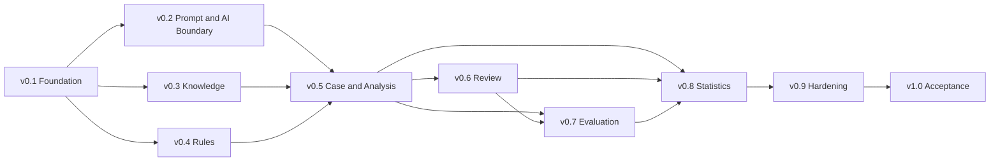

# FAS Implementation Roadmap

## 1. Purpose and Authority

This document converts the M1–M9 direction in [01_PRODUCT](./01_PRODUCT.md#11-long-term-roadmap) into practical implementation releases from v0.1 through v1.0. It defines delivery order, release boundaries, dependency gates, and acceptance evidence. It does not replace the product, domain, engine, persistence, API, package, or development contracts in the existing numbered documents.

The [PROJECT BIBLE](./00_PROJECT_BIBLE.md) remains governing. [04_ARCHITECTURE](./04_ARCHITECTURE.md) defines runtime and dependency direction; [05_PROMPT_ENGINE](./05_PROMPT_ENGINE.md) through [11_STATISTICS_ENGINE](./11_STATISTICS_ENGINE.md) define engine behavior; [12_DATABASE](./12_DATABASE.md), [13_API](./13_API.md), and [14_MONOREPO](./14_MONOREPO.md) remain authoritative for persistence, transport, and package placement. Delivery and quality practices follow [15_DEVELOPMENT_GUIDE](./15_DEVELOPMENT_GUIDE.md) and the accepted [Architecture Decision Records](../README.md#architecture-decision-records).

Release labels are internal implementation milestones until v1.0. They do not imply public availability, API stability beyond the documented compatibility rules, or permission to expose FAS outside a trusted private environment.

## 2. Release Mapping

| Release | Existing milestone alignment | Primary outcome |
|---|---|---|
| v0.1 | M1 — Foundation | Executable monorepo, persistence, durable jobs, observability, and delivery controls |
| v0.2 | M2 — Prompt Engine | Reproducible prompt composition, provider boundary, structured output, and validation foundation |
| v0.3 | M3 — Knowledge Engine | Governed knowledge lifecycle and deterministic versioned retrieval |
| v0.4 | M4 — Rule Engine | Governed immutable rules and deterministic explained evaluation |
| v0.5 | M5 — Case and Analysis Engines | Governed case retrieval and complete pre-match analysis workflow |
| v0.6 | M6 — Review Engine | Verified-result review, assessments, learning candidates, and corrected-result lineage |
| v0.7 | M7 — Evaluation Engine | Versioned quality assessment, qualification, baselines, and release reports |
| v0.8 | M8 — Statistics Engine | Rebuildable versioned metrics, watermarks, uncertainty, and projections |
| v0.9 | M9 — v1 Hardening | Release candidate proven under recovery, security, performance, and resilience tests |
| v1.0 | M9 — v1 Acceptance | Controlled production promotion after all contractual and operational gates pass |

v1.0 adds no new domain scope after v0.9. It is the promotion of a proven release candidate, not a deadline-driven feature bundle.

## 3. Delivery Principles

1. Deliver one reviewable vertical capability at a time while preserving package boundaries from [14_MONOREPO](./14_MONOREPO.md).
2. Establish immutable identities, version contracts, checksums, idempotency, and failure semantics before dependent workflows consume them.
3. Keep deterministic policies independent from framework, persistence, and provider adapters.
4. Implement each engine against its public contracts before connecting it to the Analysis Orchestrator.
5. Treat successful empty results, unavailable dependencies, invalid contracts, and partial execution as distinct outcomes.
6. Do not defer audit, observability, recovery, or architecture tests to v0.9 when an earlier release introduces the relevant behavior.
7. Use frozen fixtures and exact version identities from the first executable release so later replay and evaluation do not require retrofitting.
8. A release is complete only when its exit criteria are demonstrated in the composed system, not merely implemented in isolated packages.

## 4. Dependency and Release Sequence

The numbered release order is the default integration order. After v0.1, isolated package work for v0.2–v0.4 may proceed in parallel, but v0.5 integration cannot begin until their exact contracts and required adapters pass their release gates. Evaluation definition work may begin before v0.6, but v0.7 cannot qualify review-dependent criteria until immutable completed-review fixtures exist. Statistics formula work may begin earlier, but v0.8 cannot claim rebuild or watermark acceptance until the source contracts from analysis and review are stable.

Each release should be delivered in this sequence:

1. close its documentation and ADR gates;
2. define framework-neutral contracts and deterministic fixtures;
3. implement pure domain/application behavior;
4. implement persistence, job, provider, and transport adapters;
5. integrate API and worker composition;
6. add analyst UI only after command/query behavior is stable;
7. prove failure, replay, idempotency, and architecture boundaries;
8. tag the release only after all exit criteria pass.

## 5. Cross-cutting Planning Decisions

These decisions close implementation ambiguities exposed by the existing contracts. They are binding for sequencing. Where an existing canonical document does not yet represent the decision physically or in HTTP, that document and any required ADR must be updated before the affected implementation is merged.

### 5.1 Match Result Version History

Match results use append-only immutable result versions. A mutable match root may point to the current verified version, but a correction creates a new positive monotonic version with its own checksum, status, outcome-evidence references, recorded time, reason, and supersedes reference. It never updates the result assessed by an existing completed review.

The domain behavior follows [02_DOMAIN_MODEL](./02_DOMAIN_MODEL.md#71-match), [09_REVIEW_ENGINE](./09_REVIEW_ENGINE.md#74-corrected-outcomes), and accepted [ADR-004](./decisions/ADR-004-append-only-match-result-versions.md). [12_DATABASE](./12_DATABASE.md#6-catalog-and-match-tables) defines append-only result-version storage, while [13_API](./13_API.md#8-catalog-and-match-endpoints) defines version identity, checksum, optimistic concurrency, correction reason, and supersession behavior.

### 5.2 Knowledge and Case Retrieval Specification Versioning

Knowledge and Case retrieval remain independently governed because their eligibility, ranking, explanation, and output semantics differ. Each production retrieval records:

- exact retrieval-specification or retrieval-policy identity and immutable version;
- exact retrieval implementation version;
- normalized query/filter manifest and checksum;
- corpus or eligibility watermark sufficient for diagnostic replay;
- limit, total ordering, stable tie-break semantics, and result count;
- exact ordered selections, ranks, reasons, and excerpt or comparison checksums;
- explicit `completed_empty`, `completed_nonempty`, or `failed` outcome.

The Knowledge contract is defined in [06_KNOWLEDGE_ENGINE](./06_KNOWLEDGE_ENGINE.md#6-v1-retrieval-workflow); the Case contract is defined in [08_CASE_ENGINE](./08_CASE_ENGINE.md#7-retrieval-and-comparison-workflow). A shared primitive may represent version references and result status, but one engine's specification must not govern the other. Persistence and any governance/inspection endpoints absent from [12_DATABASE](./12_DATABASE.md) or [13_API](./13_API.md) must be documented before v0.3 or v0.5 implementation respectively.

### 5.3 Prompt Composition Policy and AI Release Bundles

A composition policy is a stable governed root with immutable versions defining required sections, canonical order, delimiters, size and deterministic truncation rules, compatibility, and empty-section behavior. An AI release bundle is a separate immutable manifest that pins:

`provider adapter + model identifier + model parameters + prompt versions + composition-policy version + output-schema version + builder version + validator bundle`

Production activation names one exact approved bundle and one tested rollback bundle. Resolving an alias such as `active` is allowed only before a run is frozen; the run and prompt manifest store the exact bundle and component identities. Changing any component creates a candidate bundle and follows the evaluation and approval requirements in [03_AI_PRINCIPLES](./03_AI_PRINCIPLES.md#11-model-and-prompt-change-governance). Prompt-owned behavior remains governed by [05_PROMPT_ENGINE](./05_PROMPT_ENGINE.md); provider execution and analysis publication remain outside it.

Before v0.2 implementation, [12_DATABASE](./12_DATABASE.md#11-prompt-and-provider-tables) must explicitly represent composition-policy versions, validator-bundle identity, immutable release bundles, activation history, and rollback target. Any operator-facing lifecycle commands must first be added to [13_API](./13_API.md).

### 5.4 Analysis Readiness Policy

Analysis readiness is a versioned deterministic policy applied by the Analysis application service. Match and Evidence publish immutable state, freshness, conflict, quality, and cutoff-qualified inputs; they do not make the final analysis command decision. The readiness result records:

- exact readiness-policy version;
- match state and evidence-quality input checksum;
- requested cutoff and evaluation time;
- blocking issues, warnings, and permitted acknowledgements with stable codes;
- actor rationale for every acknowledgement;
- final `ready`, `ready_with_acknowledgements`, or `not_ready` decision and checksum.

Readiness is evaluated before snapshot sealing and is rechecked transactionally when the analysis/job request is accepted. A later evidence change does not mutate the recorded result or sealed snapshot. Any changed input requires a new readiness result and, where applicable, a new analysis lineage.

This resolves ownership between the workflow in [04_ARCHITECTURE](./04_ARCHITECTURE.md#7-ai-analysis-workflow), readiness coordination in [14_MONOREPO](./14_MONOREPO.md#domainapplication-modules), and Analysis ownership described by the engine contracts. The authoritative readiness policy, acknowledgement classes, and persistence/API representation must be added to the applicable canonical documents before v0.5 orchestration is implemented. A policy change receives a new version; it is not a runtime configuration edit.

### 5.5 Empty Engine Result Policy

Every orchestrated engine stage returns a typed completion envelope. Absence of selected items is never inferred from a missing record, timeout, exception, or partial result.

| Stage | Successful empty meaning | Required continuation behavior |
|---|---|---|
| Knowledge retrieval | No eligible knowledge matched under the exact specification | Continue only if the pinned analysis policy permits; record empty manifest and material uncertainty |
| Rule selection/evaluation | No active qualified rule version was eligible | Continue with an explicit complete zero-count set; never imply that rules ran and did not match |
| Case retrieval | No eligible reviewed analogy matched under the exact policy | Continue only if the pinned analysis policy permits; record empty manifest and material uncertainty |

A failed, unavailable, integrity-invalid, policy-incompatible, or incomplete stage always fails analysis generation. A rule batch containing a required `error` is failed even if other evaluations completed. Prompt composition renders an explicit empty section only from a successful empty envelope allowed by the exact composition and analysis policies, consistent with [05_PROMPT_ENGINE](./05_PROMPT_ENGINE.md#5-section-model-and-composition-contract). It never converts an upstream failure into empty context.

The pinned analysis policy identifies which engine stages are mandatory, which successful empty outcomes may continue, and the uncertainty claims/validation requirements they trigger. This policy and its persistence identity must be documented before v0.5.

### 5.6 Inline Validation and `analysis.validate` Revalidation

There is one versioned Analysis validation use case with two invocation modes:

1. **Inline initial validation:** the `analysis.generate` worker invokes validation immediately after persisting the provider candidate and before a run may become `valid` or an analysis may become `validated`.
2. **Durable revalidation:** an `analysis.validate` job invokes the same use case against an exact immutable candidate/revision, sealed snapshot, prompt manifest, and exact validator bundle. It is used for crash recovery, explicit operator revalidation, or comparison under a newly governed validator bundle.

Both modes create an immutable validation execution identity and append-only findings. Revalidation never edits candidate content, replaces historical findings, advances publication by itself, or silently changes the release bundle attributed to the provider run. Publication names the exact successful validation execution and requires that its validator bundle is permitted by the active publication policy. Validation under a newer bundle is a new assessment of the same immutable content, not a rewrite of the original run.

The initial generate job checkpoints candidate persistence before validation so a worker crash can enqueue or resume durable revalidation idempotently. Duplicate validation commands with identical subject and bundle identity return the existing completed result. The job model follows [04_ARCHITECTURE](./04_ARCHITECTURE.md#11-durable-jobs-and-consistency), validation behavior follows [03_AI_PRINCIPLES](./03_AI_PRINCIPLES.md#12-validation-and-publication-gates), and persistence follows [12_DATABASE](./12_DATABASE.md#12-analysis-tables). Before v0.2 implementation, the canonical documents must define validation execution identity, uniqueness, lineage, and publication reference; [13_API](./13_API.md) must be updated first if revalidation is exposed as an HTTP command.

## 6. Release Milestones

### 6.1 v0.1 — Foundation

**Objective**

Establish the executable modular-monolith foundation and correctness mechanisms required by every later release, aligned to M1.

**Deliverables**

- Target workspace, package boundaries, application composition roots, and tooling from [14_MONOREPO](./14_MONOREPO.md).
- Local Docker Compose topology, typed configuration, PostgreSQL, optional local object storage, and private-network defaults from [04_ARCHITECTURE](./04_ARCHITECTURE.md).
- Initial persistence and migration framework organized by logical owner from [12_DATABASE](./12_DATABASE.md).
- Append-only match-result version foundation after the documentation and ADR gate in section 5.1 is complete.
- Durable PostgreSQL jobs with leases, heartbeats, bounded retries, checkpoints, idempotency, and audit records under [ADR-002](./decisions/ADR-002-postgresql-durable-jobs-for-v1.md).
- Correlation, structured logging, health/readiness, redaction, test fixtures, and baseline CI quality gates.
- Enforced package import boundaries and explicit public export maps.

**Exit Criteria**

- Clean checkout can install, build, typecheck, lint, test, migrate, start, and report healthy local services through documented commands.
- Concurrent job-claim, lease-expiry, retry, duplicate-command, and worker-shutdown tests pass.
- Migration tests pass from an empty database and across the supported application compatibility window.
- Match-result correction proves append-only version identity and preserves prior exact-version reads.
- CI rejects forbidden framework, Prisma, provider, and deep-package imports.
- No Redis, BullMQ, or pgvector service is required.

**Risks**

- Premature package scaffolding may create empty architecture theater.
- Centralized persistence may encourage cross-module table access.
- Incorrect job leases or idempotency may duplicate later provider work.
- Result-version reconciliation may reveal wider API or review-reference changes.

**Dependencies**

- Accepted [ADR-001](./decisions/ADR-001-modular-monolith-and-typescript-monorepo.md), [ADR-002](./decisions/ADR-002-postgresql-durable-jobs-for-v1.md), and [ADR-004](./decisions/ADR-004-append-only-match-result-versions.md).
- Pinned supported Node.js, pnpm, PostgreSQL, and Docker toolchain.

### 6.2 v0.2 — Prompt, Provider, and Validation Foundation

**Objective**

Deliver reproducible prompt composition and a safe provider-to-validation boundary, aligned to M2, without requiring production Knowledge, Rule, or Case implementations.

**Deliverables**

- Prompt template/version lifecycle, composition-policy versions, deterministic renderer, canonical serialization, and immutable prompt manifests from [05_PROMPT_ENGINE](./05_PROMPT_ENGINE.md).
- Immutable AI release-bundle model, compatibility checks, activation history, and rollback target from section 5.3.
- Provider-neutral generation port and initial OpenAI Responses API adapter under [ADR-003](./decisions/ADR-003-provider-neutral-ai-and-staged-retrieval.md).
- Closed structured-output schema, provider-response mapping from `unknown`, validation execution records, and blocking validator bundle.
- Shared implementation of inline validation and durable `analysis.validate` revalidation from section 5.6.
- Provider fakes, frozen fixtures, injection corpus, replay fixtures, and redacted provider-call audit.

**Exit Criteria**

- Identical exact inputs and component versions produce byte-identical rendered content and manifest checksums.
- Provider SDK types and errors do not cross the adapter boundary.
- Invalid, truncated, refused, contradictory, injection-affected, or unsupported-citation candidates cannot become publishable.
- Inline and durable validation produce semantically identical findings for the same exact subject and validator bundle.
- Crash after candidate persistence can recover through idempotent revalidation without another provider call.
- Candidate bundle evaluation fixtures identify every component and a tested rollback target.

**Risks**

- Bundle and validation identities may be under-modeled in persistence.
- Provider structured-output behavior may differ from local fixtures.
- Retaining too much prompt/response content may violate security or licensing constraints.
- Composition may accidentally absorb retrieval or model-selection responsibility.

**Dependencies**

- v0.1 jobs, storage, audit, configuration, and migration foundation.
- Completed composition-policy, release-bundle, and validation documentation gates.
- Approved provider credentials and a bounded integration-test budget.

### 6.3 v0.3 — Knowledge Engine

**Objective**

Deliver governed, source-backed knowledge and deterministic v1 retrieval, aligned to M3.

**Deliverables**

- Knowledge item/version authoring, sourcing, approval, activation, retirement, effectivity, and immutable history from [06_KNOWLEDGE_ENGINE](./06_KNOWLEDGE_ENGINE.md).
- Versioned retrieval specifications, implementation identity, manifests, deterministic ranking, stable tie-breaks, and excerpt checksums from section 5.2.
- PostgreSQL metadata, controlled-tag, scope, and full-text retrieval with measured query plans.
- API and analyst workflow for lifecycle operations and retrieval inspection as already authorized by [13_API](./13_API.md).
- Successful-empty versus failed retrieval envelopes and snapshot-ready selection contracts.

**Exit Criteria**

- Production retrieval returns only exact approved, active, effective, scope-compatible, source-backed versions.
- Identical corpus watermark, request, and specification produce identical ordered selections and excerpt checksums.
- Late approval, retirement, or correction cannot alter a stored selection.
- No eligible match returns audited `completed_empty`; dependency or integrity failure returns `failed`.
- Malicious Markdown and instruction-like text remain inert untrusted data.
- Full-text query, index, source-integrity, replay, and architecture suites pass.

**Risks**

- Retrieval relevance may be poor before a representative corpus exists.
- Full-text behavior can drift with unpinned database configuration.
- Excerpting can remove material limitations.
- Source licensing may constrain stored bodies and diagnostics.

**Dependencies**

- v0.1 persistence, audit, API conventions, and test harness.
- Completed Knowledge retrieval-specification persistence/API gate.
- Controlled vocabularies and representative sourced knowledge fixtures.

### 6.4 v0.4 — Rule Engine

**Objective**

Deliver governed rule versions and deterministic, explained per-snapshot evaluation, aligned to M4.

**Deliverables**

- Rule lifecycle, immutable versions, qualification metadata, activation, suspension, and retirement from [07_RULE_ENGINE](./07_RULE_ENGINE.md).
- Closed condition and outcome schemas with explicit applicability and missing-data semantics.
- Pure bounded evaluator with condition-level explanations, semantic checksums, and versioned evaluator identity.
- Exact eligible-version selection, normalized snapshot-input contract, immutable production evaluations, and non-persistent preview.
- Governance and preview API/UI authorized by [13_API](./13_API.md).

**Exit Criteria**

- Golden, boundary, property, and replay tests produce identical status, explanation, finding, and semantic checksum.
- `matched`, `not_matched`, `inapplicable`, and `error` remain distinct in every contract and view.
- Under-qualified rules cannot activate; approved versions cannot be edited.
- The evaluator has no clock, random, network, filesystem, provider, database, or executable-code path.
- One required rule error fails the stage; an eligible zero-rule set remains explicit and complete.
- Preview produces no production evaluation or snapshot evidence.

**Risks**

- Ambiguous numeric, temporal, collection, or missing-data semantics may undermine determinism.
- Rule qualification metadata may be mistaken for Statistics output.
- Expression complexity may create resource-exhaustion paths.
- Authoring convenience may leak executable syntax into the condition language.

**Dependencies**

- v0.1 domain primitives, persistence, audit, and architecture enforcement.
- Stable normalized metric keys and snapshot-input fixtures from Match/Evidence contracts.
- Approved condition-schema and evaluator-version policy.

### 6.5 v0.5 — Case and Pre-match Analysis

**Objective**

Deliver the complete reviewable pre-match workflow and governed case analogies, aligned to M5.

**Deliverables**

- Case root/version lifecycle, completed-review eligibility, deterministic retrieval policy, similarities, material differences, limitations, and traceability from [08_CASE_ENGINE](./08_CASE_ENGINE.md).
- Versioned Analysis readiness policy and immutable readiness results from section 5.4.
- Explicit engine-stage completion and empty-result policy from section 5.5.
- Analysis roots, sealed snapshots, runs, checkpoints, revisions, typed claims/citations, validations, human publication, and supersession from [02_DOMAIN_MODEL](./02_DOMAIN_MODEL.md) and [04_ARCHITECTURE](./04_ARCHITECTURE.md).
- End-to-end orchestration across Knowledge, Rule, Case, Prompt, provider, validation, persistence, and jobs.
- Analyst workflow for readiness, provenance, draft inspection, validation findings, and explicit publication.

**Exit Criteria**

- Critical readiness failure prevents snapshot sealing and provider invocation; acknowledgements are policy-permitted, reasoned, and immutable.
- Evidence observed after cutoff cannot enter a snapshot, and late arrivals cannot mutate it.
- Every stage records exact versions, checksums, status, timing, and failure diagnostics.
- Successful empty engine results are explicit and policy-governed; failures cannot become omitted or empty context.
- Every generated fact, rule finding, and case analogy satisfies its typed citation and difference requirements.
- Publication requires a sealed snapshot, immutable valid revision, exact accepted validation execution, optimistic concurrency, and explicit human command.
- Retry and crash recovery cannot change the snapshot, silently switch bundles, or duplicate publication.

**Risks**

- This is the first broad integration release and carries the highest orchestration risk.
- Readiness policy may become a hidden substitute for evidence governance.
- Snapshot sealing order may conflict with retrieval/evaluation lineage if implemented inconsistently.
- Analyst pressure for an answer may encourage degraded silent continuation.

**Dependencies**

- v0.1 through v0.4 release exits.
- Completed Case retrieval, readiness, empty-result, snapshot-lineage, and validation-publication documentation gates.
- Representative end-to-end fixtures for ready, warning, blocked, empty, invalid-output, retry, and publish-conflict paths.

### 6.6 v0.6 — Review and Governed Learning

**Objective**

Deliver post-match accountability and governed learning proposals, aligned to M6.

**Deliverables**

- Verified result-version ingestion and corrected-result supersession using section 5.1.
- Review drafts bound to exact published revisions, fixed target sets, exact result versions, outcome evidence, and rubric versions from [09_REVIEW_ENGINE](./09_REVIEW_ENGINE.md).
- Claim, rule, and case assessments with governed categories and immutable completion.
- Learning-candidate proposal, human disposition, idempotent target-engine draft handoff, and visible handoff failure.
- Atomic review completion and Statistics refresh job creation.
- Case-draft provenance path from completed reviews without automatic approval.

**Exit Criteria**

- A review cannot be created or completed without a published revision, exact verified result version, and valid outcome evidence for the same match.
- Every required target has an explicit assessment and required rationale/evidence.
- Completion is immutable and atomically enqueues Statistics refresh.
- A result correction preserves the old completed review and creates a superseding review lineage.
- Candidate acceptance creates at most one target draft and never approves or activates it.
- Review never mutates or reruns the published analysis, snapshot, rule evaluation, or case selection.

**Risks**

- Reviewers may conflate outcome agreement with reasoning quality.
- Corrected results may be mixed across review/statistics populations.
- Draft handoff retries may duplicate governed artifacts.
- Manual review workload may miss the operational completion target.

**Dependencies**

- v0.5 published analysis workflow.
- Append-only result versions and exact outcome-evidence references.
- Versioned review rubric and completed-review fixtures.

### 6.7 v0.7 — Evaluation Engine

**Objective**

Deliver reproducible quality and release assessment policy, aligned to M7.

**Deliverables**

- Governed assessment-definition roots/versions, criteria, rubrics, qualification, waivers, and gate expressions from [10_EVALUATION_ENGINE](./10_EVALUATION_ENGINE.md).
- Frozen subject/corpus manifests, contamination controls, evaluator versions, immutable criterion results, gate decisions, reports, and baseline comparisons.
- Initial AI release-bundle evaluation using exact bundle identities from v0.2.
- Machine-checkable structural, citation, epistemic, safety, rule-fidelity, and replay criteria.
- Human rubric-result import bound to exact subjects and rubric versions.
- Exact Statistics projection reader contract, initially supported by controlled fixtures until v0.8.

**Exit Criteria**

- No run reads mutable `latest` inputs after its subject/corpus manifest is frozen.
- Blocking failures, errors, or unassessable criteria cannot silently pass.
- Contaminated or cutoff-invalid corpora produce failed or not-qualified reports.
- Reports preserve exact definition, subject, evaluator, bundle, baseline, projection, gate, waiver, and checksum identities.
- Recommendations cannot activate a release or mutate an assessed artifact.
- Candidate-versus-baseline evaluation is reproducible from frozen fixtures.

**Risks**

- Evaluation policy may accidentally recompute Statistics or duplicate Review.
- Small or biased corpora may produce unjustified release confidence.
- Waivers may become permanent bypasses.
- Human rubric inputs may lack sufficient consistency or provenance.

**Dependencies**

- v0.5 immutable analyses, runs, validations, and bundle manifests.
- v0.6 completed reviews for review-dependent criteria.
- Frozen representative and adversarial evaluation corpora.
- Stable projection-reader contract compatible with v0.8.

### 6.8 v0.8 — Statistics Engine

**Objective**

Deliver deterministic, qualified, rebuildable projections over immutable sources, aligned to M8.

**Deliverables**

- Governed metric-definition versions, formulas, populations, dimensions, missing/zero-denominator policy, interval methods, and computation compatibility from [11_STATISTICS_ENGINE](./11_STATISTICS_ENGINE.md).
- Source-specific and composite watermarks, population/exclusion manifests, checkpoints, incremental refresh where proven, and full rebuild.
- Analysis quality, calibration, exact rule-version, evidence, review, case/knowledge usage, and operational metric families.
- Qualification, sample, completeness, uncertainty, and unqualified-result representation.
- Statistics API/views and exact projection consumption by Evaluation without policy leakage.

**Exit Criteria**

- Full rebuild equals incremental output at the same metric, computation, population, dimensions, and source-watermark identity.
- Every projection exposes numerator/denominator where meaningful, sample/minimum, qualification, interval method, population, and watermark.
- Late arrivals and corrected results affect only later-watermark or explicit rebuild projections under declared population policy.
- No projection mixes incompatible prompt, model, rule, case, knowledge, evaluator, rubric, or schema versions silently.
- Evaluation consumes exact projections and remains the only engine making quality/release gate decisions.
- Statistical golden, numerical boundary, recovery, watermark, and rebuild suites pass.

**Risks**

- Source modules may not expose stable ordered watermarks.
- Population and denominator errors may produce plausible but invalid values.
- Incremental logic may diverge from full rebuild.
- High-cardinality dimensions may threaten storage and query performance.

**Dependencies**

- v0.5 immutable analysis source contracts.
- v0.6 completed review and corrected-result lineages.
- v0.7 exact projection-reader and qualification-policy boundary.
- Representative source volume and statistical fixtures.

### 6.9 v0.9 — v1 Hardening Release Candidate

**Objective**

Prove the complete v1 system is recoverable, secure, operable, and fit for controlled deployment, aligned to M9.

**Deliverables**

- Full critical pre-match and post-match end-to-end suites across success, empty, degraded, failure, retry, correction, supersession, and recovery paths.
- Performance and capacity baselines for API, PostgreSQL job claims, retrieval, provider calls, validation, evaluation, statistics refresh, and analyst workflows.
- Backup, point-in-time recovery, object-artifact checksum, and restore drills.
- Security review covering private deployment, secrets, least privilege, injection, outbound access, dependency/image scanning, redaction, and artifact access.
- Provider and data-source resilience exercises without unapproved fallback.
- Operational runbooks, dashboards, alerts, release/rollback procedure, migration compatibility evidence, and data-retention verification.
- Complete v1 evaluation report against the governed release definition and baseline.

**Exit Criteria**

- All v1 contractual acceptance criteria in documents 05 through 11 pass in the composed system.
- Restore drills recover PostgreSQL and required object artifacts with verified checksums and lineage.
- Worker crash, lease expiry, provider timeout, exhausted retry, and deployment interruption recover without duplicate publication or source mutation.
- Performance and queue-age targets are documented and met at expected v1 load.
- No unresolved critical/high security finding or severe AI safety, citation, authority, leakage, or injection regression remains.
- The release evaluation is `passed`; every waiver has an owner, rationale, scope, expiry, and v1.0 disposition.
- Prior application image and AI release bundle rollback paths are tested against schema compatibility.

**Risks**

- Hardening may expose foundational version or recovery defects late.
- External provider behavior may invalidate assumed latency or reliability budgets.
- Restore evidence may reveal missing artifact retention.
- Scope pressure may misclassify unresolved correctness work as an operational waiver.

**Dependencies**

- v0.1 through v0.8 completed without deferred blocking acceptance work.
- Production-like private environment and approved test data.
- Named operators, release owner, security reviewer, and methodology owner.

### 6.10 v1.0 — Controlled Production Acceptance

**Objective**

Promote the proven v0.9 release candidate as the first controlled FAS v1 release without adding scope.

**Deliverables**

- Immutable release tag, build provenance, image digests, migration set, configuration schema, AI release-bundle identity, evaluation report, and rollback references.
- Approved deployment and migration record with verified pre-release backup.
- Production readiness evidence, runbook ownership, monitoring coverage, and incident contacts.
- Post-deployment smoke verification for health, job claiming, one governed analysis path, validation, publication controls, review prerequisites, and Statistics/Evaluation reads.
- Recorded disposition of all v0.9 waivers and known limitations.

**Exit Criteria**

- The deployed artifacts exactly match the evaluated v0.9 candidate; any material change returns the release to the applicable earlier gate.
- Migration, application, prompt/model bundle, validator bundle, and API compatibility checks pass.
- Backup and rollback prerequisites are confirmed before promotion.
- Private network restrictions and trusted-operator controls are verified.
- Critical telemetry is visible and alerts are actionable.
- Release owner explicitly accepts the evaluation report, residual risks, and rollback plan.

**Risks**

- Configuration drift may make deployed behavior differ from evaluated behavior.
- A last-minute migration or bundle change may invalidate release evidence.
- Trusted-environment controls may be mistaken for authentication or authorization.

**Dependencies**

- Passed v0.9 release candidate with no expired or unresolved blocking waiver.
- Approved release, operations, security, and methodology sign-off.
- Tested deployment and rollback window.

## 7. Documentation and ADR Gates

Documentation is a release input, not post-implementation cleanup. The following gates apply to every milestone:

1. Read [00_PROJECT_BIBLE](./00_PROJECT_BIBLE.md), [04_ARCHITECTURE](./04_ARCHITECTURE.md), [15_DEVELOPMENT_GUIDE](./15_DEVELOPMENT_GUIDE.md), the owning numbered documents, and all applicable ADRs before implementation.
2. Update the owning canonical document in the same change before implementing behavior that is absent, ambiguous, or inconsistent.
3. Update [12_DATABASE](./12_DATABASE.md) before implementing a new persistence identity, constraint, version lineage, retention rule, or transaction boundary.
4. Update [13_API](./13_API.md) before implementing a new or changed endpoint, command, representation, status, error, idempotency rule, or concurrency requirement.
5. Update [14_MONOREPO](./14_MONOREPO.md) before adding a package, changing ownership, or introducing a new dependency direction.
6. Create or supersede an ADR before changing system shape, module boundaries, major dependencies, persistence/versioning strategy, provider/queue/cache/vector architecture, or an intentional dependency-rule exception.
7. Validate links, Mermaid diagrams, examples, OpenAPI, and architecture checks as required by [15_DEVELOPMENT_GUIDE](./15_DEVELOPMENT_GUIDE.md#13-quality-gates).
8. A release cannot exit with code that relies on an undocumented contract or a canonical document that still describes contradictory behavior.

The minimum known pre-implementation gates are:

- v0.1: append-only match-result persistence and correction contracts remain aligned with [ADR-004](./decisions/ADR-004-append-only-match-result-versions.md);
- v0.2: composition-policy, AI release-bundle, validator-bundle, validation-execution, and publication-reference contracts;
- v0.3: Knowledge retrieval-specification persistence and inspection/governance contract;
- v0.5: Case retrieval-policy persistence, readiness-policy ownership/versioning, empty-engine-result policy, and snapshot/run lineage reconciliation;
- v0.6: corrected-result and superseding-review transport/persistence verification;
- v0.7: assessment-definition lifecycle and AI bundle release-decision workflow verification;
- v0.8: ordered source-watermark contracts for every metric source;
- v0.9: operational targets, retention, backup/restore, incident, and release policies.

## 8. Practical Integration Checkpoints

The following checkpoints prevent late vertical-integration surprises:

- **After v0.1:** create, claim, fail, retry, and recover a no-op durable job with complete correlation and audit lineage.
- **After v0.2:** compose a frozen fixture, call a fake and sandbox provider, persist a candidate, validate inline, revalidate durably, and prove it remains non-publishable without human action.
- **After v0.3:** retrieve a non-empty and empty Knowledge result with identical replay under a pinned specification.
- **After v0.4:** evaluate matched, not-matched, inapplicable, error, and zero-eligible-rule fixtures against sealed snapshot inputs.
- **After v0.5:** run a complete pre-match analysis through publication, then repeat blocked-readiness, empty-retrieval, provider-failure, invalid-output, crash-recovery, and publish-conflict paths.
- **After v0.6:** complete a review, correct the result, preserve the old review, create a superseding lineage, and hand an accepted candidate to one target engine idempotently.
- **After v0.7:** compare an exact candidate AI release bundle with its baseline and demonstrate passed, failed, not-qualified, and explicitly waived reports.
- **After v0.8:** rebuild all initial metric families at a fixed watermark and prove equality with their incremental projections.
- **After v0.9:** restore the release candidate from backup and execute the critical workflow suite before v1.0 promotion.

## 9. Non-goals

This roadmap does not authorize:

- live or in-play analysis;
- public deployment, users, authentication, authorization, roles, tenants, or commercialization;
- subscriptions, payments, notifications, social publishing, wagering, or financial advice;
- Redis, BullMQ, pgvector, embeddings, vector databases, or independent microservices in v1;
- automatic promotion of AI output, review findings, or learning candidates;
- AI execution of deterministic rules, authoritative Statistics, readiness, lifecycle, validation, or publication decisions;
- arbitrary provider fallback, model aliases without exact identity, or runtime selection of an unevaluated AI bundle;
- free-form model prose as a publication contract;
- retroactive mutation of snapshots, results, published analyses, completed reviews, governed versions, evaluations, or projections;
- a proprietary foundation model or expansion beyond football;
- implementation shortcuts that bypass owning module ports through direct cross-module table reads;
- application, database-model, framework, or UI code in this roadmap.

Phase 2 capabilities remain subject to the measured adoption triggers and governance in [01_PRODUCT](./01_PRODUCT.md#phase-2), [04_ARCHITECTURE](./04_ARCHITECTURE.md#15-deployment), [06_KNOWLEDGE_ENGINE](./06_KNOWLEDGE_ENGINE.md#17-v1-and-phase-2-boundaries), [08_CASE_ENGINE](./08_CASE_ENGINE.md#15-v1-and-phase-2), and the accepted ADRs.

## 10. Roadmap Completion

The roadmap is complete when v1.0 is promoted from an unchanged, evaluated v0.9 candidate and all release evidence is attributable to exact source, schema, policy, engine, prompt, model, validator, migration, build, and configuration versions. Feature count and prediction hit rate are not substitutes for evidence traceability, reproducibility, reviewability, recovery, or governed quality.
