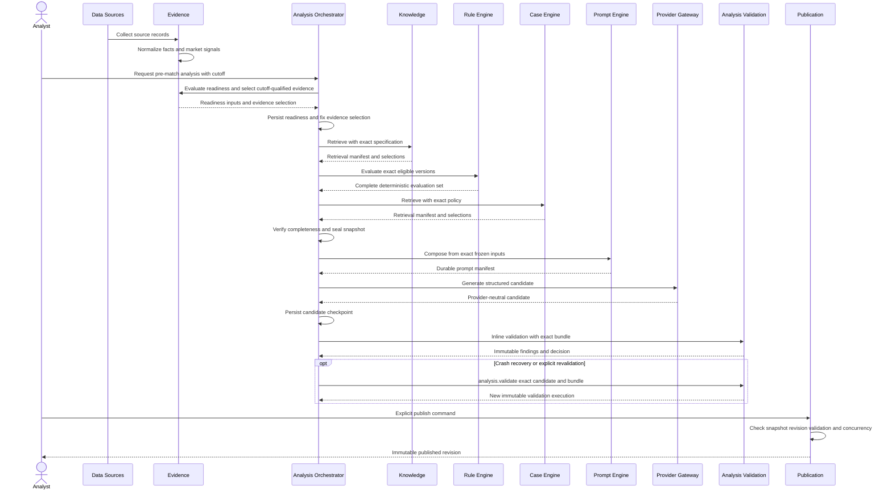
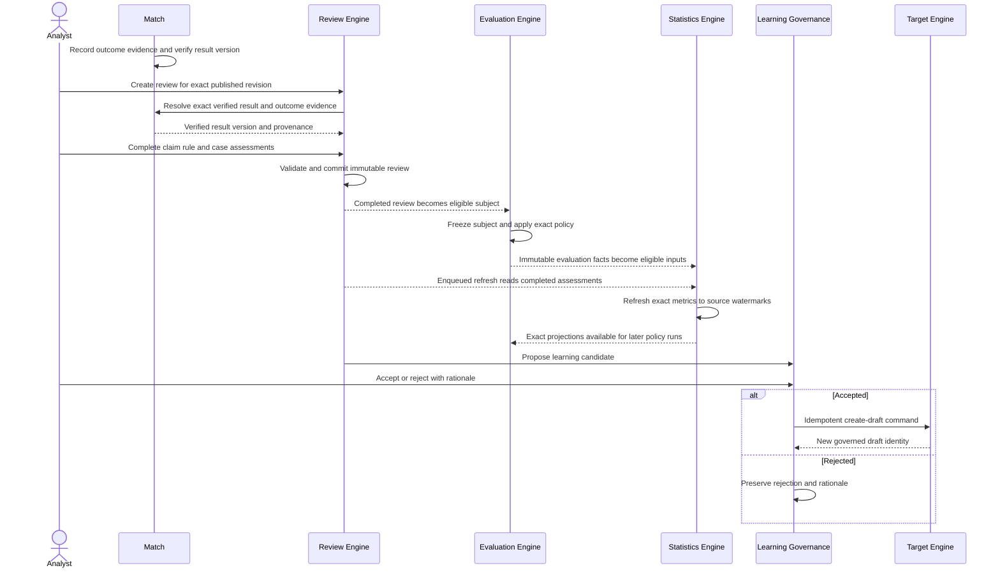

# FAS Analysis Pipeline

## 1. Purpose and Authority

This document defines the end-to-end orchestration contract that connects source acquisition, pre-match analysis, publication, and post-match learning in Football Analysis System (FAS) v1. It explains stage order, ownership, handoffs, temporal boundaries, durable execution, and failure semantics.

The [PROJECT BIBLE](./00_PROJECT_BIBLE.md) remains governing. [03_AI_PRINCIPLES](./03_AI_PRINCIPLES.md) defines AI authority and validation, [04_ARCHITECTURE](./04_ARCHITECTURE.md) defines runtime and dependency direction, and [05_PROMPT_ENGINE](./05_PROMPT_ENGINE.md) through [11_STATISTICS_ENGINE](./11_STATISTICS_ENGINE.md) remain authoritative for engine internals. [12_DATABASE](./12_DATABASE.md) is authoritative for persistence and [13_API](./13_API.md) for transport. This document does not redefine their schemas, endpoints, algorithms, or package internals.

V1 is pre-match and post-match only. The canonical AI pre-match pipeline ends at explicit human publication. An additive `deterministic_report` profile may terminate at a sealed Deterministic report without Prompt/AI generation or publication; that report is not a published Analysis Revision. Review, Evaluation, Statistics, and Knowledge Update begin only after a verified result and eligible post-match records exist. No outcome evidence may enter a pre-match snapshot, prompt, generation, validation, publication decision, or deterministic projection.

## 2. Conceptual Flow and Temporal Boundary

```mermaid
flowchart LR
    Sources[Data Sources]
    Collect[Evidence Collection]
    Normalize[Normalization]
    Knowledge[Knowledge Engine]
    Rules[Rule Engine]
    Cases[Case Engine]
    Prompt[Prompt Engine]
    LLM[LLM Reasoning]
    Publish[Validation and Publication]
    Review[Review Engine]
    Evaluate[Evaluation Engine]
    Statistics[Statistics Engine]
    Update[Knowledge Update]

    Sources --> Collect --> Normalize
    Normalize --> Knowledge --> Rules --> Cases --> Prompt --> LLM --> Publish
    Publish -->|published pre-match revision| Review
    Review -->|completed assessments| Evaluate
    Evaluate -->|immutable quality report| Statistics
    Statistics -->|qualified projections| Update
    Review -->|learning candidates| Update

    Outcome[Verified Outcome Evidence] --> Review

    subgraph PreMatch [Pre-match generation]
        Collect
        Normalize
        Knowledge
        Rules
        Cases
        Prompt
        LLM
        Publish
    end

    subgraph PostMatch [Post-match feedback]
        Review
        Evaluate
        Statistics
        Update
    end
```

The arrows express the required conceptual flow for the canonical AI analysis profile, not permission for one engine to call the next or read its tables. The Analysis Orchestrator coordinates pre-match stages through public contracts and may also execute the additive deterministic report profile defined in §3.5 and §4.13. Post-match application services and durable jobs coordinate Review, Evaluation, Statistics, and governed draft handoff. Dependency direction remains governed by [04_ARCHITECTURE](./04_ARCHITECTURE.md), [14_MONOREPO](./14_MONOREPO.md), and [ADR-001](./decisions/ADR-001-modular-monolith-and-typescript-monorepo.md).

The conceptual Evaluation-before-Statistics order means completed reviews and immutable quality subjects become eligible for policy assessment before downstream population projections are refreshed. Evaluation may require an already-existing exact Statistics projection; in that case it reads that projection through the published reader contract and never computes it. A later Statistics refresh may in turn support a new Evaluation run. Neither direction collapses the ownership boundary defined in [10_EVALUATION_ENGINE](./10_EVALUATION_ENGINE.md) and [11_STATISTICS_ENGINE](./11_STATISTICS_ENGINE.md).

## 3. Pipeline-wide Contracts

### 3.1 Readiness and Cutoff

The Analysis application service owns the final readiness decision under an exact readiness-policy version. Match and Evidence supply immutable match state, normalized evidence quality, freshness, conflicts, and cutoff-qualified inputs; they do not independently authorize generation.

A readiness result records the requested `cutoffAt`, readiness-policy version, input checksum, blocking issues, warnings, permitted acknowledgements, actor rationale, decision, and checksum. Standard v1 pre-match analysis requires `cutoffAt < kickoffAt`.

Readiness is checked before snapshot sealing and rechecked when the analysis and generation job are accepted. Evidence eligibility uses `observedAt` and validity at cutoff, never retrieval time, job start time, current time, or publication time. Provider generation and publication may occur after cutoff but cannot introduce observations made after cutoff. A late-arriving pre-cutoff record does not mutate an existing snapshot; it requires a new explicit analysis or snapshot lineage.

Critical missing, stale, rejected, or materially conflicted evidence blocks readiness unless the pinned policy explicitly permits a reasoned acknowledgement. Acknowledgement does not improve source quality or remove the uncertainty.

### 3.2 Evidence Selects; Analysis Seals

The Evidence module selects cutoff-qualified normalized evidence and returns an immutable selection result with provenance, quality, normalization versions, checksums, and explicit conflict state. It owns evidence eligibility and selection semantics.

The Analysis module owns snapshot lifecycle. It combines the accepted match state, Evidence selection, exact Knowledge and Case retrieval manifests, and exact Rule evaluations into the analysis lineage, verifies completeness, computes the overall manifest checksum, and seals the snapshot. Evidence cannot seal or reseal an analysis snapshot; Analysis cannot manufacture, renormalize, or silently omit evidence.

Once sealed, a snapshot is immutable. Later source records, normalization changes, approvals, retirements, reranking, rule changes, or outcome evidence cannot alter it.

### 3.3 Versioned Manifests and Specifications

Every non-trivial selection or transformation records exact immutable identities rather than mutable aliases:

- readiness-policy version and readiness-result checksum;
- source parser and normalizer versions;
- Knowledge retrieval-specification and implementation versions, normalized query/filter manifest, corpus watermark, ordered selections, ranks, reasons, and excerpt checksums;
- Case retrieval-policy and implementation versions, query checksum, corpus watermark, ordered selections, similarities, material differences, limitations, and checksums;
- exact Rule versions, input-schema and evaluator versions, input checksums, statuses, explanations, and result checksums;
- composition-policy, prompt-section, output-schema, builder, validator-bundle, model-configuration, and provider-adapter versions;
- prompt manifest, rendered-request checksum, provider attempts, accepted candidate checksum, validation-execution identity, and revision checksum;
- post-match result, review-rubric, assessment-definition, evaluator, metric-definition, computation, population, and source-watermark versions.

Historical replay uses stored exact selections and manifests. It does not rerun current retrieval or resolve “latest” to reconstruct history.

### 3.4 Completion Envelopes and Empty Results

Every stage returns a typed status such as `completed_nonempty`, `completed_empty`, `blocked`, or `failed`, plus exact input identity and diagnostics. A missing record, timeout, exception, integrity defect, or partial result is never interpreted as an empty success.

Knowledge or Case retrieval may return a successful empty set only when no eligible artifact matched under the exact specification. Rule processing may return a successful complete zero-rule set only when no active qualified rule version was eligible. Continuation requires the pinned analysis and composition policies to permit that empty result and to preserve the resulting material uncertainty.

No stage may silently degrade by omitting an unavailable engine, broadening retrieval, changing cutoff, selecting another version, switching model, or asking the LLM to fill missing inputs.

### 3.5 Analysis Profiles

| Profile | Coordinated by | Required stages | Terminal artifact | Publication |
|---|---|---|---|---|
| `ai_analysis` | Analysis Orchestrator | Readiness → Evidence selection → Knowledge → Rules → Cases → Seal → Prompt → LLM → Validate → Publish | Validated/published Analysis Revision | Explicit human publish |
| `deterministic_report` | Analysis Orchestrator | Readiness → Evidence selection → Feature derivation → Rules → Deterministic match projection → Deterministic report assembly | Sealed Deterministic report | Not implied; report sealing ≠ publication |

Profiles must be selected explicitly. The deterministic profile must not silently omit required feature/projection stages, invent Evidence, call Prompt/AI, or claim calibrated predictive accuracy. A future combined profile may consume a sealed Deterministic report as Prompt context; AI must not modify sealed deterministic values.

## 4. Stage Contracts

### 4.1 Data Sources

**Why it exists.** Supplies external observations from which FAS can establish match context, market state, and later verified outcomes without treating external provider identity as domain truth.

**Owner.** External source operators and source adapters at the system edge; FAS Operations governs allowed providers, credentials, terms, and acquisition configuration.

**Inputs.** Source schedules, provider credentials held outside domain records, fixture identifiers/aliases, bounded acquisition requests, and correlation metadata.

**Outputs.** Source payloads and source metadata sufficient to create append-only source records, including provider identity, external reference, source observation time when available, retrieval time, parser version, and payload checksum.

**Invariants.**

- Provider identifiers are aliases, not FAS aggregate identity.
- Source payloads are untrusted and never enter prompts directly.
- Observation time and retrieval time remain distinct.
- Pre-match and outcome acquisition are classified separately.
- Secrets and unrestricted payloads do not enter logs or job payloads.

**Failure and empty behavior.** Unavailability, rate limiting, malformed payloads, or licensing restrictions produce explicit acquisition failure or rejected source records. “Provider returned no records” is recorded separately from transport failure. No downstream stage invents missing source data.

### 4.2 Evidence Collection

**Why it exists.** Preserves exactly what a source supplied before interpretation so provenance, timing, duplicates, corrections, and parser behavior remain auditable.

**Owner.** Evidence module for source-record intake; source adapters perform provider mapping at the boundary.

**Inputs.** Untrusted source payload/reference, source identity, external record identity, observation/retrieval times, parser version, checksum, match/subject aliases, and correlation ID.

**Outputs.** Append-only source records with integrity metadata and typed parse outcomes ready for normalization.

**Invariants.**

- Original payload identity and checksum are preserved even when parsing fails.
- Duplicate intake is idempotent by source identity, external identity where present, and payload checksum.
- Corrections and changed payloads create new records or superseding lineage; they do not rewrite prior captures.
- Outcome source records cannot be selected into a pre-match analysis.

**Failure and empty behavior.** Parse failure marks the source record rejected or failed with redacted diagnostics. A successful acquisition with no applicable observations is an explicit empty collection result. Partial parsing cannot masquerade as complete evidence.

### 4.3 Normalization

**Why it exists.** Converts source-specific fields into typed FAS evidence while preserving provenance and separating directly supported facts, time-dependent market signals, and post-match outcome evidence.

**Owner.** Evidence module.

**Inputs.** Exact source records, parser output, canonical Match/Catalog identities, normalizer version, controlled metric/value schemas, and quality/conflict policy.

**Outputs.** Normalized evidence items with type, subject, metric, value, units, `observedAt`, validity, quality state, source reference, normalizer version, and checksum; conflict records and quality summaries.

**Invariants.**

- Normalization adds no analytical inference.
- Fact, market signal, and outcome evidence remain distinct epistemic types.
- Conflicting observations remain visible; resolution records a choice and rationale without deleting alternatives.
- Missing, stale, conflicted, rejected, and superseded states are distinct.
- Normalized evidence retains exact source provenance and temporal meaning.

**Failure and empty behavior.** Unsupported schema, identity ambiguity, invalid values, or checksum mismatch rejects or quarantines the affected item. A valid source record yielding no domain observation is explicit. Required normalization failure prevents readiness; it is not replaced by raw source text.

### 4.4 Knowledge Engine

**Why it exists.** Supplies reusable, governed methodology and football-domain guidance without confusing general knowledge with current-match evidence.

**Owner.** Knowledge Engine; detailed behavior is authoritative in [06_KNOWLEDGE_ENGINE](./06_KNOWLEDGE_ENGINE.md).

**Inputs.** Sealed evidence-selection context, cutoff, normalized scope/tags/query, exact retrieval-specification and implementation versions, corpus watermark, and limits.

**Outputs.** A retrieval manifest and ordered exact Knowledge-version selections with bounded excerpts, ranks, reasons, source quality, effectivity, and checksums.

**Invariants.**

- Production selections are approved, active, effective at cutoff, source-complete, and scope-compatible.
- Ranking, tie-breaking, and excerpting are deterministic under the pinned specification.
- Knowledge never substitutes for a factual citation about the current match.
- Retrieved text remains untrusted prompt context.
- Later governance changes cannot alter a recorded selection.

**Failure and empty behavior.** No eligible match is `completed_empty`. Repository, specification, integrity, or checksum failure is `failed` and stops generation. Continuation after a successful empty result is policy-governed and must expose uncertainty.

### 4.5 Rule Engine

**Why it exists.** Applies governed analytical conditions deterministically so authoritative rule findings are reproducible and never delegated to an LLM.

**Owner.** Rule Engine; detailed governance and evaluator semantics are authoritative in [07_RULE_ENGINE](./07_RULE_ENGINE.md).

**Inputs.** Exact active qualified Rule versions eligible at cutoff, sealed snapshot identity/checksum, exact normalized input values and provenance (including any Analysis-derived feature values exposed by the snapshot input contract), input/condition/outcome schema versions, and evaluator version.

**Outputs.** An immutable complete evaluation set containing `matched`, `not_matched`, `inapplicable`, or `error`, condition-level explanations, exact inputs/checksums, qualification metadata, and findings only for matched rules.

**Invariants.**

- The evaluator has no clock, random, network, filesystem, database query, provider call, or hidden mutable state.
- Identical rule version, inputs, schemas, and evaluator version produce the same semantic result.
- Applicability precedes matching; missing/conflicted data never silently becomes `false`.
- Rule confidence and sample metadata are governed version metadata, not model confidence or Statistics output.
- The LLM may discuss but cannot recalculate, repair, or override an evaluation.

**Failure and empty behavior.** A complete zero-eligible-rule result is successful empty. A valid `inapplicable` result does not fail the stage. Unsupported semantics, snapshot mismatch, evaluator defect, required-rule `error`, or persistence failure fails the stage; partial success is not a complete set.

### 4.6 Case Engine

**Why it exists.** Supplies bounded historical analogies that expose both similarity and difference without treating history as causal evidence for the current outcome.

**Owner.** Case Engine; detailed behavior is authoritative in [08_CASE_ENGINE](./08_CASE_ENGINE.md).

**Inputs.** Immutable cutoff-qualified analysis context, controlled tags/attributes, exact retrieval-policy and implementation versions, corpus watermark, limit, and production mode.

**Outputs.** A retrieval manifest and ordered exact Case-version selections with reasons, supported similarities, material differences, limitations, provenance, and checksums.

**Invariants.**

- Production cases derive from completed matches, completed reviews, and verified outcomes.
- Selected versions are approved, active, effective, in scope, and traceable.
- Historical outcome is context about the case, never evidence about the current match.
- Every selected analogy includes material differences and limitations.
- Ranking and tie-breaking are deterministic under the pinned policy.

**Failure and empty behavior.** No eligible analogy is `completed_empty`. Missing differences exclude a candidate. Retrieval dependency, policy, traceability, or integrity failure is `failed`; generation cannot silently proceed as though no cases existed.

### 4.7 Prompt Engine

**Why it exists.** Converts exact frozen inputs into a deterministic provider-neutral request while separating governed instructions from untrusted context.

**Owner.** Prompt Engine; detailed composition behavior is authoritative in [05_PROMPT_ENGINE](./05_PROMPT_ENGINE.md).

**Inputs.** Sealed snapshot, exact successful Knowledge/Rule/Case envelopes, ordered prompt-section versions, composition-policy version, output-schema version, builder version, model-configuration reference, correlation identity, and size budget.

**Outputs.** One durable prompt manifest, provider-neutral rendered request, exact schema reference, section measurements, checksums, and permitted warnings.

**Invariants.**

- The Prompt Engine performs no retrieval and makes no provider call.
- All mutable aliases are resolved before composition.
- Section order, canonical serialization, escaping, delimiters, and size behavior are deterministic.
- Upstream failure cannot be rendered as an empty section.
- Domain content remains delimited untrusted data and cannot override policy or schema.
- Identical exact inputs and versions produce byte-identical rendered content and checksum.

**Failure and empty behavior.** Missing upstream completion, incompatible version, invalid variable, unsafe serialization, ungoverned truncation, or manifest persistence failure stops before provider invocation. An empty section is rendered only from an explicitly permitted successful empty envelope.

### 4.8 LLM Reasoning

**Why it exists.** Produces a structured draft synthesis that explains interactions, uncertainty, counter-signals, scenarios, and falsifiers while remaining subordinate to frozen evidence and deterministic findings.

**Owner.** Analysis Orchestrator owns the run and calls the provider-neutral gateway; `@fas/ai-provider` owns provider mapping and the OpenAI Responses API adapter under [03_AI_PRINCIPLES](./03_AI_PRINCIPLES.md) and [ADR-003](./decisions/ADR-003-provider-neutral-ai-and-staged-retrieval.md).

**Inputs.** Durable prompt manifest and rendered request, closed output schema, exact governed AI release bundle, model configuration, run/attempt/correlation IDs, timeout, and cancellation policy.

**Outputs.** Provider-neutral structured candidate or typed failure; provider/model and response identities, attempt metadata, usage, latency, finish/refusal status, retryability, and request/response integrity references.

**Invariants.**

- Provider SDK types, credentials, request fields, and raw errors remain inside the adapter.
- Provider output is untrusted candidate data and has no write, lifecycle, publication, rule, retrieval, or Statistics authority.
- The provider cannot access evidence outside the rendered frozen context.
- No unapproved provider/model fallback or mutable model alias is selected after run freeze.
- Each retry is a distinct provider attempt under the same frozen run inputs.

**Failure and empty behavior.** Timeout, rate limit, and classified transient errors receive bounded backoff and jitter. Refusal, truncation, empty response, invalid structured output, or exhausted retries is not a valid empty analysis. Permanent unavailability fails explicitly and requires governed operator/configuration action.

### 4.9 Review Engine

**Why it exists.** Holds the published pre-match artifact accountable after the match without editing history or equating outcome agreement with sound reasoning.

**Owner.** Review Engine; detailed assessment and learning-candidate behavior is authoritative in [09_REVIEW_ENGINE](./09_REVIEW_ENGINE.md).

**Inputs.** Exact published revision and sealed snapshot, fixed claim/rule/case target set, exact verified result version/checksum, outcome evidence for the same match, rubric version, and human reviewer commands.

**Outputs.** Immutable completed claim, rule, and case assessments; review summary; explicit `supported`, `contradicted`, `inconclusive`, or `not_assessable` categories; and optional learning candidates.

**Invariants.**

- Review starts only after both publication and verified outcome evidence exist.
- It never edits, regenerates, reruns, reclassifies, or republishes the pre-match artifact.
- Completion is explicit, human-authorized, complete, and immutable.
- Corrected results create superseding review lineage rather than mutation.
- Learning candidates are proposals, not governed truth.

**Failure and empty behavior.** Missing publication, result, outcome provenance, required target, rationale, or cross-match integrity blocks creation or completion. `not_assessable` is a valid explicit assessment, not an omitted target. Completion transaction failure commits neither completion nor its downstream Statistics job.

### 4.10 Evaluation Engine

**Why it exists.** Applies exact quality, qualification, rubric, and gate policy to immutable subjects or corpora and records reproducible methodology/release assessments.

**Owner.** Evaluation Engine; detailed behavior is authoritative in [10_EVALUATION_ENGINE](./10_EVALUATION_ENGINE.md).

**Inputs.** Exact assessment-definition version, frozen subject/corpus manifest, completed reviews where required, immutable analysis and engine artifacts, evaluator versions, exact baseline report, and exact qualified or unqualified Statistics projections when policy requires them.

**Outputs.** Immutable criterion results, qualification status, `passed`, `failed`, or `not_qualified` gate decision, waivers, baseline comparison, report checksum, and advisory recommendations.

**Invariants.**

- Evaluation does not conduct per-match Review or compute Statistics projections.
- No run resolves mutable “latest” after its manifest is frozen.
- Blocking failed, errored, or unassessable criteria cannot silently pass.
- An unqualified Statistics projection cannot satisfy a qualified gate.
- Recommendations cannot mutate or activate an assessed artifact.

**Failure and empty behavior.** Missing required review/label/projection produces failure or `not_qualified` according to the exact definition. Contamination or cutoff violation is blocking. An evaluator error is recorded and cannot be converted to a skipped success.

### 4.11 Statistics Engine

**Why it exists.** Computes deterministic, rebuildable population metrics and uncertainty from immutable post-match and operational records without making quality or causal decisions.

**Owner.** Statistics Engine; detailed behavior is authoritative in [11_STATISTICS_ENGINE](./11_STATISTICS_ENGINE.md).

**Inputs.** Exact metric-definition and computation versions, completed reviews, immutable analyses/rule evaluations/cases/knowledge/evidence/operations records, population specification, dimensions, and consistent source watermarks.

**Outputs.** Versioned projections with numerator/denominator where meaningful, value/unit, sample/minimum sample, completeness, qualification, uncertainty method/interval, population/exclusion manifest, source watermarks, lineage, and checksum.

**Invariants.**

- Source records are read-only and projections are rebuildable.
- `computedAt` is not a source watermark.
- Equivalent exact inputs and versions produce equivalent projections.
- Incompatible prompt, model, rule, case, knowledge, evaluator, rubric, or schema versions are not silently pooled.
- `qualified` means only metric sample/completeness qualification; it is not approval or a release decision.
- Statistics makes no causal claim and no lifecycle mutation.

**Failure and empty behavior.** Empty or incomplete populations follow the exact metric's missing/zero-denominator policy and are normally unqualified, never fabricated. Watermark inconsistency, schema mismatch, invalid interval, or formula failure prevents a qualified projection. A failed refresh does not undo a completed Review.

### 4.12 Knowledge Update

**Why it exists.** Converts evidenced post-match learning into a governed proposal and, only after explicit human disposition, a draft for normal owner review.

**Owner.** Review Engine owns learning-candidate proposal and disposition. The targeted Knowledge, Rule, Case, Prompt/methodology owner owns creation and governance of any resulting draft.

**Inputs.** Completed review, exact assessments and outcome evidence, optional Evaluation report and qualified Statistics projections, learning-candidate schema version, target type, proposal, evidence summary, and human acceptance rationale.

**Outputs.** A proposed/accepted/rejected learning candidate and, after accepted idempotent handoff, at most one new governed draft identity linked to its provenance.

**Invariants.**

- No AI output, Review, Evaluation report, Statistics projection, or candidate auto-activates learning.
- Acceptance means “create a draft candidate for governance,” never “approve” or “activate.”
- Existing approved or active versions are never edited in place.
- Drafts follow the target engine's normal sourcing, validation, qualification, approval, activation, audit, and rollback requirements.
- Hindsight remains labeled post-match and cannot be inserted into historical pre-match inputs.

**Failure and empty behavior.** A review may validly produce no learning candidate. Rejected candidates remain auditable. Failed target handoff leaves an accepted candidate visible and retryable; it must not imply that a draft, approved version, or active version exists.

### 4.13 Deterministic Report Profile Stages

These stages apply when the Analysis Orchestrator executes the additive `deterministic_report` profile. They do not replace §4.4–§4.8 for the AI profile and do not authorize an eighth governed engine.

#### Feature derivation

**Why it exists.** Converts cutoff-qualified Evidence into versioned analysis features used as Rule inputs and projection inputs.

**Owner.** Analysis; supporting package `@fas/feature` may implement pure derivation.

**Inputs.** Match identity, cutoff-qualified Evidence selection (at minimum the profile-required types), feature-model version, and correlation identity.

**Outputs.** FeatureBundle with values, explanations, evidence references, model version, checksum, and stage status.

**Invariants.**

- Features are deterministic for identical Evidence selection and feature-model version.
- Derivation invents no missing Evidence and performs no AI call.
- Feature values entering Rule evaluation are exposed only through the declared snapshot input contract.

**Failure and empty behavior.** Missing required Evidence for the selected profile blocks or degrades according to the pinned profile policy; silent empty success is forbidden. For the first vertical slice, missing required `TEAM_FORM`/`STATISTICS` blocks projection even if some features can be partially derived.

#### Deterministic match projection

**Why it exists.** Produces a per-match outcome distribution and recommendation from pinned features and Rule findings under explicit projection-model versions.

**Owner.** Analysis; pure projection modules live under `@fas/analysis` ownership.

**Inputs.** FeatureBundle checksum/identity, complete Rule evaluation envelope for the profile, projection/xg/probability/confidence/recommendation policy versions, and optional exact approved calibration artifact reference when policy permits.

**Outputs.** DeterministicMatchProjection containing λ/xG, 1X2, top scorelines, goal ranges, confidence components, recommendation, limitations, upstream refs, checksum, and stage status.

**Invariants.**

- Projection is not a Statistics Engine population metric and does not train or refresh calibration maps during the run.
- Rule Engine findings may influence bounded channel adjustments only through the pinned projection policy; Rules do not compute the probability matrix.
- Identical pinned inputs and versions yield identical checksums.
- Presentation layers must not recompute these values.

**Failure and empty behavior.** Missing required upstream envelopes, non-finite math, or policy/version defects yield `blocked` or `failed`. The profile must not seal a success report when projection is blocked.

#### Deterministic report assembly

**Why it exists.** Assembles sealed upstream artifacts into a reviewable Deterministic report DTO.

**Owner.** Analysis; supporting package `@fas/report` may assemble without owning projection math.

**Inputs.** FeatureBundle, Rule evaluation set, DeterministicMatchProjection, assembler/schema versions, and correlation identity.

**Outputs.** Deterministic report with overview/features/rules/projection/confidence/recommendation/appendix sections, content checksum, and stage status.

**Invariants.**

- Assembly copies and orders; it does not recalculate λ, probabilities, scorelines, confidence, or recommendation.
- Report sealing is not Analysis Revision publication and does not start Review by itself.
- No Prompt/LLM prose is required or generated by this stage.

**Failure and empty behavior.** Upstream blocked/failed states block assembly. Assembly defects fail explicitly without fabricating projection fields.

## 5. Validation and Publication Boundary

Validation is part of generation orchestration, but publication is a separate explicit human command. A provider candidate is never a published analysis.

The Analysis validation use case has two invocation modes:

1. **Inline initial validation.** `analysis.generate` persists the immutable provider candidate, checkpoints it, and invokes the exact validator bundle before the run can become valid or the analysis can become validated.
2. **Durable explicit revalidation.** `analysis.validate` applies the same use case to an exact immutable candidate/revision, sealed snapshot, prompt manifest, and validator bundle for crash recovery, operator-requested revalidation, or comparison under a newly governed bundle.

Both modes create immutable validation-execution identities and append-only findings. Identical subject-and-validator-bundle requests are idempotent. Revalidation never edits candidate content, replaces historical findings, changes the provider run's release-bundle attribution, or publishes by itself.

Blocking validation covers:

- exact closed-schema parsing and compatibility;
- unique claim keys and valid epistemic types;
- required sections and type-specific fields;
- citation existence, type compatibility, semantic support, and cutoff validity;
- fidelity to deterministic Rule evaluations;
- Case analogy differences and limitations;
- confidence, rationale, uncertainty, counter-signals, and falsifiers where required;
- contradiction with frozen facts or within the candidate;
- prohibited authority, live-analysis, guarantee, wagering, injection, leakage, and unsupported external-source behavior;
- snapshot, manifest, candidate, revision, and validation checksums.

Publication requires a sealed snapshot, immutable valid revision, exact successful validation execution accepted by publication policy, no unresolved blocker, optimistic concurrency, expected checksum, and explicit human rationale. Publication and its audit event are atomic. A duplicate command returns the prior idempotent result; a conflicting command fails. Publication is the terminal stage of the canonical AI pre-match generation profile.

For the additive `deterministic_report` profile, sealing a Deterministic report is the terminal stage. That seal does not publish an Analysis Revision, does not satisfy AI validation/publication gates, and must not be presented as a published analysis.

## 6. Durable Execution, Checkpoints, Retries, and Idempotency

PostgreSQL durable jobs are the v1 execution mechanism under [ADR-002](./decisions/ADR-002-postgresql-durable-jobs-for-v1.md). Job payloads contain immutable references, versions, checksums, and correlation IDs rather than large documents or secrets.

Required safe checkpoints for generation are:

1. readiness result persisted;
2. Evidence selection persisted;
3. snapshot identity created and evidence portion fixed;
4. Knowledge retrieval manifest persisted;
5. complete Rule evaluation set persisted;
6. Case retrieval manifest persisted;
7. snapshot manifest verified and sealed;
8. prompt manifest persisted;
9. provider attempt persisted;
10. immutable candidate persisted;
11. validation execution and findings persisted;
12. immutable revision persisted and marked eligible for human publication.

A stage checkpoint is usable only when its exact input identity and output checksum match the resumed job. Changed cutoff, snapshot, retrieval specification, rule/evaluator version, prompt/schema/builder, model configuration, provider adapter, or validator bundle requires a new auditable lineage rather than silent resume.

Workers claim jobs with leases, renew heartbeats, and allow recovery after lease expiry. Retries are bounded and classified:

- transient persistence, storage, source, or provider failures retry with bounded backoff;
- deterministic contract, governance, integrity, readiness, schema, or validation failures require corrected inputs or a new governed version;
- provider retries create attempts under the same run;
- analysis retries do not silently reseal the snapshot or switch the AI release bundle;
- post-match refresh/rebuild retries retain exact result/review/definition/metric/watermark identities.

Business commands use scoped idempotency keys and request checksums. Same key and same checksum returns the prior result; same key with different content conflicts. Unique semantic identities prevent duplicate Rule evaluations, prompt manifests, validation executions, publication, completed review, learning handoff, evaluation reports, and metric projections.

External source and provider calls never occur inside database transactions. Atomic boundaries include analysis-plus-job creation, publication-plus-audit, Review completion-plus-Statistics job enqueue, and projection/report completion-plus-event publication where defined by their owning contracts.

## 7. Pre-match Sequence

The sequence ends at publish. No Review, Evaluation, Statistics, or Knowledge Update operation is part of pre-match generation.

## 8. Post-match Sequence

The post-match sequence begins only after a verified outcome exists. Evaluation and Statistics may run in multiple governed cycles as new exact projections or assessment definitions become available. Those cycles never rewrite the published analysis or completed review.

## 9. Operational and Security Rules

- Correlation propagates across source intake, jobs, analysis runs, provider attempts, validation, publication, review, evaluation, statistics, and learning handoff.
- Logs contain identifiers, versions, checksums, statuses, counts, timings, watermarks, and redacted diagnostics; they exclude secrets, full source payloads, full prompts, and full provider responses by default.
- Every external and AI-produced document is parsed from `unknown` and validated at its boundary.
- Retrieved text remains untrusted even after human approval; it has no instruction authority.
- Runtime roles use least privilege and cannot update append-only source, governed-version, assessment, publication, or audit history.
- V1 remains restricted to a trusted private environment. This pipeline does not authorize public access, users, live analysis, wagering, Redis/BullMQ, pgvector, or autonomous learning.

## 10. Acceptance Criteria

The pipeline architecture is satisfied when:

1. every AI-profile pre-match run records one cutoff, readiness-policy version, sealed snapshot, exact retrieval/evaluation manifests, prompt manifest, AI release bundle, provider attempts, validation executions, and immutable revision lineage;
2. Evidence owns cutoff-qualified selection while Analysis alone owns final snapshot completeness and sealing;
3. evidence observed after cutoff and all outcome evidence are excluded from pre-match generation and deterministic projection;
4. successful empty results are explicit and policy-governed, while failure, partial execution, and unavailability stop generation;
5. identical Rule inputs and versions yield identical authoritative evaluations without LLM participation;
6. provider output cannot publish without inline or explicit exact validation, all blocking gates, and a human publication command;
7. crash recovery resumes only from checksum-valid durable checkpoints and cannot duplicate provider acceptance, validation, publication, review completion, or learning handoff;
8. Review, Evaluation, Statistics, and Knowledge Update execute only as post-match feedback after verified outcome prerequisites;
9. no post-match operation mutates the pre-match snapshot, run, revision, claim, Rule evaluation, Case selection, or prompt manifest;
10. Knowledge Update creates at most a governed draft after explicit acceptance and never auto-approves or auto-activates it;
11. the additive `deterministic_report` profile, when selected, records exact FeatureBundle, Rule evaluation, DeterministicMatchProjection, and Deterministic report identities/checksums, terminates without Prompt/AI when complete, and never equates report sealing with publication;
12. Web/API presentation never recomputes FeatureBundle or projection fields.

## 11. Related Documents and Decisions

- [03_AI_PRINCIPLES](./03_AI_PRINCIPLES.md) — AI authority, structured output, validation, provider behavior, and evaluation principles.
- [04_ARCHITECTURE](./04_ARCHITECTURE.md) — runtime topology, Analysis Orchestrator, jobs, consistency, and failure handling.
- [05_PROMPT_ENGINE](./05_PROMPT_ENGINE.md) — deterministic composition and prompt manifests.
- [06_KNOWLEDGE_ENGINE](./06_KNOWLEDGE_ENGINE.md) — governed Knowledge retrieval and empty-result semantics.
- [07_RULE_ENGINE](./07_RULE_ENGINE.md) — rule governance and deterministic per-snapshot evaluation.
- [08_CASE_ENGINE](./08_CASE_ENGINE.md) — reviewed Case retrieval, similarities, differences, and traceability.
- [09_REVIEW_ENGINE](./09_REVIEW_ENGINE.md) — post-match assessment and learning candidates.
- [10_EVALUATION_ENGINE](./10_EVALUATION_ENGINE.md) — assessment policy, qualification, gates, and reports.
- [11_STATISTICS_ENGINE](./11_STATISTICS_ENGINE.md) — deterministic metrics, uncertainty, qualification, and watermarks.
- [12_DATABASE](./12_DATABASE.md) — authoritative persistence and integrity contracts.
- [13_API](./13_API.md) — authoritative HTTP, job, validation, publication, review, evaluation, and statistics contracts.
- [ADR-001](./decisions/ADR-001-modular-monolith-and-typescript-monorepo.md) — modular monolith and package boundaries.
- [ADR-002](./decisions/ADR-002-postgresql-durable-jobs-for-v1.md) — durable PostgreSQL jobs, leases, retries, and recovery.
- [ADR-003](./decisions/ADR-003-provider-neutral-ai-and-staged-retrieval.md) — provider-neutral generation and staged retrieval.
