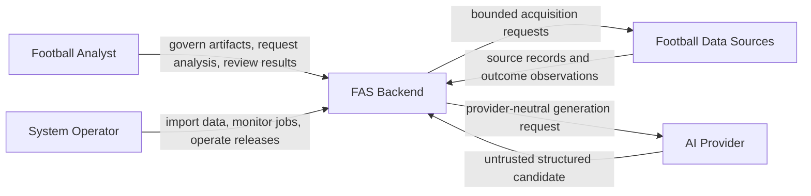
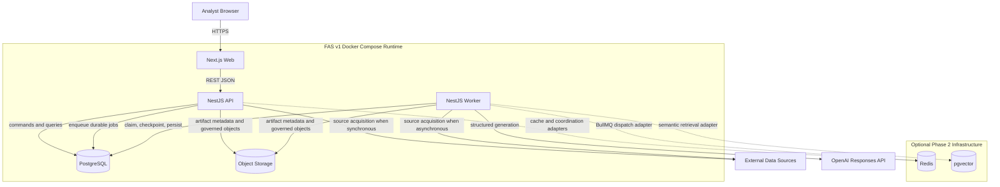
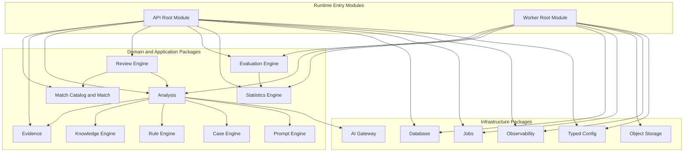
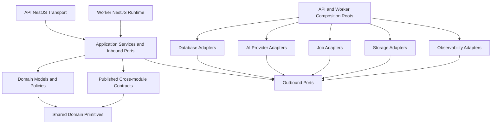

# FAS Backend Architecture

## 1. Purpose and Authority

This document defines the implementation-facing backend architecture for Football Analysis System (FAS) v1. It refines the modular-monolith decision in [04_ARCHITECTURE](./04_ARCHITECTURE.md), the package boundaries in [14_MONOREPO](./14_MONOREPO.md), and the orchestration contract in [17_ANALYSIS_PIPELINE](./17_ANALYSIS_PIPELINE.md) for a NestJS API and a separate NestJS worker.

The [PROJECT BIBLE](./00_PROJECT_BIBLE.md) remains governing. [02_DOMAIN_MODEL](./02_DOMAIN_MODEL.md) is authoritative for bounded contexts, aggregate semantics, and domain invariants. Documents [05_PROMPT_ENGINE](./05_PROMPT_ENGINE.md) through [11_STATISTICS_ENGINE](./11_STATISTICS_ENGINE.md) are authoritative for engine behavior. [12_DATABASE](./12_DATABASE.md) and [13_API](./13_API.md) remain authoritative for persistence and HTTP contracts. This document defines backend layering, dependency direction, module composition, public ports, infrastructure ownership, and criteria for later extraction; it does not redefine those detailed contracts.

The accepted architectural basis is:

- [ADR-001](./decisions/ADR-001-modular-monolith-and-typescript-monorepo.md): modular monolith and TypeScript monorepo;
- [ADR-002](./decisions/ADR-002-postgresql-durable-jobs-for-v1.md): PostgreSQL durable jobs for v1;
- [ADR-003](./decisions/ADR-003-provider-neutral-ai-and-staged-retrieval.md): provider-neutral AI and staged retrieval.

V1 is a module-first modular monolith. The backend is designed so a justified module can be extracted later, but it does not introduce network boundaries, independent service deployment, distributed transactions, Redis, BullMQ, or pgvector before measured need.

## 2. Architectural Style

The backend combines:

- **module-first organization:** business capabilities and ownership are the primary structure;
- **DDD-friendly boundaries:** each bounded context owns its language, invariants, aggregates, use cases, and public contracts;
- **ports and adapters:** application/domain code declares required capabilities and infrastructure implements them;
- **two composition roots:** the API and worker select and wire adapters for their distinct runtimes;
- **one system of record:** PostgreSQL provides v1 durability and transactional consistency;
- **framework isolation:** NestJS is a runtime composition technology, not the domain model;
- **incremental extraction readiness:** stable public ports, no cross-module table coupling, and explicit ownership reduce later migration cost.

NestJS modules mirror deployable runtime capabilities and bounded modules, but NestJS decorators, providers, modules, exceptions, pipes, and request types remain in `apps/api`, `apps/worker`, or framework-specific adapter code. A package is not considered a domain module merely because it has a NestJS `Module` class.

## 3. System Context

FAS trusts neither source payloads nor AI output. V1 is private-network only because it has no user, authentication, or authorization system. The security implications and public-deployment prerequisites remain governed by [04_ARCHITECTURE](./04_ARCHITECTURE.md), [13_API](./13_API.md), and [15_DEVELOPMENT_GUIDE](./15_DEVELOPMENT_GUIDE.md).

## 4. Runtime Containers

The API handles bounded request/response work and commits commands that request asynchronous execution. The worker performs durable analysis, validation, evaluation, statistics, cleanup, and other long-running handlers. Both reuse the same framework-neutral application packages; neither calls the other over HTTP.

## 5. Application Layers

### 5.1 Transport and Runtime Layer

Located in `apps/api` and `apps/worker`.

Responsibilities:

- NestJS bootstrapping and lifecycle;
- HTTP controllers, request validation, serialization, OpenAPI, and transport error mapping in the API;
- durable job polling, claiming, handler dispatch, heartbeats, shutdown, and process health in the worker;
- request/job correlation propagation;
- runtime guards for private deployment;
- composition of application operations and infrastructure adapters.

Transport code invokes one application command or query per endpoint/handler where practical. It contains no reusable domain policy and never exposes Prisma or provider SDK objects.

### 5.2 Application Layer

Located in each owning `@fas/*` domain or engine package.

Responsibilities:

- commands, queries, and use cases;
- orchestration within an owned capability;
- transaction demarcation through a port;
- authorization hooks for future identity support without embedding a v1 user model;
- idempotency intent and concurrency preconditions;
- public inbound ports and outbound port declarations;
- mapping domain results to framework-neutral application results;
- emitting domain events only after successful state change.

The application layer may coordinate aggregates and invoke another module's published port. It does not import another module's repository, Prisma delegate, NestJS provider, controller DTO, or infrastructure adapter.

The Analysis Orchestrator belongs to the `@fas/analysis` application layer. It coordinates the pre-match workflow in [17_ANALYSIS_PIPELINE](./17_ANALYSIS_PIPELINE.md); it is not a new engine and engines do not depend on it.

### 5.3 Domain Layer

Located under the owning package's `domain` area and in the deliberately small `@fas/domain` foundation.

Responsibilities:

- aggregates, entities, value objects, policies, domain services, and domain events;
- lifecycle and consistency invariants;
- framework-neutral errors and result types;
- deterministic logic such as rule evaluation, eligibility decisions, qualification policy, validation policy, and metric formulas where assigned by the owning engine.

Domain code is pure TypeScript. It receives clocks, identifiers, checksums, data, and external capabilities through arguments or declared ports. It does not read environment variables or use process-global runtime state.

### 5.4 Ports

Ports are narrow TypeScript contracts owned by the module that needs or provides the behavior:

- **inbound ports** are stable commands, queries, or use cases offered to controllers, job handlers, or other modules;
- **outbound ports** describe persistence, external calls, storage, telemetry, clocks, and published reads required by an application use case;
- **published cross-module ports** expose only the minimum immutable references, values, and operations another owner needs.

Ports do not expose NestJS tokens, Prisma records, OpenAI objects, Redis clients, HTTP requests, or telemetry SDK types. Runtime token binding is an adapter/composition concern.

### 5.5 Infrastructure Layer

Infrastructure packages implement outward-facing concerns:

- `@fas/database` implements persistence, transactions, migrations, PostgreSQL retrieval, and durable state adapters;
- `@fas/ai-provider` implements the AI Gateway and provider adapters;
- `@fas/jobs` owns durable job contracts and execution policy while using database-owned persistence adapters;
- `@fas/object-storage` implements governed artifact storage;
- `@fas/observability` implements structured logs, traces, metrics, correlation, and redaction;
- `@fas/config` validates and exposes typed configuration.

Infrastructure depends inward on public ports and contracts. Domain/application packages never depend outward on infrastructure implementations.

## 6. Backend Module Map and Ownership

### 6.1 Domain and Engine Modules

| Package | Bounded context or capability | Owns | Principal public consumers |
|---|---|---|---|
| `@fas/match` | Match Catalog and Match | Catalog identities; fixture lifecycle; participants; result-version references | Evidence, Analysis, Review, API |
| `@fas/evidence` | Evidence | Source records; normalization; provenance; quality; conflicts; cutoff-qualified selection | Match, Analysis, Rule input resolution, Review |
| `@fas/analysis` | Analysis | Readiness decision; workflow; snapshots; runs; revisions; claims; validation; publication | API, worker, Review, Evaluation, Statistics |
| `@fas/prompt-engine` | Prompt | Governed prompt versions; deterministic composition; manifests | Analysis |
| `@fas/knowledge-engine` | Knowledge | Knowledge governance and deterministic retrieval | Analysis, Review draft handoff, Evaluation |
| `@fas/rule-engine` | Rule | Rule governance; deterministic per-snapshot evaluation and findings | Analysis, Review, Statistics, Evaluation |
| `@fas/case-engine` | Case | Case governance; reviewed-case retrieval and comparison | Analysis, Review, Evaluation |
| `@fas/review-engine` | Review | Post-match assessments; immutable completion; learning candidates | API, Case, Statistics, Evaluation |
| `@fas/evaluation-engine` | Evaluation | Assessment definitions; criteria; qualification/gates; reports | API, worker, release governance |
| `@fas/statistics-engine` | Statistics | Metric definitions; populations; watermarks; deterministic projections | API, worker, Evaluation |

### 6.2 Match Catalog and Match

Match Catalog and Match are separate bounded contexts:

- **Match Catalog** owns competitions, seasons, teams, canonical identities, and external aliases;
- **Match** owns fixtures, participants in a fixture, kickoff/status transitions, and verified result-version identity.

They intentionally share the `@fas/match` package in v1 because they have the same initial owner, release cadence, small implementation footprint, and high local cohesion. The package must preserve the distinction through separate domain/application namespaces, separate public ports, separate repository interfaces, and explicit mapping from catalog references to Match values. A Match aggregate must not mutate Catalog aggregates as an incidental side effect.

This is packaging co-location, not bounded-context collapse. The contexts may be split into separate packages before either becomes a service if ownership, dependency pressure, or change cadence diverges.

### 6.3 Evidence and Analysis Snapshot Ownership

The boundary is explicit:

1. Evidence owns source intake, normalization, quality, conflicts, temporal eligibility, and selection of cutoff-qualified evidence records.
2. Evidence returns a complete immutable selection result with provenance, quality state, versions, conflicts, and checksums.
3. Analysis owns readiness policy application, snapshot assembly, completeness verification, manifest checksum, and the final seal.
4. Knowledge and Case selections plus Rule evaluations are added through their published results under Analysis orchestration.
5. Only Analysis may seal or reseal an analysis snapshot; in v1, a sealed snapshot is never resealed.

Evidence cannot publish a complete analysis snapshot. Analysis cannot manufacture, renormalize, silently filter, or reinterpret Evidence records. The detailed stage order and checkpoints are authoritative in [17_ANALYSIS_PIPELINE](./17_ANALYSIS_PIPELINE.md).

### 6.4 Review, Evaluation, and Statistics

These remain separate bounded capabilities and packages:

- **Review** performs the human-governed post-match assessment of an exact published revision against an exact verified result.
- **Evaluation** applies versioned quality policy, rubrics, qualification requirements, and gates to immutable subjects or corpora.
- **Statistics** computes deterministic, versioned population projections, sample qualification, uncertainty, and source watermarks.

Review does not compute aggregate metrics. Evaluation does not conduct the per-match review or recompute Statistics. Statistics does not make quality, release, or approval decisions. Their authoritative contracts are [09_REVIEW_ENGINE](./09_REVIEW_ENGINE.md), [10_EVALUATION_ENGINE](./10_EVALUATION_ENGINE.md), and [11_STATISTICS_ENGINE](./11_STATISTICS_ENGINE.md).

## 7. Module Architecture

Arrows represent use of public ports, not permission to deep-import implementations or read another module's tables.

## 8. Public Ports and Cross-module Collaboration

The names below describe stable capability boundaries, not mandatory class names. Detailed input/output fields remain in the owning documents.

| Owner | Representative inbound/public ports | Representative outbound requirements |
|---|---|---|
| Match Catalog | catalog commands; catalog reference queries; alias resolution | catalog repository; audit; clock; transaction |
| Match | match commands/queries; match-state reader; verified-result reader | match repository; Catalog reference reader; outcome-evidence verifier; audit; transaction |
| Evidence | source intake; normalization; evidence query; readiness inputs; `SelectEligibleEvidence` | evidence repositories; source acquisition/storage; Match reference reader; audit; transaction |
| Analysis | `RequestAnalysis`; `RunAnalysis`; `ValidateAnalysis`; `PublishAnalysis`; immutable analysis source readers | Match state; Evidence selection; engine ports; AI Gateway; repositories; jobs; storage; transaction |
| Prompt | governance commands; `ComposePrompt`; compatibility validation | prompt repositories; schema registry; checksum; optional artifact storage |
| Knowledge | governance commands; `RetrieveKnowledge`; draft handoff | knowledge repositories; full-text retrieval; source verification; transaction |
| Rule | governance commands; eligible-version selection; `EvaluateRules`; preview | rule repositories; immutable evaluation store; snapshot input resolver |
| Case | governance commands; `RetrieveCases`; preview; draft handoff | case repositories; completed Review/Match/Analysis reference readers; full-text retrieval |
| Review | review commands/queries; `CompleteReview`; candidate disposition | published Analysis reader; verified Result reader; Rule/Case reference readers; target draft commands; jobs; transaction |
| Evaluation | definition commands; `RunEvaluation`; report queries | immutable source readers; `StatisticsProjectionReader`; repositories; jobs |
| Statistics | metric commands; refresh/rebuild; projection queries | immutable source readers; watermark readers; repositories; jobs |
| Operations | enqueue; claim; heartbeat; complete; fail; retry; cancel | job store; transaction; clock; observability |

Cross-module rules:

1. Queries return published domain/application contracts, not persistence records.
2. Cross-module writes invoke the owner's command port.
3. Immutable exact-version references are preferred over copied mutable state.
4. A consumer cannot join or query another module's tables as an integration API.
5. Events signal committed facts and asynchronous work; they do not bypass an owner's command invariants.
6. Public package exports are intentionally small and compatibility-reviewed; deep imports are forbidden.

## 9. Dependency Rules

Mandatory enforcement:

1. Domain and engine-domain code imports no NestJS, Next.js, Prisma, OpenAI, Redis, HTTP, or telemetry SDK.
2. `@fas/database` is the sole owner of the Prisma schema, generated Prisma client, migrations, Prisma imports, persistence mappers, and Prisma-backed transaction implementation.
3. No Prisma-generated type or delegate is re-exported from `@fas/database`.
4. `@fas/ai-provider` is the sole owner of AI-provider SDK imports, provider request/response mapping, provider-specific errors, and credentials usage.
5. Provider SDK types never cross the AI Gateway boundary.
6. `@fas/jobs` owns job semantics and handler contracts but accesses durable PostgreSQL state only through database-owned adapters; it does not import Prisma.
7. Domain/application modules do not import `@fas/database`, Redis clients, or concrete AI-provider, observability, or storage adapters. `@fas/analysis` may depend only on the framework- and SDK-neutral public AI Gateway contract exported by `@fas/ai-provider`, as assigned by [14_MONOREPO](./14_MONOREPO.md).
8. Engine packages may use another module only through a published contract and may not import another engine's internals or persistence adapter.
9. Circular package dependencies and deep imports are prohibited.
10. CI enforces dependency allowlists, forbidden imports, public export maps, and architecture tests as required by [14_MONOREPO](./14_MONOREPO.md) and [15_DEVELOPMENT_GUIDE](./15_DEVELOPMENT_GUIDE.md).

## 10. Database Layer

`@fas/database` is a physically centralized infrastructure package with logically separated module ownership.

It owns:

- the complete Prisma schema and generated client;
- forward-only migration history and reviewed SQL additions;
- repository and published-read adapters;
- persistence mappers between Prisma records and module contracts;
- the transaction runner and unit-of-work implementation;
- PostgreSQL full-text retrieval adapters;
- job-store persistence;
- database readiness and migration compatibility checks;
- database test harnesses.

It does not own domain policy. Logical schema areas, aggregate boundaries, constraints, indexes, retention, and recovery remain authoritative in [12_DATABASE](./12_DATABASE.md).

Database adapter organization must preserve owner names even if one PostgreSQL schema is initially used. Each adapter implements a port declared by an owning module. Cross-module foreign keys are reviewed integrity mechanisms, not permission for cross-module repository access.

Raw SQL is permitted only inside `@fas/database`, parameterized and covered by integration tests. It is required where Prisma cannot express constraints, locking, full-text behavior, or efficient bounded queries. Prisma transactions do not escape as application contracts; application use cases request a framework-neutral transaction scope.

## 11. PostgreSQL Durable Queue

V1 follows [ADR-002](./decisions/ADR-002-postgresql-durable-jobs-for-v1.md):

- the API atomically records the requesting business change and job row where required;
- workers claim runnable jobs using `FOR UPDATE SKIP LOCKED`;
- leases, heartbeats, bounded attempts, availability time, priority, idempotency, checkpoints, and redacted failures are durable;
- expired leases permit safe recovery;
- job payloads contain schema-versioned immutable references and checksums, not secrets or large documents;
- handlers are idempotent at both job and business-command boundaries;
- PostgreSQL remains the audit authority even if dispatch changes later.

Ownership is split deliberately:

- `@fas/jobs` owns job types, execution policy, handler registration contracts, retry classification, and lease/heartbeat semantics;
- `@fas/database` owns the Prisma/PostgreSQL implementation of job persistence, claim queries, and transactional enqueue;
- `apps/worker` owns polling, concurrency limits, graceful shutdown, handler composition, and runtime health;
- the domain module that requests work owns the business command, semantic idempotency, and result meaning.

An application handler may hold a short transaction while claiming or checkpointing a job. It must not hold a transaction during provider, source, or object-storage network calls.

## 12. AI Gateway and External Providers

### 12.1 AI Gateway

The AI Gateway is the provider-neutral application boundary used by `@fas/analysis`. Its contract and safety rules follow [03_AI_PRINCIPLES](./03_AI_PRINCIPLES.md), [05_PROMPT_ENGINE](./05_PROMPT_ENGINE.md), [17_ANALYSIS_PIPELINE](./17_ANALYSIS_PIPELINE.md), and [ADR-003](./decisions/ADR-003-provider-neutral-ai-and-staged-retrieval.md).

The gateway:

- accepts a durable prompt manifest, provider-neutral rendered request, exact output schema, governed model configuration, correlation/run/attempt identities, timeout, and cancellation;
- returns a provider-neutral candidate or typed failure with safe usage, finish, refusal, latency, retryability, and integrity metadata;
- has no domain write, lifecycle, rule, retrieval, validation, or publication authority;
- treats provider output as `unknown` until mapped and validated;
- records each provider retry as a distinct attempt under frozen run inputs.

`@fas/ai-provider` owns a deliberately split public surface: a framework- and SDK-neutral AI Gateway contract plus infrastructure-only implementations. It contains the gateway implementation, OpenAI Responses API adapter, all AI-provider SDK imports, provider-specific request/response and error mapping, redaction, and test fakes. `@fas/analysis` may import only the neutral contract export. OpenAI fields, SDK objects, credentials, raw errors, and provider-specific retry details do not escape the package.

The Prompt Engine does not call the gateway. Analysis composes via Prompt, then invokes the gateway, persists the immutable candidate, and invokes Analysis validation.

### 12.2 Football Data Providers

External football sources are separate from the AI Gateway. Source acquisition adapters operate at the system edge and hand append-only source captures to Evidence. They:

- map provider aliases to FAS references without making provider identity a domain identity;
- preserve observation and retrieval times, parser version, payload checksum, and provenance;
- classify pre-match and outcome acquisition separately;
- return typed acquisition/parse failures rather than partial domain truth;
- never pass raw payloads directly into prompts;
- obtain credentials only from typed server configuration.

Source-specific transport clients remain infrastructure adapters composed by API or worker. Their payloads are normalized by Evidence before any analytical use. Adding a new external provider does not change Match, Evidence, or Analysis domain contracts unless the product semantics genuinely change.

## 13. Transaction Boundaries

Transactions protect one consistency decision at a time. Aggregate invariants are enforced by the owning application use case and database constraints. Cross-context workflows are sagas/process flows with durable checkpoints unless one explicitly documented local transaction is required.

Required atomic boundaries include:

- analysis request, immutable readiness reference, initial analysis/run state, idempotency record, and generation job creation;
- append-only source/evidence persistence and its material audit/event records where one command owns both;
- publication pointer update, exact revision/validation reference, concurrency check, and publication audit event;
- Review completion, immutable assessments, completion event/outbox record, and Statistics refresh job enqueue;
- Evaluation report completion and its completion event;
- Statistics projection completion and its refresh event;
- learning-candidate target handoff identity update after the target owner idempotently creates a draft;
- job claim, lease update, checkpoint, completion, or failure state transitions.

The following never occur inside a database transaction:

- OpenAI or any AI-provider call;
- external football-source call;
- object-storage network transfer;
- waiting, backoff, or long-running deterministic computation;
- cross-service call if a module is extracted later.

The normal pattern is:

1. open a short owner-scoped transaction;
2. verify concurrency, idempotency, and exact input references;
3. commit state plus outbox/job/audit intent where required;
4. perform external or long-running work outside the transaction;
5. open a new short transaction to persist an immutable result/checkpoint;
6. resume only when recorded input identities and checksums still match.

Transactions are requested through an application port and implemented by `@fas/database`. Controllers do not open transactions. A module cannot enlarge its transaction by directly using another module's repository; it invokes a coordinating application use case that uses published ports and documented ownership.

## 14. Composition Roots

### 14.1 API Composition Root

`apps/api` is the NestJS HTTP composition root. It wires:

- API controllers and runtime-validatable transport schemas;
- application inbound ports for Catalog, Match, Evidence, governance engines, Analysis, Review, Evaluation, Statistics, and Jobs;
- database repository/read/transaction adapters;
- idempotency and optimistic-concurrency adapters;
- object-storage adapters needed by bounded synchronous commands;
- source-acquisition adapters explicitly supported over HTTP;
- typed configuration, correlation, redaction, observability, and health;
- private-network deployment guards.

The API does not execute long-running generation, Evaluation, Statistics rebuild, or cleanup inline. It commits the command and durable job and returns the resource/job contract defined in [13_API](./13_API.md).

### 14.2 Worker Composition Root

`apps/worker` is a NestJS standalone composition root. It wires:

- PostgreSQL job claim and lifecycle adapters;
- typed job-handler registry;
- Analysis orchestration and validation handlers;
- Evaluation and Statistics handlers;
- AI Gateway and approved provider adapter;
- source and object-storage adapters required by asynchronous work;
- database repositories, published readers, and transaction adapters;
- concurrency, timeout, retry, lease, heartbeat, cancellation, and graceful-shutdown policy;
- correlation, redaction, tracing, metrics, readiness, and build identity.

The worker exposes no business HTTP API. Optional probes are private operational endpoints only. Each handler invokes a public application use case; the worker does not encode domain transitions in its dispatcher.

### 14.3 NestJS Module Rules

- Root/runtime modules live in the apps.
- Feature wiring may use app-local NestJS modules named after capabilities.
- Framework-neutral packages export values and factory-friendly contracts, not NestJS modules.
- Dependency injection tokens are defined at the composition boundary or in a framework adapter, not in domain code.
- `forwardRef` is not an accepted solution to a domain/package cycle; the cycle must be removed through ownership or port redesign.
- Global modules are limited to process-wide runtime concerns such as validated configuration, correlation, and observability.
- Request-scoped providers require measured justification; domain/application services are stateless or explicitly scoped by use-case data.

## 15. Typed Configuration

`@fas/config` is the only package, aside from minimal framework bootstraps, that reads environment variables.

Configuration rules:

1. Validate the complete process-specific schema at startup and fail readiness on missing, malformed, contradictory, or unsupported values.
2. Expose immutable typed configuration grouped by capability: process, HTTP, database, jobs, object storage, source providers, AI provider, observability, and feature/adoption state.
3. Keep API and worker schemas explicit; a process does not require credentials for capabilities it cannot execute.
4. Export a separate allowlist for browser-safe values. Server secrets never enter shared API contracts or web bundles.
5. Return secret handles or bounded values to adapters; never include secrets in domain commands, job payloads, logs, metrics, traces, or persisted model configurations.
6. Pin behavior-affecting governed policy by versioned domain records, not mutable environment flags. Environment selects an approved identity; it does not redefine prompt, readiness, validation, retrieval, Evaluation, or Statistics semantics.
7. Record a redacted configuration-schema version and relevant non-secret adapter identities in build/health diagnostics.
8. Configuration changes that alter provider, queue, cache, vector, or module architecture require the documentation and ADR process in [15_DEVELOPMENT_GUIDE](./15_DEVELOPMENT_GUIDE.md).

## 16. Phase 2 Cache and Coordination

Redis is not a v1 requirement. Domain behavior and API correctness must work with no Redis process or Redis package installed in the production path.

When measured evidence justifies Phase 2 caching:

- application packages may declare narrow `CacheReader`, `CacheWriter`, lock, or dispatch ports only for a demonstrated use case;
- Redis implementations live in an infrastructure package and are selected only by composition roots;
- cache keys include immutable entity/version identity, schema or computation version, locale where display-only, and tenant identity if a future tenant model requires it;
- TTLs are bounded and explicit;
- invalidation prefers versioned-key replacement over mutable broad deletion;
- PostgreSQL remains authoritative and a cache miss never changes domain meaning;
- cached Prisma records, provider SDK objects, secrets, unvalidated payloads, and mutable aggregate instances are prohibited;
- lock loss or cache unavailability has a declared failure mode and cannot silently violate idempotency or aggregate invariants;
- BullMQ may replace dispatch only behind the Jobs port while PostgreSQL retains job/audit authority;
- cache hit rate, latency benefit, memory growth, stale-read risk, and failure behavior are measured before and after adoption.

Knowledge, Rule, Case, Prompt, Evaluation, and Statistics caches use exact version/specification/watermark keys. pgvector is a separate retrieval adapter decision and is not a cache.

## 17. Security Architecture

Backend controls refine, but do not replace, the security requirements in [03_AI_PRINCIPLES](./03_AI_PRINCIPLES.md), [04_ARCHITECTURE](./04_ARCHITECTURE.md), and [15_DEVELOPMENT_GUIDE](./15_DEVELOPMENT_GUIDE.md):

- private bindings and edge TLS outside local development;
- no public or multi-user deployment before identity and authorization exist;
- least-privilege database roles separated for migrations, API runtime, worker runtime, and read-only operations where practical;
- explicit outbound allowlists for approved source, AI, storage, and telemetry endpoints;
- startup secret loading through typed configuration, never repository files;
- runtime validation of HTTP, source, storage, job, and provider data;
- `unknown` at untrusted boundaries and closed schemas for commands and provider output;
- parameterized Prisma/raw SQL only inside `@fas/database`;
- untrusted-content delimiting and prompt-injection defenses;
- provider tools, arbitrary network access, and domain writes disabled for AI generation;
- append-only audit records for material lifecycle and governance actions;
- redaction of credentials, authorization material, source payloads, full prompts, full provider responses, licensed excerpts, and sensitive diagnostics;
- bounded request, document, expression-tree, retrieval, prompt, provider, and job resource use;
- dependency, image, and secret scanning in CI/release pipelines.

Future authentication must enter through transport/application authorization ports and actor context. It must not add identity checks directly to aggregate persistence adapters or reinterpret trusted-environment actions retroactively.

## 18. Observability Architecture

Correlation propagates across:

`HTTP request -> application command -> database transaction -> durable job -> worker handler -> engine stage -> provider/source/storage call -> validation -> publication/review/evaluation/statistics`

`@fas/observability` owns SDK integrations and provides framework adapters plus narrow semantic ports. Domain code may emit semantic events or measurements through a framework-neutral interface but imports no telemetry SDK.

Required signals include:

- API request rate, latency, status, stable error family, and concurrency conflict;
- queue age, claim latency, lease expiry, heartbeat failure, attempts, retries, cancellation, and terminal state;
- stage duration, checkpoint age, idempotency result, and recovery path;
- database query/transaction latency, connection saturation, lock contention, job polling load, and migration compatibility;
- source/provider availability, latency, bounded usage, refusal, truncation, and retry classification;
- retrieval candidate/selection/empty/failure counts by exact specification;
- validation failures by exact validator and category;
- publication, Review completion, Evaluation gate, and Statistics refresh outcomes;
- cache and distributed-dispatch signals only after Phase 2 adoption.

Traces cross API/worker and infrastructure boundaries but never become business truth. Metrics use controlled-cardinality labels; entity IDs, prompts, source text, and unbounded provider values are not metric labels. Health separates:

- **liveness:** process can run;
- **readiness:** required configuration, database, migration compatibility, and runtime dependencies are usable;
- **degradation:** optional/external provider failure is reported without making unrelated read paths unready.

Audit events, operational logs, traces, and domain events are distinct records with distinct retention and authority.

## 19. Migration and Service-extraction Criteria

### 19.1 Internal Refactoring Before Extraction

Prefer these steps in order:

1. optimize measured PostgreSQL queries and indexes;
2. scale worker replicas under PostgreSQL leases;
3. split an overloaded package into two in-process packages while preserving public ports;
4. introduce an optional adapter such as Redis/BullMQ or pgvector only under its accepted trigger;
5. extract a network service only when in-process boundaries no longer meet measured needs.

Package separation is not service extraction. Match Catalog and Match are the first explicit example: they can become separate packages while remaining in the same API/worker deployment and PostgreSQL release.

### 19.2 Extraction Preconditions

A module is a service-extraction candidate only when at least one sustained requirement exists:

- independent scaling that cannot be met by API/worker process scaling;
- a distinct team with independent ownership and release cadence;
- materially different availability, security, data residency, or failure-isolation targets;
- resource isolation needed to protect system-of-record or HTTP workloads;
- deployment coupling demonstrably blocks safe delivery;
- a technology boundary justified by capability rather than preference.

Before extraction, all of the following are required:

- stable, versioned public command/query/event contracts;
- no direct cross-module repository or table integration;
- explicit data ownership and a migration plan for shared foreign keys;
- idempotent commands and consumers;
- timeout, retry, circuit-breaking, backpressure, and partial-failure semantics;
- observability and correlation across the proposed network boundary;
- load, failure, recovery, and cost evidence;
- deployment, rollback, data reconciliation, and disaster-recovery plans;
- an accepted ADR superseding or refining [ADR-001](./decisions/ADR-001-modular-monolith-and-typescript-monorepo.md).

### 19.3 Data and Transaction Migration

An extracted service cannot rely on distributed database transactions. Existing atomic boundaries must be redesigned as:

- owner-local transactions;
- outbox/inbox delivery;
- idempotent commands and event consumers;
- explicit process state and compensating action where necessary;
- reconciliation based on immutable identities, versions, checksums, and source watermarks.

Extraction must not weaken snapshot immutability, cutoff discipline, publication gates, completed Review immutability, Evaluation/Statistics separation, provider neutrality, auditability, or human-governed learning.

### 19.4 Phase 2 Adoption Triggers

- Redis/BullMQ follows the measured queue triggers and migration controls in [ADR-002](./decisions/ADR-002-postgresql-durable-jobs-for-v1.md).
- pgvector and embeddings follow the retrieval-quality and governance triggers in [ADR-003](./decisions/ADR-003-provider-neutral-ai-and-staged-retrieval.md), [06_KNOWLEDGE_ENGINE](./06_KNOWLEDGE_ENGINE.md), and [08_CASE_ENGINE](./08_CASE_ENGINE.md).
- A second AI provider follows the adapter capability, reliability, cost, governance, and evaluation triggers in [ADR-003](./decisions/ADR-003-provider-neutral-ai-and-staged-retrieval.md).
- Public deployment requires the identity, authorization, abuse-control, and security evolution in [13_API](./13_API.md).

## 20. Architecture Fitness Rules

CI and architecture tests must prove:

- no NestJS, Prisma, OpenAI, Redis, HTTP, or telemetry SDK import enters domain/engine-domain code;
- no `@prisma/client` import exists outside `@fas/database`;
- no AI-provider SDK import exists outside `@fas/ai-provider`;
- no Prisma or provider SDK type is exported through a public package contract;
- no application/domain package imports an app or concrete infrastructure adapter;
- no direct cross-module table, delegate, repository, or deep-package access exists;
- no circular package dependency exists;
- API and worker compose the same application contracts with runtime-appropriate adapters;
- worker handlers are registered against declared job types and preserve idempotency;
- external calls do not execute inside database transactions;
- every material cross-context write uses the owner's public command port;
- Evidence selection and Analysis snapshot sealing remain separate responsibilities;
- Match Catalog and Match remain separately testable despite v1 package co-location;
- Review, Evaluation, and Statistics contracts and persistence mappings remain distinct;
- Redis, BullMQ, pgvector, and independent services remain optional and absent from v1-required dependency paths.

Intentional exceptions require an accepted ADR and updates to the owning canonical documents before implementation.

## 21. Related Documents

- [02_DOMAIN_MODEL](./02_DOMAIN_MODEL.md) — bounded contexts, aggregate invariants, domain events, and framework boundary rules.
- [04_ARCHITECTURE](./04_ARCHITECTURE.md) — system topology, workflow, durable jobs, failure handling, security, and deployment.
- [05_PROMPT_ENGINE](./05_PROMPT_ENGINE.md) through [11_STATISTICS_ENGINE](./11_STATISTICS_ENGINE.md) — authoritative engine contracts.
- [12_DATABASE](./12_DATABASE.md) — authoritative persistence, constraints, job records, retention, and recovery.
- [13_API](./13_API.md) — authoritative transport, idempotency, concurrency, jobs, health, and security evolution.
- [14_MONOREPO](./14_MONOREPO.md) — authoritative package placement and workspace dependency enforcement.
- [15_DEVELOPMENT_GUIDE](./15_DEVELOPMENT_GUIDE.md) — engineering, testing, migration, security, and quality practices.
- [17_ANALYSIS_PIPELINE](./17_ANALYSIS_PIPELINE.md) — authoritative stage order, ownership, checkpoints, and empty/failure semantics.
- [ADR-001](./decisions/ADR-001-modular-monolith-and-typescript-monorepo.md) — modular-monolith decision and extraction review triggers.
- [ADR-002](./decisions/ADR-002-postgresql-durable-jobs-for-v1.md) — PostgreSQL queue decision and Phase 2 adoption triggers.
- [ADR-003](./decisions/ADR-003-provider-neutral-ai-and-staged-retrieval.md) — AI provider and staged-retrieval decision.
