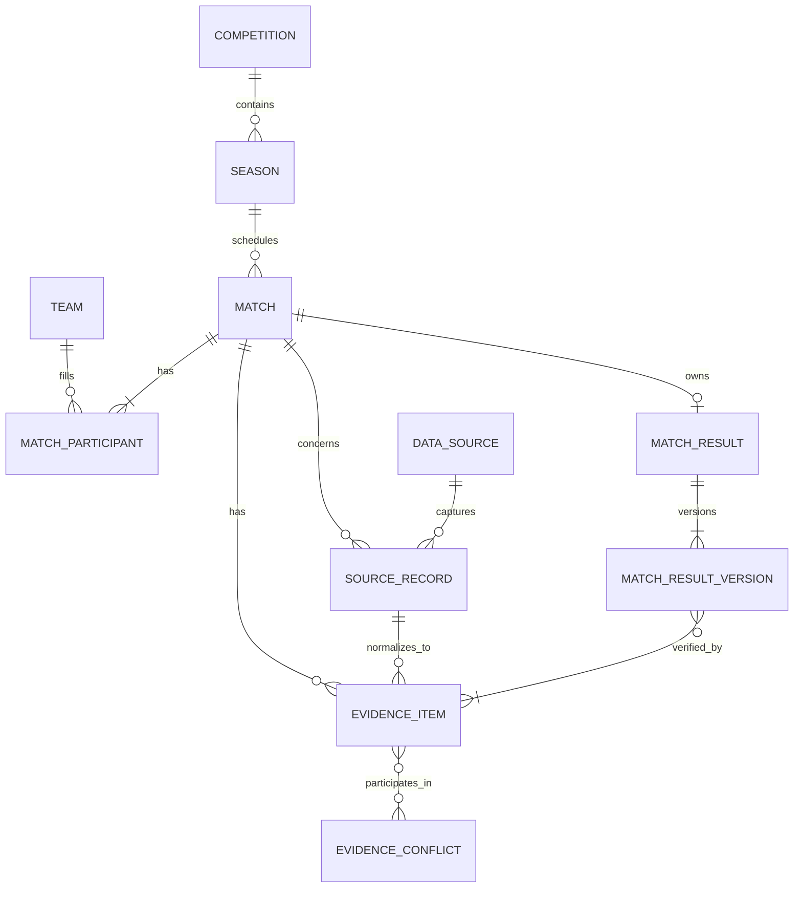
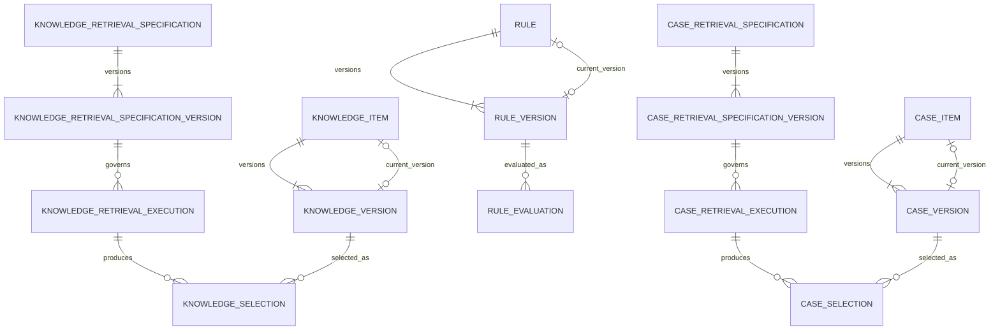
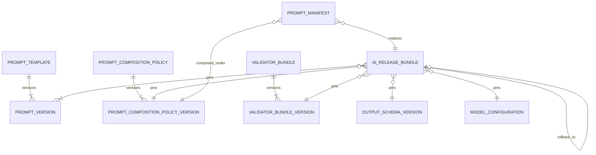
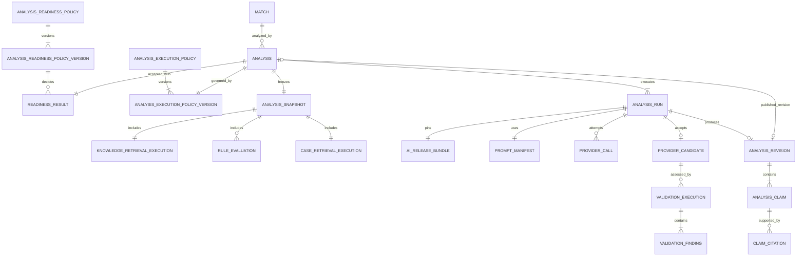
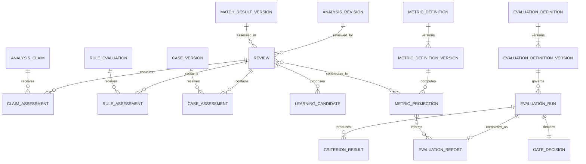
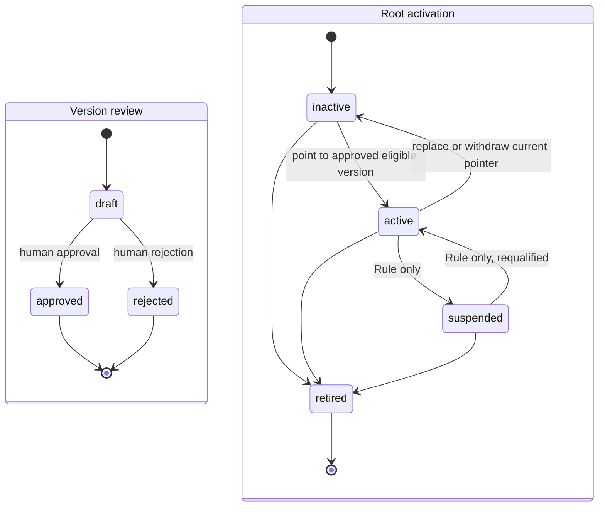
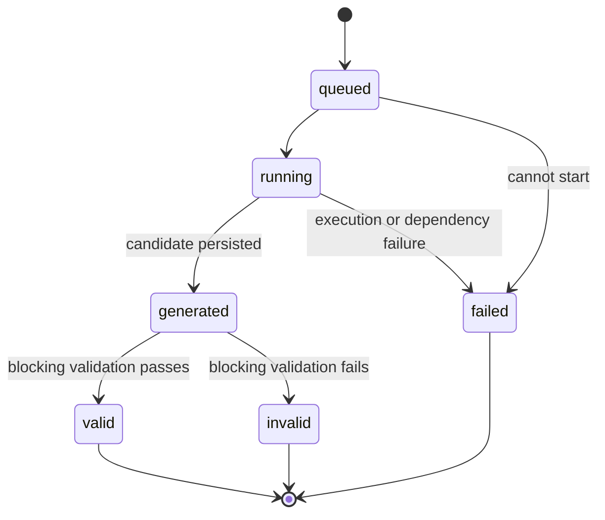
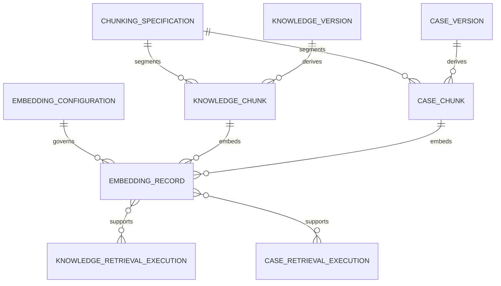

# FAS Logical Database ERD

## 1. Purpose and Authority

This document defines the logical data model for Football Analysis System (FAS): entity purpose, bounded-context ownership, aggregate roots, relationships, lifecycle, invariants, access paths, and consistency boundaries. It is an architecture model, not a Prisma schema, SQL design, migration plan, or duplicate table catalog.

The [PROJECT BIBLE](./00_PROJECT_BIBLE.md) remains governing. [02_DOMAIN_MODEL](./02_DOMAIN_MODEL.md) is authoritative for domain meaning and aggregate semantics; [04_ARCHITECTURE](./04_ARCHITECTURE.md), [17_ANALYSIS_PIPELINE](./17_ANALYSIS_PIPELINE.md), and [18_BACKEND_ARCHITECTURE](./18_BACKEND_ARCHITECTURE.md) govern runtime orchestration and dependency direction.

[12_DATABASE](./12_DATABASE.md) remains the authoritative physical table, column, constraint, and PostgreSQL index catalog. This document intentionally does not reproduce it. Where this logical model closes a known gap in 12, implementation must first reconcile 12 and, where required, [13_API](./13_API.md) and an ADR. This document does not silently override the current physical contract.

V1 uses PostgreSQL as its system of record. Redis, BullMQ, pgvector, and embeddings are Phase 2 capabilities and are not required to satisfy this logical model.

## 2. Modeling Conventions

1. An **aggregate root** is the consistency boundary through which owned state changes.
2. A **stable root** preserves long-lived identity and lifecycle; immutable versions preserve governed content.
3. A **current-version pointer** is a convenience and lifecycle decision, never a replacement for an exact version reference.
4. A **review status** belongs to an immutable governed version: `draft`, `approved`, or `rejected`.
5. **Activation state** belongs to the stable root: Knowledge and Case use `inactive`, `active`, or `retired`; Rule additionally uses `suspended`.
6. Draft content may change under optimistic concurrency. Approval freezes that version. Any content change after approval creates a new version.
7. Snapshot, run, revision, review, evaluation report, projection, source record, audit event, and approved governed version history are immutable.
8. Cross-context references identify exact immutable versions or records. Mutable aliases such as `current` or `active` are resolved before a manifest is frozen.
9. JSON documents may represent closed, schema-versioned value structures, but do not replace stable identity, ownership, or relational references.
10. External provider identifiers are aliases; FAS UUIDs are domain identity.

## 3. Bounded-context and Schema Ownership

Physical PostgreSQL schema names may differ during M1, but logical ownership does not.

| Logical owner | Schema area | Aggregate roots | Owned supporting entities |
|---|---|---|---|
| Match Catalog | `catalog` | Competition, Season, Team | External aliases and canonical references |
| Match | `match` | Match, MatchResult | MatchParticipant, MatchResultVersion |
| Evidence | `evidence` | DataSource, EvidenceItem | SourceRecord, EvidenceConflict, conflict resolution |
| Knowledge Engine | `knowledge` | KnowledgeItem, KnowledgeRetrievalSpecification | KnowledgeVersion, KnowledgeSource, retrieval executions and selections |
| Rule Engine | `rule` | Rule | RuleVersion, RuleEvaluation, RuleFinding |
| Case Engine | `case_lib` | CaseItem, CaseRetrievalSpecification | CaseVersion, CaseEvidence, retrieval executions and selections |
| Prompt Engine | `prompt` | PromptTemplate, PromptCompositionPolicy | PromptVersion, OutputSchemaVersion, PromptManifest |
| AI release governance | `prompt` / governed configuration | ModelConfiguration, ValidatorBundle, AIReleaseBundle | Bundle component references, activation and rollback references |
| Analysis | `analysis` | Analysis, AnalysisReadinessPolicy, AnalysisExecutionPolicy | ReadinessResult, AnalysisSnapshot, AnalysisRun, provider candidate, ValidationExecution, AnalysisRevision, Claim, Citation |
| Review Engine | `review` | Review, LearningCandidate | ClaimAssessment, RuleAssessment, CaseAssessment, outcome-evidence references |
| Evaluation Engine | `evaluation` | EvaluationDefinition | EvaluationDefinitionVersion, EvaluationRun, CriterionResult, GateDecision, EvaluationReport |
| Statistics Engine | `stats` | MetricDefinition | MetricDefinitionVersion, MetricProjection, population and watermark lineage |
| Operations | `ops` | Job, IdempotencyRecord | ProviderCall, AuditEvent, outbox/checkpoint records |

No context may use another context's physical tables or persistence models as an integration contract. Cross-context reads use published immutable-reference contracts; cross-context writes invoke the owning context's command port.

## 4. Core Entity Purposes and Aggregate Roles

### 4.1 Catalog, Match, and Evidence

| Entity | Why it exists | Aggregate role |
|---|---|---|
| Competition | Canonical identity for a football competition. | Root |
| Season | Defines a competition-bounded scheduling period. | Root with Competition reference |
| Team | Canonical participant identity independent of a source provider. | Root |
| Match | Owns fixture identity, participants, kickoff, and legal match-state transitions. | Root |
| MatchParticipant | Fixes a Team's role in one Match. | Match-owned entity |
| MatchResult | Provides stable result identity and points to the current verified result version. | Root |
| MatchResultVersion | Preserves each provisional, verified, or corrected result and its exact outcome-evidence basis. | Immutable version entity |
| DataSource | Governs the identity and trust metadata of an external source. | Root |
| SourceRecord | Preserves an append-only source capture before normalization. | Append-only record |
| EvidenceItem | Owns one normalized, typed, source-backed observation and its quality state. | Root |
| EvidenceConflict | Preserves incompatibility and resolution without deleting alternatives. | Root or owner-scoped consistency record |

`MatchResult` is a stable root separate from `Match`. Recording a correction appends a `MatchResultVersion` and atomically advances the root's current-version pointer. It never updates a prior version or the result version referenced by a completed Review.

### 4.2 Governed Knowledge, Rules, Cases, and Retrieval

| Entity | Why it exists | Aggregate role |
|---|---|---|
| KnowledgeItem | Stable identity and activation lifecycle for reusable guidance. | Root |
| KnowledgeVersion | Immutable sourced content with review status, scope, effectivity, and checksum. | Version entity |
| KnowledgeRetrievalSpecification | Stable identity for Knowledge eligibility, ranking, tie-break, limit, and excerpt semantics. | Root |
| KnowledgeRetrievalSpecificationVersion | Makes retrieval behavior reproducible and independently governable. | Immutable version entity |
| KnowledgeRetrievalExecution | Records exact request, corpus watermark, implementation version, and completion outcome. | Immutable execution record |
| KnowledgeSelection | Records each exact ordered selected version, rank, reason, and excerpt integrity. | Execution-owned entity |
| Rule | Stable identity and activation/suspension/retirement lifecycle for a deterministic rule. | Root |
| RuleVersion | Immutable conditions, outcome, scope, qualification metadata, and review status. | Version entity |
| RuleEvaluation | Immutable deterministic application of one exact RuleVersion to one sealed snapshot. | Root |
| CaseItem | Stable identity and activation lifecycle for a reviewed historical analogy. | Root |
| CaseVersion | Immutable reviewed account, provenance, scope, lessons, differences, and limitations. | Version entity |
| CaseRetrievalSpecification | Stable identity for Case eligibility, ranking, comparison, and difference semantics. | Root |
| CaseRetrievalSpecificationVersion | Pins independently governed Case retrieval behavior. | Immutable version entity |
| CaseRetrievalExecution | Records exact query, corpus watermark, implementation version, and completion outcome. | Immutable execution record |
| CaseSelection | Records exact ordered CaseVersion, reason, similarities, differences, and checksums. | Execution-owned entity |

Knowledge and Case retrieval specifications are distinct roots because their eligibility, ranking, excerpt/comparison, and explanation semantics differ. A shared version-reference primitive is permitted; shared governance or one specification controlling both engines is not.

Retrieval execution outcome is one of `completed_nonempty`, `completed_empty`, or `failed`. Missing, partial, unavailable, or integrity-invalid execution cannot be represented as a successful empty result.

### 4.3 Prompt Composition and AI Release Governance

| Entity | Why it exists | Aggregate role |
|---|---|---|
| PromptTemplate | Stable identity for one prompt-section purpose. | Root |
| PromptVersion | Immutable approved prompt content and variables contract. | Version entity |
| PromptCompositionPolicy | Stable identity for required sections, ordering, delimiters, size, truncation, compatibility, and empty-section behavior. | Root |
| PromptCompositionPolicyVersion | Pins exact deterministic composition semantics. | Immutable version entity |
| OutputSchemaVersion | Pins the closed structured-output contract independently of prompt content. | Immutable governed version |
| ModelConfiguration | Identifies provider-neutral model and parameter configuration without secrets. | Governed root/versioned configuration |
| ValidatorBundle | Pins the exact ordered validators and their versions. | Immutable governed root/version |
| AIReleaseBundle | Immutable manifest of all behavior-affecting AI generation components. | Root/version or immutable release aggregate |
| PromptManifest | Records exact ordered inputs and the rendered checksum for one AnalysisRun. | Immutable record |

An `AIReleaseBundle` references exact provider-adapter, model-configuration, prompt-version, composition-policy-version, output-schema-version, builder-version, and validator-bundle identities. Production governance identifies one active bundle and one tested rollback bundle. A run stores the exact bundle; it never stores only an `active` alias.

### 4.4 Analysis, Validation, and Publication

| Entity | Why it exists | Aggregate role |
|---|---|---|
| AnalysisReadinessPolicy | Stable identity for deterministic prerequisites and acknowledgement classes. | Root |
| AnalysisReadinessPolicyVersion | Pins blocking, warning, acknowledgement, and decision semantics. | Immutable version entity |
| ReadinessResult | Preserves the exact policy, inputs, issues, acknowledgements, decision, and checksum used to accept or reject a request. | Immutable decision record |
| AnalysisExecutionPolicy | Stable identity for stage requirements, successful-empty continuation, and uncertainty/validation obligations. | Root |
| AnalysisExecutionPolicyVersion | Pins stage completion and empty-engine behavior for one lineage. | Immutable version entity |
| Analysis | Stable lineage for one match, analysis type, and requested cutoff. | Root |
| AnalysisSnapshot | Sealed manifest of exact selected inputs and engine outputs. | Immutable Analysis-owned entity |
| AnalysisRun | One auditable execution attempt against exact frozen policy and input identities. | Analysis-owned entity |
| ProviderCandidate | Immutable mapped structured candidate produced by an accepted provider attempt. | Run-owned immutable entity |
| ValidationExecution | One immutable assessment of an exact candidate/revision under one ValidatorBundle. | Root or Analysis-owned immutable entity |
| ValidationFinding | Append-only result of one validator in a ValidationExecution. | Execution-owned entity |
| AnalysisRevision | Immutable validated structured analysis document. | Analysis-owned version entity |
| AnalysisClaim | Stable typed claim within a revision. | Revision-owned entity |
| ClaimCitation | Typed reference from a claim to an eligible snapshot artifact. | Claim-owned entity |

Analysis execution policy explicitly determines whether a successful empty Knowledge result, zero eligible Rule set, or successful empty Case result may continue. It also declares required uncertainty and validation consequences. A failed or incomplete stage always stops generation.

An AnalysisRun ending `invalid` completed provider execution but failed deterministic output validation. An AnalysisRun ending `failed` did not produce a usable validation candidate because execution, dependency, provider, persistence, integrity, or orchestration failed. `invalid` is not a provider failure, and `failed` is not an empty or schema-invalid analysis.

### 4.5 Review, Evaluation, and Statistics

| Entity | Why it exists | Aggregate role |
|---|---|---|
| Review | Immutable-on-completion assessment of one published revision against one exact result version. | Root |
| ClaimAssessment | Records the governed post-match category and rationale for one claim. | Review-owned entity |
| RuleAssessment | Assesses usefulness and outcome relevance of one stored RuleEvaluation without recomputation. | Review-owned entity |
| CaseAssessment | Assesses one selected CaseVersion and its recorded differences. | Review-owned entity |
| LearningCandidate | Governs a review-derived proposal and idempotent draft handoff. | Root |
| EvaluationDefinition | Stable identity for assessment policy. | Root |
| EvaluationDefinitionVersion | Immutable criteria, rubric, qualification, gate, waiver, and report semantics. | Version entity |
| EvaluationRun | Executes an exact definition against a frozen subject/corpus manifest. | Root |
| CriterionResult | Records criterion status, evidence, evaluator version, and explanation. | EvaluationRun-owned entity |
| GateDecision | Applies definition policy without recomputing Statistics. | EvaluationRun-owned entity |
| EvaluationReport | Immutable completed quality/release report. | Root or immutable run result |
| MetricDefinition | Stable metric identity. | Root |
| MetricDefinitionVersion | Immutable formula, population, dimensions, interval, minimum-sample, and qualification semantics. | Version entity |
| MetricProjection | Rebuildable value for one exact metric, population identity, dimensions, and source watermark. | Projection entity |

A Review's semantic uniqueness is `(analysis revision, match result version)`, not analysis revision alone. At most one completed authoritative Review may exist for that pair. A corrected result creates a new `MatchResultVersion` and therefore a new Review lineage; the prior completed Review remains immutable and attributable.

Evaluation and Statistics remain separate: EvaluationDefinition/Report own policy and gate decisions; MetricDefinition/Projection own deterministic measurements, population, uncertainty, qualification facts, and watermarks.

## 5. Lifecycle Model

### 5.1 Stable Roots and Governed Versions

KnowledgeItem, Rule, and CaseItem roots own operational lifecycle and current-version pointers. Their versions own review status.

- Root activation must reference one exact approved, effective, eligible version.
- Replacing active content changes the root pointer to another approved version; it does not mutate either version.
- Knowledge and Case do not use version `active` status. Rule suspension is a root lifecycle state.
- Retirement prevents future selection but preserves exact historical references.

### 5.2 Match Result

`MatchResult` is created when a match first receives a result identity. Result versions progress independently:

- provisional version may be superseded by a verified version;
- correction appends a corrected verified version with reason and supersedes reference;
- current verified pointer advances atomically;
- every version retains checksum and outcome-evidence references;
- completed Reviews remain bound to their original exact result version.

### 5.3 Analysis Run

- `invalid` means an immutable candidate exists and validation completed with blockers.
- `failed` means execution did not reach a usable validated candidate or a required stage failed.
- A retry creates a new run or attempt according to the frozen lineage; it never changes the terminal meaning of the original run.

### 5.4 Review, Evaluation, and Projection

- Review: `draft -> completed`; completion freezes the Review and assessments.
- LearningCandidate: `proposed -> accepted | rejected`; accepted handoff creates at most one draft in the target context.
- EvaluationDefinitionVersion and MetricDefinitionVersion: `draft -> approved -> active/retired` using root activation plus immutable version review status.
- EvaluationRun: queued/running then completed, not-qualified, or failed according to its exact definition.
- EvaluationReport is immutable once completed.
- MetricProjection is immutable by full projection identity; refresh or rebuild creates/replaces only an equivalent derived projection under the defined physical policy and never changes source truth.

## 6. Logical Invariants

### 6.1 Identity and Versioning

1. Every stable root and externally referenced entity has an opaque FAS identity.
2. Version numbers are positive and unique within their root.
3. Approved versions are immutable.
4. Root current-version pointers reference versions belonging to the same root.
5. A root may activate only an approved version satisfying owner-specific eligibility.
6. Historical manifests reference exact version identity and checksum, never only the root.

### 6.2 Match Result and Review

1. A Match has at most one MatchResult root.
2. Every MatchResultVersion belongs to that root and the same Match.
3. A verified/corrected result version has valid outcome evidence for that Match.
4. Result correction appends; it never updates or deletes a prior version.
5. One Review targets exactly one published AnalysisRevision and one MatchResultVersion for the same Match.
6. At most one completed authoritative Review exists per `(AnalysisRevision, MatchResultVersion)`.
7. Review completion and assessments are immutable.

### 6.3 Retrieval and Snapshot

1. Production Knowledge and Case retrieval names one exact approved specification version and implementation version.
2. Execution records normalized query/filter identity, cutoff, corpus/eligibility watermark, limit, stable ordering, and outcome.
3. A successful empty execution has zero selections; a nonempty execution has at least one; a failed execution is never snapshot-complete.
4. KnowledgeSelection references an eligible exact KnowledgeVersion; CaseSelection references an eligible exact CaseVersion.
5. A sealed snapshot records exact retrieval executions, complete Rule evaluations, selections, ranks, reasons, and checksums.
6. Later approval, activation, retirement, reranking, correction, or embedding rebuild cannot mutate a sealed snapshot.

### 6.4 Prompt, Bundle, and Analysis

1. PromptManifest references one exact AIReleaseBundle and its exact composition policy.
2. Every bundle component reference is immutable and compatibility-checked before activation.
3. Analysis records exact readiness and execution policy versions.
4. ReadinessResult inputs and acknowledgements are immutable after request acceptance.
5. A successful empty engine result may continue only when the exact AnalysisExecutionPolicy permits it.
6. A failed, partial, unavailable, integrity-invalid, or incompatible stage cannot be converted to empty context.
7. Every AnalysisRun references one sealed snapshot and one exact AIReleaseBundle.
8. A valid run has a successful ValidationExecution under an accepted ValidatorBundle.
9. An invalid run has a persisted candidate and completed blocking validation.
10. A failed run cannot be represented as invalid, generated-empty, or publishable.
11. Publication references one exact immutable revision and one accepted successful validation execution.

### 6.5 Evaluation and Statistics

1. EvaluationRun references one exact EvaluationDefinitionVersion and frozen subject/corpus manifest.
2. EvaluationReport references its exact run, criterion results, gate decision, baseline, and MetricProjections.
3. Evaluation never recomputes a MetricProjection.
4. A MetricProjection references one exact MetricDefinitionVersion, computation version, population identity, dimensions, and source watermarks.
5. Unqualified projections remain distinguishable and cannot satisfy a qualified Evaluation gate.
6. Neither a report nor projection mutates its source subjects or performs governance activation.

## 7. Analysis Policy Model

### 7.1 AnalysisReadinessPolicy

An immutable policy version defines:

- required match states and cutoff relationship;
- required evidence metric classes;
- freshness, quality, conflict, and missing-data rules;
- stable blocking and warning codes;
- which blockers may be acknowledged;
- acknowledgement requirements and resulting uncertainty;
- `ready`, `ready_with_acknowledgements`, and `not_ready` decision semantics.

The corresponding ReadinessResult records exact input checksum, cutoff, issues, acknowledgements, actor rationale, decision, and result checksum. It is rechecked when the Analysis and generation Job are accepted.

### 7.2 AnalysisExecutionPolicy

An immutable policy version defines:

- required stages and their ordering;
- whether Knowledge `completed_empty` may continue;
- how a complete zero-eligible-Rule set is represented and whether it may continue;
- whether Case `completed_empty` may continue;
- required uncertainty claims, prompt sections, and validation checks for each permitted empty outcome;
- required stage integrity and completeness checks;
- failure behavior for unavailable, partial, invalid, or incompatible results.

Knowledge and Case emptiness may be allowed or blocked independently. A zero-rule set means no eligible rule was selected; it does not mean selected rules ran and did not match.

## 8. V1 Required Logical Indexes

The exact physical definitions, names, predicates, included columns, and migration SQL belong in [12_DATABASE](./12_DATABASE.md). The following access paths are required for v1 and must be represented there before implementation.

### 8.1 Identity and Version Access

- unique root/version lookup for every governed or immutable version family;
- unique Match-to-MatchResult lookup and unique MatchResult/version lookup;
- unique Analysis/run number and Analysis/revision number lookup;
- unique claim key within AnalysisRevision;
- unique exact bundle/version and policy/version lookup.

### 8.2 Catalog, Match, and Evidence

- Season by Competition and date/name;
- Match by Season/kickoff and status/kickoff;
- participant uniqueness by Match role and Match Team;
- SourceRecord deduplication by source/external identity/checksum;
- EvidenceItem by Match, type, metric, and descending observation time;
- unresolved EvidenceConflict lookup and selected outcome-evidence traversal.

### 8.3 Governed Eligibility and Retrieval

- partial eligibility indexes for active Knowledge, Rule, and Case roots and their current exact versions;
- version lookup by root and review status/effective interval;
- GIN full-text indexes only on approved Knowledge and Case searchable content;
- tag/scope access paths demonstrated by retrieval query plans;
- RetrievalSpecification root/version uniqueness;
- retrieval execution lookup by snapshot/run, specification version, query checksum, and outcome;
- selection uniqueness and ordered retrieval by execution plus rank, with stable tie-break identity.

### 8.4 Analysis, Review, and Validation

- one semantic RuleEvaluation per `(snapshot, RuleVersion)`;
- one PromptManifest per AnalysisRun;
- ProviderCall attempts by AnalysisRun and attempt number;
- ValidationExecution uniqueness by exact subject checksum and ValidatorBundleVersion;
- unresolved blocking ValidationFinding lookup by revision/run and severity/status;
- one published revision pointer per Analysis and efficient Analysis lookup by Match/status/cutoff;
- Review uniqueness for `(AnalysisRevision, MatchResultVersion)`, with a partial unique constraint for completed authoritative reviews;
- incomplete Review work queue by status and age;
- assessment uniqueness by Review and target identity.

### 8.5 Evaluation, Statistics, and Operations

- EvaluationRun by definition version, subject/corpus checksum, status, and creation time;
- one authoritative EvaluationReport per completed run identity;
- MetricProjection uniqueness by metric definition version, subject, period, normalized dimensions, and source watermark;
- projection reads by metric/version, subject, period, and dimensions;
- runnable Job claim path by status, availability, and priority;
- expired Job lease recovery path;
- IdempotencyRecord uniqueness by scope and key;
- AuditEvent traversal by entity and occurrence order.

Every foreign-key traversal used by owner repositories requires an index unless the physical design proves it unnecessary. Broad GIN indexes on arbitrary JSON are prohibited without measured plans. Cursor pagination uses total stable order.

## 9. Transaction and Immutability Boundaries

### 9.1 Required Atomic Decisions

- create or update MatchResult root, append MatchResultVersion, attach outcome evidence, and advance current-version pointer;
- activate, suspend, retire, or change current-version pointer on one governed root with concurrency and eligibility checks;
- accept Analysis request with ReadinessResult reference, exact policies, initial run, idempotency record, and generation Job;
- persist each completed retrieval execution and its complete ordered selections;
- seal AnalysisSnapshot only after required stage outputs are complete and checksums match;
- publish revision by advancing Analysis publication pointer with exact validation reference and audit event;
- complete Review with all assessments, completion event/outbox record, and Statistics refresh Job;
- complete EvaluationReport with GateDecision and completion event;
- persist MetricProjection with its refresh event;
- record LearningCandidate handoff identity after the target owner idempotently creates a draft;
- claim, checkpoint, complete, or fail a Job with lease/concurrency enforcement.

### 9.2 Never in a Database Transaction

- AI-provider calls;
- football-source calls;
- object-storage transfers;
- waiting or retry backoff;
- long-running retrieval, evaluation, or statistical computation;
- a future cross-service network call.

### 9.3 Immutability Boundary

Append-only or immutable after completion:

- SourceRecord and historical EvidenceItem content;
- MatchResultVersion;
- approved governed versions and retrieval specification versions;
- retrieval execution manifests and selections used by a sealed snapshot;
- RuleEvaluation and finding;
- sealed AnalysisSnapshot;
- ProviderCall attempt and ProviderCandidate;
- ValidationExecution and findings;
- AnalysisRevision after acceptance/publication;
- completed Review and assessments;
- completed EvaluationReport and its criterion/gate results;
- MetricProjection identity and lineage;
- AuditEvent.

Mutable only before freeze or through a root pointer/lifecycle transition:

- draft governed versions;
- Match fixture state under legal transitions;
- stable root activation/current-version pointers;
- Analysis orchestration status and publication pointer;
- Review draft before completion;
- Job lease, checkpoint, attempt, and terminal state;
- operational current pointers to active policies or release bundles.

## 10. Phase 2 Extensions

### 10.1 Redis and BullMQ

Redis is an adapter, not a new source of domain truth.

- cache keys include exact entity/version, specification/policy, schema/computation version, and source watermark where applicable;
- TTLs are bounded and cache misses do not change semantics;
- distributed locks cannot replace database uniqueness, idempotency, or aggregate invariants;
- BullMQ may dispatch work behind the Jobs port, while PostgreSQL retains authoritative Job, checkpoint, result, and audit lineage;
- cached mutable aggregate instances, Prisma records, secrets, and unvalidated provider/source payloads are prohibited.

### 10.2 pgvector and Embeddings

Phase 2 adds derived semantic indexes without changing KnowledgeVersion or CaseVersion truth.

Logical extensions include:

- EmbeddingConfiguration with provider, model, dimensions, normalization, and lifecycle;
- ChunkingSpecification with immutable segmentation semantics;
- KnowledgeChunk and CaseChunk with stable linkage to exact source version and content checksum;
- EmbeddingRecord with exact configuration, chunk, vector dimensions, status, checksum, and generation lineage;
- hybrid Knowledge and Case retrieval specification versions that pin lexical/vector weighting and stable tie-breaks;
- query-embedding identity and checksum on retrieval execution;
- score, rank, filters, embedding version, and fallback path on each selection;
- background embedding Jobs with explicit pending, completed, failed, and stale/rebuild states.

Embedding rebuild, model change, or index replacement never mutates source versions or historical retrieval selections. Adoption requires frozen-corpus recall/relevance, latency, cost, drift, security, rebuild, and rollback evidence under [ADR-003](./decisions/ADR-003-provider-neutral-ai-and-staged-retrieval.md).

## 11. Reconciliation With the Physical Catalog

This logical model explicitly closes the following known gaps without editing [12_DATABASE](./12_DATABASE.md):

1. `MatchResult` is a stable root with append-only `MatchResultVersion` records; in-place correction is not the target model.
2. Review uniqueness is exact AnalysisRevision plus exact MatchResultVersion, preserving corrected-result review lineages.
3. Knowledge, Rule, and Case activation belongs to the stable root/current-version pointer; immutable versions use review status.
4. Knowledge and Case each have independently versioned retrieval-specification roots, executions, manifests, and successful-empty versus failed outcomes.
5. PromptCompositionPolicy, ValidatorBundle, and immutable AIReleaseBundle references are first-class.
6. AnalysisReadinessPolicy and AnalysisExecutionPolicy are versioned and recorded, including explicit empty-engine continuation behavior.
7. AnalysisRun `invalid` and `failed` have distinct terminal meanings.
8. EvaluationDefinition/EvaluationReport and MetricDefinition/MetricProjection remain distinct roots and outputs with one-way policy consumption.

Before implementation of any gap above, 12 must add or reconcile its physical identity, constraints, indexes, retention, and transaction mapping. [13_API](./13_API.md) must likewise be updated before exposing changed result-version, policy, bundle, retrieval, validation, or review semantics. A persistence/versioning strategy change follows the ADR rules in [15_DEVELOPMENT_GUIDE](./15_DEVELOPMENT_GUIDE.md).

## 12. Related Documents and Decisions

- [02_DOMAIN_MODEL](./02_DOMAIN_MODEL.md) — ubiquitous language, bounded contexts, aggregate semantics, and invariants.
- [05_PROMPT_ENGINE](./05_PROMPT_ENGINE.md) — prompt versions, composition policy, manifests, and release compatibility.
- [06_KNOWLEDGE_ENGINE](./06_KNOWLEDGE_ENGINE.md) — Knowledge governance and retrieval specification.
- [07_RULE_ENGINE](./07_RULE_ENGINE.md) — Rule governance and deterministic evaluations.
- [08_CASE_ENGINE](./08_CASE_ENGINE.md) — Case governance, retrieval, and differences.
- [09_REVIEW_ENGINE](./09_REVIEW_ENGINE.md) — review/result binding, assessments, and learning candidates.
- [10_EVALUATION_ENGINE](./10_EVALUATION_ENGINE.md) — assessment definitions, runs, gates, and reports.
- [11_STATISTICS_ENGINE](./11_STATISTICS_ENGINE.md) — metric definitions, populations, watermarks, and projections.
- [12_DATABASE](./12_DATABASE.md) — authoritative physical table, column, constraint, and index catalog.
- [17_ANALYSIS_PIPELINE](./17_ANALYSIS_PIPELINE.md) — stage order, manifests, empty-result policy, validation, and durable checkpoints.
- [18_BACKEND_ARCHITECTURE](./18_BACKEND_ARCHITECTURE.md) — module ownership, ports, transactions, and Phase 2 adapters.
- [ADR-001](./decisions/ADR-001-modular-monolith-and-typescript-monorepo.md) — modular monolith and database-boundary decision.
- [ADR-002](./decisions/ADR-002-postgresql-durable-jobs-for-v1.md) — PostgreSQL durable jobs and BullMQ adoption triggers.
- [ADR-003](./decisions/ADR-003-provider-neutral-ai-and-staged-retrieval.md) — provider neutrality and staged retrieval.
