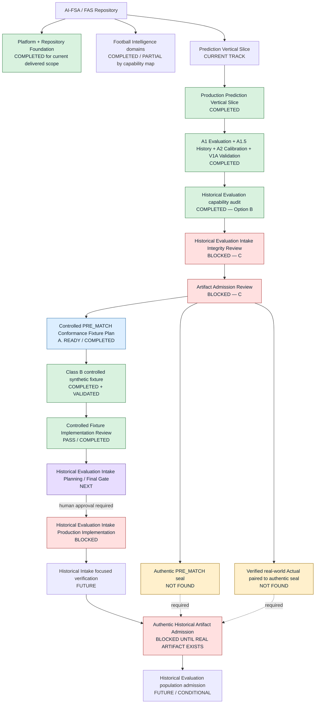

# Current Project State

```yaml
project: AI-FSA
current_track: PREDICTION_VERTICAL_SLICE
current_stage: CONTROLLED_PREMATCH_CONFORMANCE_FIXTURE_REVIEW_COMPLETED
current_gate: HISTORICAL_INTAKE_PLANNING_FINAL_GATE
historical_evaluation_intake: C_BLOCKED
authentic_prematch_seal: NOT_FOUND
authentic_seal_plus_verified_real_world_actual: NOT_FOUND
controlled_prematch_fixture: IMPLEMENTED_AND_VALIDATED
controlled_fixture_classification: B_CONTROLLED_SYNTHETIC
production_historical_intake_authorized: false
next_action: HISTORICAL_EVALUATION_INTAKE_IMPLEMENTATION_PLANNING_FINAL_GATE
next_production_capability: HISTORICAL_EVALUATION_INTAKE
```

## Document role

This file is the **Repository-grounded project state and execution handoff**.
It is the primary current-state entry point for a future Agent opening a
repository ZIP.

Use it to:

- understand delivered capabilities without relying on conversation memory;
- identify the current track, stage, gate, blockers and next action;
- avoid duplicate implementation;
- avoid crossing governance gates early;
- find the evidence that supports each status claim.

This file is not:

- a Product Roadmap;
- the canonical FIP Protocol;
- an Architecture specification;
- a prediction-model specification.

It does not override the Project Bible, accepted ADRs, owning numbered
contracts or approved gates. `docs/40_PRODUCT_ROADMAP.md` remains authoritative
for product sequencing. The canonical FIP protocol remains authoritative for
Agent PRE_MATCH analysis workflow. If this snapshot conflicts with either in
its owning scope, the owning canonical source wins and this file must be
corrected.

Update this document after every sprint, implementation gate, review that
changes the active gate, or material governance change.

## Snapshot

- Last updated: 2026-08-31 — Controlled PRE_MATCH Conformance Fixture
  implementation review completed with **PASS**.
- Current track: **PREDICTION_VERTICAL_SLICE**.
- Current stage:
  **CONTROLLED_PREMATCH_CONFORMANCE_FIXTURE_REVIEW_COMPLETED**.
- Current gate: **HISTORICAL_INTAKE_PLANNING_FINAL_GATE**.
- Current next action:
  **Historical Evaluation Intake Implementation Planning / Final Gate**.
- Current production sprint: **none active**.
- Latest implementation evidence: commit `08467c5`,
  `feat(statistics): 添加 controlled PRE_MATCH 夹具`.
- Fixture classification: **B — controlled synthetic**;
  `synthetic=true`, `historicalAuthenticity=false`,
  `allowedUsage=conformance_test_only`.
- Historical Evaluation Intake remains **C. BLOCKED** and is not authorized.
- Authentic PRE_MATCH seal remains **NOT FOUND**.
- Authentic seal plus verified real-world Actual remains **NOT FOUND**.
- Delivery phase: **Product development**.
- Release status: pre-release, private trusted environment only; not public
  production.
- Architecture Freeze: **v0.3**, unchanged.
- FIP-1: **Planning Complete / Reviewed**.
- FIP-2 P0: **Complete / Signed Off**.
- FIP-2 P1/P2/P3/P4: **NOT AUTHORIZED / NOT STARTED**.
- Product roadmap: `docs/40_PRODUCT_ROADMAP.md`, unchanged.
- Canonical PRE_MATCH protocol:
  `docs/protocols/FOOTBALL_INTELLIGENCE_ANALYSIS_PROTOCOL.md`, unchanged.
- Document/code navigation: `docs/PROJECT_INDEX.md`.

There is no discrepancy between the requested machine-readable state and the
repository evidence inspected for this update.

## Execution map



The controlled fixture and authentic historical artifacts are deliberately
separate nodes. A passing synthetic fixture never proves that an authentic
historical prediction exists.

## Completed Capability Map

| Capability | Status | Evidence / document | Owner / package |
|---|---|---|---|
| F1.1 Provider/fixture foundation, venue, player and availability path | **COMPLETED for documented F1.1 scope** | `docs/sprints/F1.1/F1.1A_IMPLEMENTATION_REPORT.md`; `F1.1B-1_VENUE_IMPLEMENTATION_REPORT.md`; `F1.1C-1_PLAYER_IMPLEMENTATION_REPORT.md`; `F1.1D_AVAILABILITY_IMPLEMENTATION_REPORT.md` | `@fas/provider-football`, `@fas/evidence-normalizer`, Evidence/Web surfaces |
| Advanced Statistics | **PARTIAL / IMPLEMENTED WHERE EVIDENCE EXISTS** | `STATISTICS.advanced` implementation and P2K expansion evidence; no dedicated F1.2 completion report exists | `@fas/provider-football`, `@fas/evidence-normalizer`, `@fas/feature`, `@fas/rule` |
| F1.3A Expected Goals Evidence | **COMPLETED** | `docs/sprints/F1.3/F1.3A_EXPECTED_GOALS_EVIDENCE_COMPLETION_REPORT.md` | Provider → Evidence → Workspace/Report |
| F1.3B Expected Goals Intelligence | **COMPLETED** | `docs/sprints/F1.3/F1.3B_EXPECTED_GOALS_INTELLIGENCE_COMPLETION_REPORT.md` | `@fas/feature`, `@fas/rule`, `@fas/analysis` |
| I1A/I1B Match Context | **COMPLETED** | `docs/sprints/I1/I1A_CONTEXT_EVIDENCE_COMPLETION_REPORT.md`; `I1B_CONTEXT_INTELLIGENCE_COMPLETION_REPORT.md` | Provider/Evidence; `@fas/feature`, `@fas/rule`, `@fas/analysis` |
| I2A/I2B Odds & Market Intelligence | **COMPLETED within findings-only contract** | `docs/sprints/I2/I2A_ODDS_MARKET_EVIDENCE_COMPLETION_REPORT.md`; `I2B_MARKET_INTELLIGENCE_COMPLETION_REPORT.md` | `@fas/provider-odds`, Evidence, Feature/Rule/Analysis |
| A1 Prediction Evaluation | **COMPLETED** | `docs/sprints/A1/A1_PREDICTION_EVALUATION_COMPLETION_REPORT.md` | `@fas/statistics` with Analysis/Report adapters |
| A1.5 Evaluation Platform Foundation | **COMPLETED** | `docs/sprints/A1/A1.5_EVALUATION_PLATFORM_FOUNDATION_COMPLETION_REPORT.md` | `@fas/statistics`, `@fas/database`, API/Web reads |
| A2 Prediction Calibration | **COMPLETED, descriptive only** | `docs/sprints/A2/A2_PREDICTION_CALIBRATION_COMPLETION_REPORT.md` | `@fas/statistics`, Report/API/Web overlays |
| V1A Football Intelligence Validation | **COMPLETED, descriptive only** | `docs/sprints/V1A/V1A_FOOTBALL_INTELLIGENCE_VALIDATION_COMPLETION_REPORT.md` | `@fas/statistics`, Report/API/Web overlays |
| L1A/L1B Club Intelligence | **COMPLETED** | `docs/sprints/L1/L1A_CLUB_INTELLIGENCE_EVIDENCE_COMPLETION_REPORT.md`; `L1B_CLUB_INTELLIGENCE_COMPLETION_REPORT.md` | Evidence; `@fas/feature`, `@fas/rule`, `@fas/analysis` |
| P1A/P1B Player Intelligence | **COMPLETED within provider-backed fields** | `docs/sprints/P1/P1A_PLAYER_INTELLIGENCE_EVIDENCE_COMPLETION_REPORT.md`; `P1B_PLAYER_INTELLIGENCE_COMPLETION_REPORT.md` | Evidence; `@fas/feature`, `@fas/rule`, `@fas/analysis` |
| M1A/M1B Manager Intelligence | **COMPLETED** | `docs/sprints/M1/M1A_MANAGER_INTELLIGENCE_EVIDENCE_COMPLETION_REPORT.md`; `M1B_MANAGER_INTELLIGENCE_COMPLETION_REPORT.md` | Evidence; Feature/Rule/Football State/Analysis |
| Football State → Match Script → Unified Matrix → Projection V2 | **COMPLETED for current production path** | P2D–P2G completion reports under `docs/sprints/` | `@fas/analysis` |
| R1B Match Script Calibration | **COMPLETED as structural experiment only** | `docs/sprints/R1B/R1B_MATCH_SCRIPT_CALIBRATION_COMPLETION_REPORT.md` | `@fas/analysis`; Baseline A remains production default; Candidate C not promoted |
| Projection Replay/Diagnostics/Parameter artifacts | **COMPLETED for governed P2H/P2I/P2J scope** | P2H, P2I and P2J completion reports | `@fas/statistics`, `@fas/analysis`, `@fas/database` |
| Controlled PRE_MATCH Conformance Fixture | **COMPLETED + VALIDATED** | commit `08467c5`; fixture/test paths listed below | `@fas/statistics` test-only area |

“Completed” is limited to each cited report's acceptance scope. It does not
mean live-provider coverage, population qualification, candidate promotion or
historical authenticity unless the cited evidence explicitly proves it.

## Current Workstream — PREDICTION_VERTICAL_SLICE

| Sequence | Work item | Current result |
|---|---|---|
| 1 | Historical Evaluation Intake Integrity Review | **COMPLETED REVIEW / Final Gate C. BLOCKED** |
| 2 | Historical Evaluation Artifact Admission Review | **COMPLETED REVIEW / C. ADMISSION BLOCKED** |
| 3 | Controlled PRE_MATCH Conformance Fixture Plan | **COMPLETED / A. READY FOR FIXTURE IMPLEMENTATION**; readiness applied only to fixture design |
| 4 | Controlled PRE_MATCH Conformance Fixture Implementation | **COMPLETED + VALIDATED** |
| 5 | Controlled Fixture Implementation Review | **PASS / COMPLETED** |
| Current | Historical Evaluation Intake Implementation Planning / Final Gate | **NEXT; planning only, not production authorization** |

### Controlled fixture implementation evidence

Classification and isolation:

- class **B — controlled synthetic**;
- `synthetic=true`;
- `historicalAuthenticity=false`;
- `provenanceClass=B`;
- `allowedUsage=conformance_test_only`;
- historical/Calibration/Validation population eligibility false;
- no runtime export, Prisma seed, database write, History, Sidecar or cohort;
- no Analysis, Feature, Rule, Match Script or Projection execution;
- no production source change.

Files:

- `packages/statistics/test/fixtures/controlled-prematch-conformance-v1/manifest.json`;
- `packages/statistics/test/fixtures/controlled-prematch-conformance-v1/prediction-seal.json`;
- `packages/statistics/test/fixtures/controlled-prematch-conformance-v1/verified-actual.json`;
- `packages/statistics/test/controlled-prematch-conformance-fixture.spec.ts`;
- `packages/statistics/test/helpers/canonical-json.ts`.

Recorded validation:

- focused fixture tests: **31 passed**;
- complete `@fas/statistics` tests: **135 passed**;
- `@fas/statistics` typecheck: **passed**;
- `pnpm quality`: **passed**;
- lint/format: **passed**;
- canonical checksum, temporal gate, identity mutations, seal mutations and
  controlled-Actual mutations: **passed**;
- replay-boundary declaration: **passed** with no Sidecar; no Evaluation or
  Replay execution was performed;
- commit: `08467c5`.

## Current Blockers

### Artifact blockers

1. Authentic PRE_MATCH seal: **NOT FOUND**.
2. Authentic seal plus verified real-world Actual: **NOT FOUND**.
3. Historical Evaluation Intake: **C. BLOCKED** and not authorized.

The controlled fixture is not a real-world artifact and does not remove these
blockers.

### Future implementation prerequisites

These findings define a future gate; they do not authorize coding:

- a versioned `EvaluationHistoryRecord` historical-intake schema/domain
  extension;
- a Prisma version-aware `record_json` decoder that preserves the new variant
  while keeping `evaluation-history.mvp.a15` readable;
- approved historical idempotency semantics;
- resolution of `evaluatedAt` sensitivity in evaluation checksum/History
  identity without silently changing existing Evaluation semantics;
- a verified Actual Evidence boundary that distinguishes controlled
  verification from real-world verification;
- a stricter historical-intake replay parameter-provenance gate;
- explicit original-seal checksum algorithm, scope and storage authority;
- human approval of the final implementation boundary.

No Prisma migration is currently indicated for the proposed JSON manifest, but
that conclusion does not authorize the decoder/domain changes.

# Next Execution Sequence

## STEP 1 — Controlled Fixture Implementation Review

- **Status:** PASS / COMPLETED.
- **Objective:** review the committed class-B fixture, canonical checksums,
  mutation coverage, isolation controls and non-authentic labeling.
- **Entry condition:** fixture implementation and validation evidence exist.
- **Allowed scope:** repository inspection, test/evidence review and governance
  sign-off; fixes only if separately authorized.
- **Exit condition:** satisfied by
  `CONTROLLED_PREMATCH_CONFORMANCE_FIXTURE_IMPLEMENTATION_REVIEW.md`.
- **Blocking condition:** none for the bounded class-B fixture; recorded
  limitations carry forward and do not establish historical authenticity.

## STEP 2 — Historical Evaluation Intake Implementation Planning / Final Gate

- **Status:** NEXT / NOT STARTED.
- **Objective:** reconcile prior planning with fixture-review evidence and issue
  one final implementation authorization decision.
- **Entry condition:** STEP 1 passes and a human authorizes this planning/gate
  review.
- **Allowed scope:** planning, exact file boundary, contracts, acceptance tests
  and human decisions; no production implementation.
- **Exit condition:** explicit READY/BLOCKED final gate and approved
  idempotency/Actual/replay/schema decisions.
- **Blocking condition:** unresolved prerequisites or absent human approval.

## STEP 3 — Historical Evaluation Intake production implementation

- **Status:** BLOCKED UNTIL STEP 2 APPROVAL.
- **Objective:** implement only the approved bounded intake trust boundary.
- **Entry condition:** explicit human approval after STEP 2.
- **Allowed scope:** only files/contracts named by the approved gate.
- **Exit condition:** focused implementation evidence and no boundary leakage.
- **Blocking condition:** no approval, architecture conflict, or attempted
  historical reconstruction.

## STEP 4 — Historical Intake focused verification

- **Status:** FUTURE.
- **Objective:** verify temporal, identity, seal, Actual, idempotency, legacy
  History and replay-blocked behavior.
- **Entry condition:** STEP 3 implementation completes within its approved
  scope.
- **Allowed scope:** focused tests and validation evidence; no model tuning.
- **Exit condition:** all approved fail-closed tests pass.
- **Blocking condition:** any silent fallback, reconstruction, schema
  incompatibility or persistence divergence.

## STEP 5 — Authentic historical artifact admission

- **Status:** BLOCKED UNTIL A REAL ARTIFACT EXISTS.
- **Objective:** admit an authentic original pre-kickoff seal and matching
  verified real-world Actual.
- **Entry condition:** a real artifact independently satisfies the seven-part
  authenticity test and the verified-Actual contract.
- **Allowed scope:** artifact inspection and admission; no reconstruction.
- **Exit condition:** explicit artifact-level admission decision.
- **Blocking condition:** missing seal, missing real-world verification,
  ambiguous fixture identity or retrospective origin.

## STEP 6 — Historical Evaluation population admission

- **Status:** FUTURE / CONDITIONAL.
- **Objective:** admit only approved historical records to governed Evaluation
  populations.
- **Entry condition:** STEP 4 passes and STEP 5 admits authentic paired
  artifacts.
- **Allowed scope:** separately approved population admission.
- **Exit condition:** traceable, qualified population membership evidence.
- **Blocking condition:** synthetic fixture contamination, missing provenance
  or absent population governance.

## Gate Matrix

| Gate | Status | Meaning | Can Proceed? |
|---|---|---|---|
| Historical Evaluation Integrity Review | **C. BLOCKED** | Planning is architecturally plausible but authenticity/test prerequisites were missing | No production intake |
| Artifact Admission Review | **C. ADMISSION BLOCKED** | No authentic seal or verified real-world Actual pair exists | No authentic admission |
| Controlled Fixture Plan | **A. READY / COMPLETED** | Fixture design can be implemented | Fixture implementation only |
| Controlled Fixture Implementation | **COMPLETED + VALIDATED** | Static class-B fixture and test-only validation landed | Proceed to fixture review |
| Fixture Implementation Review | **PASS / COMPLETED** | Class-B implementation satisfies bounded conformance/isolation review | Proceed only to planning/final gate |
| Historical Intake Implementation Planning | **NEXT / NOT STARTED** | Final gate must resolve prerequisites | Planning only; human authorization still required |
| Historical Intake Production Implementation | **BLOCKED** | No implementation authorization exists | No |
| Authentic PRE_MATCH Admission | **NOT FOUND / BLOCKED** | No real original seal passes admission | No |
| Verified Real-world Actual Admission | **NOT FOUND / BLOCKED** | Controlled verified fixture is not real-world verification | No |
| Historical Evaluation Admission | **FUTURE / CONDITIONAL** | Requires verified implementation and authentic paired artifacts | No |

`A. READY FOR FIXTURE IMPLEMENTATION` means only that the synthetic fixture
design could be implemented. It never meant Historical Evaluation Intake was
ready.

# Rules for Future Agents

Before any implementation, read in this order:

1. `AGENTS.md`;
2. `docs/PROJECT_STATE.md`;
3. the latest Review in the current workstream;
4. the current Planning document;
5. `docs/protocols/FOOTBALL_INTELLIGENCE_ANALYSIS_PROTOCOL.md` when match
   analysis is involved;
6. `docs/40_PRODUCT_ROADMAP.md` read-only for authorized sequencing.

Then explicitly identify:

```text
CURRENT_STAGE
CURRENT_GATE
NEXT_ACTION
BLOCKERS
```

Do not infer implementation authority from source-code availability, a
completion label outside its scope, or passing tests.

# Do Not Cross These Boundaries

Future Agents must not:

- treat the synthetic controlled fixture as a real historical prediction;
- clear the Historical Intake blocker because the fixture passes;
- reconstruct an old Prediction;
- use current Analysis, Feature, Rule, Match Script or Projection code to
  generate a claimed original historical prediction;
- derive a Prediction backwards from an Actual;
- promote outcome-only data into an authentic PRE_MATCH seal;
- treat controlled `quality="verified"` as verified real-world evidence;
- create the Historical Evaluation production pipeline before approval;
- modify the canonical FIP protocol for this workstream;
- modify the Product Roadmap without explicit authorization;
- modify Architecture Freeze boundaries;
- create a new Engine or replay package for this capability;
- change Projection, Feature or Rule semantics without an approved sprint;
- create a Prisma seed for fixture testing;
- inject the fixture into Calibration, Validation or historical populations;
- create History, Sidecars or replay cohorts as a shortcut around admission;
- start FIP-2 P1/P2/P3/P4, PVS-3.4, Case Engine work, P2K-CAL-3 or candidate
  promotion without a separate gate.

# Evidence Index

| Evidence | Path | Purpose | Status | Authority |
|---|---|---|---|---|
| Historical Evaluation Intake Integrity Planning | `docs/sprints/PREDICTION_VERTICAL_SLICE/HISTORICAL_EVALUATION_INTAKE_INTEGRITY_PLANNING.md` | Proposed bounded trust contract | Planning complete; no implementation authority | Planning evidence below canonical contracts |
| Historical Evaluation Intake Integrity Review | `docs/sprints/PREDICTION_VERTICAL_SLICE/HISTORICAL_EVALUATION_INTAKE_READINESS_REVIEW.md` | Repository-grounded readiness review | **C. BLOCKED** | Current gate evidence |
| Historical Evaluation Artifact Admission Review | `docs/sprints/PREDICTION_VERTICAL_SLICE/HISTORICAL_EVALUATION_ARTIFACT_ADMISSION_REVIEW.md` | Authentic seal/Actual search and admission | **C. ADMISSION BLOCKED** | Artifact admission evidence |
| Controlled PRE_MATCH Fixture Plan | `docs/sprints/PREDICTION_VERTICAL_SLICE/CONTROLLED_PREMATCH_CONFORMANCE_FIXTURE_PLAN.md` | Class-B synthetic fixture design | **A. READY FOR FIXTURE IMPLEMENTATION / completed plan** | Fixture-only planning evidence |
| Controlled fixture manifest | `packages/statistics/test/fixtures/controlled-prematch-conformance-v1/manifest.json` | Classification, identity, population isolation and file binding | Implemented | Test-only implementation evidence |
| Controlled prediction seal | `packages/statistics/test/fixtures/controlled-prematch-conformance-v1/prediction-seal.json` | Static synthetic PRE_MATCH seal payload | Implemented; not historical | Test-only implementation evidence |
| Controlled verified Actual | `packages/statistics/test/fixtures/controlled-prematch-conformance-v1/verified-actual.json` | Controlled MATCH_RESULT Evidence | Implemented; not real-world verification | Test-only implementation evidence |
| Fixture verification test | `packages/statistics/test/controlled-prematch-conformance-fixture.spec.ts` | Canonical checksum, temporal, identity, seal, Actual, replay declaration and isolation tests | 31 focused tests passed | Executable acceptance evidence |
| Fixture implementation commit | `08467c5` | Versioned repository identity for fixture delivery | Complete | Git delivery evidence; not historical timestamp proof |
| Controlled Fixture Implementation Review | `docs/sprints/PREDICTION_VERTICAL_SLICE/CONTROLLED_PREMATCH_CONFORMANCE_FIXTURE_IMPLEMENTATION_REVIEW.md` | Repository-grounded class-B implementation/isolation review | **PASS** | Authorizes progression to planning/final gate only |

The latest repository Review and implementation evidence define the current
workstream status. Sprint reports remain evidence records and do not override
canonical owning contracts.

# New Agent Bootstrap

1. Read `AGENTS.md`.
2. Read `docs/PROJECT_STATE.md`.
3. Read the current workstream Reviews and Planning.
4. Do not implement immediately.
5. Identify `CURRENT_STAGE`, `CURRENT_GATE`, `NEXT_ACTION` and `BLOCKERS`.
6. Execute only `NEXT_ACTION`.
7. If `NEXT_ACTION` is blocked, perform review/planning only.
8. Never infer authorization from test PASS alone.

## Current Gate Summary

```text
Authentic PRE_MATCH seal
= NOT FOUND

Authentic seal + verified real-world Actual
= NOT FOUND

Controlled PRE_MATCH Conformance Fixture
= IMPLEMENTED AND VALIDATED

Historical Evaluation Intake
= C. BLOCKED

Current Next Step
= HISTORICAL EVALUATION INTAKE IMPLEMENTATION PLANNING / FINAL GATE

Historical Evaluation Intake Production Implementation
= NOT AUTHORIZED YET
```

## Current Repository Status

The repository contains the Milestone 3A bootstrap platform **and** a working private-environment deterministic analysis vertical slice.

### Platform / bootstrap (still true)

- pnpm and Turborepo workspace with exact Node.js `24.18.0` and pnpm `11.13.0` pins;
- `@fas/tsconfig`, `@fas/config`, `@fas/database` (Prisma; P.2 Evidence/Match models; bootstrap plus first domain persistence);
- NestJS API, Next.js web, standalone NestJS worker;
- Biome, dependency-cruiser, Husky/lint-staged, Vitest, toolchain enforcement;
- container images and local Compose topology for PostgreSQL, API, web, and profiled worker;
- architecture documents, ADRs, sprint reports, and AI-agent governance.

### Football domain vertical slice (now implemented)

Fixture-driven, in-memory evidence path (not durable PostgreSQL domain models):

```text
Import MATCH_INFO + TEAM_FORM×2 + STATISTICS×2
  (+ optional HEAD_TO_HEAD, + optional ODDS)
  → FeatureBundle
  → Rule findings (football + market; market does not enter softmax)
  → DeterministicMatchProjection (independent Poisson + rule adjust
     + identity calibration artifact reference + market-conflict gate)
  → AnalysisReport (+ local inference narrative draft)
  → Web Match Center / Session / Workspace / Library
```

Default Match Center schedule source is Football Data (`FOOTBALL_DATA_PROVIDER_MODE=recorded`): cassette fixtures with Form/Stats/H2H mapped through FAS Football Domain Model before Evidence (never raw API-Football JSON). Odds (`ODDS_PROVIDER_MODE=recorded|live`) remains an optional market layer / `odds:*` analyze path; when Football Data mode is `fixture`, Match Center falls back to the Odds calendar. Live Football Data uses API-Sports official host + `API_FOOTBALL_KEY` (`x-apisports-key`). Live Odds still requires `THE_ODDS_API_KEY` and `ODDS_SPORT_KEYS` fan-out. True xG Evidence is **F1.3A** (`EXPECTED_GOALS`); Feature/Rule/Confidence/Projection consume is **F1.3B** (`feature.v2.f13b.xg` / `rule.mvp.f13b.xg` / `projection.v2.f13b.xg`). Match Context Evidence is **I1A** (`MATCH_CONTEXT`); Feature/Rule/Confidence/Projection consume is **I1B** (`feature.v2.i1b.context` / `rule.mvp.i1b.context` / `projection.v2.i1b.context`). Odds & Market Evidence depth is **I2A** (extended `ODDS` payload + Workspace/Report); Market Intelligence Feature/Rule/Confidence/Projection supporting consume is **I2B** (`feature.v2.i2b.market` / `rule.mvp.i2b.market` / `projection.v2.i2b.market`; Market Rules `channel: none`). Prediction Evaluation is **A1** (`MATCH_RESULT` Evidence + `@fas/statistics` `evaluatePrediction`; Report/Workspace Actual + Evaluation overlays; never mutates sealed Projection). Evaluation History is **A1.5** (append-only history records + memory/postgres repository; `GET /api/evaluation-history`; Workspace History section). Club Intelligence Evidence is **L1A** (`CLUB_INTELLIGENCE` from standings + optional manager); Feature/Rule/Confidence/Projection consume is **L1B** (`feature.v2.l1b.club` / `rule.mvp.l1b.club` / `projection.v2.l1b.club`). Player Intelligence Evidence is **P1A** (extended `PLAYER` payload: age/captain/availabilityStatus/matchSquadStatus/seasonStats, capped candidate coverage); Feature/Rule/Confidence/Projection consume is **P1B** (`feature.v2.p1b.player` / `rule.mvp.p1b.player` / `projection.v2.p1b.player`). Manager Intelligence Evidence is **M1A** (`MANAGER_INTELLIGENCE`); Feature/Rule/Confidence/Football State/Projection/Contribution consume is **M1B** (`feature.v2.m1b.manager` / `rule.mvp.m1b.manager` / `projection.v2.m1b.manager`; Features feed `pressureState`/`riskState` only — no direct λ injection, no new Football State dimensions).

Implemented packages used by the slice (non-exhaustive):

- `@fas/match`, `@fas/evidence`, `@fas/evidence-normalizer`, `@fas/evidence-import`, `@fas/evidence-query`
- `@fas/provider-fixture`, `@fas/provider-football`, `@fas/provider-odds`, `@fas/application`
- `@fas/feature`, `@fas/rule`, `@fas/analysis`, `@fas/report`
- `@fas/statistics` (pinned `population_demo_v1` frequency-ratio candidate by default; identity still selectable; no match-run training; A1 evaluation + A1.5 Evaluation History repository port / in-memory store + A2 Prediction Calibration report compute + V1A Football Intelligence Validation report compute + O1 Football Intelligence Contribution report compute + **P2H Projection Replay Validation** + **P2I Projection Diagnostics** — failure/script/state/rule/confidence diagnostics + `GET /api/projection-diagnostics`)
- `@fas/prompt` (sealed-context composition; no retrieval / no network)
- `@fas/ai-provider` (`LocalDeterministicNarrativeAdapter` only; no provider SDK)

### API surface (current)

Operational:

- `GET /`
- `GET /health/live`
- `GET /health/ready` (live `SELECT 1` ping when `DATABASE_CLIENT_MODE=live`; stub in tests)
- `GET /version`

Domain (private demo):

- `POST /api/import/match/:matchId`
- `POST /api/analyze` (homeTeam + awayTeam + optional date → fixture discovery → analyze)
- `POST /api/analyze/match/:matchId`
- `GET /api/evaluation-history/match/:matchId`
- `GET /api/evaluation-history`
- `GET /api/calibration`
- `GET /api/validation`
- `GET /api/contribution`
- `GET /api/projection-replay`
- `GET /api/projection-diagnostics`
- `GET /api/matches/upcoming`
- `GET /api/evidence/example`
- `GET /api/evidence/match/:matchId`
- `GET /api/evidence/:id`

### Web surface (current)

- Match Center, analysis session pacing UI, explainable workspace, analysis library (`/reports`)
- Workspace maps sealed projection / narrative; does not recompute λ, 1X2, confidence, or recommendations
- Workspace includes a dedicated **Manager Intelligence Evidence** section (M1A; `MANAGER_INTELLIGENCE`), visually separated from derived Feature Importance; displays provenance and honest absence; does not interpret manager quality or tactical ability
- Workspace separates **Prediction** / **Actual Result** (`MATCH_RESULT`) / **Evaluation** / **Evaluation History** (A1 + A1.5; History is append-only and read-only; never mutates Projection) / **Prediction Calibration** (A2; population-wide, measurement-only; never adjusts Prediction) / **Football Intelligence Validation** (V1A; population-wide comparison of prediction quality across Feature-configuration profiles evaluated against the same sealed historical predictions; measurement-only; never adjusts Prediction and never claims one profile improved over another) / **Football Intelligence Contribution Analysis** (O1; population-wide, per-domain measurement of Venue/Availability/Advanced Statistics/Expected Goals/Match Context/Club/Player/Market Intelligence contribution over the same sealed historical predictions; measurement-only; never adjusts Prediction, never ranks domains, and never claims causation)

### Worker

Still initializes, logs startup, and exits without a durable job queue.

## Current Toolchain

- Node.js: `24.18.0`
- pnpm: `11.13.0`
- Turborepo: `2.10.5`
- TypeScript: `6.0.3`
- Biome: `2.5.3`
- dependency-cruiser: `18.1.0`
- Husky: `9.1.7`
- lint-staged: `17.0.8`
- Vitest: `4.1.10`
- Zod: `4.4.3`
- Next.js: `16.2.10`
- React / React DOM: `19.2.7`
- NestJS: `11.1.28`
- Prisma CLI / Client / PostgreSQL adapter: `7.8.0`
- PostgreSQL driver: `8.22.0`
- Docker Engine validation baseline: `29.6.1` on `darwin/arm64`
- Docker Compose validation baseline: `5.3.0`

TypeScript 6.0.3 is the approved compiler baseline. TypeScript 7.0.2 failed because Nest CLI 11 requires a programmatic compiler API that TypeScript 7.0 does not expose.

## Completed Milestones and Gates

- Architecture Design: complete.
- Architecture Completion: complete for the current documented scope.
- ADR-001 through ADR-004: accepted.
- Milestone 3A implementation plan: approved with conditions.
- Milestone 3A Sprint 1 — Repository Foundation: complete.
- Milestone 3A Sprint 2 — Application Skeleton: complete.
- Milestone 3A.5 — AI Collaboration Governance: complete.
- Milestone 3A Sprint 3 — Platform Foundation: complete.
- Milestone 3A Sprint 4 — Engineering Quality Foundation: complete.
- Milestone 3A Sprint 5 — Configuration Foundation: complete.
- Milestone 3A Sprint 6 — Toolchain Enforcement: complete.
- Milestone 3A Sprint 7 — TypeScript Compiler Baseline Alignment: complete.
- Milestone 3A Sprint 8 — Prisma No-model Bootstrap: complete.
- Milestone 3A Sprint 9 — Container Image Packaging Foundation: complete.
- Milestone 3A Sprint 10 — Local Compose Topology Foundation: complete.
- V2 architecture alignment (doc 34) and first vertical slice specification (doc 35): accepted for planning; slice 1.0–1.4 implemented in code.

Milestone 3A and canonical v0.1 Foundation are **not** fully closed (persistence models, durable jobs, CI/ops gates remain). The deterministic vertical slice is a **parallel product capability** on top of the bootstrap platform, not a claim that v0.1 is complete.

## Completed Sprints

Historical Sprint 1–10 reports remain the evidence record for Milestone 3A bootstrap. See `docs/sprints/SPRINT1_REPORT.md` through `docs/sprints/SPRINT10_REPORT.md`.

### Vertical slice delivery (2026-07)

Not a numbered Sprint 11 authorization; delivered as bounded implementation against docs 34–35 and follow-on A→B→C:

| Slice | Delivery                                                                                           | Evidence                                                        |
| ----- | -------------------------------------------------------------------------------------------------- | --------------------------------------------------------------- |
| 1.0   | Deterministic Feature → Rule → Projection → Report → Workspace                                     | commit `ab0446b` and successors                                 |
| 1.1   | Optional `HEAD_TO_HEAD`                                                                            | commit `007d595`                                                |
| 1.2   | Optional `ODDS` + market conflict → `cautious`                                                     | commit `e370299`                                                |
| 1.3   | `@fas/statistics` identity calibration artifact consumption                                        | commit `690c988`                                                |
| 1.4   | `@fas/prompt` + local `@fas/ai-provider` inference narrative                                       | commit `39b55b2`                                                |
| B.1   | Real-shaped pre-match 1X2 ODDS ingest (`@fas/provider-odds`, recorded default)                     | `docs/sprints/VERTICAL_SLICE_B1_ODDS_INGEST_SPEC.md`            |
| B.2   | International 1X2 + Asian handicap on ODDS; AH features/rules; AH conflict limitation              | `docs/sprints/VERTICAL_SLICE_B2_AH_MARKET_SPEC.md`              |
| C.1   | Match Center upcoming fixtures from Odds-shaped feed + fixture demos                               | `docs/sprints/VERTICAL_SLICE_C1_MATCH_CENTER_FIXTURES_SPEC.md`  |
| C.2   | Scores-backed TEAM_FORM + goals-proxy STATISTICS; `odds:*` analyzable when both sides have results | `docs/sprints/VERTICAL_SLICE_C2_SCORES_FORM_STATS_SPEC.md`      |
| A.1   | Population frequency-ratio 1X2 calibration artifact (`calibration:population-demo:v1`)             | `docs/sprints/VERTICAL_SLICE_A1_CALIBRATION_POPULATION_SPEC.md` |
| P.1   | Database-aware `/health/ready` via `@fas/database` ping (no domain models)                         | `docs/sprints/VERTICAL_SLICE_P1_DATABASE_READY_SPEC.md`         |
| P.2   | First Prisma Evidence/Match models + `EVIDENCE_REPOSITORY_MODE` adapter                            | `docs/sprints/VERTICAL_SLICE_P2_EVIDENCE_PERSISTENCE_SPEC.md`   |
| ZH-1  | Chinese UI chrome for Match Center + Analysis Session                                              | `apps/web/src/copy/zh.ts`                                       |
| C.2+  | Multi-league live scores fan-out (same sport keys as Match Center odds)                            | `@fas/provider-odds` `LiveTheOddsApiScoresSource`               |
| ZH-2  | Chinese UI for Workspace / explainable report / Library                                            | `apps/web/src/copy/zh.ts`                                       |

Summary evidence: `docs/sprints/VERTICAL_SLICE_1_COMPLETION_REPORT.md` and B.1/B.2/C.1/C.2/A.1/P.1/P.2 specs above.

## Architecture Status

Architecture direction remains **approved with conditions**.

Binding principles still include: evidence before assumption; facts / market signals / findings / inference separation; deterministic policy outside generative AI; Analysis-owned match projection; Statistics-owned calibration maps; Prompt does not retrieve or call providers; UI does not recompute projections.

Open Milestone 3A / v0.1 items (unchanged in spirit):

- durable PostgreSQL domain models and Evidence/Match repositories;
- durable jobs, audit/idempotency baselines;
- remaining container/CI/security/runtime-smoke gates.

Closed relative to MF-11: API Compose wiring supplies `DATABASE_URL` + live client mode; `/health/ready` fails closed when PostgreSQL is unreachable.

Vertical-slice deferrals (intentional):

- Evaluation-qualified calibration / release gates (A.1 ships `computed_candidate` only);
- network AI provider SDKs;
- Redis, BullMQ, pgvector;
- authentication, public deployment, wagering advice.

## Approved Documents

### Governing and Canonical

- `docs/00_PROJECT_BIBLE.md`
- `docs/01_PRODUCT.md` through `docs/19_DATABASE_ERD.md`
- `docs/30_RULE_ENGINE_V2.md` through `docs/33_ANALYSIS_PIPELINE_V2.md` (design; non-authoritative where they conflict with canonical docs)
- `docs/34_V2_ARCHITECTURE_ALIGNMENT.md`
- `docs/35_V2_FIRST_VERTICAL_SLICE_SPECIFICATION.md`
- `docs/decisions/ADR-001` through `ADR-004`

### Implementation Authority

- `docs/20_IMPLEMENTATION_PLAN.md`
- `docs/21_ARCHITECTURE_SIGNOFF.md`
- Sprint 3–10 specifications and alignment approvals under `docs/sprints/`

### Governance and Evidence

- `AGENTS.md`
- `docs/DEVELOPMENT_WORKFLOW.md`
- `docs/PROJECT_STATE.md`
- `docs/protocols/FOOTBALL_INTELLIGENCE_ANALYSIS_PROTOCOL.md` (canonical Agent PRE_MATCH protocol; non-Architecture; no runtime authority)
- Sprint 1–10 reports and Milestone 3A gate/health reports under `docs/sprints/`
- `docs/sprints/VERTICAL_SLICE_1_COMPLETION_REPORT.md`

Sprint reports are evidence records, not replacements for canonical architecture.

## Known Constraints

- V1 is private and trusted-environment only.
- Public exposure is prohibited until authentication and authorization are designed and implemented.
- Live or in-play analysis is out of scope.
- AI cannot make authoritative deterministic, lifecycle, publication, or governance decisions.
- Narrative output is labeled `inference` and must not alter sealed projection numbers.
- Market odds are market signals, not ground truth; slice 1.2 does not blend them into 1X2.
- Default calibration is pinned `calibration:population-demo:v1` (frequency-ratio over a recorded demo population); still not Evaluation-qualified; match runs do not retrain.
- Demo evidence is fixture-backed and may be `unverified`.
- Confirmed Match Replay dataset `confirmed-match-replay-results.v1` contains four outcome-only `ActualMatchResult` samples. They have no historical `predictionSnapshot` and therefore are not Evaluation History, calibration or sealed-cohort rows. HT/events/actual-script/exogenous annotations remain completion-report-only because the canonical result schema is FT-only.
- Historical Match Evaluation / Case audit verdict is **Option B**: implemented FT Evaluation/History/Replay is reusable, but arbitrary historical intake is not safe until an explicitly authorized bounded path verifies a genuine original PRE_MATCH seal and cutoff. Case Engine remains documented only; no audited sample was ingested.
- The controlled PRE_MATCH conformance fixture is class B synthetic test data. It is not an authentic historical seal, is not verified real-world Evidence, is not runtime-exported and is ineligible for Historical Evaluation, Calibration and Validation populations.
- Prisma includes Evidence/Match catalog (P.2), Evaluation History (A1.5), and Projection Replay Sidecar (P2K-B). Default API mode remains in-memory unless `EVIDENCE_REPOSITORY_MODE=postgres` (`platformPersistence`) after migrate; that mode makes Evidence + Evaluation History + Sidecar durable together.
- Durable jobs, Redis, BullMQ, pgvector, analysis snapshots, and object storage are not implemented.
- Web ZH-1/ZH-2 Chinese copy covers Match Center/Session/Workspace/Library/report chrome; team and competition names stay English.
- No OpenAI or other network provider SDK is installed for narrative generation.
- Direct dependencies are exact-pinned and the root lockfile is authoritative.
- Speculative empty engine directories must not be treated as implemented packages.

## Known Documentation Drift

- Before 2026-07-19, this file still claimed “no football-domain behavior” and API-only health endpoints; that drift is corrected here.
- Doc 35 header status text may still read as pre-implementation; treat implemented slice 1.0–1.4 behavior in code and `VERTICAL_SLICE_1_COMPLETION_REPORT.md` as delivery evidence.
- Canonical v0.1 roadmap package naming (`@fas/*-engine`) vs interim packages (`@fas/rule`, `@fas/prompt`, `@fas/statistics`) remains an intentional migration gap documented in `docs/14_MONOREPO.md`.

## Historical Delivery Context (Not Current Execution Order)

The only current `NEXT_ACTION` is the **Controlled Fixture Implementation
Review** defined in the `Next Execution Sequence` above. The material below
preserves older delivery context and deferred options; it does not authorize a
different next task.

**P2K-CAL-2 Projection λ & Goal Distribution Calibration** **COMPLETED**: governed NON-DEFAULT candidate `projection.v3.calibration.candidate1` (`checksum=9b3b4022`, `productionPromoted=false`); percent-scale normalization fix; feature-group λ governance; optional Dixon–Coles ρ=−0.10; offline Expansion V2 replay (range4Plus 27→0 predicted; Draw winner 0→10; mean λ 5.7→1.9); production default unchanged; **NOT PROMOTED** (`docs/sprints/P2K/P2K_CAL_2_PROJECTION_LAMBDA_CALIBRATION_COMPLETION_REPORT.md`). **P2K-CAL-1 Projection / Match Script Calibration Diagnosis Plan** **COMPLETED**: planning-only audit of λ / Goal Range / Draw / Match Script math chain (`docs/sprints/P2K/P2K_CAL_1_PROJECTION_MATCH_SCRIPT_CALIBRATION_DIAGNOSIS_PLAN.md`); root cause = attack-group `unitCentered` saturation + high base EG; three calibration directions (analysis only); validation strategy for future round; no production code or durable artifact changes; no promotion. **P2K-G3 Validation Prediction Distribution Audit** **COMPLETED**: diagnosis-only audit of Expansion V2 30 members (`docs/sprints/P2K/P2K_G3_VALIDATION_PREDICTION_DISTRIBUTION_AUDIT.md`); Candidate C reaches Match Script→Projection (scripts/λ/probs differ 30/30) but discrete winner/goal-range never flip (0/30); explains P2K-G discrete A/C identity; `range4Plus=27/30` / `Draw=0/30` are Projection/λ/argmax properties; no durable artifact mutation; no calibration; no promotion. **P2K-G Validation Expansion V2 Population Evaluation** **COMPLETED**: `eval.p2k.g.validation.expansion.v2.analyzematch.v1` on SEALED cohort `p2k.e.validation.expansion.v2.analyzematch.v1` using durable A/C runs `run.p2k.f.validation.expansion.v2.analyzematch.v1.a` / `.c`; paired sample 30; checksum `b65010c9eaf25b1946be7ddb8cd5b8489b5b0fc35c76f3ab7d1e81efebedd2f5`; descriptive only; A2 sample meets minimum qualified threshold but that is **not** Candidate C superiority; PostgreSQL round-trip PASS. **P2K-F Validation Expansion V2 Sealed Cohort Offline Replay Run** **COMPLETED**: Baseline A (30/0) and Candidate C (30/0); pairedSuccessfulCount 30, sameHistoricalContext 30/30, identity 30/30. **P2K-E Validation Expansion V2 Sealed Replay Cohort** **COMPLETED**: SEALED cohort `p2k.e.validation.expansion.v2.analyzematch.v1` (30 members; digest `03b52d71078dee7746796fd1de722e22e2a66382ea7202556299990a5714e997`). **P2K-G2-A Validation Dataset Diversity Expansion** **COMPLETED**: 30 new Projection-v2 History+Sidecar rows (`match-p2kg-expansion-v2-*`). Prior recovery-v2 / bootstrap-v1 cohorts and evaluations remain SEALED/untouched. Candidate C remains NON-DEFAULT and is **not** auto-promoted. Production Match Script unchanged. P2K-H not authorized.

Deferred follow-ons (not the current `NEXT_ACTION`; each requires its own gate):

1. Human decision on API-Football current-season entitlement; if supplied, rerun live coverage/smoke validation against dynamically selected fixtures;
2. If explicitly authorized, run the bounded PVS-3.4 coverage probe before buying or integrating any additional provider;
3. Keep The Odds API optional and supporting-only; do not treat recorded `fas_market_depth` fields as live vendor capability;
4. Human governance on calibration candidate1 promotion (remain NON-DEFAULT) or separately authorize P2K-CAL-3 tuning;
5. Do **not** auto-promote candidate1 or Candidate C;
6. Candidate C promotion decision remains an explicit human gate (no auto-promotion in code);
7. **L2A** Squad Intelligence Evidence (or other doc 40 items);
8. Follow **`docs/40_PRODUCT_ROADMAP.md`** for trust-track governance listing of P2*/R1B/M1B/PVS*;
9. Compose migrate automation / postgres-mode smoke evidence (platform companion);
10. Do not start Redis/BullMQ/pgvector, public auth, or network AI without a separate approved milestone.

Recently delivered: **FIP-2 P0 Governance and Canonicalization** (**COMPLETE / SIGNED OFF**; canonical documentation protocol `fip.analysis-protocol.v1`; no runtime enforcement; FIP-2 P1/P2/P3/P4 not authorized; `docs/protocols/FOOTBALL_INTELLIGENCE_ANALYSIS_PROTOCOL.md`; `docs/sprints/PREDICTION_VERTICAL_SLICE/FIP-2_P0_GOVERNANCE_CANONICALIZATION_COMPLETION_REPORT.md`); **FIP-1 Football Intelligence Analysis Protocol Planning Review / Sign-off** (**PLANNING COMPLETE / REVIEWED**, operational enforcement not claimed; `docs/sprints/PREDICTION_VERTICAL_SLICE/FIP-1_FOOTBALL_INTELLIGENCE_ANALYSIS_PROTOCOL_PLANNING.md`); **Match Replay / Evaluation Dataset Update** (**COMPLETE**; four outcome-only FT samples, no reconstructed pre-match Prediction, no History/cohort/calibration mutation; `docs/sprints/PREDICTION_VERTICAL_SLICE/MATCH_REPLAY_EVALUATION_DATASET_UPDATE_COMPLETION_REPORT.md`); **PVS-3.3 Provider Capability & Data Coverage Audit** (**COMPLETE — Option C**; current core can run from API-Football facts, Odds remains optional, full market depth needs another acquisition layer; `docs/sprints/PREDICTION_VERTICAL_SLICE/PVS-3.3_PROVIDER_CAPABILITY_AND_DATA_COVERAGE_AUDIT.md`); **PVS-3.2 Live Fixture Smoke** (**LIVE SMOKE BLOCKED** by API-Football current-season plan entitlement; credential valid, production Nest startup PASS, explicit catalog fallback, fallback analysis failed closed with zero Evidence; `docs/sprints/PREDICTION_VERTICAL_SLICE/PVS-3.2_LIVE_FIXTURE_SMOKE_COMPLETION_REPORT.md`); prior **PVS-3.2 Live Production Prediction Validation** (**LIVE_VALIDATION_BLOCKED_MISSING_CREDENTIAL**; `docs/sprints/PREDICTION_VERTICAL_SLICE/PVS-3.2_LIVE_PRODUCTION_PREDICTION_VALIDATION_COMPLETION_REPORT.md`); **PVS-3.1 Production Runtime Boot Fix** (**COMPLETE**, recorded production HTTP PASS; `docs/sprints/PREDICTION_VERTICAL_SLICE/PVS-3.1_PRODUCTION_RUNTIME_BOOT_FIX_COMPLETION_REPORT.md`); **PVS-3 Production Live Fixture End-to-End Validation** (**BLOCKED**, no live-success claim; `docs/sprints/PREDICTION_VERTICAL_SLICE/PVS-3_LIVE_FIXTURE_END_TO_END_VALIDATION_COMPLETION_REPORT.md`); **PVS-2**; **PVS-1**; **P2K-CAL-1 Projection / Match Script Calibration Diagnosis Plan** (`docs/sprints/P2K/P2K_CAL_1_PROJECTION_MATCH_SCRIPT_CALIBRATION_DIAGNOSIS_PLAN.md`); **P2K-G3 Validation Prediction Distribution Audit**; **P2K-G Validation Expansion V2 Population Evaluation**; **P2K-F Validation Expansion V2 Sealed Cohort Offline Replay Run**; **P2K-E Validation Expansion V2 Sealed Replay Cohort**; **P2K-G2-A Validation Dataset Diversity Expansion**; **P2K-G2 Planning/Audit**; **P2K-G Validation Recovery V2 Population Evaluation**; **P2K-F Validation Recovery V2 Offline Replay**; **P2K-E Validation Recovery V2 Sealed Cohort**; **P2K-G-RECOVERY Projection V2 Bootstrap**; **P2K-F Validation Offline Replay FAIL CLOSED**; **P2K-E Validation Sealed Cohort**; **P2K Validation Data Bootstrap**; **P2K-G**; **P2K-F**; **P2K-E**; **P2K-D**; **P2K-C**; **P2K-A/B**; **P2K** planning; **R1B** / **R1A**; **M1B** / **M1A**; **P2J**–**P2A**; **O1**; **V1A**; **A2**; **P1B** / **P1A**; **L1B** / **L1A**; **A1.5** / **A1**; Freeze **v0.3**.

Do not start Redis/BullMQ/pgvector, public auth, or network AI provider SDKs without a separate approved milestone.

## Long-term context (non-authorizing)

- Complete remaining Milestone 3A / v0.1 Foundation gates (persistence, jobs, CI/ops).
- Grow calibration from identity baseline to reviewed population artifacts.
- Optionally attach a network AI provider behind `@fas/ai-provider` without allowing it to mutate sealed numbers.
- Continue governed engines (Knowledge, Case, Review, Evaluation) per canonical roadmap when authorized.
- v1.0: controlled private production acceptance.

## Update Checklist

After each sprint or material delivery:

- update snapshot date, current milestone, sprint, and next work;
- move completed work into the completed sections;
- reconcile repository status with actual code and commands;
- add or remove known constraints;
- record architecture or implementation-gate changes;
- link new evidence reports;
- keep release claims narrower than demonstrated evidence.

## Final Current State

```text
Authentic PRE_MATCH seal
= NOT FOUND

Authentic seal + verified real-world Actual
= NOT FOUND

Controlled PRE_MATCH Conformance Fixture
= IMPLEMENTED AND VALIDATED

Historical Evaluation Intake
= C. BLOCKED

Current Next Step
= HISTORICAL EVALUATION INTAKE IMPLEMENTATION PLANNING / FINAL GATE

Historical Evaluation Intake Production Implementation
= NOT AUTHORIZED YET
```
