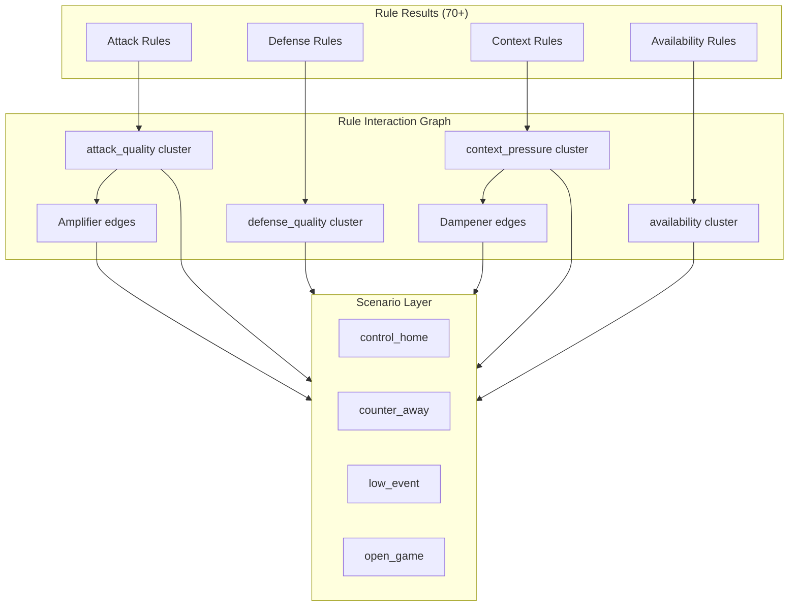

# P2A — Prediction Intelligence Architecture Review (Design)

| Field | Value |
|---|---|
| Sprint id | **P2A** Prediction Intelligence Architecture Review |
| Date | 2026-07-30 |
| Document type | **Design only** — architectural review, bottleneck analysis, Projection Intelligence V2 proposal |
| Roadmap citation | [`docs/40_PRODUCT_ROADMAP.md`](../../40_PRODUCT_ROADMAP.md) (proposed addition — see §0) |
| Authority (read-only) | `AGENTS.md` · `docs/PROJECT_STATE.md` · Architecture Freeze **v0.3** · [`docs/reviews/v0.3_ARCHITECTURE_FREEZE_REVIEW.md`](../../reviews/v0.3_ARCHITECTURE_FREEZE_REVIEW.md) · [`docs/sprints/A1/A1_PREDICTION_EVALUATION_COMPLETION_REPORT.md`](../A1/A1_PREDICTION_EVALUATION_COMPLETION_REPORT.md) · [`docs/sprints/A2/A2_PREDICTION_CALIBRATION_COMPLETION_REPORT.md`](../A2/A2_PREDICTION_CALIBRATION_COMPLETION_REPORT.md) · [`docs/sprints/V1A/V1A_FOOTBALL_INTELLIGENCE_VALIDATION_COMPLETION_REPORT.md`](../V1A/V1A_FOOTBALL_INTELLIGENCE_VALIDATION_COMPLETION_REPORT.md) · [`docs/sprints/O1/O1_FOOTBALL_INTELLIGENCE_CONTRIBUTION_COMPLETION_REPORT.md`](../O1/O1_FOOTBALL_INTELLIGENCE_CONTRIBUTION_COMPLETION_REPORT.md) · [`docs/architecture/FOOTBALL_INTELLIGENCE_V3_KNOWLEDGE_MODEL_DESIGN.md`](../../architecture/FOOTBALL_INTELLIGENCE_V3_KNOWLEDGE_MODEL_DESIGN.md) · [`docs/sprints/A1/A1_5_FOOTBALL_PROJECTION_FRAMEWORK.md`](../A1/A1_5_FOOTBALL_PROJECTION_FRAMEWORK.md) |
| Scope | Review whether the deterministic football prediction pipeline has reached its **architectural** limit; design Projection Intelligence V2 and a closed-loop optimization workflow |
| Explicit exclusions | Production code · package changes · Provider / Evidence / Feature / Rule / Projection / Evaluation / Calibration / Validation / Contribution implementation · ML · LLM prediction · new Bible Engines · Architecture Freeze amendment |

---

## 0. Governance note

This sprint is **design only**. No production code was written or modified.

Per `AGENTS.md` Project Governance Rule, every new Sprint must cite `docs/40_PRODUCT_ROADMAP.md`. **P2A is not yet listed in doc 40.** This document records that gap (same pattern as V1A/O1 governance notes) and recommends adding a **P2A** entry under a new **Prediction Intelligence** track before any P2B+ coding sprint starts.

**Relationship to adjacent work:**

| Document / Sprint | Relationship |
|---|---|
| Football Intelligence v3 Knowledge Model (V3-KM) | Extends **upstream** Intelligence (Evidence → Feature → Rule). P2A addresses **downstream** Projection architecture — complementary, not competing |
| M1B (authorized next coding sprint) | Unaffected. M1B adds Manager Intelligence consume through the **existing** Projection channel |
| A1 → A2 → V1A → O1 trust track | Provides measurement infrastructure P2A designs a **governed feedback loop** for — does not modify |
| Architecture Freeze v0.3 | Ratified dual-input Projection (Features → λ, Rules → softmax). P2A proposes V2 **within** `@fas/analysis` ownership — not a new Engine |

---

## 1. Executive summary

The Football Intelligence MVP plus Club/Player Intelligence and the A1→O1 trust track prove that FAS can **collect**, **reason about**, and **measure** football signals at scale. They also expose a structural ceiling: **prediction quality is no longer primarily limited by missing Features or Rules**. It is limited by how Projection **combines** those signals.

**Verdict:** the current `independent_poisson.v1` + flat rule-weight softmax model has reached its **architectural limit** for accuracy improvement. Adding Intelligence domains (Manager, Team Style, Tactical Matchup, …) through the existing L-track pattern will produce **diminishing returns** until Projection moves from *independent rule aggregation* to *structured football reasoning*.

**Recommended direction:** **Projection Intelligence V2** — a deterministic, versioned upgrade inside `@fas/analysis` that introduces:

1. **Scenario Layer** — multiple plausible match scripts, each with its own λ/1X2 sub-distribution  
2. **Rule Interaction Graph** — structured combination replacing flat weight sums  
3. **Unified distribution basis** — scorelines, goal range, and 1X2 from one coherent generative claim  
4. **Confidence decomposition** — component-level uncertainty instead of a single scalar  
5. **Closed-loop optimization** — Evaluation History → governed artifact proposals → human promotion → future Projection pins

All proposals remain **deterministic**, **reviewable**, and **governed**. No ML. No LLM prediction.

---

## 2. Pipeline under review

```text
Evidence
  ↓
Feature  (feature.v2.p1b.player — 70+ Features across 9 domains)
  ↓
Rule     (rule.mvp.i2b.market — 70 Rules; Market channel: none)
  ↓
Projection  (projection.v2.p1b.player — independent_poisson.v1)
  ↓
Scenario  (scenario.mvp.a05 — Most Likely / Second Likely / Upset)
  ↓
Confidence  (confidence.mvp.a05)
  ↓
Evaluation  (A1 — sealed prediction vs MATCH_RESULT)
  ↓
Evaluation History  (A1.5 — append-only)
  ↓
Calibration  (A2 — measurement only)
  ↓
Validation  (V1A — profile partitions)
  ↓
Contribution  (O1 — domain presence)
```

### 2.1 Current Projection mechanics (ground truth from code)

| Stage | What happens | Key limitation |
|---|---|---|
| **λ baseline** | `computeLambdas()` uses **only 6 Features**: `attackRating*`, `defenseRating*`, `homeAdvantage`. Formula: `λ = LAMBDA0 × (attack/50) / (defense/50) × homeFactor` | xG, Club, Player, Context, Advanced Stats **never enter λ** |
| **Poisson matrix** | Independent Poisson (`independent_poisson.v1`), G_MAX=6, separate home/away λ | Assumes goal independence; weak draw modeling |
| **Rule adjustment** | Sum PASS weights on `home+` / `away+` football-channel Rules → `delta = 0.08 × (homeSignal − awaySignal)` → `softmaxAdjust` on 1X2 only | Flat aggregation; ~50 Rules in one channel |
| **Calibration** | `applyCalibration()` on adjusted 1X2; pinned artifact (`population_demo_v1` default) | Population frequency-ratio; not Evaluation-qualified |
| **Scorelines** | From **pre-rule** Poisson matrix (`scorelinesBasis: "pre_rule_adjustment"`) | **Dual basis**: 1X2 post-rule, scorelines pre-rule |
| **Scenario** | Top 3 scorelines + upset contradictor from pre-rule matrix | No qualitative match scripts |
| **Confidence** | `0.35×A + 0.30×C + 0.35×S`, penalized by contradiction X | Single scalar; not decomposed by failure mode |

Ratified Freeze boundary (v0.3 §6.3): Features supply λ baseline **S**; Football Rules supply directional 1X2 adjustment. This review **does not propose reversing** that boundary — it proposes **evolving** how each side contributes in V2.

---

## 3. Deliverable 1 — Current Projection review

### 3.1 Architectural strengths (preserve in V2)

| Strength | Evidence |
|---|---|
| Deterministic and sealed | Every projection carries checksum, model version, upstream refs |
| Epistemic honesty | Blocked status when required Features missing; limitations array always present |
| Market/Football split | Market Rules `channel: none`; no odds softmax blend |
| Single probability owner | A1.5 contract: Projection owns 1X2; Scenario/Confidence consume |
| Trust track ready | A1→O1 measure sealed outputs without mutating history |
| Versioned pins | `projection.v2.*`, `independent_poisson.v1`, calibration artifact id |

### 3.2 Structural weaknesses

#### 3.2.1 Independent rule weighting

```text
delta = RULE_ADJUSTMENT_SCALE × (Σ home+ weights − Σ away+ weights)
```

- Each PASS Rule contributes its fixed weight (0.25–0.7) independently.  
- **No interaction terms**: `XG_DOMINANCE` PASS + `POSSESSION_HOME_EDGE` PASS = simple sum, even when both encode the same underlying dominance.  
- **No conditional logic**: `KEY_PLAYER_MISSING_AWAY` PASS does not amplify `ATTACK_STRENGTH_EDGE` — it merely adds another weight.  
- **Saturation**: with 15–25 Rules often PASS simultaneously, `delta` compresses toward ±1.6 max (20 rules × 0.7 × 0.08), making marginal Rules invisible.

#### 3.2.2 λ–Rule split creates information loss

Intelligence Features (xG quality, club strength, player availability, fatigue) flow:

```text
Feature → Rule (threshold PASS/FAIL) → weight sum → softmax nudge on 1X2
```

Continuous Feature values are **quantized** at the Rule boundary. A team with xG attack quality 72 and one with 51 both become binary PASS/FAIL at threshold — losing gradation that λ could use directly.

Known debt (Freeze v0.3 §9): *"Projection λ — Still independent Poisson — not xG-aware rewrite."*

#### 3.2.3 Dual distribution basis

From `deterministic-match-projection.ts`:

- `scorelinesBasis: "pre_rule_adjustment"`  
- `oneXTwoBasis: "post_rule_and_calibration"`

A1 Evaluation scores **Winner Hit** from post-rule 1X2 but **Score Hit** from pre-rule scorelines. The model can predict Home Win while Most Likely scoreline is Away-favouring — an internally inconsistent football claim.

#### 3.2.4 No scenario reasoning

`buildScenarioSet()` selects three scorelines from a single Poisson peak structure. It cannot represent:

- "Home controls but fails to convert" (high possession, low λ_home)  
- "Away counter-attack script" (low possession, high λ_away efficiency)  
- "Tactical stalemate" (low λ both sides, elevated draw mass)  
- "Late-goal volatility" (unchanged Poisson, different temporal script)

The existing `ScenarioSet` (quantitative) must not be confused with qualitative match scripts — see V3-KM §5.1 naming guidance.

#### 3.2.5 No match-state or tactical progression

Projection is a **static pre-match snapshot**. Football is a temporal process:

- First-half vs second-half scoring patterns differ systematically.  
- Tactical adjustments (leading team sits, trailing team pushes) shift effective λ.  
- Card/red-card states change game dynamics — not modeled at all.

Pre-match projection cannot know in-match states, but it **can** reason about **which pre-match script is most likely** — V1 cannot.

#### 3.2.6 Scoreline generation limitations

- Independent Poisson with G_MAX=6 truncates tail mass (~0.5–2% for typical λ).  
- No correlation structure (e.g., "when home scores 3, away rarely scores 3" in same script).  
- Draw mass emerges only from diagonal matrix cells — no explicit low-scoring tactical draw pathway.  
- Top 3 scorelines often cluster (1-0, 1-1, 2-1) — failing to surface structurally different worlds.

#### 3.2.7 Uncertainty not decomposed

Confidence collapses agreement (A), completeness (C), strength (S), and contradiction (X) into one 0–0.95 scalar. Analysts cannot see *why* confidence is low:

- Missing xG vs conflicting Rules vs weak strength separation vs draw-prone league?

A2 Calibration measures population reliability of this scalar but cannot diagnose **which Projection component** miscalibrates.

---

## 4. Deliverable 2 — Current prediction bottlenecks

Where accuracy is lost today, ordered by estimated impact:

| Rank | Bottleneck | Layer | Mechanism of loss |
|---|---|---|---|
| 1 | **Flat rule aggregation** | Projection | Correlated Rules double-count; saturation hides new domains |
| 2 | **λ ignores Intelligence Features** | Projection | xG/Club/Player/Context only reach 1X2 via binary Rules |
| 3 | **Dual distribution basis** | Projection → Scenario | Winner and scoreline predictions can contradict |
| 4 | **Independent Poisson draw modeling** | Projection math | Draw probability structurally underestimated in low-scoring leagues |
| 5 | **Single-script assumption** | Projection | One λ pair cannot represent multi-modal match outcomes |
| 6 | **Rule quantization** | Rule → Projection | Continuous Feature gradation lost at PASS/FAIL boundary |
| 7 | **No feedback loop** | Trust track | A2/V1A/O1 measure but do not inform Projection policy versions |
| 8 | **Confidence miscalibration** | Confidence | Single scalar poorly tracks actual hit rate (A2 ECE unqualified) |
| 9 | **Feature coverage variance** | Evidence | xG absent on many fixtures — but this is **data**, not architecture |
| 10 | **Population calibration artifact** | Statistics | `population_demo_v1` not Evaluation-qualified |

**Key insight:** items 1–6 are **architectural**. Item 9 is data coverage. The task focus ("not collecting more football data") correctly targets 1–8.

---

## 5. Deliverable 3 — Football reasoning bottlenecks

These are **football-knowledge structure** gaps — not missing metrics:

| Gap | What football requires | What V1 does |
|---|---|---|
| **Tactical interaction** | Style A vs Style B produces non-additive effects (press vs build-up) | Each side's Rules summed independently |
| **Attack–defense coupling** | Strong attack vs weak defense is multiplicative, not additive | λ formula has multiplicative structure, but Rule layer is purely additive on 1X2 |
| **Game script plurality** | Most matches have 2–3 plausible narratives before kickoff | One Poisson world + 3 scoreline picks |
| **Temporal structure** | Teams that score early vs late have different win probabilities | No goal-timing profile in Projection (V3-KM §4.9 proposes upstream Feature only) |
| **Draw as tactical outcome** | Low-event stalemates are a *script*, not a Poisson accident | Draw = diagonal matrix mass |
| **Uncertainty typing** | "We don't know" vs "genuinely balanced" vs "conflicting signals" | Single confidence scalar |
| **Domain composition** | xG edge + missing key player + fatigue = conditional compound | Rules fire independently; only X penalizes direct contradictions |

**Why Feature quality is no longer the primary bottleneck:**

The L-track pattern (L1A→L1B, P1A→P1B, M1A→M1B) adds Features and Rules successfully. O1 Contribution and V1A Validation are designed to measure whether those domains help — but every new domain enters the **same flat softmax channel**. Structural estimates (V3-KM §7) rank upstream domains Medium–High, yet **Projection architecture converts all domain signal into the same saturated delta**. Adding Rule #71 does not fix Rule #1–70 correlation.

Evidence from the trust track:

- O1: no domain yet reaches `sampleSize ≥ 20` for qualified measurement.  
- V1A: profile comparison is observational partition — cannot prove counterfactual "what if Projection used xG in λ."  
- A2: ECE/Brier unqualified on demo population.

**Conclusion:** upstream Intelligence can still improve (M1B, Team Style, Tactical Matchup per V3-KM), but **returns diminish** until Projection can **compose** signals structurally rather than **accumulate** weights.

---

## 6. Deliverable 4 — Projection Intelligence V2 architecture

### 6.1 Design principles

1. **Remain inside `@fas/analysis`** — no new Engine (A1.5 ownership rule).  
2. **Deterministic** — identical inputs + policy version ⇒ identical output.  
3. **Preserve epistemic split** — Market stays findings-only unless explicit Freeze review.  
4. **Version everything** — `projection.v3.*`, `probability_model.v2`, sub-policy ids.  
5. **Sealed history immutable** — V2 applies to future runs only (A2 calibration governance).  
6. **Honest absence** — missing inputs reduce script coverage, never invented neutrality.

### 6.2 V2 pipeline

```text
FeatureBundle + RuleResults
        │
        ▼
┌───────────────────────────────────────┐
│  Rule Interaction Graph (RIG)         │  ← replaces flat weight sum
│  Structured rule clusters + edges     │
└───────────────────────────────────────┘
        │
        ▼
┌───────────────────────────────────────┐
│  Scenario Layer (SL)                  │  ← NEW: 2–4 deterministic scripts
│  Each script: label, weight, drivers  │
└───────────────────────────────────────┘
        │
        ├─► Script A: λ_A, matrix_A, 1X2_A
        ├─► Script B: λ_B, matrix_B, 1X2_B
        └─► Script C: λ_C, matrix_C, 1X2_C
        │
        ▼
┌───────────────────────────────────────┐
│  Multi-path Projection Merge (MPM)    │  ← deterministic ensemble
│  Final λ, 1X2, scorelines, goal range │
└───────────────────────────────────────┘
        │
        ▼
┌───────────────────────────────────────┐
│  Confidence Decomposition (CD)        │  ← component uncertainties
└───────────────────────────────────────┘
        │
        ▼
  Sealed DeterministicMatchProjectionV2
        │
        ▼
  ScenarioSet (quantitative trio — unchanged contract)
        │
        ▼
  Match Tactical Tags (optional overlay — V3-KM §5, narrative only)
```

### 6.3 Component specifications

| Component | Replaces / extends | Input | Output |
|---|---|---|---|
| **Rule Interaction Graph (RIG)** | Flat `homeSignal − awaySignal` | RuleResults + FeatureBundle (for continuous rescues) | Structured `directionalImpulse` per cluster + interaction adjustments |
| **Scenario Layer (SL)** | Implicit single world | RIG output + FeatureBundle | 2–4 `MatchScript` objects with weights summing to 1 |
| **Script Generator** | `computeLambdas()` only | Per-script λ modifiers from Features **and** Rules | Per-script λ_home, λ_away |
| **Distribution Engine** | `independent_poisson.v1` | Per-script λ pair | Matrix, 1X2, scorelines, goal range — **unified basis** |
| **Multi-path Merge (MPM)** | N/A | Weighted script distributions | Final sealed distribution |
| **Confidence Decomposition (CD)** | Single A/C/S/X scalar | RIG conflicts, script concentration, completeness | Component map + aggregate band |
| **Strategy Selector** | Fixed recommendation policy | CD + market conflict gates | Recommendation code |

### 6.4 Probability model upgrade (`probability_model.v2`)

Proposed deterministic generative family (analysis only — no formulas committed):

| Option | Description | Draw modeling | Complexity |
|---|---|---|---|
| **A: Correlated Poisson** | Bivariate Poisson with shared component | Better | Medium |
| **B: Dixon–Coles adjustment** | Independent Poisson + low-score correlation factor | Good | Medium |
| **C: Negative Binomial mixture** | Overdispersion for high-variance scripts | Good | Medium–High |
| **D: Script-mixture only** | Keep independent Poisson per script; merge fixes draw | Moderate | Low–Medium |

**Recommendation:** start with **D** (lowest migration risk) — multi-script mixture captures draw/stalemate without new math library; add **B** in a later pin if draw calibration remains poor.

### 6.5 Feature → λ path (V2)

Extend λ computation beyond 6 foundation Features via **governed Feature groups**:

| Feature group | λ role | Example Features |
|---|---|---|
| **Foundation** (required) | Base attack/defense/home | `attackRating*`, `defenseRating*`, `homeAdvantage` |
| **Quality** (optional) | λ modifier when present | `xgAttackQuality*`, `xgDefenseQuality*`, `finishingEfficiency*` |
| **Context** (optional) | λ modifier | `fatigueIndex*`, `rotationPressure*` |
| **Availability** (optional) | λ suppressor | `availabilityPenalty*`, `keyPlayerAvailability*` |

Rules still produce **findings**, but V2 allows Features to **directly modulate λ within pinned bounds** — extending the ratified dual-input model rather than replacing it. Rule Interaction Graph then adjusts **script weights and 1X2 shape**, not just a single softmax delta.

---

## 7. Deliverable 5 — Scenario Layer proposal

### 7.1 Purpose

Represent **multiple plausible pre-match match scripts**, each a coherent football narrative with its own generative parameters.

Distinct from:

- **`ScenarioSet`** (quantitative: mostLikely/secondLikely/upset scorelines) — **unchanged**  
- **Match Tactical Tags** (V3-KM §5: Rule-combination labels, narrative-only) — **complementary overlay**

### 7.2 Script catalog (deterministic, versioned `matchScripts.v1`)

| Script id | Label | Typical driver Rules/Features | λ character |
|---|---|---|---|
| `control_home` | Home control | Possession edge + home attack + stability | Higher λ_home, moderate λ_away |
| `control_away` | Away control | Away possession/quality edges | Higher λ_away |
| `counter_away` | Away counter | Away efficiency + home possession without conversion | Lower λ_home, efficient λ_away |
| `counter_home` | Home counter | Mirror | Lower λ_away, efficient λ_home |
| `low_event` | Tactical stalemate | Dual stable defense + low chance creation | Low λ both, elevated draw |
| `open_game` | Open/exchange | Both attack edges + fragile defenses | High λ both |
| `fatigue_late` | Late-goal volatility | Fatigue/rotation pressure on one side | Standard λ + wider goal range |

### 7.3 Script selection mechanism

```text
For each script in catalog:
  affinity = Σ (ruleClusterWeight × clusterScriptAffinity[cluster][script])
           + Σ (featureGroupWeight × featureScriptAffinity[group][script])
  weight = softmax_normalize(affinity)

Filter: keep scripts with weight ≥ MIN_SCRIPT_WEIGHT (e.g. 0.12)
Require: at least 2 scripts OR explicit "single_script" limitation
```

All affinity tables are **pinned deterministic constants** — not learned. Promotion to new table version follows closed-loop workflow (§10).

### 7.4 Script output contract

```typescript
// Conceptual — not production code
interface MatchScript {
  readonly scriptId: string;
  readonly label: string;
  readonly weight: number;
  readonly lambdaHome: number;
  readonly lambdaAway: number;
  readonly driverRuleIds: readonly string[];
  readonly driverFeatureNames: readonly string[];
  readonly limitations: readonly string[];
}
```

### 7.5 Expected impact

| Metric | V1 | V2 Scenario Layer |
|---|---|---|
| Draw accuracy | Poor in low-scoring leagues | `low_event` script elevates draw mass explicitly |
| Score accuracy | Pre-rule scorelines | Unified basis from merged scripts |
| Upset detection | Single contradictor scoreline | `counter_*` scripts surface plausible upset paths |
| Analyst trust | "Why 2-1?" | "Open game script (38%) + Home control (41%)" |

---

## 8. Deliverable 6 — Rule Interaction proposal

### 8.1 Problem with flat aggregation

Current: 50 Rules → two sums → one delta.

V2: Rules → **clusters** → **interaction edges** → structured impulse.

### 8.2 Rule clusters (conceptual)

| Cluster | Member Rules (examples) | Mutual exclusion |
|---|---|---|
| `attack_quality` | `HOME_ATTACK_EDGE`, `XG_ATTACK_*_EDGE`, `ATTACK_STRENGTH_EDGE`, `PLAYER_ATTACK_EDGE_*` | Same-side attack rules: take **max** weight, not sum |
| `defense_quality` | `DEFENSE_*_STABLE/FRAGILE`, `XG_DEFENSIVE_*` | Same-side: max |
| `form_momentum` | `FORM_*`, `MOMENTUM_*`, `FORM_STRENGTH_EDGE*` | Same-side: max |
| `possession_shape` | `POSSESSION_*_EDGE`, `CHANCE_CREATION_*_EDGE` | Same-side: max |
| `context_pressure` | `FATIGUE_*`, `REST_ADVANTAGE_*`, `ROTATION_PRESSURE` | Conditional compound |
| `availability` | `AVAILABILITY_*`, `KEY_PLAYER_MISSING_*`, `PLAYER_AVAILABILITY_EDGE_*` | Amplifier edges |
| `club_identity` | `CLUB_STRENGTH_EDGE*`, `LEAGUE_STRENGTH_EDGE*`, `MANAGER_STABILITY*` | Same-side: max |
| `head_to_head` | `H2H_SUPPORTS_*` | Optional; excluded from denominator when INAPPLICABLE (already) |

### 8.3 Interaction edges (deterministic)

| Edge type | Example | Effect |
|---|---|---|
| **Amplifier** | `KEY_PLAYER_MISSING_AWAY` PASS + `ATTACK_STRENGTH_EDGE` PASS (home) | ×1.15 on home cluster impulse |
| **Dampener** | `KNOCKOUT_CONTEXT` PASS | ×0.85 on all attack clusters (cautious knockout) |
| **Conditional gate** | `XG_DOMINANCE` PASS requires `xgAttackQuality*` Feature present | Otherwise cluster contribution halved + limitation |
| **Contradiction** | Both `DEFENSE_HOME_STABLE` and `DEFENSE_HOME_FRAGILE` PASS | Impossible — should not occur; if detected, block cluster |
| **Cross-side tension** | Strong home attack cluster + strong away attack cluster | Feeds `open_game` script affinity, not cancellation |

### 8.4 Cluster → Projection mapping

```text
clusterImpulse[side] = max(ruleWeight for PASS rules in cluster, side)
interactionMultiplier = Π edgeFactors (bounded [0.5, 1.5])
netDirection = Σ (clusterImpulse[home] × interactionMultiplier) − Σ (clusterImpulse[away] × ...)
```

Replaces `RULE_ADJUSTMENT_SCALE × (homeSignal − awaySignal)` with bounded, interpretable components.

### 8.5 Rule Graph diagram



---

## 9. Deliverable 7 — Projection strategy comparison

Comparison of V2 architectural directions (analysis only):

| Strategy | Mechanism | Deterministic | Draw/score | Rule interaction | Migration risk | Recommended phase |
|---|---|---|---|---|---|---|
| **V1 baseline** (current) | Single λ + flat softmax | Yes | Weak | None | — | Legacy pin only |
| **S1: Rule Graph only** | RIG → adjusted softmax; single λ | Yes | Moderate | Yes | Low | P2B |
| **S2: Feature-enriched λ** | xG/Context in λ; Rules → RIG | Yes | Moderate | Yes | Medium | P2C |
| **S3: Scenario Layer** | Multi-script mixture | Yes | Strong | Yes | Medium | P2D |
| **S4: Dixon–Coles** | Correlation-adjusted matrix | Yes | Strong (draw) | N/A | Medium | P2E |
| **S5: State machine** | Pre-match phase model (1H/2H split) | Yes | Moderate | Yes | High | P2F (research) |
| **S6: Deterministic ensemble** | Multiple policy pins merged | Yes | Depends | Depends | High | Defer |
| **S7: xG-native distribution** | Expected goal distribution from xG Features | Yes | Strong | Partial | Medium | P2E (with S2) |
| **S8: Strategy selection** | Pick best strategy per match profile | Yes | Strong | Yes | Medium | P2D (part of SL) |

### 9.1 Evaluation criteria

| Criterion | Weight | Notes |
|---|---|---|
| Winner accuracy improvement potential | High | Primary A1 metric |
| Draw accuracy | High | Known V1 weakness |
| Score/scenario hit | Medium | Requires unified basis |
| Internal consistency | High | Eliminate dual basis |
| Explainability | Medium | Scenario Layer + CD |
| Migration/replay safety | High | Must not rewrite history |
| Implementation cost | Medium | Prefer incremental pins |

### 9.2 Recommended strategy stack

**Primary:** S1 + S2 + S3 (Rule Graph + Feature-enriched λ + Scenario Layer)  
**Secondary:** S4 (Dixon–Coles) if draw calibration still unqualified after S3  
**Defer:** S5 (State machine), S6 (Ensemble of unrelated policies)

**Explicitly rejected:**

| Approach | Reason |
|---|---|
| Machine Learning | Violates task constraint; breaks determinism/reviewability |
| LLM prediction | Violates task constraint; epistemic boundary |
| Market softmax blend | Violates Freeze v0.3 Market/Football split |

---

## 10. Deliverable 8 — Closed-loop optimization design

### 10.1 Current state (open loop)

```text
Projection (pin vN) → seal → Evaluation History → A2/V1A/O1 measure → display only
                                                              ↓
                                                         (no return path)
```

A2 explicitly: *"never adjusts Prediction."* O1: *"never claims causation."* This is correct for **measurement**. It is insufficient for **improvement**.

### 10.2 Target state (closed loop, governed)

```text
┌─────────────────────────────────────────────────────────────────┐
│                     OFFLINE OPTIMIZATION PLANE                     │
│  (Statistics + Evaluation methodology — never mutates seals)     │
└─────────────────────────────────────────────────────────────────┘
        ↑ read-only                    ↓ proposals only
Evaluation History ──► Diagnostics ──► Candidate Artifacts
(A1.5)                 Engine           (new policy tables)
        ↑                                    │
        │                                    ▼
        │                          Offline Replay Validation
        │                          (counterfactual on sealed inputs)
        │                                    │
        │                                    ▼
        │                          Human Promotion Gate
        │                                    │
        └──────── future runs only ◄─────────┘
                    pin new policy version
```

### 10.3 Feedback surfaces (what each trust-track component contributes)

| Component | Diagnostic output | Feeds V2 optimization how |
|---|---|---|
| **Evaluation History (A1.5)** | Per-match sealed snapshot + outcome | Raw dataset for all offline analysis |
| **A1 Evaluation** | Winner/score/scenario hit, rule coverage | Identify which Rule clusters misfire |
| **A2 Calibration** | ECE, Brier, bucket reliability | Target Confidence Decomposition recalibration |
| **V1A Validation** | Profile-partition accuracy | Detect which Feature groups deserve λ vs Rule-only |
| **O1 Contribution** | Domain presence vs accuracy | Prioritize which upstream domains need Projection consume change |

### 10.4 Candidate artifact types (new, governed)

| Artifact | Owner | Consumed by | Promotion gate |
|---|---|---|---|
| `ruleClusterPolicy.v2` | `@fas/analysis` | RIG | Evaluation replay + human sign-off |
| `matchScripts.v1` affinity tables | `@fas/analysis` | Scenario Layer | Same |
| `lambdaFeatureGroups.v2` | `@fas/analysis` | λ computation | Same |
| `confidenceDecomposition.v2` | `@fas/analysis` | CD module | A2 bucket improvement evidence |
| `calibrationArtifact.v2` | `@fas/statistics` | Projection 1X2 post-process | A2 qualified thresholds met |
| `projectionStrategyPin.v3` | `@fas/analysis` | Orchestrator | Composite of above |

### 10.5 Offline replay validation (required before promotion)

For each candidate artifact:

1. **Select cohort** — Evaluation History rows matching projection model version + Feature profile.  
2. **Replay** — Recompute Projection with candidate pin on **stored** FeatureBundle + RuleResults snapshots (already in `predictionSnapshot`).  
3. **Compare** — Winner/score/draw hit rate, ECE, Brier vs sealed original.  
4. **Require** — Improvement on declared primary metric **without** degradation on draw/score beyond tolerance.  
5. **Document** — Limitations, cohort size, qualification flags (same honesty as A2).

**Critical constraint:** replay uses **sealed upstream inputs** — never re-runs Provider or Feature extractors. This preserves causality claims O1 cannot make, but offline replay can (*"given the same Features/Rules, would V2 have scored better?"*).

### 10.6 Automation boundaries

| Automated | Human required |
|---|---|
| Compute diagnostics from History | Promote artifact to `qualified` |
| Generate candidate table diffs | Accept strategy change scope |
| Run replay validation suite | Release pin for production use |
| Flag cluster misfire patterns | Override when sample unqualified |

No auto-activation (A2 governance rule preserved).

### 10.7 Confidence Decomposition feedback

Map A2 bucket failures to components:

| A2 signal | CD component to adjust |
|---|---|
| High confidence, low hit rate | Reduce A weight or cap band |
| Draw predictions miscalibrated | Elevate `low_event` script prior |
| Score hit low, winner hit OK | λ/scoreline basis (unified distribution) |
| Profile X worse in V1A | Feature group λ eligibility for profile X |

---

## 11. Deliverable 9 — Migration strategy

### 11.1 Version coexistence

| Pin | Status |
|---|---|
| `projection.v2.p1b.player` + `independent_poisson.v1` | **Frozen** — all historical seals remain valid |
| `projection.v3.0.scenario-layer` | **New pin** — opt-in for forward runs |
| `probability_model.v2.script-mixture` | Sub-pin of V3 |

Both versions run side-by-side in **offline replay**; only one pinned for live analysis at a time.

### 11.2 Migration phases

| Phase | Scope | History impact | Gate |
|---|---|---|---|
| **M0: Diagnostics** | Read-only analysis of History with V1 diagnostics | None | P2A complete |
| **M1: Unified basis fix** | Scorelines from same post-rule distribution as 1X2 | New pin only | P2B — smallest V2 slice |
| **M2: Rule Interaction Graph** | Replace flat softmax | New pin | P2C + replay validation |
| **M3: Feature-enriched λ** | xG/Context/Availability modulate λ | New pin | P2D + V1A profile check |
| **M4: Scenario Layer** | Multi-script mixture | New pin | P2E + scenario hit metrics |
| **M5: Confidence Decomposition** | Replace scalar | New pin | P2F + A2 bucket qualified |
| **M6: Closed-loop promotion** | First qualified artifact from History | Future only | Evaluation sign-off |

### 11.3 What does NOT migrate

| Item | Treatment |
|---|---|
| Sealed Evaluation History rows | Immutable — never recomputed |
| A1 metrics on old seals | Preserved with original projection model version |
| Market findings-only boundary | Unchanged unless explicit Freeze review |
| ScenarioSet contract (3 quantitative slots) | Unchanged — V2 feeds it a better distribution |
| Match Tactical Tags (V3-KM) | Orthogonal overlay — can ship independently |

### 11.4 Rollback

Pin revert to `projection.v2.*` — instant, no History mutation. Candidate artifacts remain in catalog as `superseded`.

### 11.5 Dependency on upstream Intelligence

V2 **does not block** M1B or V3-KM Phase 0 items. Upstream domains continue L-track delivery. V2 changes how their Rules/Features are **consumed** at Projection — ideally after M1B so Manager Rules enter RIG clusters from the start.

---

## 12. Deliverable 10 — Recommended coding sequence

Proposed Sprint ids (require doc 40 addition before coding):

| Order | Sprint | Delivers | Depends on |
|---|---|---|---|
| 1 | **P2B** | Unified distribution basis (fix dual-basis; scorelines post-rule) | P2A |
| 2 | **P2C** | Rule Interaction Graph v1 (cluster max + 3 interaction edges) | P2B |
| 3 | **P2D** | Feature-enriched λ v1 (xG + availability groups) | P2C |
| 4 | **P2E** | Scenario Layer v1 (4-script catalog + mixture merge) | P2D |
| 5 | **P2F** | Confidence Decomposition v1 | P2E |
| 6 | **P2G** | Offline replay validation tooling | A1.5 History + P2E |
| 7 | **P2H** | Closed-loop candidate artifact pipeline (proposal only, no auto-promote) | P2G + A2 |
| 8 | **P2I** | Dixon–Coles or NB upgrade (if draw calibration still unqualified) | P2E + A2 evidence |

**Parallel tracks (unchanged):**

| Track | Sprint | Relationship to V2 |
|---|---|---|
| Intelligence L-track | M1B Manager consume | New Rules enter RIG `club_identity` cluster |
| V3-KM Phase 0 | TT1 Match Tactical Tags | Narrative overlay — no Projection change |
| Trust track doc hygiene | Add V1/O1/P2A to doc 40 | Governance |

**Do not start P2B until:**

1. P2A design reviewed and accepted.  
2. P2B–P2I ids added to `docs/40_PRODUCT_ROADMAP.md` (or explicit task authorization).  
3. Architecture exception recorded if Feature-enriched λ is deemed a dual-input boundary extension (recommended: lightweight ADR or Freeze addendum v0.3.1 — design note only, not a full redesign).

---

## 13. Architecture limit verdict

| Question | Answer |
|---|---|
| Has the pipeline reached its **architectural** limit? | **Yes** — for accuracy via more Rules/Features alone |
| Is Feature quality the primary bottleneck? | **No** — Projection composition is |
| Is Projection still independent Rule aggregation? | **Yes** — flat weight sum + single λ world |
| Can deterministic methods improve further? | **Yes** — Scenario Layer + Rule Graph + unified basis + closed loop |
| Is ML/LLM required? | **No** |
| Does this require a new Engine? | **No** — `@fas/analysis` owns Projection Intelligence V2 |

---

## 14. Risks

| Risk | Severity | Mitigation |
|---|---|---|
| V2 scope creep into ML | High | Explicit must-not; pinned deterministic tables only |
| Dual-input boundary drift | Medium | Document λ Feature groups as extension of v0.3 ratified model |
| History replay storage gaps | Medium | Verify `predictionSnapshot` carries enough for replay before P2G |
| Scenario Layer vs ScenarioSet naming collision | Medium | Use `MatchScript` / `Scenario Layer` — never rename quantitative ScenarioSet |
| Premature promotion without qualified sample | Medium | Reuse A2 `qualified: false` pattern; MIN_SAMPLE ≥ 20 |
| Upstream/downstream coupling | Low | M1B Rules designed to map into RIG clusters when P2C ships |
| doc 40 citation gap for P2A/P2B+ | Medium | Documentation pass before P2B coding |

---

## 15. Acceptance criteria (P2A design sprint)

| # | Criterion | Status |
|---|---|---|
| 1 | Current Projection review | **Complete** (§3) |
| 2 | Current prediction bottlenecks | **Complete** (§4) |
| 3 | Football reasoning bottlenecks | **Complete** (§5) |
| 4 | Projection Intelligence V2 architecture | **Complete** (§6) |
| 5 | Scenario Layer proposal | **Complete** (§7) |
| 6 | Rule Interaction proposal | **Complete** (§8) |
| 7 | Projection strategy comparison | **Complete** (§9) |
| 8 | Closed-loop optimization design | **Complete** (§10) |
| 9 | Migration strategy | **Complete** (§11) |
| 10 | Recommended coding sequence | **Complete** (§12) |
| — | Production code changes | **None** |
| — | Package modifications | **None** |

---

## 16. Recommended next steps

1. **Human review** of this document — especially §6 dual-input λ extension and §10 closed-loop governance.  
2. **doc 40 addition** — retroactive P2A entry + proposed P2B–P2I ids.  
3. **Continue M1B** on current Projection channel — new Manager Rules should be authored with RIG cluster mapping in mind.  
4. **Authorize P2B** (unified distribution basis) as first V2 coding sprint — smallest diff, highest consistency win.  
5. **Verify History replay feasibility** — audit `predictionSnapshot` in A1.5 records for FeatureBundle + RuleResult sufficiency before P2G.

---

## Sign-off

| Item | Status |
|---|---|
| P2A Prediction Intelligence Architecture Review | **Complete (design only)** |
| Production code changes | **None** |
| Architecture Freeze v0.3 | **Unchanged** |
| Next authorized coding (unchanged) | **M1B** Manager Intelligence Features → Rules → Confidence → Projection |

---

*End of P2A Prediction Intelligence Architecture Review.*
