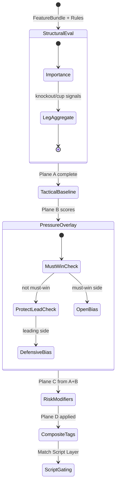

# P2B — Football State & Scenario Architecture (Design)

| Field | Value |
|---|---|
| Sprint id | **P2B** Football State & Scenario Architecture |
| Date | 2026-07-30 |
| Document type | **Design only** — Football State layer, Match Script Scenario Layer, Projection V2 integration |
| Roadmap citation | [`docs/40_PRODUCT_ROADMAP.md`](../../40_PRODUCT_ROADMAP.md) (proposed addition — see §0) |
| Parent design | [`P2A_PREDICTION_INTELLIGENCE_ARCHITECTURE_REVIEW.md`](../P2A/P2A_PREDICTION_INTELLIGENCE_ARCHITECTURE_REVIEW.md) |
| Authority (read-only) | `AGENTS.md` · `docs/PROJECT_STATE.md` · Architecture Freeze **v0.3** · [`docs/reviews/v0.3_ARCHITECTURE_FREEZE_REVIEW.md`](../../reviews/v0.3_ARCHITECTURE_FREEZE_REVIEW.md) · [`docs/architecture/FOOTBALL_INTELLIGENCE_V3_KNOWLEDGE_MODEL_DESIGN.md`](../../architecture/FOOTBALL_INTELLIGENCE_V3_KNOWLEDGE_MODEL_DESIGN.md) · [`docs/sprints/A1/A1_5_FOOTBALL_PROJECTION_FRAMEWORK.md`](../A1/A1_5_FOOTBALL_PROJECTION_FRAMEWORK.md) |
| Scope | Design deterministic Football State + Match Script layers between Rule evaluation and Projection; domain mapping; V1→V2 migration |
| Explicit exclusions | Production code · package changes · Evidence / Feature / Rule redesign · ML · LLM · new Bible Engines · Architecture Freeze amendment |

---

## 0. Governance note

This sprint is **design only**. No production code was written or modified.

**Roadmap citation gap:** P2B is not listed in `docs/40_PRODUCT_ROADMAP.md` (same pattern as P2A, V1A, O1). Add **P2B** and downstream coding ids (**P2C**–**P2I**) before any implementation sprint.

**Relationship to P2A:** P2A identified the Projection architectural limit and sketched Scenario Layer + Rule Interaction Graph at a high level. **P2B specifies** the Football State envelope, state→script activation, domain mapping, and Projection consumption contract. P2A's Rule Interaction Graph (RIG) remains a **parallel P2C** concern — Football State **consumes** RuleResults but does not replace cluster logic.

**Relationship to A1.5:** A1.5 places quantitative **`ScenarioSet`** (mostLikely / secondLikely / upset) **after** Projection. P2B introduces **`MatchScript`** (2–5 pre-projection scripts) as a **new layer** without renaming or relocating `ScenarioSet`. Both coexist with explicit naming (§2.2).

**Relationship to V3-KM:** Match Tactical Tags (V3-KM §5) remain a **post-Projection narrative overlay**. Match Scripts (P2B) are **pre-Projection probability inputs**. Different purpose, different pipeline position.

**Evidence / Feature / Rule:** unchanged. Football State reads sealed `FeatureBundle` + `RuleResult[]` only — never Provider or Evidence payloads directly.

---

## 1. Executive summary

Football prediction quality is constrained because V1 Projection treats a match as a **static snapshot** aggregated through flat Rule weights into **one Poisson world**. Football is better understood as a **space of plausible pre-match dynamics** — structural pressure (cup tie, aggregate, must-win), tactical posture (control, counter, low event), and risk modifiers (fatigue, rotation, card tendency) — each implying different goal-generation scripts.

**Recommendation:** insert two deterministic layers inside `@fas/analysis`, **after Rule evaluation and before Projection**:

```text
Evidence → Feature → Rule → Football State → Match Script → Projection → ScenarioSet → Confidence
```

| Layer | Role |
|---|---|
| **Football State (FS)** | Canonical pre-match **state envelope** — structural, tactical, pressure, and risk dimensions with explicit activation levels |
| **Match Script (MS)** | 2–5 weighted **plausible match scenarios**, each with drivers, λ modifiers, and distribution character |
| **Projection V2** | Per-script Poisson (or successor) → **weighted merge** → unified 1X2 + scorelines + goal range |

No ML. No LLM. No new Engine. No Evidence/Feature/Rule redesign.

---

## 2. Pipeline review and naming

### 2.1 Should football reasoning change?

**Yes.** The current path:

```text
Rule → Projection (single λ + flat softmax)
```

loses football structure. Rules encode **local findings**; Projection needs **global match dynamics**. A State + Script layer translates findings into **coherent football situations** before probability generation.

### 2.2 Three "scenario" concepts (must not conflate)

| Name | Policy pin (conceptual) | Pipeline position | Purpose |
|---|---|---|---|
| **Football State** | `footballState.v1` | After Rule, before Match Script | Deterministic state envelope |
| **Match Script** | `matchScript.v1` | After State, before Projection | 2–5 weighted pre-projection scripts |
| **ScenarioSet** | `scenario.mvp.a05` (unchanged) | **After** Projection | Quantitative trio: mostLikely / secondLikely / upset scorelines |

P2B owns the first two. **`ScenarioSet` contract is unchanged** — it still selects scoreline worlds from the **sealed merged Projection distribution**, not from Match Scripts directly.

### 2.3 Target pipeline (V2)

```text
┌─────────────────────────────────────────────────────────────────┐
│ UPSTREAM (unchanged)                                             │
│  Evidence → Feature → Rule                                       │
└────────────────────────────┬────────────────────────────────────┘
                             │
                             ▼
┌─────────────────────────────────────────────────────────────────┐
│ FOOTBALL STATE (NEW — @fas/analysis/football-state/)             │
│  Input: FeatureBundle + RuleResult[]                             │
│  Output: FootballStateEnvelope (versioned, checksum, limitations)│
└────────────────────────────┬────────────────────────────────────┘
                             │
                             ▼
┌─────────────────────────────────────────────────────────────────┐
│ MATCH SCRIPT LAYER (NEW — @fas/analysis/match-script/)           │
│  Input: FootballStateEnvelope + FeatureBundle + RuleResult[]     │
│  Output: MatchScriptSet (2–5 scripts, weights Σ=1)               │
└────────────────────────────┬────────────────────────────────────┘
                             │
                             ▼
┌─────────────────────────────────────────────────────────────────┐
│ PROJECTION V2 (@fas/analysis/projection/)                        │
│  Per-script λ + distribution → weighted merge → sealed envelope  │
└────────────────────────────┬────────────────────────────────────┘
                             │
                             ▼
┌─────────────────────────────────────────────────────────────────┐
│ DOWNSTREAM (unchanged contract)                                  │
│  ScenarioSet → Confidence → Report → Evaluation                  │
└─────────────────────────────────────────────────────────────────┘
```

### 2.4 Ownership (DDD)

All new modules remain in **`@fas/analysis`**. No `packages/football-state-engine`. Analysis orchestrator (`analyze-match-use-case`) gains two new steps; dependency direction unchanged (Feature/Rule packages not imported by new layers beyond existing contracts).

---

## 3. Deliverable 1 — Football State architecture

### 3.1 Purpose

Football State is a **deterministic, sealed envelope** describing the **pre-match situational and tactical context** in which goal generation should be modeled. It is **not** live in-match tracking (V1 is pre-match only). It is **not** a probability distribution. It is the **bridge** between Rule findings and Match Scripts.

### 3.2 State envelope contract (conceptual)

```typescript
// Conceptual — not production code
interface FootballStateEnvelope {
  readonly policyVersion: "footballState.v1";
  readonly matchId: MatchId;
  readonly dimensions: Readonly<Record<StateDimensionId, StateDimensionValue>>;
  readonly compositeTags: readonly CompositeStateTag[];  // derived booleans
  readonly driverRuleNames: readonly string[];
  readonly driverFeatureNames: readonly string[];
  readonly limitations: readonly string[];
  readonly checksum: string;
}

interface StateDimensionValue {
  readonly level: "absent" | "low" | "medium" | "high";
  readonly score: number;           // 0..1 deterministic scalar
  readonly basis: "feature" | "rule" | "derived" | "composite";
  readonly sourceRefs: readonly string[];  // rule names or feature names
}
```

Every dimension declares **honest absence** (`level: "absent"`) when inputs are missing — never a fabricated neutral score.

### 3.3 State dimension catalog (`footballState.v1`)

Dimensions grouped into four **planes**. Each plane is computed independently then composed.

#### Plane A — Structural context (competition / tie)

| Dimension id | Meaning | Primary inputs | Notes |
|---|---|---|---|
| `match_importance` | Stakes of fixture | `knockoutContext` Feature, `KNOCKOUT_CONTEXT` Rule, competition type from `MATCH_INFO` | League routine vs knockout |
| `competition_mode` | League vs cup character | `MATCH_INFO.competition`, knockout Feature | Enum-like: `league` / `domestic_cup` / `european_knockout` / `unknown` |
| `leg_phase` | First leg / second leg / single | `MATCH_CONTEXT` leg metadata when present | **Absent** when not a two-legged tie |
| `aggregate_balance` | Who leads on aggregate | `aggregateScore` on MATCH_CONTEXT metrics | Parsed to home-leading / away-leading / level / absent |
| `tie_pressure` | Must-score / must-not-lose dynamic | Derived from `leg_phase` + `aggregate_balance` | Composite — see §4 |

#### Plane B — Tactical posture (expected game shape)

| Dimension id | Meaning | Primary inputs |
|---|---|---|
| `home_control` | Home likely to dominate ball/territory | `POSSESSION_HOME_EDGE`, `CHANCE_CREATION_HOME_EDGE`, `attackRatingHome` |
| `away_control` | Away likely to dominate | Mirror |
| `balanced_contest` | Neither side clear control | Low control both sides + near parity Rules |
| `open_game_tendency` | End-to-end / high chance volume | Both `ATTACK_*_EDGE` + fragile defense Rules |
| `defensive_game_tendency` | Low-event / cautious | Both `DEFENSE_*_STABLE`, low chance creation |
| `counter_attack_tendency` | Underdog counter script | Control one side + efficiency other side (xG finishing) |

#### Plane C — Pressure dynamics (score-state **expectations**, pre-kickoff)

These model **likely in-match pressure patterns**, not observed scoreline (pre-match).

| Dimension id | Meaning | Activation |
|---|---|---|
| `must_win_home` | Home must win (knockout / aggregate) | Second leg + home trailing aggregate |
| `must_win_away` | Away must win | Second leg + away trailing aggregate |
| `home_protect_lead` | Home can sit on advantage | Leading aggregate + second leg |
| `away_protect_lead` | Away can sit on advantage | Mirror |
| `favourite_expectation` | Pre-match favourite exists | Club strength / market lean (market **state input only**, not probability) |
| `underdog_upset_path` | Credible upset channel | Underdog efficiency + favourite fragility |
| `late_comeback_pressure` | Late-goal volatility expected | Fatigue asymmetry + must-win |

#### Plane D — Risk modifiers

| Dimension id | Meaning | Primary inputs | Honesty |
|---|---|---|---|
| `fatigue_asymmetry` | One side materially more fatigued | `FATIGUE_*`, `REST_ADVANTAGE_*`, `fatigueIndex*` | Feature + Rule |
| `rotation_influence` | Rotation/squad depth stress | `ROTATION_PRESSURE`, `rotationPressure*` | Rule + Feature |
| `discipline_volatility` | Card-heavy match risk | `DISCIPLINE_*_RISK` Rules | **Pre-match risk only** |
| `red_card_influence` | — | — | **Always `absent` pre-match** — no live card state in V1 scope; limitation required if ever referenced |
| `availability_asymmetry` | Key absence skew | `AVAILABILITY_*`, `KEY_PLAYER_MISSING_*`, Player Features | Rule + Feature |

**Red card rule:** `red_card_influence` is included in the catalog for forward compatibility but **must remain `absent`** in pre-match V1/V2 private product. Any future in-play product would be a separate milestone with explicit Freeze review — not P2B scope.

### 3.4 Composite state tags

Derived booleans for Scenario activation readability:

| Tag | Condition (illustrative) |
|---|---|
| `KNOCKOUT_HIGH_STAKES` | `match_importance ≥ medium` AND competition_mode ≠ league |
| `SECOND_LEG_TRAILING_HOME` | leg_phase = second AND aggregate_balance = away_leading |
| `SECOND_LEG_PROTECT_HOME` | leg_phase = second AND aggregate_balance = home_leading |
| `TACTICAL_STALEMATE_LIKELY` | defensive_game_tendency ≥ medium AND open_game_tendency ≤ low |
| `OPEN_EXCHANGE_LIKELY` | open_game_tendency ≥ medium |
| `COUNTER_SCRIPT_AVAILABLE` | counter_attack_tendency ≥ medium |
| `LATE_GOAL_RISK` | late_comeback_pressure ≥ medium OR fatigue_asymmetry ≥ medium |

Tags are **deterministic derivatives** — not a separate input source.

### 3.5 Football State module boundaries

| Allowed | Forbidden |
|---|---|
| Read FeatureBundle numeric values | Read Evidence payloads |
| Read RuleResult status/channel/weight | Recompute Rules |
| Derive composite dimensions from Features + Rules | Call Provider |
| Emit limitations for absent dimensions | Invent aggregate/leg facts |
| Pin `footballState.v1` policy tables | Emit probabilities |

---

## 4. Deliverable 2 — State transition model

### 4.1 What "transition" means pre-match

V1 FAS is **pre-match only**. Football State does not simulate minute-by-minute match progression. The **State Transition Model (STM)** is a **deterministic directed graph** describing how **structural state constrains tactical and pressure dimensions**, which in turn **gate Match Script activation**.

This is **conditional composition**, not temporal simulation.

### 4.2 Transition graph (conceptual)

```text
                    ┌─────────────────────┐
                    │  Structural Plane A  │
                    │  importance, leg,    │
                    │  aggregate, mode     │
                    └──────────┬──────────┘
                               │
              ┌────────────────┼────────────────┐
              ▼                ▼                ▼
     ┌────────────────┐ ┌─────────────┐ ┌──────────────────┐
     │ Pressure Plane C │ │ Tactical B  │ │ Risk Plane D     │
     │ must_win, protect│ │ control,    │ │ fatigue, rotation│
     │ favourite, upset │ │ open, def,  │ │ discipline       │
     └────────┬─────────┘ │ counter     └────────┬─────────┘
              │           └──────┬──────┘          │
              └────────────┬─────┴─────────────────┘
                           ▼
                  ┌─────────────────┐
                  │ Composite Tags   │
                  └────────┬────────┘
                           ▼
                  ┌─────────────────┐
                  │ Match Script     │
                  │ activation       │
                  └─────────────────┘
```

### 4.3 Transition rules (pinned table excerpts)

| From state | Transition | To state | Effect |
|---|---|---|---|
| `leg_phase = second_leg` + `aggregate_balance = away_leading` | **T1** | `must_win_home = high` | Enables must-win pressure scripts |
| `must_win_home = high` | **T2** | `open_game_tendency += medium` | Trailing side pushes — elevates open/late scripts |
| `home_protect_lead = high` | **T3** | `defensive_game_tendency += medium` | Leading side sits — elevates low_event, suppresses open |
| `away_control = high` + `home_control = low` + xG efficiency home | **T4** | `counter_attack_tendency = high` | Home counter script path |
| `KNOCKOUT_CONTEXT PASS` | **T5** | `match_importance = min(medium)` | Floor importance in knockouts |
| `fatigue_asymmetry = high` | **T6** | `late_comeback_pressure += medium` | Late chaos script affinity |
| `DISCIPLINE_* both PASS` | **T7** | `discipline_volatility = high` | Wider goal-range modifier (not red card) |
| `aggregate_balance = absent` | **T8** | All leg-derived pressure = absent | Honest absence — no must-win from aggregate |

All transitions are **pure functions** over the dimension score map. Order of application is **fixed and versioned** (structural → tactical baseline → pressure overrides → risk modifiers → composite tags).

### 4.4 Conflict resolution

| Conflict | Resolution |
|---|---|
| `must_win_home` high AND `home_protect_lead` high | **Impossible structurally** — if detected via bad data, both capped to medium + limitation |
| `open_game` high AND `defensive_game` high | Reduce both by dampening table; prefer `balanced_contest` tag |
| Opposing control (home + away both high) | Cap both at medium; activate `balanced_contest` |
| Missing leg metadata but aggregate present | aggregate used with limitation; leg_phase = absent |

### 4.5 State transition diagram (Mermaid)



---

## 5. Deliverable 3 — Scenario Layer architecture

### 5.1 Purpose

The **Match Script Layer (MSL)** converts Football State + upstream signals into **2–5 weighted plausible match scripts**. Each script is a **coherent football narrative** with its own generative parameters for Projection.

**Not** the quantitative `ScenarioSet`. **Not** Match Tactical Tags (narrative overlay).

### 5.2 MatchScriptSet contract (conceptual)

```typescript
// Conceptual — not production code
interface MatchScriptSet {
  readonly policyVersion: "matchScript.v1";
  readonly matchId: MatchId;
  readonly scripts: readonly MatchScript[];  // length 2..5
  readonly concentration: number;            // max script weight
  readonly singleScriptFallback: boolean;
  readonly footballStateChecksum: string;
  readonly limitations: readonly string[];
  readonly checksum: string;
}

interface MatchScript {
  readonly scriptId: MatchScriptId;
  readonly label: string;
  readonly weight: number;                   // 0..1; Σ weights = 1
  readonly activationReason: string;         // human-readable
  readonly activatingRules: readonly string[];
  readonly strengtheningFeatures: readonly string[];
  readonly lambdaModifiers: Readonly<{
    homeMultiplier: number;
    awayMultiplier: number;
    drawBias: number;                       // optional draw mass nudge
  }>;
  readonly goalRangeCharacter: "low" | "standard" | "high";
  readonly limitations: readonly string[];
}
```

### 5.3 Script catalog (`matchScript.v1`)

| Script id | Label | Football meaning |
|---|---|---|
| `home_control` | Home Control | Home dominates territory; moderate conversion |
| `away_control` | Away Control | Away dominates territory |
| `away_counter` | Away Counter | Away concedes possession, efficient transitions |
| `home_counter` | Home Counter | Mirror |
| `low_event` | Low Event | Tactical stalemate; elevated draw mass |
| `open_match` | Open Match | End-to-end; high λ both sides |
| `late_chaos` | Late Chaos | Standard λ but high variance / late-goal character |

Minimum active scripts: **2**. Maximum: **5**. If only one script exceeds threshold → `singleScriptFallback: true` + limitation.

### 5.4 Layer placement vs P2A

P2A listed `control_home`, `counter_away`, etc. P2B **canonicalizes ids** and binds each script to **Football State dimensions** (§6) rather than directly to flat Rule lists. Rule Interaction Graph (P2C) may later refine cluster weights fed into State — not required for P2B design acceptance.

---

## 6. Deliverable 4 — Scenario activation logic

### 6.1 Activation pipeline

```text
FootballStateEnvelope
        +
FeatureBundle + RuleResult[] (for driver attribution)
        │
        ▼
For each script in catalog:
  rawAffinity = Σ stateDimensionScore[d] × affinityTable[script][d]
              + Σ rulePassBonus[script][ruleName]     // small, bounded
              + Σ featureStrengthBonus[script][feature] // continuous, bounded
        │
        ▼
  scriptWeight = softmax_normalize(rawAffinity, temperature=τ)
        │
        ▼
  Keep scripts where weight ≥ MIN_SCRIPT_WEIGHT (0.10)
  Require ≥ 2 scripts else merge fallback table
        │
        ▼
  Renormalize weights to Σ = 1
        │
        ▼
MatchScriptSet
```

All tables (`affinityTable`, `rulePassBonus`, `featureStrengthBonus`, `τ`) are **pinned constants** in `matchScript.v1` — not learned.

### 6.2 Per-script activation specification

#### `home_control`

| Field | Specification |
|---|---|
| **Why it exists** | Models dominant home territorial control without necessarily high scoreline |
| **When activated** | `home_control ≥ medium` AND `away_control ≤ low` |
| **Activating Rules** | `POSSESSION_HOME_EDGE`, `CHANCE_CREATION_HOME_EDGE`, `HOME_ATTACK_EDGE`, `CLUB_STRENGTH_EDGE` (home favour) — any PASS |
| **Strengthening Features** | `possessionHome`, `attackRatingHome`, `clubStrengthHome`, `xgAttackQualityHome` |
| **Projection effect** | λ_home × 1.08; λ_away × 0.92; drawBias neutral |

#### `away_control`

| Field | Specification |
|---|---|
| **Why it exists** | Away dominates — common when favourite plays away in league |
| **When activated** | `away_control ≥ medium` AND `home_control ≤ low` |
| **Activating Rules** | `POSSESSION_AWAY_EDGE`, `CHANCE_CREATION_AWAY_EDGE`, `AWAY_ATTACK_EDGE`, `CLUB_STRENGTH_EDGE_AWAY` |
| **Strengthening Features** | `possessionAway`, `attackRatingAway`, `clubStrengthAway`, `xgAttackQualityAway` |
| **Projection effect** | λ_away × 1.08; λ_home × 0.92 |

#### `away_counter`

| Field | Specification |
|---|---|
| **Why it exists** | Away sits deep and punishes transitions — classic upset script |
| **When activated** | `counter_attack_tendency ≥ medium` AND home favoured in strength |
| **Activating Rules** | `POSSESSION_HOME_EDGE` + `XG_ATTACK_AWAY_EDGE` or `PLAYER_ATTACK_EDGE_AWAY`; `DEFENSE_HOME_FRAGILE` optional amplifier |
| **Strengthening Features** | `finishingEfficiencyAway`, `xgAttackQualityAway`, high `attackRatingAway` vs `defenseRatingHome` |
| **Projection effect** | λ_home × 0.90; λ_away × 1.05; efficiency-weighted away boost |

#### `home_counter`

| Field | Specification |
|---|---|
| **Why it exists** | Home counter vs away favourite |
| **When activated** | `counter_attack_tendency ≥ medium` AND away favoured |
| **Activating Rules** | Mirror of away_counter |
| **Strengthening Features** | Mirror |
| **Projection effect** | λ_away × 0.90; λ_home × 1.05 |

#### `low_event`

| Field | Specification |
|---|---|
| **Why it exists** | Draw-prone tactical stalemate — Poisson diagonal alone undercounts |
| **When activated** | `defensive_game_tendency ≥ medium` OR (`TACTICAL_STALEMATE_LIKELY` tag) OR `home_protect_lead` + `away_protect_lead` unlikely both low with low open tendency |
| **Activating Rules** | `DEFENSE_HOME_STABLE`, `DEFENSE_AWAY_STABLE`, failed xG dominance both sides |
| **Strengthening Features** | Low `chanceCreation*`, stable `defenseRating*`, low `xgDominance*` |
| **Projection effect** | λ_home × 0.85; λ_away × 0.85; **drawBias +0.06** |

#### `open_match`

| Field | Specification |
|---|---|
| **Why it exists** | Open exchange — both sides create and concede |
| **When activated** | `open_game_tendency ≥ medium` OR both attack edges PASS with fragile defenses |
| **Activating Rules** | `HOME_ATTACK_EDGE` + `AWAY_ATTACK_EDGE`; `DEFENSE_HOME_FRAGILE` and/or `DEFENSE_AWAY_FRAGILE` |
| **Strengthening Features** | High `attackRating*`, high `chanceCreation*`, low defensive stability |
| **Projection effect** | λ_home × 1.12; λ_away × 1.12; drawBias neutral |

#### `late_chaos`

| Field | Specification |
|---|---|
| **Why it exists** | Fatigue/must-win drives late goals — goal-range wider even if λ moderate |
| **When activated** | `late_comeback_pressure ≥ medium` OR (`must_win_home` OR `must_win_away`) with `fatigue_asymmetry ≥ medium` |
| **Activating Rules** | `FATIGUE_*`, `ROTATION_PRESSURE`, `REST_ADVANTAGE_*`, `KNOCKOUT_CONTEXT` |
| **Strengthening Features** | `fatigueIndex*`, `rotationPressure*`, `scheduleAdvantage*` asymmetry |
| **Projection effect** | λ multipliers standard; **goalRangeCharacter: high**; drawBias −0.02 |

### 6.3 Example activation trace (illustrative)

**Fixture:** UCL second leg, home trailing 0–1 aggregate, home possession edge, away counter xG efficiency, home fatigue elevated.

| Step | Result |
|---|---|
| Plane A | `leg_phase=second`, `aggregate_balance=away_leading`, `match_importance=high` |
| Transition T1/T2 | `must_win_home=high`, `open_game_tendency+=medium` |
| Plane D | `fatigue_asymmetry=high` → `late_comeback_pressure=medium` |
| Script affinities | `home_control: 0.28`, `away_counter: 0.22`, `open_match: 0.24`, `late_chaos: 0.18`, `low_event: 0.08` |
| After filter (≥0.10) | 4 scripts kept, renormalized |
| Limitations | none beyond "pre-match; red_card_influence absent" |

---

## 7. Deliverable 5 — Intelligence domain mapping

For each domain: where signal should influence in V2. **Findings only** = current Market pattern (`channel: none`, no State/Script/λ).

| Domain | Football State | Match Script | Projection λ | Confidence | Default if unchanged |
|---|---|---|---|---|---|
| **Club Intelligence** | **Yes** — favourite expectation, strength asymmetry | **Yes** — control scripts | **Yes** — foundation λ already uses attack/defense; club strength modulates λ bounds | **Yes** — strength separation in S component | Keep Rules in football channel until V2 pin |
| **Player Intelligence** | **Yes** — availability asymmetry | **Yes** — counter/open amplification | **Yes** — availability suppresses λ | **Yes** — KEY_PLAYER caps | Rules remain |
| **Expected Goals (xG)** | **Yes** — open vs low-event tendency | **Yes** — efficiency strengthens counter scripts | **Yes** — primary λ quality group (P2A §6.5) | **Yes** — xG completeness | Rules remain |
| **Match Context** | **Yes** — **primary owner** of structural plane (leg, aggregate, fatigue, rotation, knockout) | **Yes** — late_chaos, low_event, must-win scripts | **Yes** — fatigue/rotation λ modifiers | **Yes** — schedule completeness | Rules remain |
| **Advanced Statistics** | **Yes** — control/open/defensive posture | **Yes** — possession/chance creation script affinities | **Partial** — secondary λ tweak only | **Yes** — completeness | Rules remain |
| **Manager Intelligence** (post-M1B) | **Yes** — stability/new-manager bounce → pressure/tactical | **Minor** — script tie-breaker only | **Minor** — tenure modifier bounded | **Yes** — manager evidence completeness | M1B Rules as today until V2 |
| **Market Intelligence** | **Optional read** — favourite expectation tag **only** (discrete, not odds blend) | **No** | **No** | **Yes** — conflict gate (existing) | **Findings only** for Rules; State may read `marketLean` Feature as **non-probability** favourite hint with limitation |
| **Venue** | **Minor** — home control boost | **Minor** — home_control affinity | **Yes** — via existing `homeAdvantage` in λ | **Minor** | Rules remain |
| **Availability (Foundation)** | **Yes** — merged with Player plane | **Yes** | **Yes** | **Yes** — UNKNOWN caps | Rules remain |
| **Foundation (form/momentum/H2H)** | **Yes** — tactical baseline | **Yes** | **Yes** — core λ | **Yes** | Rules remain |

### 7.1 Market Intelligence special case (Freeze v0.3)

Market Rules **remain findings-only** (`channel: none`). For Football State:

- `marketLeanHome/Away` Features may set `favourite_expectation` **tag only** with explicit limitation: *"Market lean informs structural favourite tag; does not enter probability mass."*  
- Market **must not** set script weights directly.  
- Market conflict gate on recommendation **unchanged**.

### 7.2 Domain → State plane mapping (summary)

| Domain | Primary plane |
|---|---|
| Match Context | A (structural) + D (fatigue/rotation) |
| Club | A (favourite) + B (control) |
| xG | B (open/defensive/counter) |
| Advanced Statistics | B |
| Player / Availability | D + B |
| Manager | A (stability) + C (pressure) |
| Foundation | B + λ foundation |
| Market | A (favourite tag only, optional) |

---

## 8. Deliverable 6 — Projection integration

### 8.1 From one Poisson world to multi-script merge

**V1:**

```text
λ_home, λ_away ← 6 Features
Poisson matrix → 1X2 adjusted by flat Rules → scorelines PRE-rule
```

**V2 (P2B design):**

```text
Foundation λ_base ← Feature groups (foundation + optional quality/context/availability)
        │
        ▼
For each MatchScript s with weight w_s:
  λ_home_s = λ_base_home × script.lambdaModifiers.homeMultiplier
  λ_away_s = λ_base_away × script.lambdaModifiers.awayMultiplier
  matrix_s = Poisson(λ_home_s, λ_away_s) with drawBias_s applied to 1X2 slice
  optionally widen goalRange if goalRangeCharacter_s = high
        │
        ▼
Merged 1X2:  P_merged(o) = Σ_s w_s × P_s(o)   for o ∈ {home, draw, away}
Merged scoreline (h,a): P_merged(h,a) = Σ_s w_s × P_s(h,a)
Merged goal range: same convex combination
        │
        ▼
Optional calibration artifact on merged 1X2 only (unchanged governance)
        │
        ▼
Unified envelope: scorelinesBasis = oneXTwoBasis = "post_script_merge_and_calibration"
```

### 8.2 Projection output changes (conceptual)

| Field | V1 | V2 |
|---|---|---|
| `probabilityModelVersion` | `independent_poisson.v1` | `independent_poisson.v2.script_mixture` |
| `projectionModelVersion` | `projection.v2.p1b.player` | `projection.v3.0.state_scenario` |
| `scorelinesBasis` | `pre_rule_adjustment` | `post_script_merge` |
| `oneXTwoBasis` | `post_rule_and_calibration` | `post_script_merge_and_calibration` |
| New field | — | `matchScriptSetChecksum`, `footballStateChecksum`, `activeScriptIds[]` |
| Flat rule softmax | Yes | **Removed** — replaced by script merge (Rules drive State/Scripts) |

### 8.3 Rule role after V2

| Rule role | V1 | V2 |
|---|---|---|
| Football channel weight sum | Direct 1X2 softmax | **Retired** for probability |
| Threshold findings | Adjust 1X2 | Drive **Football State** + **script affinities** |
| Findings-only (Market) | Unchanged | Unchanged |
| Confidence agreement | Uses rule weights | Uses State concentration + script concentration |

Rules are **not wasted** — they become **inputs to structured reasoning** instead of redundant softmax summands.

### 8.4 ScenarioSet integration (downstream, unchanged)

```text
MatchScriptSet → Projection merge → sealed distribution
                                        ↓
                              buildScenarioSet(projection)
                                        ↓
                              mostLikely / secondLikely / upset
```

`ScenarioSet` reads **merged** top scorelines and 1X2 — internal consistency restored.

### 8.5 Confidence integration

Confidence consumes:

| Input | Use |
|---|---|
| Script concentration (`max w_s`) | High concentration → higher confidence ceiling |
| State dimension absence count | Completeness penalty |
| Multi-script spread (entropy) | High entropy → lower confidence |
| Market conflict | Existing gate |
| Rule contradiction via State conflicts | Replaces raw X penalty |

Confidence **still does not** compute its own 1X2 (A1.5 preserved).

### 8.6 End-to-end diagram

```mermaid
flowchart TB
  FB[FeatureBundle]
  RR[RuleResult[]]

  FB --> FS[Football State]
  RR --> FS
  FB --> MS[Match Script Layer]
  RR --> MS
  FS --> MS

  MS --> P1[Script 1: Poisson + modifiers]
  MS --> P2[Script 2: Poisson + modifiers]
  MS --> P3[Script N: Poisson + modifiers]

  P1 --> MERGE[Weighted merge]
  P2 --> MERGE
  P3 --> MERGE

  MERGE --> CAL[Calibration artifact]
  CAL --> PROJ[Sealed Projection V2]
  PROJ --> SS[ScenarioSet]
  PROJ --> CONF[Confidence]
```

---

## 9. Deliverable 7 — Migration strategy from Projection V1

### 9.1 Principles

1. **Sealed history immutable** — all V1 `projection.v2.*` records remain valid.  
2. **Pin coexistence** — V1 and V2 pins run in parallel during offline replay (P2A §10).  
3. **Incremental coding** — State layer can ship before full script merge (feature-flag policy pin).  
4. **No Evidence/Feature/Rule migration** — upstream unchanged.

### 9.2 Migration phases

| Phase | Deliverable | Live behavior | History |
|---|---|---|---|
| **M0** | P2B design accepted | V1 only | Unchanged |
| **M1** | Football State module (read-only overlay on report) | V1 Projection; FS displayed in Workspace | None |
| **M2** | Match Script overlay (weights only, no λ change) | V1 Projection; scripts displayed | None |
| **M3** | Unified basis fix (P2A P2B overlap) | Scorelines from same basis as 1X2 under V1 | New pin optional |
| **M4** | Script mixture Projection V2 | `projection.v3.0.state_scenario` for forward runs | V1 seals preserved |
| **M5** | Retire flat softmax internally | V2 default | Replay compares V1 vs V2 |
| **M6** | Confidence decomposition uses State/Script | CD policy pin | A2 validation |

### 9.3 Evaluation History compatibility

Append to `predictionSnapshot` (future coding spec, not this sprint):

- `footballStateChecksum`  
- `matchScriptSetChecksum`  
- `activeScriptIds`  
- `projectionPolicyVersion`

Enables offline replay: *given same Features/Rules, would V2 have scored better?* (P2A closed-loop).

### 9.4 Rollback

Pin revert to `projection.v2.p1b.player` — instant. FS/MS overlays can remain display-only without affecting numbers.

### 9.5 What V3-KM items defer to

| V3-KM item | P2B treatment |
|---|---|
| Match Tactical Tags (TT1) | Post-Projection narrative; orthogonal |
| Team Style (TS1) | Feeds Football State plane B when shipped — no P2B blocker |
| Tactical Matchup (TM1) | Strengthens script affinities — future `matchScript.v2` table |
| Transition goal-timing (TX1) | Strengthens `late_chaos` — upstream Feature only |

---

## 10. Deliverable 8 — Recommended coding sequence

Proposed Sprint ids (require doc 40 authorization):

| Order | Sprint | Delivers | Depends on |
|---|---|---|---|
| 1 | **P2C** | `footballState.v1` module + envelope types + pinned dimension tables + tests | P2B design acceptance |
| 2 | **P2D** | `matchScript.v1` module + activation tables + MatchScriptSet + tests | P2C |
| 3 | **P2E** | Report/Workspace overlay sections (State + Scripts display-only) | P2D |
| 4 | **P2F** | Foundation λ enrichment (xG/context/availability groups per P2A §6.5) | P2C |
| 5 | **P2G** | Script mixture Projection (`projection.v3.0.state_scenario`) + unified merge | P2D + P2F |
| 6 | **P2H** | Confidence update (script concentration + state completeness) | P2G |
| 7 | **P2I** | Evaluation History snapshot extension + offline replay harness | P2G + A1.5 |
| 8 | **P2J** | Rule Interaction Graph (P2A) — optional refinement of State inputs | P2C |
| 9 | **P2K** | Dixon–Coles draw adjustment if A2 draw buckets still unqualified | P2G + A2 evidence |

**Parallel (unchanged):** **M1B** Manager Intelligence consume — author Manager Rules with State plane A/C mapping in mind.

**Do not start P2C until:** P2B reviewed + doc 40 updated + explicit coding authorization.

### 10.1 Suggested folder layout (implementation gate only)

```text
packages/analysis/src/
  football-state/
    compute-football-state.ts
    state-dimensions.ts
    state-transitions.ts
    football-state-envelope.ts
  match-script/
    compute-match-script-set.ts
    script-catalog.ts
    script-activation.ts
  projection/          # extended — not replaced
    compute-script-mixture-projection.ts
```

---

## 11. Acceptance criteria (P2B design sprint)

| # | Deliverable | Status |
|---|---|---|
| 1 | Football State architecture | **Complete** (§3) |
| 2 | State transition model | **Complete** (§4) |
| 3 | Scenario Layer architecture | **Complete** (§5) |
| 4 | Scenario activation logic | **Complete** (§6) |
| 5 | Intelligence domain mapping | **Complete** (§7) |
| 6 | Projection integration | **Complete** (§8) |
| 7 | Migration strategy from Projection V1 | **Complete** (§9) |
| 8 | Recommended coding sequence | **Complete** (§10) |
| — | Production code | **None** |
| — | Evidence/Feature/Rule redesign | **None** |

---

## 12. Risks

| Risk | Severity | Mitigation |
|---|---|---|
| Naming collision (Match Script vs ScenarioSet vs Tactical Tags) | High | §2.2 naming table; never rename `ScenarioSet` |
| Fabricating leg/aggregate facts | High | Honest absence; parse failures → absent + limitation |
| `red_card_influence` over-claim | High | Always absent pre-match; documented §3.3 |
| Market probability leak via State | High | favourite tag only; no script weight from Market |
| Scope creep into in-play modeling | Medium | Pre-match STM only; separate milestone for live |
| P2A RIG overlap | Low | RIG deferred to P2J; State uses Rules directly first |
| doc 40 citation gap | Medium | Add P2B/P2C+ before coding |

---

## 13. Recommended next steps

1. Human review of Football State planes and red-card / market boundaries.  
2. Add P2A/P2B and P2C–P2K to `docs/40_PRODUCT_ROADMAP.md`.  
3. Authorize **P2C** (Football State module) as first coding sprint in this track.  
4. Continue **M1B** on current Projection — Manager Rules mapped to State plane A in M1B spec notes.  
5. Align TT1 (Match Tactical Tags) spec to reference Match Scripts as upstream context for narrative — not probability.

---

## Sign-off

| Item | Status |
|---|---|
| P2B Football State & Scenario Architecture | **Complete (design only)** |
| Production code changes | **None** |
| Architecture Freeze v0.3 | **Unchanged** (Market findings-only preserved) |
| Next authorized coding (unchanged) | **M1B** |

---

*End of P2B Football State & Scenario Architecture.*
