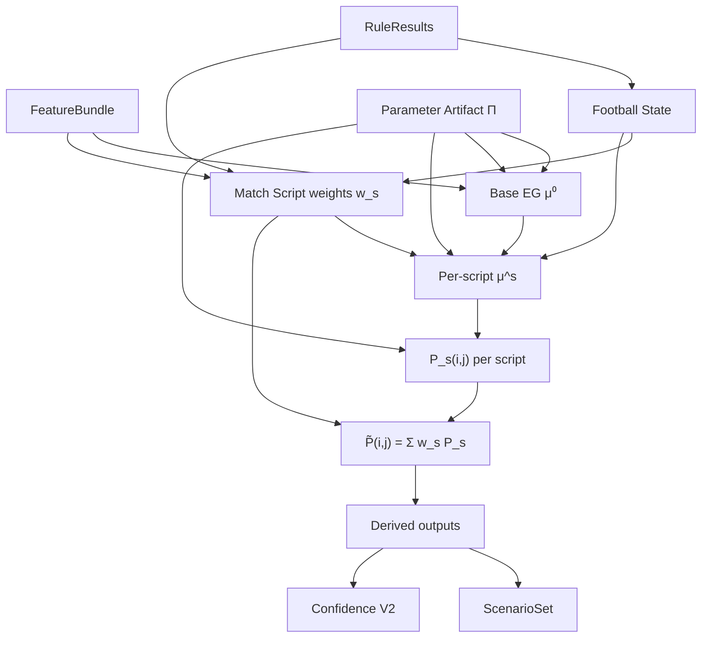

# P2C — Projection V2 Mathematical Model (Design)

| Field | Value |
|---|---|
| Sprint id | **P2C** Projection V2 Mathematical Model |
| Date | 2026-07-30 |
| Document type | **Design only** — deterministic mathematics for Projection V2 |
| Roadmap citation | [`docs/40_PRODUCT_ROADMAP.md`](../../40_PRODUCT_ROADMAP.md) (proposed addition — see §0) |
| Parent designs | [`P2A_PREDICTION_INTELLIGENCE_ARCHITECTURE_REVIEW.md`](../P2A/P2A_PREDICTION_INTELLIGENCE_ARCHITECTURE_REVIEW.md) · [`P2B_FOOTBALL_STATE_SCENARIO_ARCHITECTURE.md`](../P2B/P2B_FOOTBALL_STATE_SCENARIO_ARCHITECTURE.md) |
| Authority (read-only) | `AGENTS.md` · `docs/PROJECT_STATE.md` · Architecture Freeze **v0.3** · [`docs/reviews/v0.3_ARCHITECTURE_FREEZE_REVIEW.md`](../../reviews/v0.3_ARCHITECTURE_FREEZE_REVIEW.md) · [`docs/sprints/A1/A1_5_FOOTBALL_PROJECTION_FRAMEWORK.md`](../A1/A1_5_FOOTBALL_PROJECTION_FRAMEWORK.md) · [`docs/sprints/A2/A2_FOOTBALL_INTELLIGENCE_CALIBRATION_FRAMEWORK.md`](../A2/A2_FOOTBALL_INTELLIGENCE_CALIBRATION_FRAMEWORK.md) |
| Scope | Formal mathematical architecture for Projection V2: unified probability space, Feature→λ, script weighting, confidence decomposition, governed parameters |
| Explicit exclusions | Production code · package changes · Evidence / Feature / Rule redesign · ML · LLM · new Bible Engines |

---

## 0. Governance note

This sprint is **design only**. No production code was written or modified.

**Roadmap citation gap:** P2C is not listed in `docs/40_PRODUCT_ROADMAP.md` (same pattern as P2A/P2B, V1A, O1).

**Relationship to P2B:** P2B defines **Football State** and **Match Script** layers and their football semantics. **P2C defines the mathematics** those layers feed — expected goals, joint scoreline distribution, derived markets, and confidence. Implementation of State/Script modules remains a separate coding sprint (proposed **P2D** / **P2E** in §10).

**Relationship to P2A:** P2A proposed script mixture and Feature-enriched λ conceptually. P2C **formalizes equations, invariants, and artifact governance**.

**Probability ownership (A1.5):** Projection V2 remains the **sole owner** of all probability mass. Football State and Match Script emit **non-probability** envelopes (scores, weights, modifiers). Confidence emits **trust signals**, not competing 1X2.

**Naming:** quantitative post-Projection trio remains **`ScenarioSet`** (`scenario.mvp.a05`). Pre-Projection scripts remain **`MatchScript`** (`matchScript.v1`).

---

## 1. Executive summary

V1 Projection is mathematically inconsistent: **1X2**, **scorelines**, and **goal range** do not always derive from the same probability object, and **Rule softmax** adjusts winner mass without updating the generative model.

**Projection V2** replaces:

```text
Independent Poisson  +  flat Rule softmax on 1X2 only
```

with a **single unified probability space**:

```text
Football State  →  Match Script weights
       →  Expected Goal Generator (per script)
       →  Joint scoreline matrix P_s(i,j)
       →  Mixture merge P(i,j) = Σ_s w_s · P_s(i,j)
       →  All outputs as marginals / functionals of P(i,j)
```

Every sealed output — 1X2, top scorelines, goal range, BTTS, O/U lines, ScenarioSet inputs — is a **deterministic functional** of one normalized joint matrix. No conflicting claims permitted.

All numeric coefficients live in **governed projection parameter artifacts** — never hard-coded football knowledge in Projection logic.

---

## 2. Current Projection — mathematical review

### 2.1 V1 computation chain (ground truth)

| Step | Formula / operation | Output |
|---|---|---|
| **Foundation λ** | `λ_h = clamp(LAMBDA0 × (A_h/50) / max(D_a,0.05) × (1 + 0.6·HA), 0.05, 5)` (mirror for away) | `λ_home`, `λ_away` |
| **Poisson matrix** | `P_raw(i,j) = Poisson(i;λ_h) × Poisson(j;λ_a)` for i,j ∈ [0..6]; normalize | Joint matrix (pre-rule) |
| **1X2 (pre-rule)** | Marginals from matrix | `pHome`, `pDraw`, `pAway` |
| **Rule softmax** | `δ = 0.08 × (Σ w_home+ − Σ w_away+)`; logit adjust home/away | Post-rule 1X2 |
| **Calibration** | `applyCalibration(1X2, artifact)` | Final 1X2 |
| **Scorelines** | Top-3 from **pre-rule** matrix | `topScorelines` |
| **Goal range** | Buckets from **pre-rule** matrix | `range01`, `range23`, `range4Plus` |
| **ScenarioSet** | Rank scorelines from sealed `topScorelines` + 1X2 fallback worlds | mostLikely / secondLikely / upset |

Constants today (`LAMBDA0=1.3`, `RULE_ADJUSTMENT_SCALE=0.08`, etc.) are **hard-coded** in `projection-math.ts`.

### 2.2 Mathematical inconsistencies in V1

| ID | Inconsistency | Consequence |
|---|---|---|
| **M-01 Dual basis** | 1X2 post-rule+calibration; scorelines pre-rule | Winner Hit and Score Hit measure **different generative claims** (A1 evaluation) |
| **M-02 Orphan softmax** | Rule adjustment moves 1X2 mass without updating P(i,j) | Implied scorelines no longer match implied winner |
| **M-03 Draw under-modelled** | Draw = diagonal of independent Poisson only | Systematic draw underestimation in low-scoring profiles |
| **M-04 No BTTS / O/U** | Not computed from any sealed matrix | Product cannot expose consistent secondary markets |
| **M-05 Truncation silent** | G_MAX=6 tail mass ~0.5–2% | `truncationMass` disclosed but not propagated to confidence |
| **M-06 Rule double-count** | Correlated Rules sum into δ | Effective adjustment non-linear and saturated — not interpretable as log-odds shift of a generative model |
| **M-07 Intelligence bypass** | xG/Club/Player never enter λ | Continuous signal quantized to Rule PASS then lost in softmax |
| **M-08 Confidence decoupled** | Confidence uses A/C/S/X unrelated to final matrix entropy | High confidence possible when distribution is flat |

### 2.3 ScenarioSet-specific issue

`buildScenarioSet()` reads `projection.topScorelines` (pre-rule) while `projection.pHome/pDraw/pAway` are post-rule. The upset slot may cite a scoreline whose winner contradicts the calibrated 1X2 argmax — **guaranteed inconsistency** when δ is material.

---

## 3. Deliverable 1 — Projection V2 mathematical architecture

### 3.1 Canonical pipeline

```text
Inputs (sealed):
  FeatureBundle F
  RuleResult[] R
  FootballStateEnvelope S     ← from footballState.v1 (P2B)
  MatchScriptSet M              ← from matchScript.v1 (P2B)
  ProjectionParameterArtifact Π ← governed coefficients (§8)

Stages:
  1. Base expected goals     μ⁰_h, μ⁰_a  ← Feature-enriched λ (§4)
  2. Per-script expected goals μ^s_h, μ^s_a ← script modifiers + state (§5)
  3. Per-script joint matrix   P_s(i,j)    ← EG generator (§6)
  4. Mixture merge             P(i,j) = Σ_s w_s · P_s(i,j)
  5. Normalize                 P̃(i,j) = P(i,j) / Σ_{i,j} P(i,j)
  6. Optional calibration map  on marginals only (governed artifact)
  7. Derived outputs           all functionals of P̃ (§6.4)
  8. Confidence decomposition  non-probability trust (§7)
```

### 3.2 Mathematical objects

| Symbol | Type | Meaning |
|---|---|---|
| `μ_h`, `μ_a` | ℝ⁺ | Expected goals (attack rate parameters) per side |
| `P(i,j)` | [0,1] | Probability of exact scoreline home=i, away=j |
| `w_s` | [0,1], Σw=1 | Match script mixture weight |
| `ρ` | [-1,1] | Dixon–Coles low-score correlation (optional, artifact) |
| `G_max` | ℕ | Truncation ceiling (artifact, default 8 in V2) |

**Invariant U1 (unity):** `Σ_{i=0}^{G_max} Σ_{j=0}^{G_max} P̃(i,j) = 1`.

**Invariant U2 (coherence):** `pHome = Σ_{i>j} P̃(i,j)`, `pDraw = Σ_{i=j} P̃(i,j)`, `pAway = Σ_{i<j} P̃(i,j)`.

**Invariant U3 (scoreline argmax):** `mostLikelyScore = argmax_{i,j} P̃(i,j)` — same matrix as 1X2.

**Invariant U4 (no orphan adjustment):** No post-matrix softmax on 1X2 alone. Rule influence enters via State → Script → μ adjustment only.

### 3.3 Module ownership (`@fas/analysis`)

| Module | Mathematical responsibility |
|---|---|
| `football-state/` | Emits `S` — dimension scores ∈ [0,1]; **not probabilities** |
| `match-script/` | Emits `{w_s, modifier_s}` — weights Σ=1 |
| `projection/expected-goals.ts` | `μ⁰`, `μ^s` from F, S, M, Π |
| `projection/scoreline-matrix.ts` | `P_s(i,j)` generator + Dixon–Coles |
| `projection/mixture-merge.ts` | `P̃(i,j)` |
| `projection/derived-markets.ts` | BTTS, O/U, goal range from `P̃` |
| `projection/confidence-v2.ts` | Five-component confidence (§7) |
| `scenario/scenario-set.ts` | **Unchanged contract** — reads merged `P̃` only |

### 3.4 Architecture diagram



---

## 4. Deliverable 2 — Unified probability model

### 4.1 Generative family: script-conditional Poisson + optional Dixon–Coles

For each script `s`, define independent Poisson counts with optional low-score correlation correction:

**Base (independent):**

```text
P_s^raw(i,j) = Poisson(i; μ^s_h) × Poisson(j; μ^s_a)
```

**Dixon–Coles adjustment (when `Π.dixonColes.enabled`):**

```text
τ(i,j) = 1                           if i > 1 or j > 1
τ(0,0) = 1 − μ^s_h · μ^s_a · ρ
τ(0,1) = 1 + μ^s_h · ρ
τ(1,0) = 1 + μ^s_a · ρ
τ(1,1) = 1 − ρ

P_s(i,j) = P_s^raw(i,j) × τ(i,j)   for i,j ∈ {0,1}; else P_s^raw(i,j)
```

Then truncate to `i,j ∈ [0..G_max]`, renormalize per script to sum 1.

**Mixture:**

```text
P(i,j) = Σ_{s ∈ activeScripts} w_s · P_s(i,j)
P̃(i,j) = P(i,j) / Σ_{i,j} P(i,j)
```

### 4.2 Variance / tempo (without abandoning Poisson)

When script `s` has `goalRangeCharacter = high` (P2B `late_chaos`):

**Option A (recommended for V2.0 pin):** inflate variance by **mixture of two Poisson rates** within the same script:

```text
P_s = α · PoissonMatrix(μ × κ_low) + (1−α) · PoissonMatrix(μ × κ_high)
```

with `α`, `κ_low`, `κ_high` from artifact — still closed-form, no ML.

**Option B (deferred pin):** Negative Binomial marginals — higher implementation cost.

Tempo (goal rate level) is carried by `μ`. Variance is carried by script character or Option A sub-mixture. **Draw tendency** is carried by Dixon–Coles `ρ` and `low_event` script μ suppression — not a separate orphan bias on 1X2.

### 4.3 Derived outputs (all from P̃)

| Output | Functional | Notes |
|---|---|---|
| **Home / Draw / Away** | Marginals U2 | Primary 1X2 |
| **Top scorelines** | Sort `(i,j)` by `P̃(i,j)` desc | Unified basis |
| **Most likely score** | `argmax P̃(i,j)` | Must match ScenarioSet mostLikely source |
| **Goal range 0–1** | `Σ_{i+j≤1} P̃(i,j)` | Replaces V1 buckets |
| **Goal range 2–3** | `Σ_{2≤i+j≤3} P̃(i,j)` | |
| **Goal range 4+** | `Σ_{i+j≥4} P̃(i,j)` | |
| **BTTS Yes** | `Σ_{i≥1,j≥1} P̃(i,j)` | New sealed field in V2 |
| **BTTS No** | `1 − BTTS_Yes` | |
| **Over 2.5** | `Σ_{i+j≥3} P̃(i,j)` | Total goals market |
| **Under 2.5** | `1 − Over_2.5` | |
| **Expected total goals** | `E[T] = Σ (i+j) P̃(i,j)` | Diagnostic / report |
| **Truncation mass** | `1 − Σ_{i,j≤G_max} P_mix(i,j)` before final renorm | Always disclosed |

### 4.4 Calibration (governed, marginal-only)

Post-merge, optional **calibration artifact** (Statistics-owned, A2 governance) may adjust **1X2 marginals** while preserving a coherent matrix:

**Method CM1 (recommended):** Adjust `(pHome, pDraw, pAway)` via artifact map, then **reconcile** to nearest matrix using iterative proportional fitting (IPF) on `{home, draw, away}` margins — still deterministic, pinned algorithm id `matrix_reconcile.v1`.

**Forbidden:** Calibrate BTTS/O/U independently of the same matrix — would break U1.

If artifact status is `candidate` / not qualified, apply identity and append limitation.

### 4.5 Probability model version pin

| Pin | Description |
|---|---|
| `probability_model.v2.script_mixture_dc` | Script mixture + Dixon–Coles + unified derive |
| `probability_model.v2.script_mixture` | Mixture without DC (fallback pin) |

---

## 5. Deliverable 3 — Feature → λ mapping

### 5.1 Base expected goals model

```text
μ⁰_h = clamp( λ₀ · A_h · Q_h · C_h · V_h / D_a , μ_min, μ_max )
μ⁰_a = clamp( λ₀ · A_a · Q_a · C_a · V_a / D_h · ψ(HA) , μ_min, μ_max )
```

Where:

| Factor | Source | Role |
|---|---|---|
| `λ₀` | Artifact `Π.lambda.baseRate` | League-scale intercept (replaces hard-coded 1.3) |
| `A_*` | Attack rating Features | Primary attack level |
| `D_*` | Defense rating Features | Primary defense resistance |
| `Q_*` | xG quality Features | Chance quality multiplier |
| `C_*` | Context Features | Tempo/fatigue multiplier |
| `V_*` | Availability Features | Suppressor ∈ (0,1] |
| `ψ(HA)` | homeAdvantage + venueAdvantage | Away-side home-field dampener |
| `μ_min, μ_max` | Artifact bounds | Replace 0.05 / 5 |

**Missing optional factor:** factor = 1.0 and dimension listed absent in limitations — **never** impute population mean.

### 5.2 Feature family mapping table

Legend: **A** = attack λ, **D** = defense λ (opponent divisor), **T** = tempo, **V** = variance character, **Dr** = draw tendency (via μ suppression / script affinity only), **R** = Rule-only (State/Script, not direct λ).

#### Foundation

| Feature(s) | A | D | T | V | Dr | R-only |
|---|---|---|---|---|---|---|
| `attackRatingHome/Away` | **●** | | | | | |
| `defenseRatingHome/Away` | | **●** | | | | |
| `homeAdvantage`, `venueAdvantage` | | **●** (ψ) | | | | |
| `momentumHome/Away`, `momentum` | minor **A** | | **T** | | | partial |
| `recentForm*`, `formAtHome*`, `formOnRoad*` | minor **A** | | **T** | | | partial |
| `goalsScoredRate*`, `goalsConcededRate*` | **A** | **D** | | | | |
| `h2hLean`, `h2hSampleSize` | | | | | | **●** (State) |
| `homeTeam`, `awayTeam`, `kickoff` | | | | | | metadata |

#### Expected Goals

| Feature(s) | A | D | T | V | Dr | R-only |
|---|---|---|---|---|---|---|
| `xgAttackQualityHome/Away` | **●** Q | | | | | |
| `xgDefenseQualityHome/Away` | | **●** Q | | | | |
| `finishingEfficiencyHome/Away` | **●** Q | | | | | |
| `xgDominance` | | | | | | **●** (State/script) |

#### Match Context

| Feature(s) | A | D | T | V | Dr | R-only |
|---|---|---|---|---|---|---|
| `fatigueIndexHome/Away` | | | **●** C | **●** script | | |
| `rotationPressureHome/Away` | | | **●** C | **●** | | |
| `scheduleAdvantage` | | | **●** C | | | |
| `homeStability` | | | | | **Dr** script | partial |
| `knockoutContext` | | | | | | **●** (State plane A) |

#### Club Intelligence

| Feature(s) | A | D | T | V | Dr | R-only |
|---|---|---|---|---|---|---|
| `clubStrength*`, `pointsPerMatch*` | **●** A | | | | | |
| `clubAttackStrength*` | **●** | | | | | |
| `clubDefensiveStrength*` | | **●** | | | | |
| `formStrength*`, `goalDifferenceStrength*` | minor **A** | | **T** | | | |
| `leagueStrength*`, `homeLeagueStrength`, `awayLeagueStrength` | minor | minor | | | | **●** State |
| `managerStability*` (M1B+) | | | | | | **●** State |

#### Player / Availability

| Feature(s) | A | D | T | V | Dr | R-only |
|---|---|---|---|---|---|---|
| `availabilityPenalty*` | | | | **●** V | | |
| `playerAvailabilityImpact*` | **●** V | | | | | |
| `keyPlayerAvailability*` | **●** V | | | | | |
| `squadAvailabilityScore*` | minor **V** | | | | | |
| `playerAttackContribution*` | **●** A | | | | | |
| `goalkeeperReliability*` | | **●** D | | | | |

#### Advanced Statistics

| Feature(s) | A | D | T | V | Dr | R-only |
|---|---|---|---|---|---|---|
| `attackEfficiency*` | **●** A | | | | | |
| `possession*` | | | **T** | | | **●** script |
| `chanceCreation*` | **●** A | | **T** | | | partial |
| `disciplineRisk*` | | | | **●** V | | **●** State |

#### Market Intelligence

| Feature(s) | A | D | T | V | Dr | R-only |
|---|---|---|---|---|---|---|
| All market Features | | | | | | **●** findings / State favourite tag only |

**Freeze v0.3:** Market Features **must not** enter μ or P̃ directly.

### 5.3 Per-script expected goals

```text
μ^s_h = μ⁰_h · m^s_{h,μ} · exp( Σ_k α^s_{h,k} · z_k )
μ^s_a = μ⁰_a · m^s_{a,μ} · exp( Σ_k α^s_{a,k} · z_k )
```

- `m^s` — script multiplier table from artifact (`Π.scriptModifiers[scriptId]`) — replaces P2B informal ×1.08 values  
- `z_k` — normalized State dimension scores (bounded transforms)  
- `α` — artifact coefficients, initially 0; non-zero only after governed promotion  

Draw tendency for `low_event` script: achieve via **lower μ both sides + elevated ρ** toward artifact cap — not a standalone `drawBias` added to 1X2.

---

## 6. Deliverable 4 — Scenario weighting model

### 6.1 Separation of concerns

| Layer | Output | Mathematical type |
|---|---|---|
| Football State | dimension scores `d_k ∈ [0,1]` | Not probabilities |
| Match Script | weights `w_s`, modifiers | Simplex vector |
| Projection | `P̃(i,j)` | Probability matrix |

### 6.2 Script weight computation (no ML)

From P2B §6.1, formalized:

```text
a_s = b_s + Σ_k Λ[s,k] · d_k + Σ_{r ∈ PASS} β[s,r] · I(r) + Σ_f γ[s,f] · φ(f)
w_s = exp(a_s / τ) / Σ_{s'} exp(a_{s'} / τ)
```

| Term | Meaning | Source |
|---|---|---|
| `b_s` | Script prior logit | Artifact `Π.scriptPrior[s]` |
| `Λ[s,k]` | State dimension affinity | Artifact `Π.scriptStateAffinity` |
| `β[s,r]` | Rule PASS bonus (sparse) | Artifact `Π.scriptRuleBonus` |
| `γ[s,f]` | Feature strength bonus | Artifact `Π.scriptFeatureBonus` |
| `φ(f)` | Bounded normalize of Feature value | e.g. `(value−50)/50` clamped |
| `τ` | Temperature | Artifact `Π.scriptTemperature` |

**Filter:** keep scripts with `w_s ≥ w_min` (artifact, default 0.10). If `< 2` scripts, apply fallback table `Π.scriptFallbackPair`. Renormalize.

**Determinism:** all of `b, Λ, β, γ, τ, w_min` live in artifact `projectionParams.v3` — not source code literals.

### 6.3 Worked example (illustrative constants)

State: `home_control=0.72`, `open_game=0.55`, `counter_away=0.61`, `late_chaos=0.40`

| Script | Raw affinity `a_s` | Pre-norm weight |
|---|---|---|
| home_control | 1.85 | 0.31 |
| away_counter | 1.42 | 0.22 |
| open_match | 1.55 | 0.25 |
| late_chaos | 1.10 | 0.15 |
| low_event | 0.40 | (filtered < 0.10) |

Renormalized: `{0.34, 0.24, 0.27, 0.15}` — four active scripts.

### 6.4 Script concentration metrics (for confidence)

```text
H_script = − Σ_s w_s · log(w_s)        // entropy
C_script = max_s w_s                    // concentration
```

High `C_script` → fewer plausible narratives → higher Scenario Agreement confidence component.

---

## 7. Deliverable 5 — Confidence decomposition

Replace V1 scalar `confidence = f(A,C,S,X)` with five **interpretable components** on `[0,1]`, combined via artifact weights.

### 7.1 Components

| Component | Symbol | Definition | Inputs |
|---|---|---|---|
| **Evidence Confidence** | `E_conf` | Required + optional Evidence/Feature coverage ratio | FeatureBundle presence, same spirit as V1 `C` |
| **Reasoning Confidence** | `R_conf` | State dimension qualification + Rule→State consistency | Absent dimensions penalized; contradictory State tags penalized |
| **Projection Confidence** | `P_conf` | 1 − normalized entropy of 1X2 marginal from **pre-calibration** P̃ | Flat distribution → low |
| **Scenario Agreement** | `S_conf` | Alignment between script weights and merged matrix peak + `C_script` | High if dominant script predicts same winner as argmax P̃ |
| **Historical Calibration** | `H_cal` | Reliability factor from pinned A2 calibration artifact for this projection policy cohort | Display-only modifier; **does not** change P̃ |

### 7.2 Reasoning Confidence detail

```text
R_conf = clamp( mean(qualified dimension scores) − penalty_conflict − penalty_sparse , 0, 1 )
```

- `penalty_conflict`: e.g. open_game high AND defensive_game high (P2B conflict table)  
- `penalty_sparse`: >40% of State dimensions absent  

Rules influence `R_conf` **only through State** — not independent agreement ratio on raw Rule weights (V1 `A` retired for probability; repurposed here for reasoning quality).

### 7.3 Scenario Agreement detail

```text
winner_s = argmax_{o∈{H,D,A}} marginal(P_s)
winner_merged = argmax marginal(P̃)
S_conf = C_script · I(winner dominant script = winner_merged) · (1 − H_script / log(n_scripts))
```

### 7.4 Historical Calibration detail

From A2 `PredictionCalibrationReport` or dedicated projection reliability artifact:

```text
H_cal = clamp( 1 − ECE_cohort / ECE_max , 0, 1 )
```

When cohort unqualified (`sampleSize < 20`): `H_cal = 0.5` with limitation — not hidden.

**H_cal adjusts displayed confidence band only** — never retroactively edits sealed P̃.

### 7.5 Combined confidence

```text
confidence_raw = Σ_i ω_i · component_i     // ω from artifact Π.confidenceWeights
confidence = clamp( confidence_raw · recommendation_gate , 0, 0.95 )
```

| Gate | Effect |
|---|---|
| Market conflict | Cap band at `medium` |
| `truncationMass > τ_trunc` | Cap at `medium` |
| Required Features missing | `blocked` |

**Sealed envelope** includes all five components + combined score for A1 Confidence Correctness evaluation.

### 7.6 Confidence policy pin

`confidence.v3.decomposed` — replaces `confidence.mvp.a05` under Projection V2 pin only.

---

## 8. Deliverable 6 — Governed parameter model

### 8.1 Principle

> **No football constant in Projection source code.** All coefficients live in versioned, checksum-sealed **Projection Parameter Artifacts** promoted through Evaluation governance (extends A2 calibration framework).

### 8.2 Artifact types

| Artifact id pattern | Owner | Consumed by |
|---|---|---|
| `projectionParams:v3.0:baseline` | `@fas/analysis` policy + `@fas/statistics` storage | Expected goals, script weights, matrix gen |
| `calibration:population-demo:v1` (existing) | `@fas/statistics` | Marginal reconcile post-merge |
| `confidenceWeights:v3.0:baseline` | `@fas/analysis` | Confidence combine |
| `projectionParams:v3.0:candidate-*` | Offline replay proposals | Not live until promoted |

### 8.3 Artifact schema (conceptual sections)

```text
ProjectionParameterArtifact
  artifactId
  status: candidate | qualified | identity
  projectionPolicyVersion: projection.v3.0.state_scenario
  probabilityModelVersion: probability_model.v2.script_mixture_dc
  checksum
  limitations[]

  lambda:
    baseRate: 1.3
    min: 0.05
    max: 5.0
    homeAttackShare: 0.6
    awaySuppressShare: 0.4
    featureWeights: { xgAttackQuality: 0.12, fatigueIndex: -0.08, ... }

  dixonColes:
    enabled: true
    rhoDefault: -0.08
    rhoLowEvent: -0.13

  scriptPrior: { home_control: 0.0, away_counter: -0.2, ... }
  scriptStateAffinity: Matrix[script × dimension]
  scriptRuleBonus: Sparse[script × ruleName]
  scriptFeatureBonus: Sparse[script × featureName]
  scriptModifiers: { home_control: { home: 1.08, away: 0.92 }, ... }
  scriptTemperature: 1.0
  scriptMinWeight: 0.10

  matrix:
    gMax: 8
    highVarianceSubMix: { alpha: 0.7, kappaLow: 0.9, kappaHigh: 1.15 }

  confidenceWeights:
    evidence: 0.25
    reasoning: 0.25
    projection: 0.20
    scenarioAgreement: 0.15
    historicalCalibration: 0.15
```

### 8.4 Lifecycle (extends A2)

```text
Evaluation History → offline replay diagnostics → candidate projectionParams:v3.0:*
  → human promotion → qualified pin for FUTURE runs only
```

**Forbidden:** auto-promote from O1/V1A ranking. **Forbidden:** mutate sealed predictions.

### 8.5 Default pin for V2 launch

Ship `projectionParams:v3.0:baseline` with:

- Feature weights **initially zero** except Foundation mapping (parity with V1 λ)  
- Script affinities copied from P2B design estimates  
- Dixon–Coles `enabled: false` in first coding pin; enable in `v3.0:dc1` after draw validation  

This ensures **safe incremental activation** per coefficient group.

### 8.6 What remains in code (not artifacts)

| In code | In artifact |
|---|---|
| Algorithm structure (Poisson PMF, mixture sum, IPF steps) | All numeric coefficients |
| Type contracts, checksum serialization | Script catalog **ids** (not weights) |
| Honest absence handling | Threshold values |

---

## 9. Deliverable 7 — Migration strategy

### 9.1 Version pins

| Pin | Model |
|---|---|
| V1 (frozen) | `projection.v2.*` + `independent_poisson.v1` + flat softmax |
| V2 | `projection.v3.0.state_scenario` + `probability_model.v2.script_mixture_dc` + `confidence.v3.decomposed` |

### 9.2 Migration phases

| Phase | Math change | User-visible |
|---|---|---|
| **M0** | P2C design accepted | None |
| **M1** | Unified matrix from V1 λ only (drop dual basis; retire softmax) | Score Hit aligns with Winner Hit |
| **M2** | Feature-enriched μ⁰ | Better λ when xG present |
| **M3** | Script mixture (2 scripts min) | BTTS/O/U available |
| **M4** | Dixon–Coles + full 5-script catalog | Draw calibration improves |
| **M5** | Confidence v3 + parameter artifact | Decomposed trust |
| **M6** | Governed coefficient promotion | Closed loop |

### 9.3 Evaluation History extension

Store on each seal:

- `projectionPolicyVersion`, `probabilityModelVersion`, `projectionParamsArtifactId`  
- `footballStateChecksum`, `matchScriptSetChecksum`  
- `confidenceComponents` (5-vector)  
- `bttsYes`, `over25` (new derived fields)

Enables replay: *same F,R,S,M + artifact → same P̃*.

### 9.4 Backward compatibility

V1 records remain valid. A1 metrics on V1 seals unchanged. V2 introduces new fields — not retroactive.

### 9.5 Rollback

Pin `projection.v2.p1b.player` — instant. Parameter artifacts remain cataloged as `superseded`.

---

## 10. Deliverable 8 — Recommended coding sequence

**Note:** P2B §10 used P2C for Football State **coding**. This design sprint **P2C** is the math spec. Implementation ids shift:

| Order | Sprint | Delivers | Depends on |
|---|---|---|---|
| 1 | **P2D** | `ProjectionParameterArtifact` types + identity baseline artifact in `@fas/statistics` | P2C accepted |
| 2 | **P2E** | `footballState.v1` module (P2B semantics) | P2D |
| 3 | **P2F** | `matchScript.v1` module + weight computation using Π | P2E |
| 4 | **P2G** | **M1 math:** unified matrix from V1-equivalent μ⁰; remove dual basis + softmax | P2D |
| 5 | **P2H** | Feature-enriched μ⁰ (§5) | P2G |
| 6 | **P2I** | Script mixture + derived BTTS/O/U (§4.3) | P2F + P2H |
| 7 | **P2J** | Dixon–Coles pin + `late_chaos` variance sub-mix | P2I |
| 8 | **P2K** | Confidence v3 decomposition (§7) | P2I |
| 9 | **P2L** | Marginal calibration IPF reconcile (§4.4) | P2I + A2 |
| 10 | **P2M** | Offline replay + candidate artifact promotion tooling | P2L + A1.5 |

**Parallel (unchanged):** **M1B** Manager Intelligence — Features map to State/Rule; Manager Features stay Rule-only for λ until M1B complete.

**Do not start P2D until:** P2C reviewed + doc 40 updated.

---

## 11. Acceptance criteria (P2C design sprint)

| # | Deliverable | Status |
|---|---|---|
| 1 | Projection V2 mathematical architecture | **Complete** (§3) |
| 2 | Unified probability model | **Complete** (§4) |
| 3 | Feature → λ mapping | **Complete** (§5) |
| 4 | Scenario weighting model | **Complete** (§6) |
| 5 | Confidence decomposition | **Complete** (§7) |
| 6 | Governed parameter model | **Complete** (§8) |
| 7 | Migration strategy | **Complete** (§9) |
| 8 | Recommended coding sequence | **Complete** (§10) |
| — | Production code | **None** |

---

## 12. Risks

| Risk | Severity | Mitigation |
|---|---|---|
| IPF reconcile non-convergence | Medium | Cap iterations; fail closed to pre-calibration matrix + limitation |
| Artifact schema sprawl | Medium | Single `ProjectionParameterArtifact` with sections |
| Dixon–Coles overfits demo population | Medium | Separate promotion gate; default off in baseline pin |
| BTTS/O/U scope creep vs Freeze | Low | Derived from same P̃ — report fields only, not wagering UX |
| P2B/P2C sprint id numbering drift | Low | §10 explicit implementation renumbering |
| doc 40 citation gap | Medium | Add P2A/P2B/P2C before P2D coding |

---

## 13. Sign-off

| Item | Status |
|---|---|
| P2C Projection V2 Mathematical Model | **Complete (design only)** |
| Production code changes | **None** |
| Architecture Freeze v0.3 | **Unchanged** (Market excluded from μ/P̃) |
| Next authorized coding (unchanged) | **M1B** |

---

*End of P2C Projection V2 Mathematical Model.*
