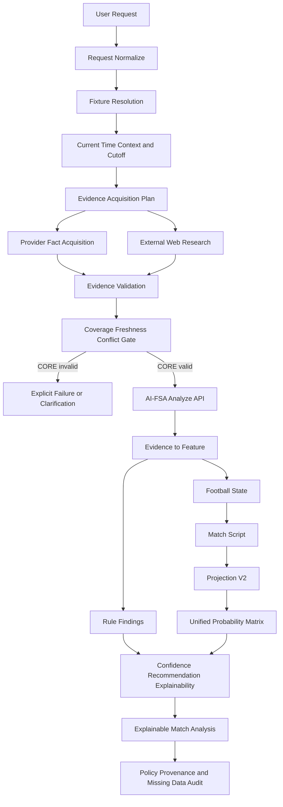

# FIP-1 — Football Intelligence Analysis Protocol Planning

## 0. Document status and governance

- Status: **PLANNING COMPLETE / REVIEWED**
- Review date: 2026-08-30
- Operational status: **NOT IMPLEMENTED** — this document defines the target
  protocol but is not itself an executable Agent playbook or production
  contract.
- Type: Planning / Specification / Contract / Governance Design only.
- Governance posture: FIP-1 is an explicitly authorized bounded planning task,
  not a new Sprint in `docs/40_PRODUCT_ROADMAP.md`.
- This document does not amend doc 40 and does not authorize FIP-2.
- Architecture Freeze remains v0.3.
- Production policy remains:
  - `projectionPolicyPin = "v2"`
  - parameter artifact `projection.v3.replay`
  - calibration candidate1 NON-DEFAULT / NOT PROMOTED
- No Projection, lambda, Match Script, Calibration, Evaluation History,
  Unified Matrix, Feature/Rule mathematics, Provider implementation, Engine,
  database schema, credential or Architecture Freeze change is authorized.

Primary authority and implementation references:

- `AGENTS.md`
- `docs/PROJECT_STATE.md`
- `docs/PROJECT_INDEX.md`
- `docs/40_PRODUCT_ROADMAP.md`
- `docs/35_V2_FIRST_VERTICAL_SLICE_SPECIFICATION.md`
- `docs/architecture/FOOTBALL_INTELLIGENCE_V2_DOMAIN_ARCHITECTURE.md`
- `docs/sprints/PREDICTION_VERTICAL_SLICE/PVS-3.3_PROVIDER_CAPABILITY_AND_DATA_COVERAGE_AUDIT.md`
- `docs/sprints/PREDICTION_VERTICAL_SLICE/MATCH_REPLAY_EVALUATION_DATASET_UPDATE_COMPLETION_REPORT.md`

### 0.1 As-built capability versus target protocol

FIP-1 deliberately contains both verified current behavior and requirements for
a future operational protocol. They must not be conflated.

Verified as built:

- team-based fixture discovery and match-id analysis endpoints;
- Provider Adapter → FAS domain → Evidence normalization/import;
- CORE Evidence → Feature → Rule plus Feature → Football State → Match Script;
- Projection V2 and Unified Matrix output;
- sealed report provenance, V2 policy pin and `projection.v3.replay`;
- honest import/projection failure paths;
- explicit Match Center recorded-fallback metadata on the upcoming board.

Specified here but **not currently enforced end to end**:

- `analysisTime`, PRE_MATCH cutoff and `NOT_PRE_MATCH` transport validation;
- configurable freshness windows and cutoff-aware Evidence queries;
- External Evidence observation intake/validation;
- cross-source conflict, supersession and refresh records;
- a protocol-level CORE/IMPORTANT/OPTIONAL coverage gate;
- `allowRecordedFallback=false` on the analyze transport;
- propagation of all schedule fallback metadata into every analysis report;
- a canonical cross-Agent protocol, Agent skill or conformance test suite.

FIP-1 sign-off means the planning contracts are internally complete and
Freeze-compatible. It does not claim that the target protocol is operational.

## 1. Goal, scope and non-goals

FIP-1 defines a reusable PRE_MATCH analysis protocol for any new Agent or new
conversation. A request such as:

> 分析 皇马 vs 皇家社会

must become an auditable workflow rather than an answer based on conversation
memory or unsupported football intuition.

The protocol must:

- parse the request and resolve the intended fixture;
- capture the current time, analysis cutoff and fixture status;
- acquire and validate the latest verifiable data;
- separate Provider Fact, External Evidence, Derived Feature and LLM Narrative;
- use only the existing AI-FSA Evidence-first analysis path for deterministic
  projection;
- return a consistent Explainable Match Analysis;
- fail honestly for missing, conflicting, stale, inaccessible or unsupported
  data.

Non-goals:

- LIVE/in-play or POST_MATCH analysis;
- Agent-side probability, lambda, Match Script or confidence calculations;
- treating web observations as imported Provider Facts;
- adding a Provider, scraper, Engine, model or database schema;
- model retraining, tuning or candidate promotion;
- claims of predictive superiority, causation or wagering value without
  Evaluation evidence.

## 2. Agent Analysis Protocol lifecycle



### 2.1 User Request

Extract:

- requested home team;
- requested away team;
- optional competition/date/kickoff;
- requested output markets;
- output language.

The order of team names expresses user intent only. It is not authoritative
home/away orientation until fixture resolution succeeds.

### 2.2 Fixture Resolution

Resolution order:

1. query the current Match Center fixture catalog;
2. match normalized team identities;
3. apply optional date and competition constraints;
4. cross-check the resolved fixture against an official schedule source;
5. return one resolved fixture, a candidate list, or an explicit failure.

Required resolution output:

- requested and resolved team names;
- resolved home/away orientation;
- match id;
- competition;
- kickoff;
- schedule source;
- provider source;
- `homeAwaySwapped`;
- candidate count;
- resolution status.

An ambiguous fixture must not be selected silently. The Agent presents
candidates and requests a user choice unless the existing deterministic resolver
has already produced a unique result.

Current implementation caveat: when multiple non-identical upcoming fixtures
remain and no date is supplied, the existing resolver may deterministically
select the earliest kickoff. FIP-1's stricter disambiguation behavior is a
target protocol rule for FIP-2 conformance, not a claim about the current
transport.

### 2.3 Current Time Context

Before acquiring analytical Evidence, capture:

- `analysisTime`;
- timezone and UTC offset;
- resolved kickoff;
- `timeToKickoff`;
- `analysisCutoff`;
- fixture status.

If the match has started or finished, FIP-1 must not run or present a PRE_MATCH
Projection.

Current implementation caveat: the analyze request does not yet carry
`analysisTime`, timezone or cutoff and does not enforce `NOT_PRE_MATCH`. This
section defines the future protocol gate.

### 2.4 Evidence Acquisition Plan

Create the requirement list in this order:

1. CORE
2. IMPORTANT
3. OPTIONAL

For each requirement define the expected source class, freshness rule, current
availability and blocking behavior before retrieval begins.

### 2.5 Evidence Acquisition

Production facts follow:

```text
Provider Adapter
  → FAS Domain Model
  → Evidence Normalizer
  → Evidence Repository
```

Web research produces External Evidence observations. Until an approved intake
and normalizer exist, those observations remain a separate research dossier and
cannot enter Feature, Rule, Football State, Match Script or Projection.

### 2.6 Evidence Validation

Validate:

- match identity;
- team subject and home/away side;
- payload type and unit;
- source and source record identity;
- retrieval, publication, effective and observation times;
- analysis cutoff compliance;
- freshness;
- duplicate or superseded observations;
- cross-source conflicts.

### 2.7 Coverage Gate

- Invalid, missing, stale or materially conflicted CORE data blocks a successful
  analysis.
- IMPORTANT gaps permit a partial analysis only when the engine's CORE path is
  valid and the gaps are disclosed.
- OPTIONAL gaps remain neutral and explicit.
- No gap is replaced by Agent memory, inference or a default fact.

Current implementation caveat: the five-Evidence projection gate exists, but
the freshness/conflict/coverage policy described here is not yet a production
service.

### 2.8 AI-FSA Analysis

Use the implemented transport:

- `POST /api/analyze` for analyze-by-teams plus fixture resolution;
- `POST /api/analyze/match/:matchId` only after a match id is unambiguous.

The Agent must not reproduce internal formulas or invoke an alternative
probability path.

### 2.9 Pipeline Integrity

The successful production path must preserve:

```text
Evidence
  → Feature
      ├→ Rule findings → Confidence / Recommendation / Explainability
      └→ Football State → Match Script → Projection V2
                                      → Unified Probability Matrix
                                      → Confidence / Recommendation
                                      → Explainable Report
```

Current implementation truths:

- Football State consumes Features.
- Match Script activation consumes Football State, not Rules.
- Rules affect findings, confidence, recommendation and explainability.
- Market Rules remain `channel: none`.
- Scorelines, goal range, BTTS and O/U derive from the merged Unified Matrix.
- 1X2 uses the same matrix marginals and then the pinned calibration artifact.

Required assertions:

- `analysisProvenance.projectionPolicyPin === "v2"`;
- `projectionFramework.parameterVersionLabel === "projection.v3.replay"`;
- `scorelinesBasis === "match_script_merged_v2"`;
- no V1 fallback;
- no silent recorded substitution;
- no fabricated Evidence.

Current implementation caveat: Match Center exposes `usedRecordedFallback`,
but the analyze-by-teams response does not yet guarantee propagation of that
board-level flag. “No silent recorded substitution” is therefore an FIP-2
protocol assertion requiring conformance work, not a current universal
guarantee.

### 2.10 Explainable Report

Copy sealed outputs and connect the available provenance chain:

```text
Evidence
  → Feature
  → Rule / Football State
  → Match Script
  → Projection
```

The LLM may organize this material into prose. It cannot add facts, change
numbers or infer unavailable deterministic stages.

### 2.11 Final Audit

Before returning success, report:

- analysis cutoff;
- Evidence coverage;
- missing, stale and conflicted data;
- Provider modes and fallback state;
- policy/model versions and checksums;
- known limitations;
- integrity assertion results.

Any failed integrity assertion converts the response to an explicit blocked or
partial result, never empty success.

Current implementation anchors:

- `packages/application/src/fixture/discover-fixture-by-teams.ts`
- `packages/analysis/src/use-case/analyze-match-use-case.ts`
- `packages/analysis/src/projection-v2/compute-projection-v2.ts`
- `packages/report/src/use-case/generate-match-report-use-case.ts`
- `apps/api/src/analysis.controller.ts`

## 3. Evidence Acquisition Contract

### 3.1 Epistemic classes

`PROVIDER_FACT`

- Returned through an approved Provider Adapter.
- Mapped to the FAS domain model.
- Validated by the normalizer and stored as Evidence.
- Preserves provider id, source id, method and timestamp.

`EXTERNAL_EVIDENCE`

- A verifiable observation collected from an official website, announcement or
  trusted data source.
- Remains outside the production deterministic pipeline until an approved
  Adapter/intake/normalizer accepts it.

`DERIVED_FEATURE`

- Deterministically generated by the existing FeatureExtractor from Evidence.
- References source Evidence ids.
- Never hand-authored by an Agent.

`DETERMINISTIC_FINDING`

- A Rule result produced from Features only.
- Does not read raw Provider payloads.

`LLM_NARRATIVE`

- An inference-only explanation of sealed facts, findings and outputs.
- Cannot create facts or modify deterministic results.

`ACTUAL_MATCH_RESULT`

- POST_MATCH/Evaluation data only.
- Never enters PRE_MATCH Feature or Projection.

### 3.2 CORE data

The current non-blocked Projection V2 path requires:

- `MATCH_INFO`;
- home `TEAM_FORM`;
- away `TEAM_FORM`;
- home `STATISTICS`;
- away `STATISTICS`.

These must yield the seven foundation Features:

- `attackRatingHome`;
- `attackRatingAway`;
- `defenseRatingHome`;
- `defenseRatingAway`;
- `momentumHome`;
- `momentumAway`;
- `homeAdvantage`.

Any CORE identity, orientation or cutoff conflict, or any missing foundation
Feature, blocks successful report publication.

### 3.3 IMPORTANT data

These domains are not current hard engine gates but materially affect analytical
completeness:

- injuries, suspensions and player availability;
- confirmed lineup, only after official publication;
- advanced statistics;
- true xG/xGA when actually returned by a provider;
- rest, congestion, knockout leg and aggregate Match Context;
- Club, Player and Manager Intelligence;
- venue and referee identity;
- near-kickoff market snapshot.

Missing IMPORTANT data is disclosed in coverage, risk and limitation sections.
The Agent cannot fill it. Confirmed lineup is currently primarily raw/report
Evidence and must not be described as a Feature consumer that does not exist.

### 3.4 OPTIONAL data

- H2H;
- venue enrichment and formation;
- spreads, totals and multi-book market context;
- referee, weather, news and ranking only when an approved contract and consumer
  exist.

H2H is optional to Projection mathematics, although the current live
API-Football bundle adapter may reject a bundle when H2H is unavailable. The
protocol must report that as an operational adapter gate, not a model
requirement.

Deep pressing, transition-chain, shot-map and PSxG facts remain unavailable
unless a future approved source supplies them.

### 3.5 External Evidence observation contract

This planning contract is not an existing production DTO:

```json
{
  "observationId": "stable-id",
  "matchIdentity": "resolved-match-id",
  "requirementId": "INJURY_HOME",
  "epistemicClass": "EXTERNAL_EVIDENCE",
  "subject": {
    "team": "...",
    "player": "..."
  },
  "claim": "verbatim factual claim",
  "value": null,
  "sourceType": "OFFICIAL_LEAGUE|OFFICIAL_CLUB|LICENSED_PROVIDER|REPUTABLE_NEWS|AGGREGATOR",
  "publisher": "...",
  "sourceUrl": "https://...",
  "publishedAt": "ISO-8601|null",
  "effectiveAt": "ISO-8601|null",
  "retrievedAt": "ISO-8601",
  "analysisCutoff": "ISO-8601",
  "freshnessStatus": "FRESH|STALE|UNKNOWN",
  "verificationStatus": "PRIMARY|CORROBORATED|CONFLICTED|UNVERIFIED",
  "corroboratingSources": [],
  "conflictSetId": null,
  "notes": ""
}
```

The original statement and Agent summary remain separate. URL, publisher and
time fields are required or explicitly `null/unavailable`. Conversion to
production Evidence requires a separately approved intake and normalizer.

## 4. Web Research Protocol

### 4.1 Search order

1. Official competition fixture/match centre for fixture, orientation, kickoff
   and status.
2. Official club websites or verified official accounts for squad,
   availability, lineup and manager announcements.
3. Official league/federation disciplinary, lineup and referee pages.
4. Authorized/licensed data providers for form, statistics, xG, players and
   market snapshots.
5. Reputable sports media for attributed and timestamped facts that can be
   corroborated.
6. Aggregators and search snippets for discovery only.

### 4.2 Search targets

- fixture: `team A team B competition date official`;
- availability: `team official injury suspension squad update`;
- lineup: `official lineup team A team B`;
- form/statistics: official/provider structured data;
- xG: a source with an explicit metric definition and sample window;
- odds: bookmaker, market, line and observation time;
- context: objective schedule, rest, competition format, leg and aggregate
  facts.

“Importance”, “morale” and “motivation” remain inference unless governed
Evidence supports them.

### 4.3 Cross-validation and conflict handling

- Fixture/kickoff: official competition first, official clubs second. A conflict
  between official sources blocks CORE resolution.
- Availability/lineup: official team sheet or club announcement first.
  “Expected” lineups never become confirmed lineups.
- Statistics/xG: compare only equal definitions and windows. Preserve
  differently defined metrics as separate observations.
- Odds: different bookmakers are parallel market observations. For one
  bookmaker/market, use the latest snapshot before cutoff.
- Preserve every conflicting value, source, timestamp and selection rationale.
- Material CORE conflicts fail closed.
- IMPORTANT conflicts mark the domain `CONFLICTED` and exclude it from Agent
  interpretation.

### 4.4 Hallucination prevention

- Open and inspect the source; do not rely on a search snippet, page title or
  Agent memory.
- Preserve uncertainty words such as “expected”, “possible” and “reported”.
- Mark facts without a source URL or usable timestamp
  `UNVERIFIED/UNKNOWN`.
- Never fill player status, lineup, xG, odds, kickoff or competition from
  language-model recall.
- Keep original units, definitions and windows.
- Failed research creates a missing-data record.

## 5. Match Analysis Input Contract

This is a planning contract, not implemented code:

```json
{
  "homeTeam": "string",
  "awayTeam": "string",
  "competition": "string|null",
  "kickoff": "ISO-8601|null",
  "analysisTime": "ISO-8601 required",
  "timezone": "IANA timezone|required",
  "requestedMarkets": [
    "1X2",
    "SCORELINES",
    "GOAL_RANGE",
    "BTTS",
    "OVER_UNDER_2_5"
  ],
  "language": "zh-CN",
  "mode": "PRE_MATCH",
  "sourcePolicy": "FIP-1",
  "allowRecordedFallback": false
}
```

Contract rules:

- Requested teams become authoritative only after fixture resolution.
- `analysisTime` comes from the execution clock.
- An absent kickoff is resolved; a conflicting user kickoff is not silently
  overwritten.
- `requestedMarkets` filters presentation only. It does not trigger separate
  probability calculations.
- Real-current analysis defaults to `allowRecordedFallback=false`.
- A recorded demonstration must be labelled `RECORDED_DEMO`.
- A started or finished fixture returns `NOT_PRE_MATCH`.

## 6. Evidence Coverage Contract

Every requirement receives one coverage tier:

- `CORE`: missing, stale or materially conflicted data blocks success.
- `IMPORTANT`: the current engine may run, but absence reduces completeness and
  creates a visible limitation.
- `OPTIONAL`: enrichment only; absence is neutral.
- `UNAVAILABLE`: unsupported, inaccessible, not published, stale, conflicted or
  failed acquisition, with a reason code.

Coverage record:

```json
{
  "requirementId": "TEAM_FORM_HOME",
  "tier": "CORE",
  "status": "AVAILABLE|PARTIAL|UNAVAILABLE|STALE|CONFLICTED",
  "epistemicClass": "PROVIDER_FACT|EXTERNAL_EVIDENCE|DERIVED_FEATURE|LLM_NARRATIVE",
  "sourceIds": [],
  "observedAt": "ISO-8601|null",
  "ageSeconds": null,
  "freshnessRuleId": "...",
  "missingReason": "NOT_PUBLISHED|NOT_COVERED|NOT_ENTITLED|PROVIDER_FAILED|STALE|CONFLICT|NOT_IMPLEMENTED|null"
}
```

Coverage summaries report counts and states. They do not invent a new
confidence score or overwrite either engine confidence contract.

## 7. Analysis Output Contract

The final Agent output uses these sections. Each section carries
`AVAILABLE/PARTIAL/UNAVAILABLE/STALE/CONFLICTED` and provenance.

1. `Fixture`
   - resolved identity, competition, kickoff, analysis time, PRE_MATCH status
     and source.
2. `Data Coverage`
   - CORE, IMPORTANT, OPTIONAL and UNAVAILABLE requirements plus cutoff.
3. `Team Strength`
   - existing club, attack and defence Features only.
4. `Recent Form`
   - window, sample size, period and source.
5. `Injuries/Suspensions`
   - Provider Facts and External Evidence observations separated.
6. `Lineup`
   - confirmed, not yet published or unavailable.
7. `Advanced Stats`
8. `xG`
   - source definition, window and availability; never estimated.
9. `Match Context`
   - rest, congestion, knockout leg and aggregate facts.
10. `Manager/Player Intelligence`
11. `Odds / Market`
    - bookmaker, market and observation time; supporting-only and
      `channel: none`.
12. `Football State`
    - sealed dimensions, tags and checksum copied from the report.
13. `Match Script`
    - sealed active scripts, weights and checksum; activated by Football State.
14. `Projection`
    - 1X2, most likely/top scorelines, goal range, BTTS, O/U and confidence,
      copied from sealed Projection/Unified Matrix output.
15. `Key Drivers`
    - traceable Evidence → Feature → Rule/State → Script → Projection links.
16. `Risks`
    - missing data, market conflict, coverage bias, sample size and lineup
      timing.
17. `Missing Data`
    - explicit reason code for every absent requirement.
18. `Provenance`
    - Provider modes, source URLs/ids, timestamps, policy/model versions,
      checksums and fallback state.

Do not merge the two existing confidence contracts:

- projection confidence: `confidence.v2.slice1`;
- report intelligence confidence: `confidence.mvp.a05`.

## 8. Agent and AI-FSA boundary

The Agent may:

- normalize the request and facilitate fixture disambiguation;
- search the web and record External Evidence;
- assess source priority, freshness, conflicts and coverage;
- call existing Match Center, analysis and Evidence read APIs;
- copy sealed outputs and write cited explanations;
- fail or degrade honestly.

The Agent may not:

- label web/news/LLM content as imported Provider Fact;
- bypass Provider → Evidence → Feature → Rule → Analysis → Report;
- recompute lambda, probability, Football State, Match Script or confidence;
- modify Projection, Calibration, artifacts, candidate lifecycle or Evaluation
  History;
- let market prices replace football probability;
- inject `MATCH_RESULT` into PRE_MATCH analysis;
- present recorded fallback as live success;
- publish a blocked projection;
- convert failure to empty success;
- give wagering advice or unsupported accuracy claims.

## 9. Cross-Agent and new-conversation reusability

Long-term reuse must not depend on conversation memory.

Recommended single-source structure:

- FIP-1: this planning document, recording contracts, boundaries and backlog.
- FIP-2, if separately authorized: one non-numbered, non-Architecture canonical
  operational contract, for example
  `docs/protocols/FOOTBALL_INTELLIGENCE_ANALYSIS_PROTOCOL.md`.
- `AGENTS.md`: one pointer to the canonical protocol only when the repository
  rule changes.
- `docs/PROJECT_INDEX.md`: protocol ownership and reading-order link.
- Future Agent skill/rule: startup instructions and a pointer to the canonical
  protocol, not a copied policy body.

Executable truth remains in implementation and tests, including:

- `apps/api/test/pvs-1-production-vertical-slice.spec.ts`
- `packages/application/test/discover-fixture-by-teams.spec.ts`

A new Agent's minimum reading bundle should be:

1. `AGENTS.md`;
2. `docs/PROJECT_STATE.md`;
3. the future canonical FIP protocol;
4. current production policy manifest;
5. request, coverage, output and failure contracts;
6. source and freshness rules;
7. one recorded demonstration and one fail-closed golden example.

## 10. Provider-agnostic contract

The protocol depends on capabilities, not vendor names:

```text
Source Connector
  → Provider Adapter or External Observation Collector
  → FAS Domain Mapping
  → Evidence Normalizer and Validation
  → Canonical Evidence Contract
  → Feature / Rule / Analysis Pipeline
```

API-Football, The Odds API, another licensed Provider, an official competition
site or an official club site must map into common requirement and provenance
language. The source does not change Evidence semantics, Feature mathematics or
Projection policy.

A Provider capability declaration must include:

- supported Evidence types;
- competition and season coverage;
- entitlement status;
- historical/current availability;
- expected freshness and latency;
- provider/source ids and method;
- failure semantics;
- licensing and retention constraints.

Web research remains External Evidence until an approved intake exists. Market
sources remain market observations, not football facts.

## 11. PRE_MATCH, LIVE and POST_MATCH boundary

`PRE_MATCH`

- `analysisTime < kickoff`;
- uses only data available at or before the analysis cutoff;
- the only FIP-1 analysis mode.

`LIVE`

- kickoff through full time;
- FIP-1 must not update or relabel its Projection as live analysis.

`POST_MATCH`

- actual result, events, actual script, Evaluation and Replay;
- remains separate from the pre-match seal.

Boundary rules:

- If no date is supplied and multiple fixtures exist, return candidates rather
  than selecting a historical match.
- If the most recent fixture is finished and a future fixture exists, identify
  the upcoming candidate explicitly.
- If the match has started, return `NOT_PRE_MATCH`; do not switch to LIVE.
- Post-match score and event data never enter pre-match Evidence or Sidecar.

## 12. Data Freshness Rules

These are proposed protocol thresholds. The current implementation does not
uniformly enforce them. FIP-2 would need separately authorized, configurable
policy and tests.

- Fixture identity/kickoff:
  - kickoff within 48 hours: retrieval age at most 6 hours;
  - kickoff farther away: retrieval age at most 24 hours;
  - any official schedule change invalidates the previous observation.
- TEAM_FORM/STATISTICS/xG:
  - only completed matches before cutoff;
  - refresh after either team completes a newer match;
  - retrieval age alone is insufficient.
- Injuries/suspensions:
  - generally at most 24 hours old;
  - within 12 hours of kickoff, at most 6 hours old;
  - later official updates invalidate earlier status.
- Confirmed lineup:
  - valid only after official publication;
  - retrieval age at most 15 minutes;
  - absence before publication means `NOT_PUBLISHED`, not an empty lineup.
- Manager/club/squad:
  - at most 7 days old;
  - appointment, transfer or registration events invalidate prior records.
- Match Context:
  - recompute after schedule changes;
  - bind rest/congestion values to a schedule snapshot.
- Odds:
  - more than 2 hours before kickoff: at most 60 minutes old;
  - within 2 hours of kickoff: at most 15 minutes old;
  - bind bookmaker, market, line and observation time;
  - never infer movement across different bookmakers.
- External statements:
  - retain publication, effective and retrieval times;
  - no publication time means `UNKNOWN`.
- Any observation after `analysisCutoff` is excluded from that PRE_MATCH run.

Known current gaps that FIP-1 must not present as delivered:

- normalizers generally mark Evidence `fresh`;
- Evidence queries do not apply analysis cutoff/freshness filters;
- live bundles have no common TTL invalidation contract;
- API composition currently uses a fixed `collectedAt` in one import path;
- cross-source conflict and refresh/supersession policies are not implemented.

## 13. Source Priority Rules

Priority is data-domain-specific:

- fixture/kickoff/competition:
  official competition → official clubs → licensed fixture provider →
  reputable data site;
- lineup/squad/availability:
  official competition team sheet or official club → licensed provider →
  corroborated reputable media;
- suspension:
  official league/federation record → official club → provider;
- statistics/xG:
  licensed/official source with transparent definition and window;
- manager/transfer:
  official club/league registration → provider → reputable media;
- odds:
  named bookmaker feed or authorized aggregator with snapshot time.

Aggregators, forums, prediction pages, search snippets and anonymous social
posts cannot independently support CORE or IMPORTANT facts. Provider
`/predictions`, media predictions and LLM statements cannot replace lineup,
injury, xG or Provider Fact.

## 14. Failure and missing-data rules

Standard planning-level failure codes:

- `INVALID_REQUEST`
- `FIXTURE_NOT_FOUND`
- `FIXTURE_AMBIGUOUS`
- `NOT_PRE_MATCH`
- `CORE_EVIDENCE_MISSING`
- `CORE_EVIDENCE_STALE`
- `CORE_EVIDENCE_CONFLICT`
- `PROVIDER_NOT_ENTITLED`
- `PROVIDER_NOT_COVERED`
- `PROVIDER_UNAVAILABLE`
- `EXTERNAL_SOURCE_UNVERIFIED`
- `ANALYSIS_IMPORT_FAILED`
- `PROJECTION_BLOCKED`
- `POLICY_PIN_MISMATCH`
- `REPORT_INTEGRITY_FAILED`

Handling rules:

- CORE failure: do not output successful 1X2, scoreline, BTTS or O/U
  conclusions. Return verified facts, missing requirements and a retry or
  clarification action.
- IMPORTANT gap: the engine report may be returned as `PARTIAL_COVERAGE`, with
  unsupported explanations listed.
- OPTIONAL gap: keep it unavailable.
- Credential/entitlement failure: report BLOCKED; no silent recorded fallback.
- Ambiguity: return candidate teams, competition, kickoff, match id and source.
- Conflict: preserve the conflict set and never choose the value that supports
  a preferred prediction.
- The current API may return HTTP 200 with `{ ok: false }`; inspect the body
  discriminant, not only HTTP status.

## 15. Governance Rules

- Preserve the repository authority order.
- FIP-1 creates no new Engine, Provider or second analysis pipeline.
- AI-FSA owns deterministic computation; the Agent owns orchestration, research,
  validation and explanation.
- Rules consume Features only.
- Football State consumes Features.
- Match Script activation consumes Football State.
- Narrative consumes the sealed report.
- Market findings remain supporting-only and `channel: none`.
- AI drafts; FAS validates; humans govern publication and promotion.
- Evaluation, Calibration and candidate promotion require separate authorization.
- A single match run never trains, tunes or promotes.
- UI/Agent cannot recompute sealed numbers.
- A real-current analysis cannot silently use a recorded cassette.
- Credentials cannot be printed, recorded or committed.

## 16. Acceptance Criteria

FIP-1 Planning is acceptable when:

1. The lifecycle covers User Request through Explainable Report.
2. MatchAnalysisRequest, External Evidence, Coverage, Output and Failure
   contracts have explicit fields and boundaries.
3. CORE five-Evidence and seven-foundation-Feature requirements match the
   implementation.
4. The protocol states that Rules do not activate Match Scripts, Market does
   not enter softmax, and Unified Matrix is the output source.
5. PRE_MATCH, LIVE, POST_MATCH and analysis cutoff remain distinct.
6. Provider Fact, External Evidence, Derived Feature, Narrative and Actual
   Result remain distinct.
7. Missing, stale, conflict, entitlement and fallback states fail honestly.
8. The protocol is Provider-agnostic.
9. A new Agent can use repository artifacts rather than chat memory.
10. Current capabilities and FIP-2 backlog are not conflated.
11. No code, parameter, History, Provider, Engine, Freeze or doc 40 change is
    made.
12. FIP-2, PVS-3.4 and calibration tuning remain unstarted.

## 17. Implementation Backlog

This backlog is planning only.

### FIP-2 P0 — Governance and canonicalization

- Obtain separate human authorization for FIP-2.
- Decide whether the FIP series enters doc 40 or remains a bounded operational
  track.
- Create one canonical non-Architecture protocol.
- Make AGENTS/PROJECT_INDEX link to it without copying policy text.
- Define policy manifest ownership, versioning, supersession and drift checks.

### FIP-2 P1 — Contracts and validation

- Implement transport-neutral request, coverage, freshness, source and failure
  schemas.
- Replace fixed collection time with a real injected clock.
- Add cutoff-aware Evidence selection, freshness policy and live cache TTL.
- Define append-only refresh/supersession.
- Define conflict records; no last-write-wins.
- Design an approved intake/normalizer gate for External Evidence.

### FIP-2 P2 — Agent operational playbook

- Implement parse → research → verify → coverage gate → API → integrity audit →
  output instructions.
- Add an Agent skill only if approved; it must reference the canonical protocol.
- Define fixture ambiguity and retry interaction.

### FIP-2 P3 — Conformance and golden tests

- Golden request: “分析 皇马 vs 皇家社会”.
- Test unique fixture, ambiguity, not-found, started match, CORE missing, stale,
  conflict, entitlement blocked and silent-fallback rejection.
- Assert V2 pin, `projection.v3.replay`, Unified Matrix lineage and no Agent
  recomputation.
- Use recorded fixtures only as protocol demonstrations, never live-freshness
  evidence.

### FIP-2 P4 — Documentation integration

- Update the owning API document instead of creating a parallel API source of
  truth.
- Update PROJECT_STATE/PROJECT_INDEX and the minimum Agent reading bundle.
- Mark superseded readiness material as historical where needed.

## 18. Recommended FIP-2 direction

Recommended name:

`FIP-2 — Football Intelligence Analysis Protocol Operationalization &
Cross-Agent Conformance`

Recommended scope:

- canonical protocol/playbook;
- request, coverage, freshness, source and failure contracts;
- Agent conformance tests;
- existing API invocation plus provenance/integrity checks;
- recorded golden and fail-closed flows.

FIP-2 should not automatically include:

- a new Provider;
- production web scraping;
- a database schema;
- Projection, Calibration, Feature or Rule mathematics changes;
- LIVE mode;
- candidate promotion;
- P2K-CAL-3.

Production intake of External Web Evidence remains a separate gate unless FIP-2
receives explicit implementation authorization and updates the owning
contracts.

## 19. FIP-1 Review and Sign-off

Review result: **PASS — PLANNING COMPLETE / REVIEWED**.

Acceptance checklist:

1. PASS — User Request through Explainable Report lifecycle is defined.
2. PASS — MatchAnalysisRequest, External Evidence, Coverage, Output and Failure
   contracts have explicit fields and boundaries.
3. PASS — the five CORE Evidence records and seven foundation Features match
   the current implementation.
4. PASS — the corrected lifecycle shows Rules and Football State as parallel
   Feature consumers; Match Script consumes Football State; Market remains
   findings-only; Unified Matrix remains the output source.
5. PASS — PRE_MATCH, LIVE, POST_MATCH and cutoff are distinct, with current
   enforcement gaps explicitly identified as FIP-2 work.
6. PASS — Provider Fact, External Evidence, Derived Feature, Deterministic
   Finding, Narrative and Actual Result remain epistemically distinct.
7. PASS — missing, stale, conflict, entitlement and fallback semantics are
   fail-closed target rules, not overstated as current implementation.
8. PASS — the design is Provider-agnostic and capability-based.
9. PASS — repository discoverability is provided through PROJECT_STATE and
   PROJECT_INDEX; operational cross-Agent reuse remains explicitly deferred to
   the canonical FIP-2 protocol.
10. PASS — current capabilities and FIP-2 target work are separated in §0.1.
11. PASS — no production code, parameter, History, Provider, Engine,
    Architecture Freeze or doc 40 change was made.
12. PASS — FIP-2 P1/P2/P3/P4, PVS-3.4 and calibration tuning remain
    unauthorized and unstarted.

Sign-off scope:

- FIP-1 planning quality is accepted.
- FIP-1 does not authorize implementation.
- Freshness thresholds remain proposed policy pending FIP-2 review.
- No live/current-season capability claim is added.
- The API-Football 2026 entitlement blocker remains unchanged.

## 20. FIP-1 termination condition

FIP-1 is formally closed as **Planning Complete / Reviewed**. FIP-2 P0 has a
separate planning artifact only; implementation of the canonical protocol
requires explicit human approval. Do not automatically create production code,
an Agent skill, a Provider, FIP-2 P1/P2/P3/P4, PVS-3.4 or any
calibration/tuning work.
